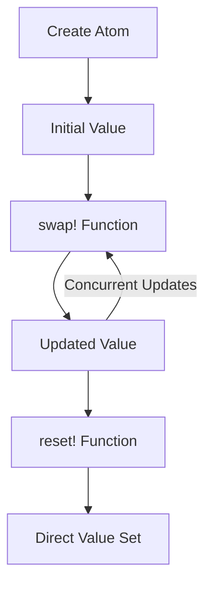

## 3.3 Managing State with Atoms

In this section, we will delve into the concept of atoms in Clojure, a powerful tool for managing state in a functional programming environment. As experienced Java developers, you are likely familiar with mutable state and concurrency challenges. Atoms in Clojure provide a way to manage state changes safely and efficiently, leveraging immutability and functional paradigms.

### Introduction to Atoms

Atoms in Clojure are a fundamental construct for managing state in a concurrent environment. They provide a way to encapsulate mutable state while ensuring thread safety and consistency. Unlike traditional mutable variables in Java, atoms in Clojure are designed to work seamlessly with immutable data structures, allowing you to manage state changes without compromising the benefits of immutability.

Atoms are part of Clojure's reference types, which also include refs, agents, and vars. Each of these types serves a specific purpose in managing state, but atoms are particularly useful for managing independent, synchronous state changes.

#### Key Characteristics of Atoms

- **Atomicity**: Atoms ensure that state changes are atomic, meaning that updates are applied consistently without interference from other threads.
- **Immutability**: While the state within an atom can change, the data itself remains immutable. This allows for safe sharing of state across threads.
- **Concurrency**: Atoms are designed to handle concurrent updates efficiently, making them ideal for scenarios where multiple threads need to read and update shared state.

### Atom Operations

Let's explore how to create and manipulate atoms in Clojure. We'll cover the basic operations, including creating atoms, updating their state, and ensuring thread safety.

#### Creating Atoms

To create an atom, you use the `atom` function, which takes an initial value as an argument. This initial value can be any Clojure data structure, such as a number, vector, map, or list.

```clojure
(def my-atom (atom 0))
```

In this example, `my-atom` is an atom initialized with the value `0`. You can think of this as similar to declaring a variable in Java, but with the added benefits of immutability and thread safety.

#### Updating Atoms with `swap!`

The `swap!` function is used to update the value of an atom. It takes an atom and a function as arguments. The function is applied to the current value of the atom, and the result becomes the new value of the atom.

```clojure
(swap! my-atom inc)
```

Here, `inc` is a function that increments its argument by one. The `swap!` function applies `inc` to the current value of `my-atom`, updating it atomically.

#### Resetting Atoms with `reset!`

The `reset!` function allows you to set the value of an atom directly, bypassing any transformation function.

```clojure
(reset! my-atom 10)
```

This sets the value of `my-atom` to `10`. While `reset!` is useful for setting a specific value, it does not provide the same atomicity guarantees as `swap!` when dealing with concurrent updates.

### Concurrency with Atoms

Atoms are designed to handle concurrent updates safely. In a multithreaded environment, multiple threads can read and update the value of an atom without causing data corruption or inconsistency.

#### Ensuring Consistency

The `swap!` function ensures that updates are applied consistently, even when multiple threads are involved. It uses a compare-and-swap (CAS) mechanism to ensure that the function is applied to the most recent value of the atom. If another thread updates the atom before the current thread's update is applied, `swap!` retries the operation with the new value.

```clojure
(defn update-atom [atom-ref]
  (swap! atom-ref (fn [current-value]
                    (do-some-computation current-value))))
```

In this example, `update-atom` is a function that takes an atom reference and applies a computation to its current value. The use of `swap!` ensures that the computation is applied atomically, even in the presence of concurrent updates.

### Use Cases for Atoms

Atoms are well-suited for managing state in scenarios where state changes are independent and do not require coordination with other state changes. Here are some common use cases:

#### Counters and Accumulators

Atoms are ideal for implementing counters and accumulators, where state changes are simple and independent.

```clojure
(def counter (atom 0))

(defn increment-counter []
  (swap! counter inc))
```

In this example, `counter` is an atom that tracks a count. The `increment-counter` function increments the counter atomically.

#### Caching and Memoization

Atoms can be used to implement caching and memoization, where the state represents cached data that can be updated independently.

```clojure
(def cache (atom {}))

(defn cache-result [key value]
  (swap! cache assoc key value))
```

Here, `cache` is an atom that holds a map of cached values. The `cache-result` function updates the cache atomically.

#### Configuration and Settings

Atoms are useful for managing application configuration and settings, where state changes are infrequent and independent.

```clojure
(def config (atom {:debug false :max-connections 10}))

(defn update-config [key value]
  (swap! config assoc key value))
```

In this example, `config` is an atom that holds application settings. The `update-config` function updates the configuration atomically.

### Visualizing Atom Operations

To better understand how atoms work, let's visualize the flow of data through atom operations using a diagram.



**Diagram Description**: This flowchart illustrates the lifecycle of an atom in Clojure. It starts with the creation of an atom with an initial value. The `swap!` function is used to update the value atomically, handling concurrent updates. The `reset!` function allows for direct value setting.

### Try It Yourself

Now that we've explored how atoms work in Clojure, let's try some hands-on experimentation. Modify the code examples above to:

- Implement a decrement function for the counter atom.
- Add a function to remove a key-value pair from the cache atom.
- Update the configuration atom to toggle the debug setting.

### References and Further Reading

- [Official Clojure Documentation on Atoms](https://clojure.org/reference/atoms)
- [ClojureDocs: Atoms](https://clojuredocs.org/clojure.core/atom)
- [Clojure Programming by Chas Emerick, Brian Carper, and Christophe Grand](https://www.oreilly.com/library/view/clojure-programming/9781449310387/)

### Knowledge Check

Let's reinforce what we've learned with a quiz.

## Understanding Atoms in Clojure: Quiz



### What is the primary purpose of atoms in Clojure?

- [x] To manage state changes atomically and safely in a concurrent environment.
- [ ] To provide mutable state similar to Java variables.
- [ ] To handle asynchronous operations.
- [ ] To manage database transactions.

> **Explanation:** Atoms are designed to manage state changes atomically and safely, especially in concurrent environments.

### Which function is used to update the value of an atom in Clojure?

- [x] `swap!`
- [ ] `update!`
- [ ] `change!`
- [ ] `modify!`

> **Explanation:** The `swap!` function is used to update the value of an atom by applying a function to its current value.

### How does `swap!` ensure consistency in concurrent updates?

- [x] By using a compare-and-swap (CAS) mechanism.
- [ ] By locking the atom during updates.
- [ ] By queuing updates for sequential execution.
- [ ] By using a mutex.

> **Explanation:** `swap!` uses a compare-and-swap (CAS) mechanism to ensure that updates are applied to the most recent value of the atom.

### What is a common use case for atoms in Clojure?

- [x] Implementing counters and accumulators.
- [ ] Managing complex transactions.
- [ ] Handling asynchronous events.
- [ ] Performing file I/O operations.

> **Explanation:** Atoms are commonly used for implementing counters and accumulators due to their simplicity and atomicity.

### Which function sets the value of an atom directly?

- [x] `reset!`
- [ ] `set!`
- [ ] `assign!`
- [ ] `direct!`

> **Explanation:** The `reset!` function sets the value of an atom directly, bypassing any transformation function.

### True or False: Atoms in Clojure are mutable.

- [ ] True
- [x] False

> **Explanation:** Atoms themselves are not mutable; they encapsulate mutable state while ensuring immutability of the data.

### What type of data structure can be stored in an atom?

- [x] Any Clojure data structure
- [ ] Only numbers
- [ ] Only strings
- [ ] Only maps

> **Explanation:** Atoms can store any Clojure data structure, including numbers, strings, maps, vectors, and lists.

### Which of the following is NOT a characteristic of atoms?

- [ ] Atomicity
- [ ] Immutability
- [ ] Concurrency
- [x] Asynchronous updates

> **Explanation:** Atoms do not handle asynchronous updates; they are designed for synchronous state changes.

### What mechanism does `swap!` use to apply updates?

- [x] Compare-and-swap (CAS)
- [ ] Locking
- [ ] Mutex
- [ ] Semaphore

> **Explanation:** `swap!` uses a compare-and-swap (CAS) mechanism to apply updates atomically.

### True or False: `reset!` provides the same atomicity guarantees as `swap!`.

- [ ] True
- [x] False

> **Explanation:** `reset!` does not provide the same atomicity guarantees as `swap!` because it sets the value directly without retrying on concurrent updates.



Now that you've mastered managing state with atoms in Clojure, you're well-equipped to handle state changes in your applications effectively. Keep experimenting and exploring the power of functional programming with Clojure!
