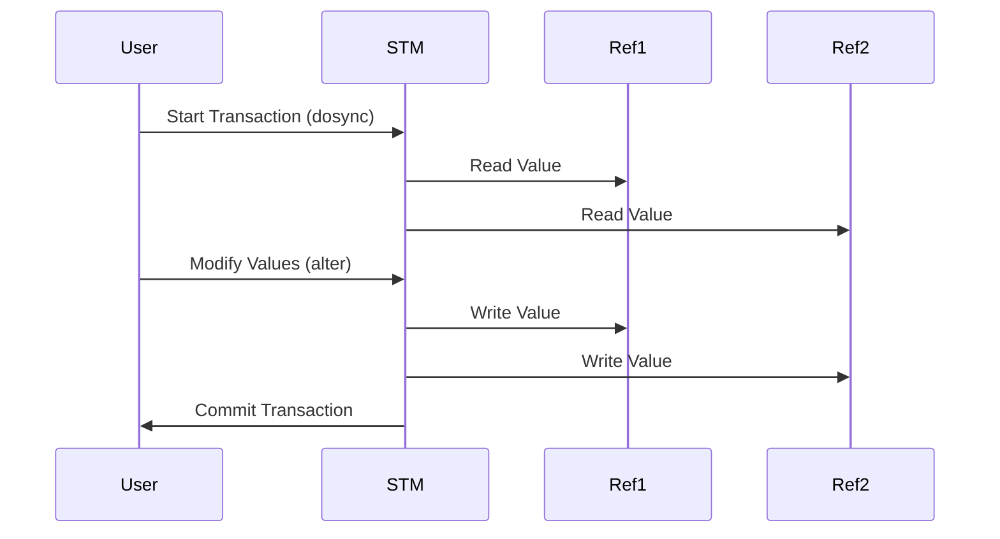

## 3.4 Coordinated State Change with Refs

In this section, we delve into the concept of coordinated state change using refs in Clojure. As experienced Java developers, you may be familiar with managing state using synchronized blocks or concurrent collections. Clojure offers a different approach through its Software Transactional Memory (STM) system, which provides a robust mechanism for managing shared state in a concurrent environment. Let's explore how refs and STM can help you build scalable and reliable applications.

### Understanding Refs

Refs in Clojure are designed to manage shared, synchronous, and coordinated state changes. They are part of Clojure's STM system, which allows you to perform multiple state changes atomically. This means that all changes within a transaction either succeed together or fail together, ensuring consistency.

#### Key Characteristics of Refs:

- **Atomicity**: Changes to refs are atomic, meaning they are completed entirely or not at all.
- **Consistency**: The state remains consistent across transactions.
- **Isolation**: Transactions are isolated from each other, preventing interference.
- **Durability**: Once a transaction is committed, its changes are permanent.

### Software Transactional Memory (STM)

Clojure's STM is a concurrency control mechanism that simplifies the process of managing shared state. It allows you to define transactions that can safely modify multiple refs. STM ensures that transactions are executed in a way that maintains consistency and avoids race conditions.

#### How STM Works:

1. **Transaction Start**: A transaction begins when you enter a `dosync` block.
2. **Read and Write**: Within the transaction, you can read and write to refs.
3. **Validation**: STM validates the transaction to ensure no conflicts with other transactions.
4. **Commit or Retry**: If validation passes, the transaction is committed. If not, it retries.

### Using `dosync`

The `dosync` block is the core of Clojure's STM system. It defines a transactional context where you can safely modify refs. Let's look at an example:

```clojure
(def account-a (ref 100))
(def account-b (ref 200))

(defn transfer [amount from-account to-account]
  (dosync
    (alter from-account - amount)
    (alter to-account + amount)))

(transfer 50 account-a account-b)
```

In this example, we define two accounts as refs and a `transfer` function that moves money between them. The `dosync` block ensures that the transfer is atomic and consistent.

#### Key Functions:

- **`ref`**: Creates a new ref.
- **`dosync`**: Starts a transaction.
- **`alter`**: Changes the value of a ref within a transaction.
- **`ref-set`**: Sets the value of a ref directly.

### Refs vs. Atoms

While both refs and atoms are used for managing state, they serve different purposes:

- **Refs**: Ideal for coordinated changes across multiple pieces of state. Use when you need transactions.
- **Atoms**: Suitable for independent state changes. Use when you need simple, uncoordinated updates.

#### Comparison Table:

| Feature          | Refs                          | Atoms                        |
|------------------|-------------------------------|------------------------------|
| Coordination     | Supports coordinated changes  | Does not support coordination|
| Transactional    | Yes                           | No                           |
| Use Case         | Multiple state dependencies   | Independent state updates    |
| Performance      | Higher overhead due to STM    | Lower overhead               |

### Practical Example: Bank Account Transfers

Let's expand our earlier example to include error handling and logging:

```clojure
(defn transfer-with-logging [amount from-account to-account]
  (dosync
    (try
      (when (< @from-account amount)
        (throw (Exception. "Insufficient funds")))
      (alter from-account - amount)
      (alter to-account + amount)
      (println "Transfer successful:" amount "from" from-account "to" to-account)
      (catch Exception e
        (println "Transfer failed:" (.getMessage e))))))
```

In this enhanced version, we check for sufficient funds before proceeding with the transfer. If the funds are insufficient, an exception is thrown, and the transaction is aborted.

### Visualizing STM with Refs

To better understand how STM coordinates state changes, let's visualize the process:



**Diagram Description**: This sequence diagram illustrates the flow of a transaction in Clojure's STM. The user initiates a transaction, reads values from refs, modifies them, and commits the transaction.

### References and Links

For further reading on Clojure's STM and refs, consider the following resources:

- [Official Clojure Documentation on Refs](https://clojure.org/reference/refs)
- [ClojureDocs: Refs and Transactions](https://clojuredocs.org/clojure.core/ref)
- [GitHub: Clojure STM Examples](https://github.com/clojure/examples)

### Knowledge Check

Let's test your understanding of refs and STM with a few questions:

1. What is the primary purpose of using refs in Clojure?
2. How does STM ensure consistency in transactions?
3. What is the difference between `alter` and `ref-set`?
4. When should you use refs over atoms?

### Exercises

1. **Modify the Bank Transfer Example**: Add a feature to log each transaction to a file.
2. **Implement a Simple Inventory System**: Use refs to manage stock levels and ensure transactions are consistent.

### Key Takeaways

- Refs are essential for managing coordinated state changes in Clojure.
- STM provides a robust mechanism for ensuring consistency and reliability.
- Use `dosync` to define transactional contexts for modifying refs.
- Choose refs over atoms when you need to coordinate changes across multiple states.

By mastering refs and STM, you can build scalable and reliable applications in Clojure. Now that we've explored how to manage state effectively, let's continue to enhance our understanding of functional programming in Clojure.

## Quiz: Mastering Coordinated State Change with Refs



### What is the primary purpose of using refs in Clojure?

- [x] To manage coordinated state changes atomically
- [ ] To handle asynchronous state changes
- [ ] To perform independent state updates
- [ ] To manage immutable data structures

> **Explanation:** Refs are used to manage coordinated state changes atomically, ensuring consistency across multiple states.

### How does STM ensure consistency in transactions?

- [x] By validating transactions and retrying if conflicts occur
- [ ] By locking all resources involved in a transaction
- [ ] By using synchronized blocks
- [ ] By using concurrent collections

> **Explanation:** STM validates transactions and retries them if conflicts occur, ensuring consistency without locking resources.

### What is the difference between `alter` and `ref-set`?

- [x] `alter` modifies a ref's value within a transaction, while `ref-set` sets it directly
- [ ] `alter` sets a ref's value directly, while `ref-set` modifies it within a transaction
- [ ] Both are used interchangeably
- [ ] `alter` is used for atoms, while `ref-set` is for refs

> **Explanation:** `alter` is used to modify a ref's value within a transaction, while `ref-set` sets it directly, bypassing the transaction.

### When should you use refs over atoms?

- [x] When you need to coordinate changes across multiple states
- [ ] When you need simple, uncoordinated updates
- [ ] When performance is a primary concern
- [ ] When managing immutable data structures

> **Explanation:** Refs should be used when you need to coordinate changes across multiple states, as they support transactions.

### Which of the following is a key characteristic of refs?

- [x] Atomicity
- [ ] Asynchronous updates
- [ ] Mutable state
- [ ] Independent updates

> **Explanation:** Refs provide atomicity, ensuring that changes are completed entirely or not at all.

### What function is used to start a transaction in Clojure?

- [x] `dosync`
- [ ] `sync`
- [ ] `transaction`
- [ ] `begin`

> **Explanation:** The `dosync` function is used to start a transaction in Clojure.

### Which of the following is NOT a feature of Clojure's STM?

- [ ] Atomicity
- [ ] Consistency
- [x] Asynchronous execution
- [ ] Isolation

> **Explanation:** Clojure's STM provides atomicity, consistency, and isolation, but not asynchronous execution.

### How does Clojure's STM handle transaction conflicts?

- [x] By retrying the transaction
- [ ] By aborting the transaction
- [ ] By locking resources
- [ ] By using synchronized blocks

> **Explanation:** Clojure's STM handles transaction conflicts by retrying the transaction until it succeeds.

### What is the purpose of the `ref` function in Clojure?

- [x] To create a new ref
- [ ] To modify a ref's value
- [ ] To start a transaction
- [ ] To set a ref's value directly

> **Explanation:** The `ref` function is used to create a new ref in Clojure.

### True or False: Refs are suitable for managing independent state updates.

- [ ] True
- [x] False

> **Explanation:** Refs are not suitable for managing independent state updates; they are used for coordinated changes across multiple states.



By understanding and applying these concepts, you can effectively manage state in your Clojure applications, leveraging the power of functional programming to build scalable and reliable systems.
