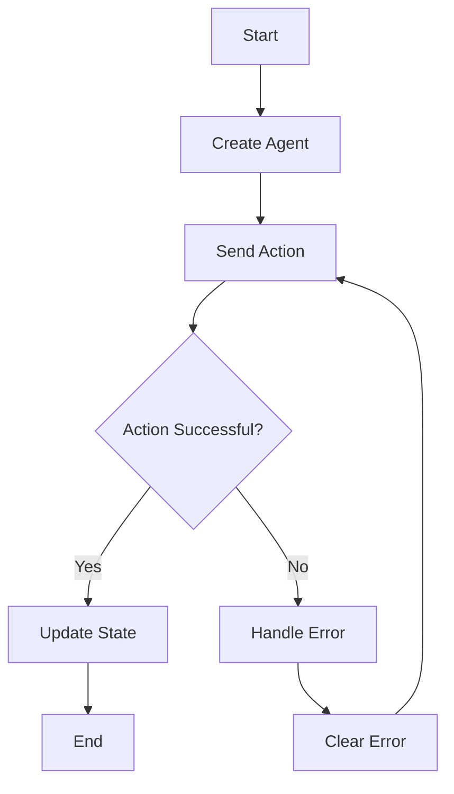

## 3.5 Agents for Asynchronous State Changes

In the realm of functional programming, managing state changes efficiently and safely is paramount. Clojure, with its emphasis on immutability and functional paradigms, offers several constructs to handle state changes, one of which is **agents**. Agents provide a robust mechanism for managing asynchronous state changes, allowing developers to build scalable and responsive applications. In this section, we will delve into the concept of agents, how they work, and their practical applications in Clojure.

### What are Agents?

Agents in Clojure are designed to manage state changes asynchronously. They are part of Clojure's concurrency model, which also includes atoms, refs, and vars. While atoms are used for synchronous state changes and refs for coordinated synchronous changes, agents are ideal for tasks that can be performed independently and asynchronously.

#### Key Characteristics of Agents:

- **Asynchronous State Management**: Agents allow you to perform state changes in a non-blocking manner, making them suitable for tasks that do not require immediate feedback.
- **Immutable State**: Like other Clojure state management constructs, agents work with immutable data. The state of an agent is updated by applying a function to the current state.
- **Error Handling**: Agents have built-in mechanisms for handling errors, ensuring that your application remains robust even when unexpected issues arise.

### Sending Actions to Agents

To interact with agents, you use the `send` and `send-off` functions. These functions dispatch actions to agents, allowing you to update their state asynchronously.

#### Using `send`

The `send` function is used to dispatch a function to an agent. This function is applied to the current state of the agent, and the result becomes the new state. The `send` function is suitable for CPU-bound tasks.

```clojure
(def my-agent (agent 0))

;; Increment the agent's state by 1
(send my-agent inc)

;; Check the agent's state
@my-agent ; => 1
```

In this example, we create an agent `my-agent` with an initial state of `0`. We then use `send` to increment the state by `1`. The `@` symbol is used to dereference the agent and obtain its current state.

#### Using `send-off`

The `send-off` function is similar to `send`, but it is used for tasks that involve I/O operations or are otherwise blocking. `send-off` dispatches the function to a separate thread pool, allowing the main thread to continue executing without waiting for the task to complete.

```clojure
(def my-agent (agent 0))

;; Simulate a blocking operation
(send-off my-agent (fn [state]
                     (Thread/sleep 1000) ; Simulate delay
                     (inc state)))

;; Check the agent's state after some time
(Thread/sleep 1100)
@my-agent ; => 1
```

In this example, we use `send-off` to simulate a blocking operation with `Thread/sleep`. The agent's state is incremented after the delay, demonstrating how `send-off` allows for non-blocking execution.

### Error Handling

Agents in Clojure have built-in error handling mechanisms. If an error occurs during the execution of a function dispatched to an agent, the agent's state is not updated, and the error is stored in the agent's error handler.

#### Monitoring Agent Status

You can monitor the status of an agent and handle errors using the `agent-error` function. This function returns the error that occurred during the last action, if any.

```clojure
(def my-agent (agent 0))

;; Dispatch a function that causes an error
(send my-agent (fn [state]
                 (/ state 0))) ; Division by zero error

;; Check for errors
(agent-error my-agent) ; => #error {...}
```

In this example, we intentionally cause a division by zero error. The `agent-error` function allows us to retrieve the error and handle it appropriately.

#### Clearing Errors

Once an error has been handled, you can clear it using the `clear-agent-errors` function. This resets the agent's error state, allowing it to continue processing new actions.

```clojure
(clear-agent-errors my-agent)

;; Verify that the error has been cleared
(agent-error my-agent) ; => nil
```

### Practical Applications

Agents are particularly useful in scenarios where you need to manage state changes asynchronously without blocking the main thread. Here are some practical applications of agents in Clojure:

#### Background Processing

Agents can be used to perform background processing tasks, such as logging, data aggregation, or batch processing. By dispatching these tasks to agents, you can ensure that your application remains responsive.

```clojure
(def log-agent (agent []))

;; Function to log messages
(defn log-message [log message]
  (conj log message))

;; Send log messages to the agent
(send log-agent log-message "Starting process")
(send log-agent log-message "Process completed")

;; Retrieve the log
@log-agent ; => ["Starting process" "Process completed"]
```

In this example, we use an agent to manage a log of messages. The `log-message` function appends messages to the log, and the agent's state is updated asynchronously.

#### Asynchronous Data Processing

Agents can be used to process data asynchronously, allowing you to handle large datasets without blocking the main thread.

```clojure
(def data-agent (agent []))

;; Function to process data
(defn process-data [data new-data]
  (concat data new-data))

;; Send data to the agent for processing
(send-off data-agent process-data [1 2 3])
(send-off data-agent process-data [4 5 6])

;; Retrieve the processed data
(Thread/sleep 100)
@data-agent ; => [1 2 3 4 5 6]
```

In this example, we use an agent to process data in chunks. The `process-data` function concatenates new data to the existing data, and the agent's state is updated asynchronously.

### Visualizing Agent Workflow

To better understand how agents work, let's visualize the workflow of sending actions to agents and handling errors.



**Diagram Description**: This flowchart illustrates the process of creating an agent, sending actions to it, and handling errors. If an action is successful, the agent's state is updated. If an error occurs, it is handled and cleared before retrying the action.

### Try It Yourself

To solidify your understanding of agents, try modifying the code examples provided. Experiment with different functions and observe how agents handle state changes and errors. Consider implementing a simple task queue using agents to manage asynchronous tasks.

### Key Takeaways

- **Agents** provide a powerful mechanism for managing asynchronous state changes in Clojure.
- **send** and **send-off** are used to dispatch actions to agents, with `send-off` suitable for blocking operations.
- **Error handling** is built into agents, allowing you to monitor and handle errors effectively.
- **Practical applications** of agents include background processing and asynchronous data handling.

### References and Links

- [Official Clojure Documentation on Agents](https://clojure.org/reference/agents)
- [ClojureDocs: Agent Examples](https://clojuredocs.org/clojure.core/agent)
- [Concurrency in Clojure: A Practical Guide](https://www.braveclojure.com/concurrency/)

### Knowledge Check

To reinforce your understanding of agents, try answering the following questions and challenges.

## Quiz: Mastering Clojure Agents for Asynchronous State Changes



### What is the primary purpose of agents in Clojure?

- [x] To manage asynchronous state changes
- [ ] To handle synchronous state changes
- [ ] To coordinate state changes across multiple threads
- [ ] To perform I/O operations

> **Explanation:** Agents are designed to manage asynchronous state changes in Clojure, allowing for non-blocking updates to state.

### Which function is used to dispatch CPU-bound tasks to an agent?

- [x] send
- [ ] send-off
- [ ] dispatch
- [ ] execute

> **Explanation:** The `send` function is used for CPU-bound tasks, while `send-off` is used for tasks that involve blocking operations.

### How can you retrieve the current state of an agent?

- [x] Using the `@` symbol to dereference the agent
- [ ] Using the `get` function
- [ ] Using the `state` function
- [ ] Using the `value` function

> **Explanation:** The `@` symbol is used to dereference an agent and obtain its current state.

### What happens if an error occurs during an agent's action?

- [x] The agent's state is not updated, and the error is stored
- [ ] The agent's state is updated with the error
- [ ] The agent stops processing further actions
- [ ] The error is ignored, and the state is updated

> **Explanation:** If an error occurs, the agent's state is not updated, and the error is stored for handling.

### How can you clear an error from an agent?

- [x] Using the `clear-agent-errors` function
- [ ] Using the `reset` function
- [ ] Using the `clear` function
- [ ] Using the `remove-error` function

> **Explanation:** The `clear-agent-errors` function is used to clear errors from an agent, allowing it to continue processing actions.

### Which function is suitable for dispatching I/O-bound tasks to an agent?

- [x] send-off
- [ ] send
- [ ] dispatch
- [ ] execute

> **Explanation:** The `send-off` function is suitable for I/O-bound tasks, as it dispatches the function to a separate thread pool.

### What is a practical application of agents in Clojure?

- [x] Background processing tasks
- [ ] Coordinated state changes
- [ ] Synchronous data handling
- [ ] Immediate feedback tasks

> **Explanation:** Agents are useful for background processing tasks, allowing for asynchronous state management.

### How can you monitor an agent's error status?

- [x] Using the `agent-error` function
- [ ] Using the `error-status` function
- [ ] Using the `check-error` function
- [ ] Using the `monitor` function

> **Explanation:** The `agent-error` function is used to check for errors that occurred during an agent's action.

### True or False: Agents in Clojure work with mutable data.

- [ ] True
- [x] False

> **Explanation:** Agents work with immutable data, ensuring that state changes are managed safely and predictably.

### Which of the following is NOT a characteristic of agents?

- [ ] Asynchronous state management
- [ ] Immutable state
- [x] Coordinated synchronous changes
- [ ] Built-in error handling

> **Explanation:** Agents are not used for coordinated synchronous changes; refs are used for that purpose.



By mastering the use of agents in Clojure, you can effectively manage asynchronous state changes, leading to more scalable and responsive applications. Keep experimenting with agents and explore their potential in your projects.
