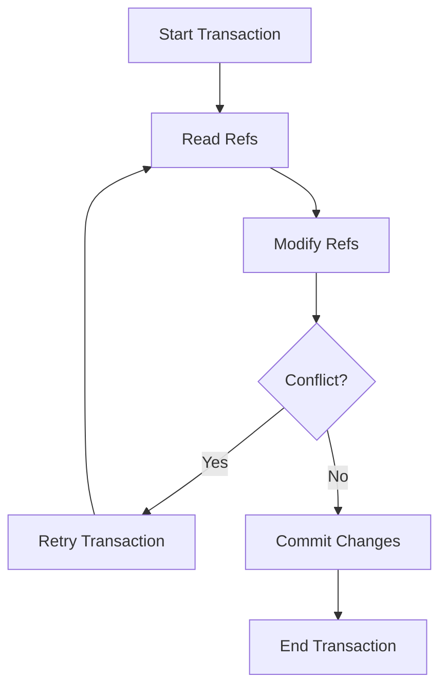

## 3.6 Software Transactional Memory in Clojure

In this section, we will explore Software Transactional Memory (STM) in Clojure, a powerful concurrency model that simplifies state management in multithreaded applications. STM allows developers to handle complex state changes in a coordinated manner, ensuring data integrity and consistency without the pitfalls of traditional locking mechanisms.

### Introduction to Software Transactional Memory

Software Transactional Memory (STM) is a concurrency control mechanism analogous to database transactions for managing shared memory in concurrent computing. It allows multiple threads to execute transactions on shared memory, ensuring that all operations within a transaction are atomic, consistent, isolated, and durable (ACID).

#### Why STM?

In traditional Java applications, managing concurrency often involves using locks and synchronized blocks. While effective, these approaches can lead to issues such as deadlocks, race conditions, and complex error-prone code. STM provides a higher-level abstraction that simplifies concurrent programming by allowing developers to focus on the logic of their transactions rather than the intricacies of thread synchronization.

### Clojure's STM Implementation

Clojure's STM is built around the concept of **refs**, which are mutable references to immutable data. Transactions are executed using the `dosync` macro, which ensures that all operations within the transaction are executed atomically.

#### Key Concepts

- **Refs**: Mutable references to immutable data. They are the primary mechanism for managing shared state in STM.
- **Transactions**: Blocks of code executed atomically using the `dosync` macro.
- **Consistency**: Ensures that all refs are in a consistent state before and after a transaction.
- **Isolation**: Transactions are isolated from each other, preventing intermediate states from being visible to other transactions.
- **Automatic Retry**: If a transaction fails due to a conflict, it is automatically retried.

### Coordinated Transactions with Refs

Let's explore how to use refs and transactions in Clojure to manage complex state changes.

```clojure
(def account-a (ref 1000))
(def account-b (ref 2000))

(defn transfer [from to amount]
  (dosync
    (alter from - amount)
    (alter to + amount)))

(transfer account-a account-b 100)
```

In this example, we define two accounts, `account-a` and `account-b`, each represented by a ref. The `transfer` function performs a transaction that deducts an amount from `account-a` and adds it to `account-b`. The `dosync` macro ensures that these operations are atomic and isolated.

#### Try It Yourself

Experiment with the `transfer` function by changing the amounts and observing how STM ensures data consistency even when multiple transfers are executed concurrently.

### Conflict Resolution in STM

One of the key features of STM is its ability to handle conflicts gracefully. When two transactions attempt to modify the same ref simultaneously, Clojure's STM detects the conflict and retries the transactions until one succeeds.

#### Example of Conflict Resolution

```clojure
(def counter (ref 0))

(defn increment-counter []
  (dosync
    (alter counter inc)))

(future (dotimes [_ 1000] (increment-counter)))
(future (dotimes [_ 1000] (increment-counter)))

@counter
```

In this example, two futures increment the `counter` ref concurrently. STM ensures that the final value of `counter` is 2000, demonstrating its ability to resolve conflicts and maintain data integrity.

### Performance Considerations

While STM provides a robust mechanism for managing concurrency, it is not without its performance trade-offs. The overhead of managing transactions and automatic retries can impact performance, especially in high-contention scenarios.

#### When to Use STM

- **Complex State Changes**: STM is ideal for scenarios where multiple refs need to be updated atomically.
- **Data Integrity**: Use STM when maintaining data integrity is critical.
- **Low Contention**: STM performs best in low-contention environments where conflicts are rare.

#### Alternatives to STM

For scenarios where STM's overhead is prohibitive, consider using other concurrency primitives such as **atoms** or **agents**, which offer lower overhead at the cost of reduced flexibility.

### Visualizing STM with Diagrams

To better understand how STM coordinates transactions and resolves conflicts, let's visualize the process using a flowchart.



**Diagram Description**: This flowchart illustrates the flow of a transaction in Clojure's STM. The transaction begins by reading refs, modifying them, and checking for conflicts. If a conflict is detected, the transaction is retried. Otherwise, changes are committed, and the transaction ends.

### Knowledge Check

- **Question**: What are the key benefits of using STM over traditional locking mechanisms?
- **Exercise**: Modify the `transfer` function to include a fee for each transaction and ensure that the fee is deducted atomically.

### Summary

In this section, we've explored the principles of Software Transactional Memory in Clojure, including coordinated transactions, conflict resolution, and performance considerations. STM provides a powerful abstraction for managing concurrency, allowing developers to focus on the logic of their applications rather than the intricacies of thread synchronization.

### Further Reading

- [Official Clojure Documentation on STM](https://clojure.org/reference/refs)
- [ClojureDocs: STM Examples](https://clojuredocs.org/clojure.core/dosync)
- [GitHub: Clojure STM Examples](https://github.com/clojure/clojure)

## Quiz Time!



### What is the primary purpose of Software Transactional Memory (STM) in Clojure?

- [x] To manage shared state in concurrent applications
- [ ] To optimize memory usage
- [ ] To simplify input/output operations
- [ ] To enhance graphical user interfaces

> **Explanation:** STM is used to manage shared state in concurrent applications by providing a mechanism for atomic, consistent, isolated, and durable transactions.

### Which Clojure construct is used to execute transactions atomically?

- [ ] `atom`
- [x] `dosync`
- [ ] `future`
- [ ] `promise`

> **Explanation:** The `dosync` macro is used to execute transactions atomically in Clojure's STM.

### What happens when a conflict is detected in a Clojure STM transaction?

- [ ] The transaction is aborted
- [x] The transaction is retried
- [ ] The transaction is ignored
- [ ] The transaction is logged

> **Explanation:** When a conflict is detected, Clojure's STM automatically retries the transaction until it succeeds.

### Which of the following is NOT a characteristic of STM transactions?

- [ ] Atomicity
- [ ] Consistency
- [ ] Isolation
- [x] Synchronization

> **Explanation:** STM transactions are atomic, consistent, and isolated, but they do not rely on traditional synchronization mechanisms like locks.

### In which scenarios is STM most appropriate to use?

- [x] Complex state changes
- [x] Low contention environments
- [ ] High-frequency I/O operations
- [ ] Simple state updates

> **Explanation:** STM is most appropriate for complex state changes and low contention environments where maintaining data integrity is critical.

### What is a potential downside of using STM in high-contention scenarios?

- [ ] Increased memory usage
- [x] Performance overhead
- [ ] Reduced code readability
- [ ] Limited scalability

> **Explanation:** The performance overhead of managing transactions and retries can be a downside in high-contention scenarios.

### Which Clojure construct is used to represent mutable references in STM?

- [ ] `atom`
- [x] `ref`
- [ ] `agent`
- [ ] `var`

> **Explanation:** `ref` is used to represent mutable references in Clojure's STM.

### How does STM ensure data integrity during concurrent transactions?

- [ ] By using locks
- [x] By automatically retrying conflicting transactions
- [ ] By logging all transactions
- [ ] By limiting the number of concurrent threads

> **Explanation:** STM ensures data integrity by automatically retrying transactions that conflict with each other.

### What is the role of the `alter` function in a Clojure STM transaction?

- [x] To modify the value of a ref
- [ ] To create a new ref
- [ ] To commit a transaction
- [ ] To abort a transaction

> **Explanation:** The `alter` function is used to modify the value of a ref within a transaction.

### True or False: STM transactions in Clojure can be nested.

- [x] True
- [ ] False

> **Explanation:** STM transactions in Clojure can be nested, allowing for complex transactional logic.


