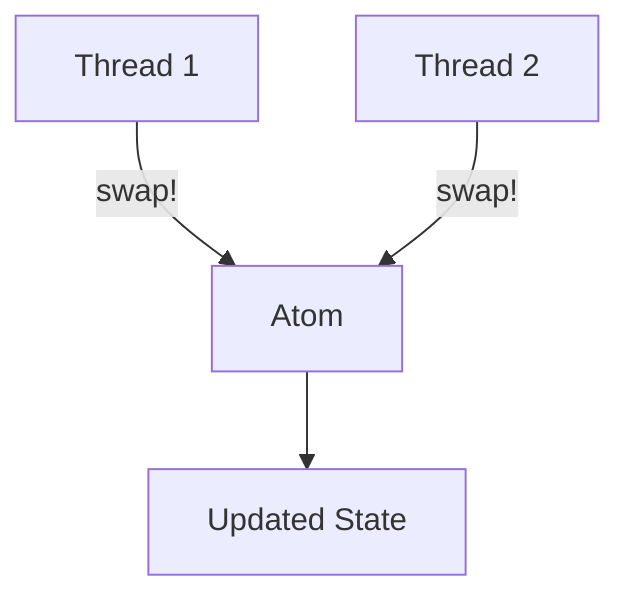
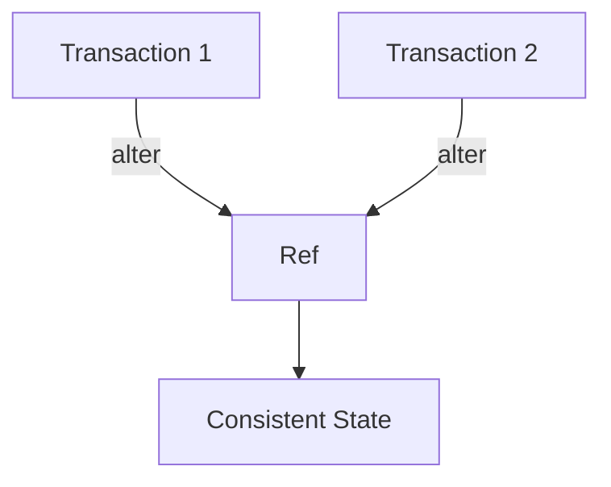
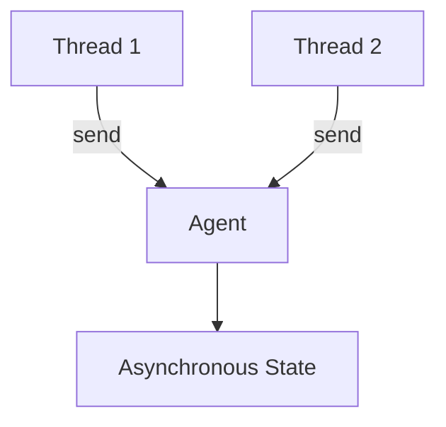

## 3.7 Handling State in Multithreaded Environments

In the realm of software development, handling state in multithreaded environments is a complex challenge. As experienced Java developers, you are likely familiar with the intricacies of managing concurrency, including the pitfalls of race conditions and deadlocks. In this section, we will explore how Clojure's concurrency model, rooted in immutability and functional programming principles, offers a robust solution to these challenges. Let's delve into the common problems faced in multithreaded programming and how Clojure's unique approach can simplify state management.

### Concurrency Challenges

Concurrency in programming involves multiple computations happening simultaneously, which can lead to several issues if not handled correctly. Here are some common problems:

- **Race Conditions**: Occur when two or more threads access shared data and try to change it simultaneously. The final outcome depends on the thread scheduling, which is unpredictable.
- **Deadlocks**: Happen when two or more threads are blocked forever, each waiting for the other to release a lock.
- **Resource Starvation**: Occurs when a thread is perpetually denied access to resources it needs to proceed.
- **Complexity in Synchronization**: Managing locks and ensuring thread safety can lead to complex and error-prone code.

In Java, developers often use synchronized blocks, locks, and other concurrency utilities from the `java.util.concurrent` package to manage these issues. However, these solutions can be cumbersome and difficult to maintain.

### Clojure's Concurrency Model

Clojure offers a different approach to concurrency, leveraging immutability and functional programming principles to simplify state management. Let's explore some key aspects of Clojure's concurrency model:

#### Immutability as a Foundation

In Clojure, data structures are immutable by default. This means that once a data structure is created, it cannot be changed. Instead of modifying existing data, new data structures are created with the desired changes. This immutability eliminates the possibility of race conditions, as threads cannot alter shared data.

```clojure
(def my-list [1 2 3])
(def new-list (conj my-list 4)) ; Creates a new list with 4 added
```

In this example, `my-list` remains unchanged, and `new-list` is a new list with the additional element. This approach ensures thread safety without the need for locks.

#### State Management Constructs

Clojure provides several constructs for managing state in a controlled manner:

- **Atoms**: Provide a way to manage shared, synchronous, and independent state. They are ideal for situations where you need to manage state changes that are independent of other state changes.

  ```clojure
  (def counter (atom 0))
  (swap! counter inc) ; Atomically increments the counter
  ```

- **Refs**: Allow coordinated, synchronous changes to multiple pieces of state. They use Software Transactional Memory (STM) to ensure consistency.

  ```clojure
  (def account-balance (ref 100))
  (dosync
    (alter account-balance + 50)) ; Adds 50 to the account balance within a transaction
  ```

- **Agents**: Facilitate asynchronous state changes. They are suitable for managing state that changes independently and asynchronously.

  ```clojure
  (def logger (agent []))
  (send logger conj "Log entry") ; Asynchronously adds a log entry
  ```

These constructs provide a higher-level abstraction for managing state, reducing the complexity associated with traditional locking mechanisms.

### Synchronization Mechanisms

Clojure's approach to synchronization differs significantly from traditional locking mechanisms. Let's compare these approaches:

#### Traditional Locking in Java

In Java, synchronization is often achieved using locks and synchronized blocks. While effective, these mechanisms can lead to complex and error-prone code:

```java
public class Counter {
    private int count = 0;

    public synchronized void increment() {
        count++;
    }

    public synchronized int getCount() {
        return count;
    }
}
```

In this example, the `synchronized` keyword ensures that only one thread can execute the `increment` method at a time, preventing race conditions. However, this approach can lead to deadlocks and requires careful management of locks.

#### Clojure's Approach

Clojure's concurrency constructs, such as atoms, refs, and agents, provide a more declarative way to manage state:

- **Atoms**: Use compare-and-swap (CAS) operations to ensure atomic updates without locks.

  ```clojure
  (def counter (atom 0))
  (swap! counter inc) ; Atomically increments the counter
  ```

- **Refs**: Use STM to manage coordinated state changes. Transactions are retried automatically if conflicts occur.

  ```clojure
  (def account-balance (ref 100))
  (dosync
    (alter account-balance + 50)) ; Adds 50 to the account balance within a transaction
  ```

- **Agents**: Handle asynchronous updates, allowing state changes to occur independently.

  ```clojure
  (def logger (agent []))
  (send logger conj "Log entry") ; Asynchronously adds a log entry
  ```

These constructs simplify synchronization by abstracting away the complexities of locking, reducing the risk of deadlocks and race conditions.

### Best Practices for Multithreaded Code in Clojure

To write safe and efficient multithreaded code in Clojure, consider the following best practices:

1. **Leverage Immutability**: Use immutable data structures to eliminate race conditions and simplify state management.

2. **Choose the Right State Management Construct**: Use atoms for independent state changes, refs for coordinated changes, and agents for asynchronous updates.

3. **Minimize Shared State**: Reduce the amount of shared state to minimize the potential for conflicts.

4. **Use Transactions Wisely**: When using refs, ensure that transactions are short and do not perform side effects.

5. **Monitor Performance**: Use profiling tools to identify performance bottlenecks and optimize state management accordingly.

6. **Test Concurrent Code**: Write tests to ensure that your code behaves correctly under concurrent conditions.

7. **Document Your Code**: Clearly document the intended behavior of concurrent code to aid future maintenance.

### Visualizing Clojure's Concurrency Model

To better understand Clojure's concurrency model, let's visualize the flow of data through atoms, refs, and agents using Mermaid.js diagrams.

#### Atoms



**Diagram Description**: This diagram illustrates how multiple threads can update an atom concurrently using the `swap!` function. The atom ensures atomic updates, resulting in a consistent updated state.

#### Refs



**Diagram Description**: This diagram shows how refs use STM to manage coordinated state changes. Transactions are retried automatically if conflicts occur, ensuring a consistent state.

#### Agents



**Diagram Description**: This diagram depicts how agents handle asynchronous updates. Multiple threads can send updates to an agent, which processes them independently.

### References and Further Reading

For more information on Clojure's concurrency model and state management constructs, consider exploring the following resources:

- [Official Clojure Documentation](https://clojure.org/reference/atoms)
- [ClojureDocs](https://clojuredocs.org/)
- [Clojure Programming by Chas Emerick, Brian Carper, and Christophe Grand](https://www.oreilly.com/library/view/clojure-programming/9781449310387/)

### Knowledge Check

Let's reinforce your understanding of handling state in multithreaded environments with a few questions and exercises.

1. **What are the key differences between atoms, refs, and agents in Clojure?**
2. **How does immutability help prevent race conditions?**
3. **Write a Clojure function that uses an atom to manage a counter.**
4. **Explain how Clojure's STM ensures consistency in state management.**
5. **Modify the provided Java code to use Clojure's concurrency constructs.**

### Summary

In this section, we've explored how Clojure's concurrency model, rooted in immutability and functional programming principles, simplifies handling state in multithreaded environments. By leveraging constructs like atoms, refs, and agents, we can write safe and efficient multithreaded code without the complexities of traditional locking mechanisms. Now that we've covered these concepts, let's apply them to build scalable and robust applications in Clojure.

## Quiz: Mastering State Management in Multithreaded Environments



### What is a common problem in multithreaded programming?

- [x] Race conditions
- [ ] Immutable data structures
- [ ] Functional programming
- [ ] Higher-order functions

> **Explanation:** Race conditions occur when multiple threads access shared data simultaneously, leading to unpredictable outcomes.

### How does Clojure's immutability help in multithreaded environments?

- [x] It prevents race conditions by ensuring data cannot be changed.
- [ ] It allows for mutable state management.
- [ ] It requires complex locking mechanisms.
- [ ] It increases the risk of deadlocks.

> **Explanation:** Immutability ensures that data cannot be altered, eliminating race conditions and simplifying concurrency.

### Which Clojure construct is best for managing asynchronous state changes?

- [x] Agents
- [ ] Atoms
- [ ] Refs
- [ ] Transactions

> **Explanation:** Agents facilitate asynchronous state changes, allowing updates to occur independently.

### What does Clojure's STM stand for?

- [x] Software Transactional Memory
- [ ] Synchronous Transactional Management
- [ ] State Transition Model
- [ ] Simple Thread Management

> **Explanation:** STM stands for Software Transactional Memory, a concurrency control mechanism used by refs in Clojure.

### Which Clojure construct uses compare-and-swap (CAS) operations?

- [x] Atoms
- [ ] Refs
- [ ] Agents
- [ ] Transactions

> **Explanation:** Atoms use CAS operations to ensure atomic updates without locks.

### What is a key benefit of using refs in Clojure?

- [x] Coordinated state changes with STM
- [ ] Asynchronous updates
- [ ] Independent state changes
- [ ] Complex locking mechanisms

> **Explanation:** Refs allow for coordinated state changes using STM, ensuring consistency.

### How can you ensure thread safety in Clojure?

- [x] Use immutable data structures
- [ ] Use synchronized blocks
- [ ] Use complex locking mechanisms
- [ ] Use mutable state

> **Explanation:** Immutable data structures inherently ensure thread safety by preventing data modification.

### What is a best practice for writing multithreaded code in Clojure?

- [x] Minimize shared state
- [ ] Use complex locking mechanisms
- [ ] Avoid using atoms
- [ ] Perform side effects in transactions

> **Explanation:** Minimizing shared state reduces the potential for conflicts and simplifies concurrency management.

### Which Clojure construct is suitable for independent state changes?

- [x] Atoms
- [ ] Refs
- [ ] Agents
- [ ] Transactions

> **Explanation:** Atoms are ideal for managing independent state changes.

### True or False: Clojure requires locks for managing state in multithreaded environments.

- [ ] True
- [x] False

> **Explanation:** Clojure's concurrency constructs, such as atoms, refs, and agents, abstract away the need for locks, simplifying state management.


