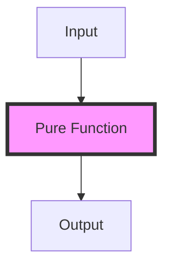

## 4.1 Defining Pure Functions

In the realm of functional programming, pure functions are a cornerstone concept that distinguishes this paradigm from others, such as imperative or object-oriented programming. For Java developers transitioning to Clojure, understanding pure functions is crucial for leveraging the full potential of functional programming to build scalable and maintainable applications.

### Characteristics of Pure Functions

**Pure functions** are defined by two main characteristics:

1. **No Side Effects**: A pure function does not alter any external state or interact with the outside world. This means no modifying global variables, no I/O operations, and no database interactions within the function.

2. **Deterministic Output**: Given the same input, a pure function will always produce the same output. This predictability is a key advantage in functional programming.

#### Benefits of Pure Functions

Pure functions offer several benefits that contribute to the robustness and scalability of applications:

- **Ease of Testing**: Since pure functions are deterministic and do not depend on external state, they are straightforward to test. You can simply provide inputs and verify the outputs without setting up complex environments.

- **Reasoning and Debugging**: Pure functions simplify reasoning about code behavior. You can understand a function's behavior in isolation, making debugging more manageable.

- **Composability**: Pure functions can be easily composed to build more complex operations. This modularity is a hallmark of functional programming, allowing developers to build complex systems from simple, reusable components.

- **Concurrency and Parallelism**: Pure functions are inherently thread-safe, as they do not modify shared state. This makes them ideal for concurrent and parallel execution, enhancing performance in multi-core systems.

### Examples of Pure Functions

Let's explore some examples of pure functions in Clojure and compare them with Java to highlight the differences and similarities.

#### Clojure Example

```clojure
;; A simple pure function that adds two numbers
(defn add [x y]
  (+ x y))

;; Usage
(add 2 3) ; => 5
```

In this example, the `add` function is pure because it does not modify any external state and always returns the same result for the same inputs.

#### Java Example

```java
// A simple pure function in Java
public class PureFunctionExample {
    public static int add(int x, int y) {
        return x + y;
    }

    public static void main(String[] args) {
        System.out.println(add(2, 3)); // Output: 5
    }
}
```

The Java example mirrors the Clojure function in terms of purity. However, Clojure's syntax and functional nature make it more concise and expressive.

### Identifying Impurities

Identifying impure functions is essential for maintaining the purity of your codebase. Here are some common signs of impurity:

- **State Modification**: If a function modifies a variable or object outside its scope, it is impure.

- **I/O Operations**: Functions that perform input/output operations, such as reading from or writing to a file or console, are impure.

- **Randomness**: Functions that rely on random number generation or other non-deterministic processes are impure.

#### Example of an Impure Function

```clojure
;; An impure function that modifies a global variable
(def counter (atom 0))

(defn increment-counter []
  (swap! counter inc))

;; Usage
(increment-counter) ; Modifies the state of `counter`
```

In this example, `increment-counter` is impure because it modifies the state of the `counter` atom.

### Visualizing Pure Functions

To better understand the flow of data in pure functions, let's use a diagram to illustrate how inputs are transformed into outputs without side effects.



**Diagram Explanation**: This diagram shows that a pure function takes an input and produces an output without interacting with or altering any external state.

### Try It Yourself

To deepen your understanding, try modifying the following Clojure code to introduce impurity and observe the effects:

```clojure
(defn multiply [x y]
  (* x y))

;; Experiment: Introduce a side effect by printing the result
(defn impure-multiply [x y]
  (println "Multiplying" x "and" y)
  (* x y))

;; Test both functions
(multiply 3 4) ; Pure
(impure-multiply 3 4) ; Impure
```

### Knowledge Check

To reinforce your understanding of pure functions, consider the following questions:

- What are the two main characteristics of a pure function?
- How do pure functions enhance code composability?
- Why are pure functions easier to test compared to impure functions?
- Identify an example of an impure function in your current codebase and refactor it to be pure.

### Summary

Pure functions are a fundamental concept in functional programming, offering predictability, testability, and composability. By understanding and applying pure functions, you can write more robust and scalable Clojure applications. As you continue your journey in mastering functional programming, remember to leverage the power of pure functions to simplify your code and enhance its maintainability.

Now that we've explored the essence of pure functions, let's delve into the advantages they bring to your functional programming toolkit.

## Quiz: Understanding Pure Functions in Clojure



### What is a key characteristic of a pure function?

- [x] It produces the same output for the same input.
- [ ] It modifies global variables.
- [ ] It performs I/O operations.
- [ ] It generates random numbers.

> **Explanation:** A pure function always produces the same output for the same input, without side effects.

### Why are pure functions easier to test?

- [x] They have no side effects.
- [ ] They rely on global state.
- [ ] They perform I/O operations.
- [ ] They are non-deterministic.

> **Explanation:** Pure functions are easier to test because they have no side effects and are deterministic.

### Which of the following is an example of an impure function?

- [ ] A function that adds two numbers.
- [x] A function that writes to a file.
- [ ] A function that multiplies two numbers.
- [ ] A function that returns a constant value.

> **Explanation:** A function that writes to a file is impure because it performs an I/O operation.

### How do pure functions enhance code composability?

- [x] They can be easily combined to form more complex functions.
- [ ] They modify external state.
- [ ] They rely on random number generation.
- [ ] They perform I/O operations.

> **Explanation:** Pure functions enhance composability because they can be combined without side effects.

### Which of the following is a benefit of pure functions?

- [x] They simplify reasoning about code.
- [ ] They require complex setup for testing.
- [ ] They depend on external state.
- [ ] They are non-deterministic.

> **Explanation:** Pure functions simplify reasoning about code because they are deterministic and have no side effects.

### What makes a function impure?

- [x] It modifies external state.
- [ ] It always returns the same output for the same input.
- [ ] It does not perform I/O operations.
- [ ] It is deterministic.

> **Explanation:** A function is impure if it modifies external state or performs I/O operations.

### How can you identify an impure function?

- [x] It performs I/O operations.
- [x] It modifies global variables.
- [ ] It always returns the same output for the same input.
- [ ] It is deterministic.

> **Explanation:** Impure functions perform I/O operations or modify global variables.

### What is a common use case for pure functions?

- [x] Building scalable applications.
- [ ] Modifying global state.
- [ ] Performing I/O operations.
- [ ] Generating random numbers.

> **Explanation:** Pure functions are commonly used in building scalable applications due to their predictability and composability.

### Which of the following is true about pure functions?

- [x] They are inherently thread-safe.
- [ ] They rely on external state.
- [ ] They perform I/O operations.
- [ ] They are non-deterministic.

> **Explanation:** Pure functions are inherently thread-safe because they do not modify shared state.

### Pure functions are easier to test because they are deterministic.

- [x] True
- [ ] False

> **Explanation:** Pure functions are easier to test because they are deterministic and have no side effects.


