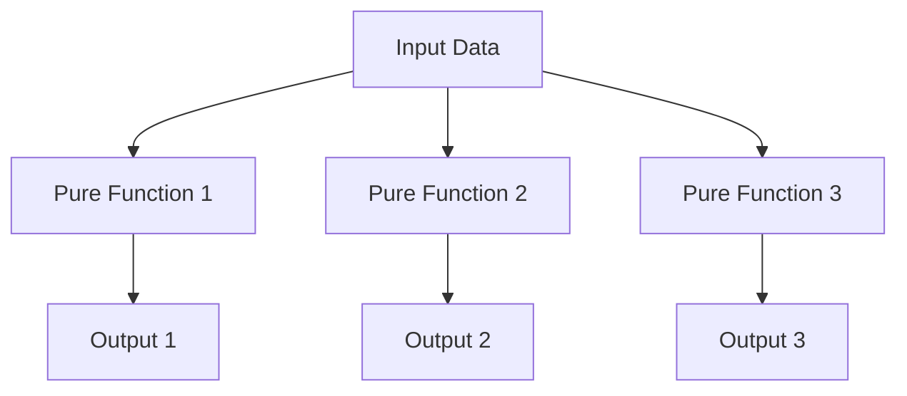
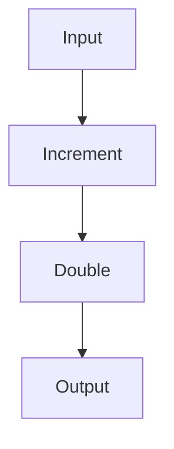

## 4.2 Advantages of Pure Functions

In the realm of functional programming, pure functions are the cornerstone of writing predictable, maintainable, and scalable code. As experienced Java developers transitioning to Clojure, understanding the advantages of pure functions will not only enhance your functional programming skills but also improve your overall software development practices. In this section, we will delve into the key benefits of pure functions, including testability, parallelization, caching and memoization, and maintainability.

### Understanding Pure Functions

Before we explore the advantages, let's briefly define what pure functions are. A pure function is a function where the output value is determined only by its input values, without observable side effects. This means that given the same input, a pure function will always produce the same output. Additionally, pure functions do not modify any external state or interact with the outside world.

#### Characteristics of Pure Functions

1. **Deterministic Output**: The same input will always yield the same output.
2. **No Side Effects**: Pure functions do not alter any external state or variables.
3. **Referential Transparency**: Expressions in a program can be replaced with their corresponding values without changing the program's behavior.

### Testability

One of the most significant advantages of pure functions is their testability. In Java, testing often involves dealing with complex object states and dependencies, which can require extensive use of mocks and stubs. Pure functions simplify this process considerably.

#### Simplified Unit Testing

Pure functions are inherently easier to test because they do not depend on any external state. This means you can test them in isolation, without needing to set up complex environments or mock dependencies.

```clojure
;; Clojure Example: Testing a Pure Function
(defn add [a b]
  (+ a b))

;; Test
(assert (= 5 (add 2 3))) ;; This will always pass
```

In contrast, consider a Java method that might require a mock database connection or a stubbed service. With pure functions, you eliminate these dependencies, making your tests more reliable and faster to execute.

#### Try It Yourself

Experiment with creating a pure function in Clojure and write a simple test for it. Notice how straightforward it is compared to setting up a similar test in Java.

### Parallelization

Pure functions are naturally suited for parallel execution. Since they do not rely on or modify shared state, they can be executed concurrently without the risk of race conditions or the need for synchronization mechanisms.

#### Safe Parallel Execution

In Java, parallelizing code often requires careful management of shared resources and synchronization to avoid concurrency issues. Pure functions, however, can be executed in parallel without these concerns, leading to more efficient and scalable applications.

```clojure
;; Clojure Example: Parallel Execution with Pure Functions
(defn square [x]
  (* x x))

;; Using pmap for parallel mapping
(def numbers (range 1 100))
(def squares (pmap square numbers))
```

In this example, `pmap` is used to apply the `square` function to each element in the `numbers` collection in parallel. This is possible because `square` is a pure function, ensuring that each computation is independent of the others.

#### Visual Aid: Parallel Execution Flow



*Diagram: Parallel execution of pure functions, where each function operates independently on the input data.*

### Caching and Memoization

Pure functions lend themselves well to caching and memoization strategies. Since the output of a pure function is solely determined by its input, you can safely cache the results of function calls to improve performance.

#### Efficient Memoization

Memoization is a technique where the results of expensive function calls are cached, so subsequent calls with the same arguments can return the cached result instead of recomputing it.

```clojure
;; Clojure Example: Memoization
(defn slow-fib [n]
  (if (<= n 1)
    n
    (+ (slow-fib (- n 1)) (slow-fib (- n 2)))))

(def memoized-fib (memoize slow-fib))

;; Using memoized-fib will be much faster for repeated calls
(memoized-fib 40)
```

In this example, `memoize` is used to cache the results of the `slow-fib` function, significantly improving performance for repeated calls with the same arguments.

#### Try It Yourself

Modify the `slow-fib` function to include a print statement that logs each computation. Observe how the memoized version reduces the number of computations.

### Maintainability

Pure functions contribute to maintainable codebases by promoting clear and predictable code. This is especially beneficial in large-scale applications where understanding and modifying code can become challenging.

#### Long-Term Benefits

1. **Predictability**: Since pure functions always produce the same output for the same input, they are easier to reason about and debug.
2. **Refactoring**: Pure functions can be refactored with confidence, knowing that changes will not introduce unintended side effects.
3. **Modularity**: Pure functions encourage a modular design, where functions can be composed and reused across different parts of an application.

```clojure
;; Clojure Example: Composing Pure Functions
(defn increment [x]
  (+ x 1))

(defn double [x]
  (* x 2))

(defn increment-and-double [x]
  (double (increment x)))

;; Test
(assert (= 6 (increment-and-double 2)))
```

In this example, the `increment` and `double` functions are composed to create a new function, `increment-and-double`. This modular approach makes it easy to understand and modify the code.

#### Visual Aid: Function Composition



*Diagram: Function composition using pure functions, where the output of one function becomes the input to the next.*

### Conclusion

Pure functions offer numerous advantages that enhance the quality and scalability of your code. By simplifying testing, enabling parallel execution, supporting efficient caching, and improving maintainability, pure functions are a powerful tool in the functional programmer's toolkit.

As you continue to explore Clojure and functional programming, consider how you can leverage pure functions to write cleaner, more efficient, and more reliable code. Embrace the functional programming mindset, and you'll find that many of the challenges faced in traditional programming paradigms can be addressed with elegance and simplicity.

### Knowledge Check

Now that we've explored the advantages of pure functions, let's test your understanding with a few questions.

## Quiz: Mastering Pure Functions in Clojure



### What is a key characteristic of pure functions?

- [x] They produce the same output for the same input.
- [ ] They can modify external state.
- [ ] They depend on global variables.
- [ ] They require synchronization for parallel execution.

> **Explanation:** Pure functions are deterministic, meaning they produce the same output for the same input, without side effects.

### How do pure functions simplify unit testing?

- [x] They eliminate the need for mocks and stubs.
- [ ] They require complex test setups.
- [ ] They depend on external state.
- [ ] They need synchronization mechanisms.

> **Explanation:** Pure functions do not depend on external state, making them easy to test in isolation without mocks or stubs.

### Why are pure functions suitable for parallel execution?

- [x] They do not modify shared state.
- [ ] They require locks for synchronization.
- [ ] They depend on mutable variables.
- [ ] They need complex concurrency controls.

> **Explanation:** Pure functions do not modify shared state, allowing them to be executed in parallel without synchronization concerns.

### What is memoization in the context of pure functions?

- [x] Caching the results of function calls.
- [ ] Modifying function inputs.
- [ ] Synchronizing function execution.
- [ ] Using global variables for storage.

> **Explanation:** Memoization involves caching the results of function calls to avoid recomputation, which is safe with pure functions.

### How do pure functions contribute to maintainability?

- [x] They promote modular and predictable code.
- [ ] They increase code complexity.
- [ ] They require extensive documentation.
- [ ] They depend on external libraries.

> **Explanation:** Pure functions promote modular and predictable code, making it easier to maintain and refactor.

### What is a benefit of function composition with pure functions?

- [x] It allows for modular and reusable code.
- [ ] It increases code duplication.
- [ ] It requires complex dependencies.
- [ ] It depends on mutable state.

> **Explanation:** Function composition with pure functions allows for modular and reusable code, enhancing maintainability.

### How does memoization improve performance?

- [x] By caching results to avoid recomputation.
- [ ] By increasing computation time.
- [ ] By using more memory.
- [ ] By requiring additional synchronization.

> **Explanation:** Memoization caches results of function calls, reducing the need for recomputation and improving performance.

### What is referential transparency?

- [x] The ability to replace expressions with their values.
- [ ] The use of global variables.
- [ ] The modification of external state.
- [ ] The need for synchronization.

> **Explanation:** Referential transparency allows expressions to be replaced with their values without changing program behavior.

### Why is predictability important in pure functions?

- [x] It makes code easier to reason about and debug.
- [ ] It increases code complexity.
- [ ] It requires more documentation.
- [ ] It depends on mutable state.

> **Explanation:** Predictability makes code easier to reason about and debug, as pure functions always produce the same output for the same input.

### True or False: Pure functions can modify external state.

- [ ] True
- [x] False

> **Explanation:** Pure functions cannot modify external state; they are side-effect-free and deterministic.



By mastering pure functions, you are well on your way to becoming a proficient functional programmer in Clojure. Continue to explore and experiment with these concepts, and you'll discover the power and elegance of functional programming.
