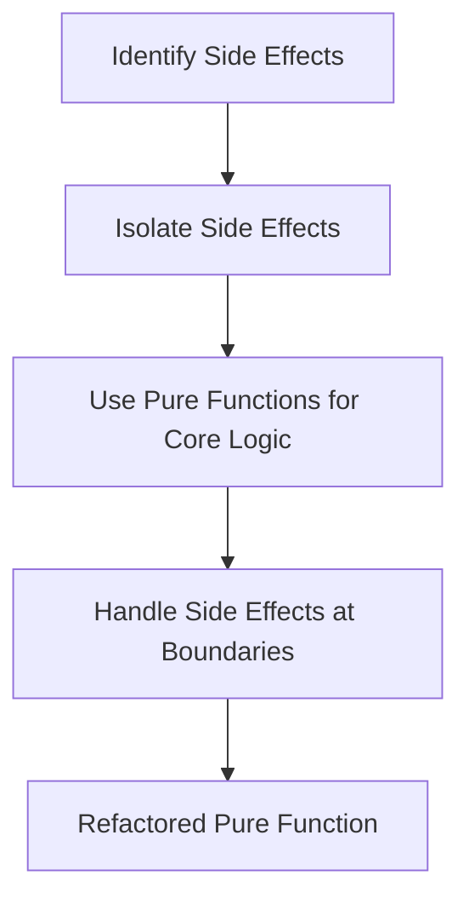

## 4.3 Avoiding Side Effects in Functions

In the realm of functional programming, one of the core principles is the use of pure functions. Pure functions are the building blocks of reliable, maintainable, and scalable applications. They are functions that, given the same input, will always produce the same output and have no side effects. In this section, we will delve into the concept of side effects, explore common examples, and provide strategies to refactor impure functions to eliminate side effects.

### Understanding Side Effects

**Side effects** occur when a function interacts with the outside world or changes the state of the system in a way that is observable outside the function. This can include modifying a global variable, performing I/O operations, or altering the input arguments. Side effects can make functions unpredictable and harder to test, as they introduce dependencies on the external environment.

#### Impact of Side Effects on Function Purity

The presence of side effects in a function compromises its purity. Pure functions are deterministic and easier to reason about, test, and debug. They are essential for achieving referential transparency, where expressions can be replaced with their corresponding values without changing the program's behavior.

**Example of a Pure Function in Clojure:**

```clojure
(defn add [x y]
  (+ x y))
```

This `add` function is pure because it simply returns the sum of `x` and `y` without altering any external state or performing any I/O operations.

**Example of an Impure Function in Java:**

```java
public int addAndLog(int x, int y) {
    int sum = x + y;
    System.out.println("Sum is: " + sum); // Side effect: I/O operation
    return sum;
}
```

In this Java example, the function `addAndLog` is impure because it performs an I/O operation by printing to the console, which is a side effect.

### Common Side Effects

Let's explore some common side effects that can occur in functions:

1. **Modifying Global Variables**: Changing the value of a global variable within a function can lead to unpredictable behavior, as other parts of the program may depend on that variable.

2. **I/O Operations**: Reading from or writing to files, databases, or the console are side effects because they interact with the external environment.

3. **Changing Input Arguments**: Altering the input arguments of a function can lead to unexpected results, especially if those arguments are used elsewhere in the program.

4. **Network Calls**: Making HTTP requests or interacting with external services can introduce side effects due to network latency and variability.

5. **Random Number Generation**: Using random numbers can make a function's output non-deterministic, as the same input can produce different outputs.

### Strategies to Avoid Side Effects

To write pure functions and avoid side effects, consider the following strategies:

#### 1. Pass in Necessary Data

Ensure that all the data a function needs is passed in as arguments. This eliminates the need to rely on external state or global variables.

**Clojure Example:**

```clojure
(defn calculate-total [prices]
  (reduce + prices))
```

In this example, `calculate-total` takes a list of `prices` as an argument and returns their sum without relying on any external state.

#### 2. Return New Values

Instead of modifying existing data structures, return new values. Clojure's immutable data structures make this approach efficient and straightforward.

**Clojure Example:**

```clojure
(defn add-item [cart item]
  (conj cart item))
```

Here, `add-item` returns a new cart with the `item` added, rather than modifying the original cart.

#### 3. Use Pure Functions for Computation

Separate computation from side effects. Perform all calculations in pure functions and handle side effects in a controlled manner, such as at the boundaries of your application.

**Clojure Example:**

```clojure
(defn compute-discount [price discount-rate]
  (* price discount-rate))
```

This function calculates a discount without any side effects. Any I/O operations, such as displaying the discount, should be handled separately.

#### 4. Leverage Higher-Order Functions

Use higher-order functions like `map`, `filter`, and `reduce` to operate on collections without introducing side effects.

**Clojure Example:**

```clojure
(defn apply-discounts [prices discount-rate]
  (map #(compute-discount % discount-rate) prices))
```

This function applies a discount to each price in the list using the pure `compute-discount` function.

### Refactoring Impure Functions

Refactoring impure functions involves identifying side effects and restructuring the code to eliminate them. Here are some steps to guide you through the process:

#### Step 1: Identify Side Effects

Examine the function to identify any operations that interact with the external environment or modify state.

**Java Example of an Impure Function:**

```java
public void updateInventory(String item, int quantity) {
    inventory.put(item, quantity); // Side effect: Modifying a global map
    System.out.println("Inventory updated"); // Side effect: I/O operation
}
```

#### Step 2: Isolate Side Effects

Separate the side effects from the core logic of the function. This often involves creating helper functions to handle the pure computation.

**Clojure Refactoring Example:**

```clojure
(defn update-inventory [inventory item quantity]
  (assoc inventory item quantity))

(defn log-update [item quantity]
  (println (str "Inventory updated for " item " with quantity " quantity)))
```

In this refactoring, `update-inventory` is a pure function that returns a new inventory map, while `log-update` handles the I/O operation separately.

#### Step 3: Use Pure Functions for Core Logic

Ensure that the core logic of your function is handled by pure functions. This makes the code more testable and easier to reason about.

**Clojure Example:**

```clojure
(defn process-order [inventory order]
  (reduce (fn [inv [item quantity]]
            (update-inventory inv item quantity))
          inventory
          order))
```

This function processes an order by updating the inventory using the pure `update-inventory` function.

#### Step 4: Handle Side Effects at the Boundaries

Perform side effects at the boundaries of your application, such as in the main function or in specific I/O handling functions.

**Clojure Example:**

```clojure
(defn main []
  (let [inventory {}
        order [["apple" 10] ["banana" 5]]]
    (let [updated-inventory (process-order inventory order)]
      (doseq [[item quantity] order]
        (log-update item quantity))
      updated-inventory)))
```

In this example, `main` handles the side effects of logging updates, while the core logic remains pure.

### Visual Aids

To better understand the flow of data and the separation of side effects, let's look at a diagram illustrating the process of refactoring an impure function:



**Diagram Description**: This flowchart outlines the steps to refactor an impure function by identifying and isolating side effects, using pure functions for core logic, and handling side effects at the boundaries.

### Knowledge Check

Let's reinforce what we've learned with some questions and exercises:

1. **Question**: What is a side effect in the context of functional programming?
   - **Answer**: A side effect is any interaction with the external environment or change in state that is observable outside the function.

2. **Exercise**: Refactor the following impure function to eliminate side effects:

   ```clojure
   (defn impure-function [x]
     (println "Processing" x)
     (* x 2))
   ```

   **Solution**:

   ```clojure
   (defn pure-function [x]
     (* x 2))

   (defn log-processing [x]
     (println "Processing" x))
   ```

   **Explanation**: The `pure-function` handles the computation, while `log-processing` manages the I/O operation separately.

### Encouraging Tone

Now that we've explored how to avoid side effects in functions, let's apply these concepts to write cleaner, more reliable code in your Clojure applications. By embracing pure functions, you'll create software that is easier to test, debug, and maintain. Keep experimenting with these techniques, and you'll soon master the art of functional programming in Clojure.

### References and Links

For further reading and exploration, consider the following resources:

- [Official Clojure Documentation](https://clojure.org/reference/documentation)
- [ClojureDocs](https://clojuredocs.org/)
- [Functional Programming in Clojure](https://www.braveclojure.com/)

### Quiz: Mastering Pure Functions and Avoiding Side Effects



### What is a side effect in functional programming?

- [x] An interaction with the external environment or change in state observable outside the function
- [ ] A function that returns a value
- [ ] A function that takes multiple arguments
- [ ] A function that uses recursion

> **Explanation:** A side effect is any interaction with the external environment or change in state that is observable outside the function, making it impure.

### Which of the following is NOT a common side effect?

- [ ] Modifying a global variable
- [ ] Performing I/O operations
- [x] Using a local variable
- [ ] Making network calls

> **Explanation:** Using a local variable within a function does not constitute a side effect, as it does not affect the external environment or state.

### How can you avoid side effects in functions?

- [x] By passing in necessary data and returning new values
- [ ] By modifying global variables
- [ ] By performing I/O operations within the function
- [ ] By using random number generation

> **Explanation:** Avoid side effects by passing in necessary data and returning new values instead of modifying existing ones.

### What is the benefit of using pure functions?

- [x] They are deterministic and easier to test
- [ ] They can modify global state
- [ ] They perform I/O operations
- [ ] They rely on external dependencies

> **Explanation:** Pure functions are deterministic and easier to test because they do not rely on external state or perform side effects.

### Which strategy helps in refactoring impure functions?

- [x] Isolating side effects and using pure functions for core logic
- [ ] Combining side effects with core logic
- [ ] Ignoring side effects
- [ ] Using global variables

> **Explanation:** Isolating side effects and using pure functions for core logic helps in refactoring impure functions to eliminate side effects.

### What is the role of higher-order functions in avoiding side effects?

- [x] They operate on collections without introducing side effects
- [ ] They modify global variables
- [ ] They perform I/O operations
- [ ] They generate random numbers

> **Explanation:** Higher-order functions like `map`, `filter`, and `reduce` operate on collections without introducing side effects.

### How can you handle side effects in a functional program?

- [x] At the boundaries of the application
- [ ] In the core logic of the function
- [ ] By modifying input arguments
- [ ] By using global variables

> **Explanation:** Handle side effects at the boundaries of the application, keeping the core logic pure.

### What is the impact of side effects on referential transparency?

- [x] They compromise referential transparency
- [ ] They enhance referential transparency
- [ ] They have no impact on referential transparency
- [ ] They make functions more efficient

> **Explanation:** Side effects compromise referential transparency, making functions less predictable and harder to reason about.

### Which of the following is a pure function?

- [x] A function that returns the same output for the same input without side effects
- [ ] A function that modifies a global variable
- [ ] A function that performs I/O operations
- [ ] A function that changes input arguments

> **Explanation:** A pure function returns the same output for the same input without side effects, making it predictable and testable.

### True or False: Pure functions can perform I/O operations.

- [ ] True
- [x] False

> **Explanation:** False. Pure functions cannot perform I/O operations, as they would introduce side effects.



By mastering the art of avoiding side effects in functions, you are well on your way to becoming proficient in functional programming with Clojure. Keep practicing and exploring, and you'll unlock the full potential of this powerful paradigm.
