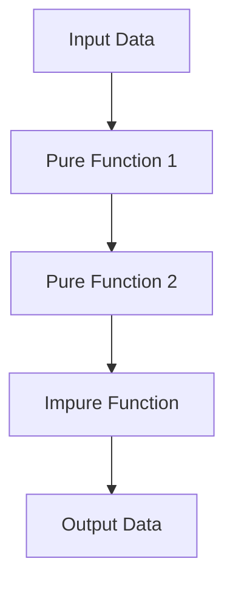

## 4.5 Identifying and Refactoring Impure Functions

In the realm of functional programming, pure functions are the cornerstone of reliable and maintainable code. As experienced Java developers transitioning to Clojure, understanding how to identify and refactor impure functions is crucial. This section will guide you through the process of analyzing function behavior, employing refactoring techniques, leveraging Clojure's pure core functions, and managing necessary side effects.

### Analyzing Function Behavior

**Pure vs. Impure Functions**

A pure function is one that, given the same input, will always produce the same output and has no side effects. In contrast, impure functions may produce different outputs for the same inputs or cause side effects such as modifying global state or performing I/O operations.

#### Identifying Impure Functions

To identify impure functions, look for the following characteristics:

1. **State Modification**: Functions that alter global variables or mutable data structures.
2. **I/O Operations**: Functions that read from or write to files, databases, or network resources.
3. **Randomness**: Functions that rely on random number generation.
4. **Time Dependency**: Functions that depend on the current time or date.

**Example in Java:**

```java
// Impure function in Java
public class Counter {
    private int count = 0;

    public int increment() {
        return ++count; // Modifies state
    }
}
```

**Equivalent in Clojure:**

```clojure
;; Impure function in Clojure
(def counter (atom 0))

(defn increment []
  (swap! counter inc)) ; Modifies state
```

### Refactoring Techniques

Refactoring impure functions into pure ones involves isolating side effects and ensuring that functions are deterministic.

#### Step-by-Step Refactoring

1. **Identify Side Effects**: Determine where the function interacts with external systems or modifies state.
2. **Isolate Side Effects**: Move side effects to the edges of your system, such as input/output boundaries.
3. **Use Pure Functions**: Replace impure logic with pure functions wherever possible.
4. **Test for Purity**: Ensure that the refactored function is deterministic and free of side effects.

**Refactoring Example:**

Let's refactor the impure `increment` function to a pure one.

**Original Impure Function:**

```clojure
(def counter (atom 0))

(defn increment []
  (swap! counter inc))
```

**Refactored Pure Function:**

```clojure
(defn increment [count]
  (inc count)) ; Pure function

;; Usage
(defn update-counter [counter]
  (reset! counter (increment @counter)))
```

### Using Pure Core Functions

Clojure's core library provides a wealth of pure functions that can be used to build complex logic without introducing impurities.

#### Leveraging Clojure's Core Library

- **`map`**: Apply a function to each element in a collection.
- **`filter`**: Select elements from a collection based on a predicate.
- **`reduce`**: Accumulate a result by applying a function to each element in a collection.

**Example:**

```clojure
(defn process-numbers [numbers]
  (->> numbers
       (filter even?)
       (map #(* % %))
       (reduce +)))
```

This function processes a list of numbers by filtering even numbers, squaring them, and summing the results—all using pure functions.

### Dealing with Necessary Side Effects

While functional programming strives for purity, some side effects are unavoidable. The key is to manage them effectively.

#### Isolating Side Effects

1. **Boundary Isolation**: Keep side effects at the boundaries of your system, such as in main functions or dedicated I/O modules.
2. **Functional Interfaces**: Use pure functions to process data and pass results to impure functions for side effects.

**Example:**

```clojure
(defn read-file [filename]
  (slurp filename)) ; Side effect

(defn process-content [content]
  (->> content
       (clojure.string/split-lines)
       (map clojure.string/trim)))

(defn process-file [filename]
  (-> filename
      read-file
      process-content))
```

In this example, `read-file` is the only function with side effects, while `process-content` remains pure.

### Visual Aids

To better understand the flow of data and function composition, let's visualize the process using a flowchart.



**Caption**: This flowchart illustrates the separation of pure and impure functions, with side effects isolated at the system's edges.

### References and Links

- [Official Clojure Documentation](https://clojure.org/reference/documentation)
- [ClojureDocs](https://clojuredocs.org/)
- [Functional Programming in Clojure](https://www.braveclojure.com/)

### Knowledge Check

- **What are the characteristics of impure functions?**
- **How can you refactor an impure function to a pure one?**
- **Why is it important to isolate side effects in functional programming?**

### Exercises

1. **Identify Impurities**: Review a piece of code and list all impure functions.
2. **Refactor Challenge**: Take an impure function and refactor it to be pure.
3. **Experiment with Core Functions**: Use `map`, `filter`, and `reduce` to process a collection of data.

### Encouraging Tone

Now that we've explored how to identify and refactor impure functions, let's apply these concepts to enhance the reliability and maintainability of your Clojure applications. Embrace the power of pure functions and see how they can transform your codebase.

### Quiz

## Quiz: Mastering Pure Functions in Clojure



### Which of the following is a characteristic of a pure function?

- [x] It always produces the same output for the same input.
- [ ] It modifies global state.
- [ ] It performs I/O operations.
- [ ] It relies on random number generation.

> **Explanation:** A pure function is deterministic and free of side effects, always producing the same output for the same input.

### How can you refactor an impure function to a pure one?

- [x] Isolate side effects and use pure functions for logic.
- [ ] Increase the number of parameters.
- [ ] Add more global variables.
- [ ] Use more I/O operations.

> **Explanation:** Refactoring involves isolating side effects and ensuring the logic is handled by pure functions.

### What is the role of Clojure's core library functions in refactoring?

- [x] They provide pure functions for building complex logic.
- [ ] They introduce more side effects.
- [ ] They are used only for I/O operations.
- [ ] They are not relevant to refactoring.

> **Explanation:** Clojure's core library functions are pure and can be used to construct complex logic without side effects.

### Why is it important to isolate side effects in functional programming?

- [x] To maintain code reliability and predictability.
- [ ] To increase code complexity.
- [ ] To make debugging harder.
- [ ] To ensure more global state is used.

> **Explanation:** Isolating side effects helps maintain code reliability and predictability, making it easier to test and debug.

### Which of the following is an example of a pure function in Clojure?

- [x] `(defn add [a b] (+ a b))`
- [ ] `(defn read-file [filename] (slurp filename))`
- [ ] `(defn increment [] (swap! counter inc))`
- [ ] `(defn get-time [] (System/currentTimeMillis))`

> **Explanation:** The `add` function is pure as it always returns the same result for the same inputs and has no side effects.

### What is a common technique for managing necessary side effects?

- [x] Isolate them at the system's boundaries.
- [ ] Spread them throughout the codebase.
- [ ] Ignore them completely.
- [ ] Use more global variables.

> **Explanation:** Necessary side effects should be isolated at the system's boundaries to keep the core logic pure.

### How does the `reduce` function contribute to pure function design?

- [x] It accumulates results using a pure function.
- [ ] It introduces side effects.
- [ ] It modifies global state.
- [ ] It performs I/O operations.

> **Explanation:** `reduce` uses a pure function to accumulate results, maintaining purity in the logic.

### What is the benefit of using pure functions in Clojure?

- [x] Improved code reliability and maintainability.
- [ ] Increased code complexity.
- [ ] More side effects.
- [ ] Greater reliance on global state.

> **Explanation:** Pure functions lead to improved code reliability and maintainability by eliminating side effects.

### Which of the following is NOT a characteristic of impure functions?

- [x] Deterministic behavior.
- [ ] Modifies global state.
- [ ] Performs I/O operations.
- [ ] Depends on external systems.

> **Explanation:** Impure functions are not deterministic as they can produce different outputs for the same inputs due to side effects.

### True or False: Pure functions can have side effects.

- [ ] True
- [x] False

> **Explanation:** Pure functions cannot have side effects; they are deterministic and always produce the same output for the same input.



By mastering the art of identifying and refactoring impure functions, you can harness the full potential of functional programming in Clojure, leading to more robust and scalable applications.
