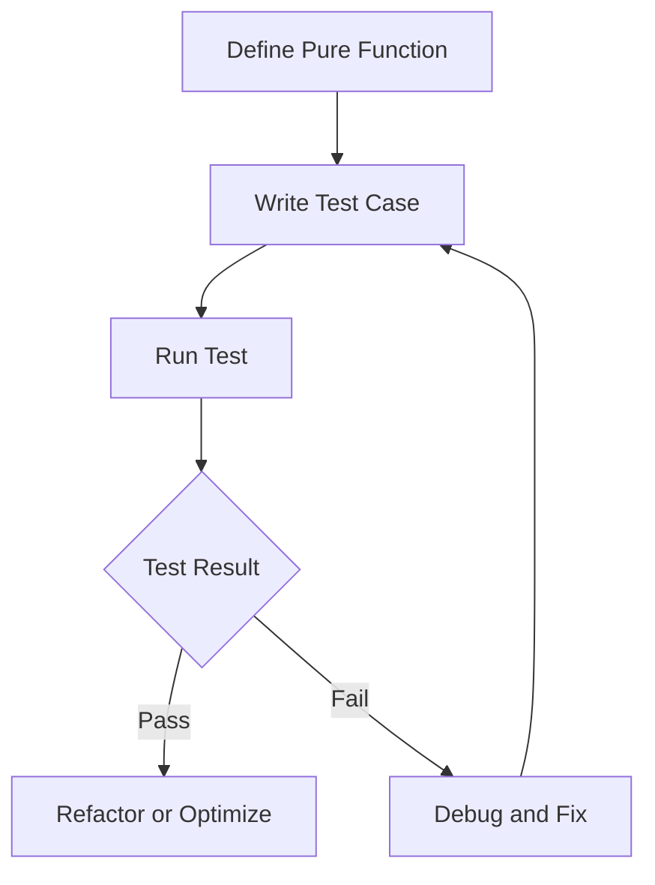

## 4.6 Writing Testable Functions

In the realm of software development, writing testable code is a cornerstone of creating reliable and maintainable applications. For Java developers transitioning to Clojure, understanding how to leverage functional programming paradigms to enhance testability is crucial. This section delves into the art of writing testable functions in Clojure, focusing on the benefits of pure functions and the power of property-based testing.

### Unit Testing Fundamentals

Unit testing is the practice of testing individual components of a program, typically functions or methods, to ensure they perform as expected. In Java, unit testing is often done using frameworks like JUnit, where each test case verifies a specific behavior of a method. Clojure, with its emphasis on functional programming, offers unique advantages in writing testable code.

#### Testing Pure Functions

Pure functions are the building blocks of functional programming. They are deterministic, meaning they always produce the same output for the same input and have no side effects. This predictability makes pure functions inherently easier to test. Let's explore how testing pure functions in Clojure compares to Java.

**Java Example:**

```java
public class MathUtils {
    public static int add(int a, int b) {
        return a + b;
    }
}

// JUnit Test
import static org.junit.Assert.assertEquals;
import org.junit.Test;

public class MathUtilsTest {
    @Test
    public void testAdd() {
        assertEquals(5, MathUtils.add(2, 3));
    }
}
```

**Clojure Example:**

```clojure
(defn add [a b]
  (+ a b))

;; clojure.test
(ns math-utils-test
  (:require [clojure.test :refer :all]
            [math-utils :refer :all]))

(deftest test-add
  (is (= 5 (add 2 3))))
```

In both examples, the function `add` is pure, making it straightforward to test. The Clojure test uses `clojure.test`, a built-in testing framework that provides a simple and expressive way to write tests.

#### Advantages of Testing Pure Functions

1. **Predictability**: Pure functions' deterministic nature ensures consistent test results.
2. **Isolation**: Tests for pure functions do not require complex setup or teardown procedures.
3. **Composability**: Pure functions can be easily composed and tested in isolation or as part of larger functions.

### Property-Based Testing

While traditional unit tests check specific input-output pairs, property-based testing validates that a function behaves correctly across a wide range of inputs. This approach is particularly useful for functions with complex logic or numerous edge cases.

#### Introducing Property-Based Testing

Property-based testing involves defining properties or invariants that should hold true for a function. The testing framework then generates random inputs to verify these properties. In Clojure, the `test.check` library facilitates property-based testing.

**Example:**

Consider a function that reverses a list. A property we might want to test is that reversing a list twice yields the original list.

```clojure
(ns list-utils
  (:require [clojure.test.check :as tc]
            [clojure.test.check.generators :as gen]
            [clojure.test.check.properties :as prop]))

(defn reverse-list [lst]
  (reduce conj () lst))

(def reverse-twice-property
  (prop/for-all [lst (gen/vector gen/int)]
    (= lst (reverse-list (reverse-list lst)))))

(tc/quick-check 100 reverse-twice-property)
```

In this example, `reverse-twice-property` defines the property that reversing a list twice should return the original list. The `quick-check` function runs this property against 100 randomly generated lists.

#### Benefits of Property-Based Testing

1. **Comprehensive Coverage**: Tests a wide range of inputs, uncovering edge cases that specific test cases might miss.
2. **Specification Clarity**: Encourages thinking about the properties and invariants of functions.
3. **Automated Test Generation**: Reduces the effort needed to write extensive test cases manually.

### Example Tests with Clojure's Testing Frameworks

Clojure provides several testing frameworks, with `clojure.test` being the most commonly used. Let's explore how to write effective tests using this framework.

#### Writing Tests with `clojure.test`

The `clojure.test` framework offers a straightforward way to define and run tests. Here's a simple example:

```clojure
(ns string-utils
  (:require [clojure.test :refer :all]))

(defn capitalize [s]
  (clojure.string/capitalize s))

(deftest test-capitalize
  (testing "capitalize function"
    (is (= "Hello" (capitalize "hello")))
    (is (= "World" (capitalize "world")))))
```

In this example, the `capitalize` function is tested using `deftest` and `testing` blocks to organize and describe the tests.

#### Running Tests

To run tests, you can use the `lein test` command if you're using Leiningen, or run them directly in the REPL using `(run-tests)`.

### Visual Aids

To better understand the flow of data and the testing process, let's visualize the testing of a pure function using a flowchart.



**Caption:** This flowchart illustrates the process of defining a pure function, writing a test case, running the test, and handling the results.

### Knowledge Check

To reinforce your understanding, consider the following questions:

1. What are the key characteristics of a pure function?
2. How does property-based testing differ from traditional unit testing?
3. Why is it beneficial to test pure functions in isolation?

### Exercises

1. **Exercise 1**: Write a pure function in Clojure that calculates the factorial of a number. Create unit tests to verify its correctness.
2. **Exercise 2**: Define a property-based test for a function that checks if a number is prime. Use `test.check` to validate the function over a range of inputs.

### Summary

Writing testable functions in Clojure leverages the power of pure functions and property-based testing to create robust and reliable code. By understanding these concepts and applying them effectively, you can enhance the quality and maintainability of your Clojure applications.

### References and Links

- [Official Clojure Documentation](https://clojure.org/reference/documentation)
- [ClojureDocs](https://clojuredocs.org/)
- [clojure.test Documentation](https://clojure.github.io/clojure/clojure.test-api.html)
- [test.check GitHub Repository](https://github.com/clojure/test.check)

## Quiz: Mastering Testable Functions in Clojure



### What is a key characteristic of a pure function?

- [x] It always produces the same output for the same input.
- [ ] It can modify global state.
- [ ] It relies on external data sources.
- [ ] It has side effects.

> **Explanation:** A pure function is deterministic, meaning it always produces the same output for the same input and has no side effects.

### How does property-based testing differ from traditional unit testing?

- [x] It tests properties over a range of inputs.
- [ ] It only tests specific input-output pairs.
- [ ] It requires manual input generation.
- [ ] It is less comprehensive than unit testing.

> **Explanation:** Property-based testing validates that a function behaves correctly across a wide range of inputs by testing properties or invariants.

### Which Clojure library is commonly used for property-based testing?

- [x] test.check
- [ ] clojure.test
- [ ] core.async
- [ ] clojure.spec

> **Explanation:** The `test.check` library is used for property-based testing in Clojure.

### What is the benefit of testing pure functions?

- [x] They are predictable and easy to test.
- [ ] They require complex setup.
- [ ] They depend on external state.
- [ ] They are difficult to isolate.

> **Explanation:** Pure functions are deterministic and do not depend on external state, making them predictable and easy to test.

### Which of the following is a property that can be tested for a list reversal function?

- [x] Reversing a list twice returns the original list.
- [ ] Reversing a list changes its length.
- [ ] Reversing a list modifies the original list.
- [ ] Reversing a list is non-deterministic.

> **Explanation:** A valid property for a list reversal function is that reversing a list twice should return the original list.

### What is the purpose of the `quick-check` function in `test.check`?

- [x] To run property-based tests with random inputs.
- [ ] To define unit tests.
- [ ] To generate test reports.
- [ ] To mock external dependencies.

> **Explanation:** The `quick-check` function runs property-based tests with randomly generated inputs to validate properties.

### Which of the following is a benefit of property-based testing?

- [x] Comprehensive input coverage.
- [ ] Limited to specific cases.
- [ ] Requires manual input generation.
- [ ] Less effective than unit tests.

> **Explanation:** Property-based testing provides comprehensive coverage by testing a wide range of inputs, uncovering edge cases.

### What is the role of `deftest` in `clojure.test`?

- [x] To define a test case.
- [ ] To run all tests.
- [ ] To generate random inputs.
- [ ] To mock dependencies.

> **Explanation:** `deftest` is used to define a test case in the `clojure.test` framework.

### Which command is used to run tests in a Leiningen project?

- [x] lein test
- [ ] lein run
- [ ] lein compile
- [ ] lein deploy

> **Explanation:** The `lein test` command is used to run tests in a Leiningen project.

### True or False: Pure functions can have side effects.

- [ ] True
- [x] False

> **Explanation:** Pure functions cannot have side effects; they are deterministic and do not modify external state.


