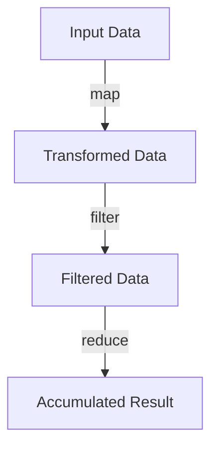

## 5.1 Understanding Higher-Order Functions

Higher-order functions are a cornerstone of functional programming, offering a powerful way to create more abstract and flexible code. In this section, we'll explore what higher-order functions are, their significance in functional programming, and how they can be utilized in Clojure to simplify complex tasks.

### Definition and Significance

**Higher-order functions** are functions that can take other functions as arguments or return functions as results. This capability allows for a higher level of abstraction in programming, enabling developers to write more concise and expressive code. In functional programming, higher-order functions are essential for creating reusable and composable code.

#### Key Characteristics of Higher-Order Functions

- **Function Arguments**: Higher-order functions can accept other functions as parameters, allowing them to operate on these functions or use them as callbacks.
- **Function Returns**: They can return new functions, enabling the creation of function factories or decorators.
- **Abstraction and Flexibility**: By manipulating functions, higher-order functions allow for more abstract code that can be easily adapted to different contexts.

### Examples in Clojure

Clojure, as a functional language, provides several built-in higher-order functions that facilitate common operations on collections and data. Let's explore some of these functions and how they compare to similar constructs in Java.

#### `map`

The `map` function applies a given function to each element in a collection, returning a new collection of the results.

```clojure
;; Clojure example using map
(defn square [x]
  (* x x))

(def numbers [1 2 3 4 5])

(def squared-numbers (map square numbers))
;; => (1 4 9 16 25)
```

In Java, a similar operation can be achieved using streams:

```java
// Java example using streams
import java.util.Arrays;
import java.util.List;
import java.util.stream.Collectors;

List<Integer> numbers = Arrays.asList(1, 2, 3, 4, 5);
List<Integer> squaredNumbers = numbers.stream()
                                      .map(x -> x * x)
                                      .collect(Collectors.toList());
// => [1, 4, 9, 16, 25]
```

#### `filter`

The `filter` function returns a new collection containing only the elements that satisfy a given predicate function.

```clojure
;; Clojure example using filter
(defn even? [x]
  (zero? (mod x 2)))

(def even-numbers (filter even? numbers))
;; => (2 4)
```

In Java, filtering can be done using streams and predicates:

```java
// Java example using streams
List<Integer> evenNumbers = numbers.stream()
                                   .filter(x -> x % 2 == 0)
                                   .collect(Collectors.toList());
// => [2, 4]
```

#### `reduce`

The `reduce` function processes elements in a collection to produce a single accumulated result, using a specified function.

```clojure
;; Clojure example using reduce
(defn sum [a b]
  (+ a b))

(def total-sum (reduce sum numbers))
;; => 15
```

In Java, reduction can be achieved using the `reduce` method in streams:

```java
// Java example using streams
int totalSum = numbers.stream()
                      .reduce(0, Integer::sum);
// => 15
```

### Function Manipulation

Higher-order functions enable function manipulation, allowing developers to create more abstract and flexible code. This capability is particularly useful in scenarios where the behavior of a function needs to be modified or extended.

#### Creating Function Factories

Function factories are higher-order functions that return new functions. This pattern is useful for generating customized functions based on input parameters.

```clojure
;; Clojure example of a function factory
(defn adder [x]
  (fn [y] (+ x y)))

(def add-five (adder 5))
(def result (add-five 10))
;; => 15
```

In Java, function factories can be implemented using lambda expressions or method references:

```java
// Java example of a function factory
import java.util.function.Function;

Function<Integer, Function<Integer, Integer>> adder = x -> y -> x + y;
Function<Integer, Integer> addFive = adder.apply(5);
int result = addFive.apply(10);
// => 15
```

#### Decorators

Decorators are higher-order functions that wrap existing functions to extend or modify their behavior.

```clojure
;; Clojure example of a decorator
(defn logging-decorator [f]
  (fn [& args]
    (println "Calling function with arguments:" args)
    (apply f args)))

(def logged-square (logging-decorator square))
(logged-square 3)
;; Output: Calling function with arguments: (3)
;; => 9
```

In Java, decorators can be implemented using lambda expressions or anonymous classes:

```java
// Java example of a decorator
Function<Integer, Integer> loggingDecorator = x -> {
    System.out.println("Calling function with argument: " + x);
    return x * x;
};

int loggedResult = loggingDecorator.apply(3);
// Output: Calling function with argument: 3
// => 9
```

### Real-World Applications

Higher-order functions are not just theoretical constructs; they have practical applications in real-world programming. Let's explore some scenarios where higher-order functions can simplify complex tasks.

#### Event Handling

In event-driven programming, higher-order functions can be used to create flexible event handlers that can be easily composed and reused.

```clojure
;; Clojure example of event handling
(defn on-click [handler]
  (fn [event]
    (println "Event received:" event)
    (handler event)))

(defn handle-click [event]
  (println "Handling click event:" event))

(def click-handler (on-click handle-click))
(click-handler {:type "click" :target "button"})
;; Output: Event received: {:type "click", :target "button"}
;; Handling click event: {:type "click", :target "button"}
```

In Java, event handling can be achieved using functional interfaces and lambda expressions:

```java
// Java example of event handling
import java.util.function.Consumer;

Consumer<String> onClick = handler -> event -> {
    System.out.println("Event received: " + event);
    handler.accept(event);
};

Consumer<String> handleClick = event -> System.out.println("Handling click event: " + event);

Consumer<String> clickHandler = onClick.apply(handleClick);
clickHandler.accept("click event");
// Output: Event received: click event
// Handling click event: click event
```

#### Asynchronous Programming

Higher-order functions can also be used to manage asynchronous tasks, providing a clean and concise way to handle callbacks and promises.

```clojure
;; Clojure example of asynchronous programming
(defn async-task [callback]
  (future
    (Thread/sleep 1000)
    (callback "Task completed")))

(defn handle-result [result]
  (println "Result:" result))

(async-task handle-result)
;; Output (after 1 second): Result: Task completed
```

In Java, asynchronous programming can be managed using `CompletableFuture` and lambda expressions:

```java
// Java example of asynchronous programming
import java.util.concurrent.CompletableFuture;

CompletableFuture<Void> asyncTask = CompletableFuture.runAsync(() -> {
    try {
        Thread.sleep(1000);
        System.out.println("Task completed");
    } catch (InterruptedException e) {
        e.printStackTrace();
    }
});

asyncTask.thenRun(() -> System.out.println("Result: Task completed"));
// Output (after 1 second): Task completed
// Result: Task completed
```

### Visual Aids

To better understand the flow of data through higher-order functions, let's visualize the process using a flowchart.



**Figure 1**: Flow of data through higher-order functions `map`, `filter`, and `reduce`.

### References and Links

- [Official Clojure Documentation](https://clojure.org/reference/documentation)
- [ClojureDocs](https://clojuredocs.org/)
- [Java Streams Documentation](https://docs.oracle.com/javase/8/docs/api/java/util/stream/package-summary.html)

### Knowledge Check

Let's reinforce your understanding of higher-order functions with some questions and exercises.

1. **What is a higher-order function?**
   - A function that takes other functions as arguments or returns functions as results.

2. **How does the `map` function in Clojure differ from Java's `map` method in streams?**
   - Both apply a function to each element in a collection, but Clojure's `map` returns a lazy sequence.

3. **Try It Yourself**: Modify the `square` function to cube each number instead. What changes do you observe in the output?

4. **Exercise**: Implement a higher-order function in Clojure that takes a function and a collection, applies the function to each element, and returns a collection of results.

### Encouraging Tone

Now that we've explored higher-order functions in Clojure, you're well-equipped to harness their power in your applications. Remember, the key to mastering functional programming is practice and experimentation. Don't hesitate to try new things and see how higher-order functions can simplify your code.

### Best Practices for Tags

- Use Specific and Relevant Tags
- Include 4 to 8 relevant and specific tags that reflect the article's content.
- Tags should reflect key topics, technologies, or concepts discussed in the article.
- Keep tag names consistent.
- Wrap tags in double-quotes.
- Avoid tags containing special characters like `#`.

---

## Quiz: Test Your Knowledge on Higher-Order Functions



### What is a higher-order function?

- [x] A function that takes other functions as arguments or returns functions as results
- [ ] A function that only operates on numbers
- [ ] A function that cannot be passed as an argument
- [ ] A function that is always recursive

> **Explanation:** Higher-order functions are defined by their ability to take other functions as arguments or return them as results, enabling greater abstraction and flexibility in code.

### Which Clojure function applies a given function to each element in a collection?

- [x] map
- [ ] filter
- [ ] reduce
- [ ] apply

> **Explanation:** The `map` function in Clojure applies a given function to each element in a collection, returning a new collection of the results.

### What is the primary benefit of using higher-order functions?

- [x] They allow for more abstract and flexible code
- [ ] They make code run faster
- [ ] They eliminate the need for variables
- [ ] They are only used for mathematical operations

> **Explanation:** Higher-order functions enable more abstract and flexible code by allowing functions to manipulate other functions, leading to more reusable and composable code.

### How does the `filter` function in Clojure work?

- [x] It returns a new collection containing only the elements that satisfy a given predicate function
- [ ] It modifies the original collection
- [ ] It sorts the collection
- [ ] It duplicates each element in the collection

> **Explanation:** The `filter` function in Clojure returns a new collection containing only the elements that satisfy a given predicate function, without modifying the original collection.

### What is a function factory?

- [x] A higher-order function that returns new functions
- [ ] A function that creates objects
- [ ] A function that only works with strings
- [ ] A function that is always asynchronous

> **Explanation:** A function factory is a higher-order function that returns new functions, allowing for the creation of customized functions based on input parameters.

### Which of the following is an example of a higher-order function in Java?

- [x] A lambda expression that takes another lambda as an argument
- [ ] A method that only returns integers
- [ ] A class that implements an interface
- [ ] A static method

> **Explanation:** In Java, a lambda expression that takes another lambda as an argument is an example of a higher-order function, as it involves functions being passed as arguments.

### What does the `reduce` function do in Clojure?

- [x] It processes elements in a collection to produce a single accumulated result
- [ ] It duplicates each element in a collection
- [ ] It filters out elements from a collection
- [ ] It sorts a collection

> **Explanation:** The `reduce` function in Clojure processes elements in a collection to produce a single accumulated result, using a specified function.

### Which of the following is a real-world application of higher-order functions?

- [x] Event handling
- [ ] File I/O
- [ ] Memory management
- [ ] Network configuration

> **Explanation:** Higher-order functions are often used in event handling to create flexible event handlers that can be easily composed and reused.

### What is a decorator in the context of higher-order functions?

- [x] A higher-order function that wraps existing functions to extend or modify their behavior
- [ ] A function that only decorates strings
- [ ] A class that implements multiple interfaces
- [ ] A method that returns void

> **Explanation:** A decorator is a higher-order function that wraps existing functions to extend or modify their behavior, providing additional functionality.

### True or False: Higher-order functions can only be used in functional programming languages.

- [ ] True
- [x] False

> **Explanation:** Higher-order functions can be used in any programming language that supports functions as first-class citizens, not just functional programming languages.


