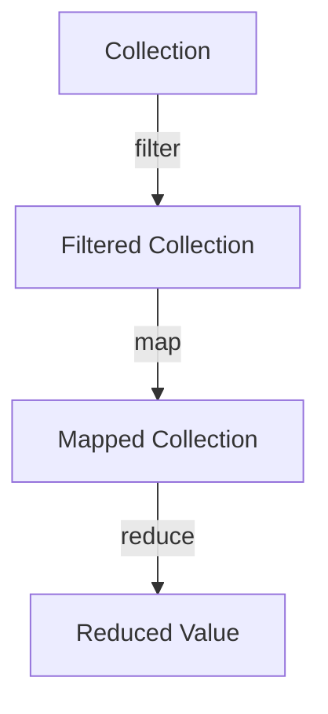

## 5.2 Using `map`, `filter`, and `reduce`

In this section, we will delve into three fundamental functions in Clojure: `map`, `filter`, and `reduce`. These functions are the cornerstone of functional programming and data transformation in Clojure, enabling developers to write concise, expressive, and efficient code. As experienced Java developers, you may find parallels between these functions and Java's Stream API, but Clojure's approach offers unique advantages in terms of immutability and functional composition.

### The `map` Function

The `map` function in Clojure applies a given function to each element of a collection, returning a sequence of results. This is akin to Java's `Stream.map()` method but with the added benefit of immutability and lazy evaluation.

#### How `map` Works

The `map` function takes two arguments: a function and a collection. It returns a lazy sequence where each element is the result of applying the function to the corresponding element of the collection.

```clojure
;; Example of using map in Clojure
(defn square [x]
  (* x x))

(def numbers [1 2 3 4 5])

(def squared-numbers (map square numbers))

;; Output: (1 4 9 16 25)
```

In this example, the `square` function is applied to each element of the `numbers` vector, resulting in a new sequence of squared numbers.

#### Comparison with Java

In Java, you might achieve similar functionality using the Stream API:

```java
import java.util.Arrays;
import java.util.List;
import java.util.stream.Collectors;

public class MapExample {
    public static void main(String[] args) {
        List<Integer> numbers = Arrays.asList(1, 2, 3, 4, 5);
        List<Integer> squaredNumbers = numbers.stream()
                                              .map(x -> x * x)
                                              .collect(Collectors.toList());

        System.out.println(squaredNumbers); // Output: [1, 4, 9, 16, 25]
    }
}
```

While both approaches achieve the same result, Clojure's `map` function is inherently lazy, meaning it only computes values as needed, which can lead to performance benefits in large data processing tasks.

### The `filter` Function

The `filter` function selects elements from a collection that satisfy a predicate function. This is similar to Java's `Stream.filter()` method.

#### How `filter` Works

`filter` takes a predicate function and a collection as arguments. It returns a lazy sequence of elements for which the predicate returns true.

```clojure
;; Example of using filter in Clojure
(defn even? [x]
  (zero? (mod x 2)))

(def even-numbers (filter even? numbers))

;; Output: (2 4)
```

Here, the `even?` function checks if a number is even, and `filter` returns a sequence of even numbers from the `numbers` collection.

#### Comparison with Java

In Java, filtering can be done using the Stream API:

```java
import java.util.Arrays;
import java.util.List;
import java.util.stream.Collectors;

public class FilterExample {
    public static void main(String[] args) {
        List<Integer> numbers = Arrays.asList(1, 2, 3, 4, 5);
        List<Integer> evenNumbers = numbers.stream()
                                           .filter(x -> x % 2 == 0)
                                           .collect(Collectors.toList());

        System.out.println(evenNumbers); // Output: [2, 4]
    }
}
```

Both Clojure and Java provide a straightforward way to filter collections, but Clojure's lazy sequences can offer more efficient memory usage.

### The `reduce` Function

The `reduce` function aggregates elements of a collection into a single value using a reducing function. This is similar to Java's `Stream.reduce()` method.

#### How `reduce` Works

`reduce` takes a function and a collection, and optionally an initial value. It applies the function cumulatively to the elements of the collection, from left to right, to reduce the collection to a single value.

```clojure
;; Example of using reduce in Clojure
(defn sum [acc x]
  (+ acc x))

(def total (reduce sum 0 numbers))

;; Output: 15
```

In this example, `reduce` sums up all the numbers in the collection, starting with an initial value of 0.

#### Comparison with Java

In Java, reduction can be performed using the Stream API:

```java
import java.util.Arrays;
import java.util.List;

public class ReduceExample {
    public static void main(String[] args) {
        List<Integer> numbers = Arrays.asList(1, 2, 3, 4, 5);
        int total = numbers.stream()
                           .reduce(0, Integer::sum);

        System.out.println(total); // Output: 15
    }
}
```

Clojure's `reduce` function is versatile and can be used for a wide range of aggregation tasks, from summing numbers to concatenating strings.

### Practical Examples

Let's explore some practical examples of using `map`, `filter`, and `reduce` together to perform complex data transformation tasks.

#### Example 1: Processing a List of Names

Suppose we have a list of names, and we want to filter out names shorter than 5 characters, convert the remaining names to uppercase, and then concatenate them into a single string.

```clojure
(def names ["Alice" "Bob" "Charlie" "David" "Eve"])

(defn long-name? [name]
  (>= (count name) 5))

(defn to-uppercase [name]
  (.toUpperCase name))

(def concatenated-names
  (reduce str
          (map to-uppercase
               (filter long-name? names))))

;; Output: "ALICECHARLIEDAVID"
```

In this example, we first filter the names to include only those with 5 or more characters, then map each name to its uppercase form, and finally reduce the sequence to a single concatenated string.

#### Example 2: Calculating Average Age

Consider a list of ages, and we want to calculate the average age.

```clojure
(def ages [23 30 34 45 29])

(defn average [coll]
  (/ (reduce + coll) (count coll)))

(def avg-age (average ages))

;; Output: 32.2
```

Here, we use `reduce` to sum the ages and then divide by the count of ages to get the average.

### Composition of Functions

One of the powerful aspects of Clojure is the ability to compose functions to create complex data processing pipelines. By chaining `map`, `filter`, and `reduce`, we can build expressive and efficient data transformations.

#### Function Composition Example

Let's revisit the names example and see how we can compose functions for clarity and reusability.

```clojure
(defn process-names [names]
  (->> names
       (filter long-name?)
       (map to-uppercase)
       (reduce str)))

(def result (process-names names))

;; Output: "ALICECHARLIEDAVID"
```

In this example, we use the threading macro `->>` to pass the result of each function to the next, creating a clear and readable pipeline.

### Visual Aids

To better understand the flow of data through these functions, let's visualize the process using a flowchart.



**Figure 1:** Data flow through `filter`, `map`, and `reduce`.

### References and Links

For further reading and deeper understanding, consider exploring the following resources:

- [Official Clojure Documentation](https://clojure.org/reference)
- [ClojureDocs](https://clojuredocs.org/)
- [Java Stream API Documentation](https://docs.oracle.com/javase/8/docs/api/java/util/stream/package-summary.html)

### Knowledge Check

Let's reinforce your understanding with a few questions and exercises.

1. What is the primary difference between `map` in Clojure and Java's `Stream.map()`?
2. How does Clojure's lazy evaluation benefit performance in data processing?
3. Try modifying the `process-names` function to include names shorter than 5 characters but convert them to lowercase instead.

### Summary

In this section, we've explored the power of `map`, `filter`, and `reduce` in Clojure. These functions allow us to transform and process data efficiently, leveraging the strengths of functional programming. By understanding and applying these concepts, you can write more expressive and maintainable code in Clojure.

Now that we've mastered these core functions, let's continue our journey into the world of higher-order functions and functional composition in Clojure.

## Quiz: Mastering `map`, `filter`, and `reduce` in Clojure



### What does the `map` function do in Clojure?

- [x] Applies a function to each element of a collection
- [ ] Filters elements of a collection based on a predicate
- [ ] Aggregates elements of a collection into a single value
- [ ] Sorts elements of a collection

> **Explanation:** The `map` function applies a given function to each element of a collection, returning a sequence of results.

### How does `filter` function work in Clojure?

- [x] Selects elements from a collection that satisfy a predicate
- [ ] Applies a function to each element of a collection
- [ ] Aggregates elements of a collection into a single value
- [ ] Transforms a collection into a map

> **Explanation:** The `filter` function selects elements from a collection that satisfy a predicate function, returning a sequence of those elements.

### What is the purpose of the `reduce` function in Clojure?

- [x] Aggregates elements of a collection into a single value
- [ ] Applies a function to each element of a collection
- [ ] Selects elements from a collection that satisfy a predicate
- [ ] Transforms a collection into a map

> **Explanation:** The `reduce` function aggregates elements of a collection into a single value using a reducing function.

### Which of the following is a benefit of lazy evaluation in Clojure?

- [x] Improved performance by computing values only as needed
- [ ] Immediate computation of all values in a collection
- [ ] Increased memory usage
- [ ] Simplified syntax for function definitions

> **Explanation:** Lazy evaluation improves performance by computing values only as needed, which can be beneficial in large data processing tasks.

### How can `map`, `filter`, and `reduce` be composed in Clojure?

- [x] By chaining them together using threading macros
- [ ] By using them in separate, unrelated functions
- [ ] By applying them to different collections
- [ ] By combining them into a single function

> **Explanation:** `map`, `filter`, and `reduce` can be composed by chaining them together using threading macros like `->>` to create data processing pipelines.

### What is a key difference between Clojure's `map` and Java's `Stream.map()`?

- [x] Clojure's `map` is lazy, while Java's `Stream.map()` is eager
- [ ] Clojure's `map` is eager, while Java's `Stream.map()` is lazy
- [ ] Both are eager
- [ ] Both are lazy

> **Explanation:** Clojure's `map` is lazy, meaning it computes values only as needed, whereas Java's `Stream.map()` is eager.

### Which function would you use to sum all elements in a collection in Clojure?

- [x] `reduce`
- [ ] `map`
- [ ] `filter`
- [ ] `concat`

> **Explanation:** The `reduce` function is used to aggregate elements of a collection into a single value, such as summing all elements.

### What does the `->>` threading macro do in Clojure?

- [x] Passes the result of each function to the next in a pipeline
- [ ] Reverses the order of elements in a collection
- [ ] Converts a collection into a map
- [ ] Filters elements of a collection

> **Explanation:** The `->>` threading macro passes the result of each function to the next, creating a clear and readable pipeline.

### How can you modify the `process-names` function to include short names in lowercase?

- [x] Use `map` to apply a conditional transformation
- [ ] Use `filter` to exclude short names
- [ ] Use `reduce` to concatenate names
- [ ] Use `concat` to combine names

> **Explanation:** You can use `map` to apply a conditional transformation that converts short names to lowercase.

### True or False: Clojure's `filter` function returns a lazy sequence.

- [x] True
- [ ] False

> **Explanation:** True. Clojure's `filter` function returns a lazy sequence, which means it computes values only as needed.


