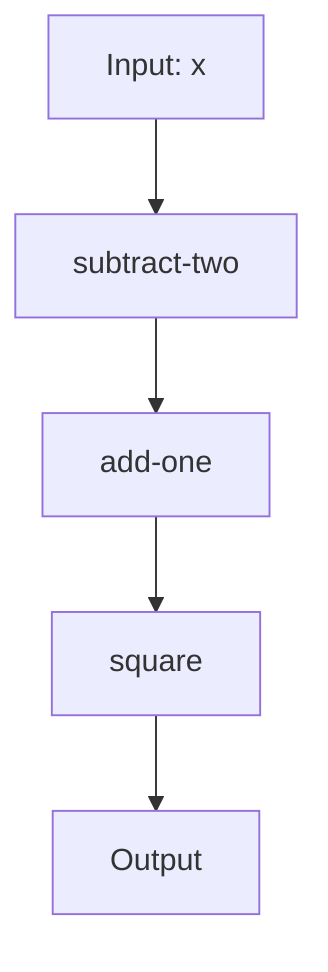

## 5.3 Function Composition Techniques

In the realm of functional programming, function composition is a fundamental concept that allows developers to build complex functionalities by combining simpler functions. This technique not only enhances code readability but also promotes reusability and modularity. In this section, we will delve into the intricacies of function composition in Clojure, focusing on the `comp` function, the order of operations, and the benefits of chaining functions.

### Understanding Composition

Function composition is the process of combining two or more functions to produce a new function. This new function represents the application of each composed function in sequence. In mathematical terms, if you have two functions, `f` and `g`, the composition of these functions is denoted as `f(g(x))`. In Clojure, function composition is a powerful tool that allows developers to build complex operations from simple, reusable components.

#### Why Compose Functions?

- **Modularity**: By breaking down complex operations into smaller, manageable functions, you can create a modular codebase where each function has a single responsibility.
- **Reusability**: Composed functions can be reused across different parts of an application, reducing code duplication.
- **Readability**: Function composition can lead to cleaner and more readable code, as it abstracts away the details of intermediate operations.

### The `comp` Function

Clojure provides the `comp` function as a built-in utility for composing functions. The `comp` function takes multiple functions as arguments and returns a new function that is the composition of those functions.

```clojure
(defn add-one [x]
  (+ x 1))

(defn square [x]
  (* x x))

(def composed-fn (comp square add-one))

(println (composed-fn 2)) ; Output: 9
```

In the example above, `composed-fn` is a new function that first applies `add-one` to its argument and then applies `square` to the result. This demonstrates the power of `comp` in creating new functions by combining existing ones.

### Order of Operations

One of the critical aspects of using `comp` is understanding the order in which functions are applied. In Clojure, `comp` applies functions from right to left. This means that the last function in the argument list is applied first, and the first function is applied last.

#### Example: Right-to-Left Composition

```clojure
(defn subtract-two [x]
  (- x 2))

(def composed-fn (comp square add-one subtract-two))

(println (composed-fn 5)) ; Output: 16
```

In this example, `subtract-two` is applied first to the input `5`, resulting in `3`. Then, `add-one` is applied to `3`, resulting in `4`. Finally, `square` is applied to `4`, producing `16`.

### Chaining Functions

Function composition can be particularly useful when you need to apply a series of transformations to data. By chaining functions together, you can create a pipeline of operations that is both efficient and easy to understand.

#### Example: Chaining with `comp`

```clojure
(defn double [x]
  (* x 2))

(defn negate [x]
  (- x))

(def composed-fn (comp negate double add-one))

(println (composed-fn 3)) ; Output: -8
```

Here, `add-one` is applied first, followed by `double`, and finally `negate`. This chaining of functions allows for a clear and concise representation of the operations being performed.

### Visualizing Function Composition

To better understand the flow of data through composed functions, let's visualize the process using a flowchart.



**Diagram Description**: This flowchart illustrates the sequence of function applications in the composed function `composed-fn`. The input `x` is first processed by `subtract-two`, followed by `add-one`, and finally `square`, resulting in the final output.

### Practical Applications of Function Composition

Function composition is not just a theoretical concept; it has practical applications in real-world programming. Here are some scenarios where function composition can be particularly beneficial:

- **Data Transformation Pipelines**: When processing data, you often need to apply a series of transformations. Function composition allows you to define these transformations as individual functions and then compose them into a single pipeline.
- **Middleware in Web Applications**: In web development, middleware functions are often composed to handle requests and responses. Each middleware function performs a specific task, and composing them allows for a clean and organized flow of operations.
- **Event Handling in GUIs**: In graphical user interfaces, events can be handled by composing functions that process the event data in sequence.

### Comparing with Java

For Java developers transitioning to Clojure, understanding function composition can be facilitated by drawing parallels with Java's approach to function chaining. In Java, function composition is often achieved using method chaining or the `Function` interface introduced in Java 8.

#### Java Example: Method Chaining

```java
import java.util.function.Function;

public class FunctionComposition {
    public static void main(String[] args) {
        Function<Integer, Integer> addOne = x -> x + 1;
        Function<Integer, Integer> square = x -> x * x;

        Function<Integer, Integer> composedFunction = addOne.andThen(square);

        System.out.println(composedFunction.apply(2)); // Output: 9
    }
}
```

In this Java example, the `andThen` method is used to compose functions, similar to Clojure's `comp`. However, note that `andThen` applies functions from left to right, which is the opposite of Clojure's `comp`.

### Try It Yourself

To deepen your understanding of function composition in Clojure, try modifying the examples provided:

- **Experiment with Different Functions**: Create your own functions and compose them using `comp`. Observe how changing the order of functions affects the output.
- **Create a Data Transformation Pipeline**: Define a series of transformations on a collection of data and compose them into a single function.
- **Implement a Simple Middleware System**: Simulate a middleware system by composing functions that process input data in sequence.

### Knowledge Check

To reinforce your understanding of function composition in Clojure, let's test your knowledge with a few questions.

## Function Composition Techniques Quiz



### What is the primary purpose of function composition in Clojure?

- [x] To combine simple functions into more complex ones
- [ ] To execute functions in parallel
- [ ] To optimize memory usage
- [ ] To handle exceptions

> **Explanation:** Function composition is used to combine simple functions into more complex ones, allowing for modular and reusable code.

### How does the `comp` function in Clojure apply functions?

- [ ] From left to right
- [x] From right to left
- [ ] In parallel
- [ ] In random order

> **Explanation:** The `comp` function in Clojure applies functions from right to left, meaning the last function is applied first.

### Which of the following is a benefit of function composition?

- [x] Improved code readability
- [ ] Increased memory usage
- [ ] Slower execution time
- [ ] More complex code

> **Explanation:** Function composition improves code readability by abstracting complex operations into simpler, reusable components.

### In the Clojure expression `(comp f g h)`, which function is applied first?

- [ ] f
- [ ] g
- [x] h
- [ ] None of the above

> **Explanation:** In the expression `(comp f g h)`, the function `h` is applied first due to the right-to-left order of operations in `comp`.

### What is a practical application of function composition?

- [x] Creating data transformation pipelines
- [ ] Increasing code complexity
- [ ] Reducing code readability
- [ ] Handling exceptions

> **Explanation:** Function composition is often used to create data transformation pipelines, allowing for efficient and organized data processing.

### How does Java's `Function` interface differ from Clojure's `comp`?

- [ ] It applies functions from right to left
- [x] It applies functions from left to right
- [ ] It does not support function composition
- [ ] It is slower than `comp`

> **Explanation:** Java's `Function` interface applies functions from left to right using the `andThen` method, which is the opposite of Clojure's `comp`.

### Which Clojure function is used to compose multiple functions?

- [x] comp
- [ ] map
- [ ] filter
- [ ] reduce

> **Explanation:** The `comp` function in Clojure is used to compose multiple functions into a single function.

### What is the output of `(comp inc dec inc)` when applied to the number 5?

- [x] 6
- [ ] 5
- [ ] 4
- [ ] 7

> **Explanation:** The expression `(comp inc dec inc)` first applies `inc` to 5, resulting in 6, then `dec` to 6, resulting in 5, and finally `inc` to 5, resulting in 6.

### Why is function composition important in functional programming?

- [x] It promotes modularity and reusability
- [ ] It increases execution time
- [ ] It complicates code maintenance
- [ ] It is only used for mathematical functions

> **Explanation:** Function composition is important in functional programming because it promotes modularity and reusability, making code easier to maintain and extend.

### True or False: Function composition in Clojure can only be used with pure functions.

- [x] True
- [ ] False

> **Explanation:** Function composition is most effective with pure functions, as they have no side effects and produce consistent results, making them ideal for composition.



By mastering function composition techniques in Clojure, you can create scalable and maintainable applications that leverage the power of functional programming. As you continue to explore Clojure, remember to experiment with different compositions and apply these concepts to real-world scenarios.
