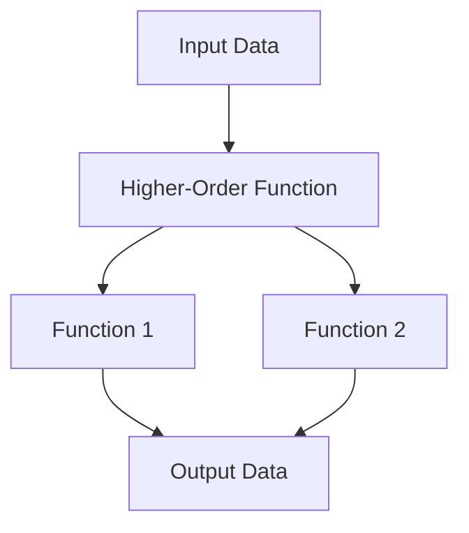

## 5.4 Creating Custom Higher-Order Functions

Higher-order functions are a cornerstone of functional programming, allowing us to write more abstract, reusable, and concise code. In this section, we'll explore how to create custom higher-order functions in Clojure, leveraging your existing Java knowledge to ease the transition. We'll cover defining higher-order functions, creating custom utilities, and generating functions dynamically. Let's dive in!

### Defining Higher-Order Functions

Higher-order functions are functions that can take other functions as arguments or return them as results. This concept might be familiar to you from Java's `Function` interface or lambda expressions. In Clojure, higher-order functions are a natural fit due to the language's emphasis on immutability and first-class functions.

#### Accepting Functions as Parameters

In Clojure, you can pass functions as arguments just like any other data type. This allows you to create flexible and reusable code components.

```clojure
(defn apply-operation
  "Applies a given operation to two numbers."
  [operation x y]
  (operation x y))

;; Usage example
(apply-operation + 5 3) ; => 8
(apply-operation * 5 3) ; => 15
```

In this example, `apply-operation` is a higher-order function that takes an `operation` function and two numbers, `x` and `y`. It applies the operation to the numbers, demonstrating how you can pass different operations to achieve various results.

#### Returning Functions as Results

Clojure also allows you to return functions from other functions, enabling the creation of function generators.

```clojure
(defn make-adder
  "Returns a function that adds a given number to its argument."
  [n]
  (fn [x] (+ x n)))

;; Usage example
(def add-five (make-adder 5))
(add-five 10) ; => 15
```

Here, `make-adder` returns a new function that adds `n` to its argument. This demonstrates how you can dynamically create functions based on input parameters.

### Custom Utilities

Creating custom higher-order functions can enhance existing functions by adding additional behavior, such as logging or retry mechanisms.

#### Logging Wrappers

You can create a higher-order function that wraps another function to add logging functionality.

```clojure
(defn with-logging
  "Wraps a function to log its input and output."
  [f]
  (fn [& args]
    (println "Calling with:" args)
    (let [result (apply f args)]
      (println "Result:" result)
      result)))

;; Usage example
(def logged-add (with-logging +))
(logged-add 3 4) ; Logs: Calling with: (3 4) Result: 7
```

The `with-logging` function takes a function `f` and returns a new function that logs the input arguments and result of `f`.

#### Retry Mechanisms

Another practical utility is a retry mechanism, which attempts to call a function multiple times in case of failure.

```clojure
(defn with-retry
  "Retries a function up to n times if it throws an exception."
  [f n]
  (fn [& args]
    (loop [attempts n]
      (try
        (apply f args)
        (catch Exception e
          (if (pos? attempts)
            (do
              (println "Retrying..." attempts "attempts left")
              (recur (dec attempts)))
            (throw e)))))))

;; Usage example
(defn unreliable-function
  "A function that randomly fails."
  []
  (if (< (rand) 0.5)
    (throw (Exception. "Random failure"))
    "Success"))

(def retrying-function (with-retry unreliable-function 3))
(retrying-function) ; Retries up to 3 times
```

The `with-retry` function wraps another function `f`, retrying it up to `n` times if it throws an exception.

### Function Generators

Function generators create functions dynamically based on input parameters, allowing for highly customizable behavior.

#### Dynamic Function Creation

Consider a scenario where you need a function that performs different mathematical operations based on input.

```clojure
(defn operation-generator
  "Generates a function for a given operation."
  [op]
  (case op
    :add +
    :subtract -
    :multiply *
    :divide /))

;; Usage example
(def add-fn (operation-generator :add))
(add-fn 10 5) ; => 15

(def multiply-fn (operation-generator :multiply))
(multiply-fn 10 5) ; => 50
```

The `operation-generator` function returns a function corresponding to the specified operation, demonstrating dynamic function creation.

### Practical Examples

Let's explore some practical examples to solidify our understanding of custom higher-order functions.

#### Example: Custom Sorting

Suppose you want to sort a collection based on a custom comparator function.

```clojure
(defn custom-sort
  "Sorts a collection using a custom comparator."
  [comparator coll]
  (sort comparator coll))

;; Usage example
(defn descending-comparator [a b]
  (compare b a))

(custom-sort descending-comparator [3 1 4 1 5 9]) ; => (9 5 4 3 1 1)
```

The `custom-sort` function takes a comparator and a collection, sorting the collection according to the comparator.

#### Example: Function Composition

Function composition is a powerful technique in functional programming, allowing you to combine multiple functions into a single operation.

```clojure
(defn compose
  "Composes two functions into a single function."
  [f g]
  (fn [& args]
    (f (apply g args))))

;; Usage example
(def add-one (partial + 1))
(def double (partial * 2))

(def add-one-and-double (compose double add-one))
(add-one-and-double 3) ; => 8
```

The `compose` function takes two functions, `f` and `g`, and returns a new function that applies `g` to its arguments and then `f` to the result.

### Try It Yourself

Now that we've explored creating custom higher-order functions, try modifying the examples to suit your needs:

- **Modify the `with-logging` function** to include timestamps in the logs.
- **Enhance the `with-retry` function** to include a delay between retries.
- **Create a function generator** that returns functions for different string operations, such as concatenation or substring extraction.

### Visual Aids

To better understand the flow of data through higher-order functions, consider the following diagram:



**Diagram Description:** This flowchart illustrates how input data is processed through a higher-order function, which applies multiple functions (Function 1 and Function 2) to produce output data.

### References and Links

- [Official Clojure Documentation](https://clojure.org/reference)
- [ClojureDocs](https://clojuredocs.org/)
- [Functional Programming in Java](https://www.oreilly.com/library/view/functional-programming-in/9781449365516/)

### Knowledge Check

To reinforce your understanding, consider these questions:

- What is a higher-order function, and how does it differ from regular functions?
- How can you create a function that logs its input and output in Clojure?
- What are some practical applications of function generators?

### Summary

In this section, we've explored the creation of custom higher-order functions in Clojure. We've seen how to define higher-order functions, create custom utilities, and generate functions dynamically. By leveraging these techniques, you can write more abstract, reusable, and concise code, enhancing your functional programming skills in Clojure.

## Quiz: Mastering Custom Higher-Order Functions in Clojure



### What is a higher-order function?

- [x] A function that takes other functions as arguments or returns a function as a result.
- [ ] A function that performs arithmetic operations.
- [ ] A function that only works with numbers.
- [ ] A function that cannot be nested.

> **Explanation:** Higher-order functions are those that can take other functions as arguments or return functions as results, allowing for more abstract and reusable code.

### How can you create a logging wrapper for a function in Clojure?

- [x] By creating a higher-order function that wraps the original function and adds logging.
- [ ] By modifying the original function to include logging statements.
- [ ] By using a built-in Clojure logging library.
- [ ] By writing a separate logging function.

> **Explanation:** A logging wrapper can be created by defining a higher-order function that takes the original function as an argument and adds logging functionality.

### What is the purpose of a retry mechanism in higher-order functions?

- [x] To attempt calling a function multiple times in case of failure.
- [ ] To optimize the performance of a function.
- [ ] To log the execution time of a function.
- [ ] To ensure a function only runs once.

> **Explanation:** A retry mechanism is used to attempt calling a function multiple times if it fails, increasing the robustness of the code.

### How can you dynamically create functions in Clojure?

- [x] By using function generators that return functions based on input parameters.
- [ ] By writing separate functions for each case.
- [ ] By using macros to generate code.
- [ ] By using Java reflection.

> **Explanation:** Function generators in Clojure can dynamically create functions based on input parameters, allowing for customizable behavior.

### What is function composition?

- [x] Combining multiple functions into a single operation.
- [ ] Writing functions in a specific order.
- [ ] Using functions to modify data structures.
- [ ] Creating functions that return other functions.

> **Explanation:** Function composition involves combining multiple functions into a single operation, allowing for more concise and expressive code.

### What is the benefit of using higher-order functions?

- [x] They allow for more abstract, reusable, and concise code.
- [ ] They make code execution faster.
- [ ] They simplify error handling.
- [ ] They eliminate the need for variables.

> **Explanation:** Higher-order functions enable more abstract, reusable, and concise code, enhancing the flexibility and maintainability of the codebase.

### How can you modify the `with-logging` function to include timestamps?

- [x] By adding a timestamp to the log messages within the function.
- [ ] By using a built-in Clojure timestamp library.
- [ ] By creating a separate timestamp function.
- [ ] By modifying the original function to include timestamps.

> **Explanation:** You can modify the `with-logging` function to include timestamps by adding a timestamp to the log messages within the function.

### What is a practical application of function generators?

- [x] Creating functions for different mathematical operations based on input.
- [ ] Optimizing the performance of existing functions.
- [ ] Logging the execution time of functions.
- [ ] Simplifying error handling in functions.

> **Explanation:** Function generators can create functions for different operations based on input, allowing for highly customizable behavior.

### How does Clojure's approach to higher-order functions compare to Java's?

- [x] Clojure treats functions as first-class citizens, making higher-order functions more natural.
- [ ] Java does not support higher-order functions.
- [ ] Clojure requires special syntax for higher-order functions.
- [ ] Java's approach is more flexible than Clojure's.

> **Explanation:** Clojure treats functions as first-class citizens, making higher-order functions more natural and intuitive compared to Java's approach.

### True or False: Higher-order functions can only take functions as arguments, not return them.

- [ ] True
- [x] False

> **Explanation:** Higher-order functions can both take functions as arguments and return functions as results, providing great flexibility in functional programming.


