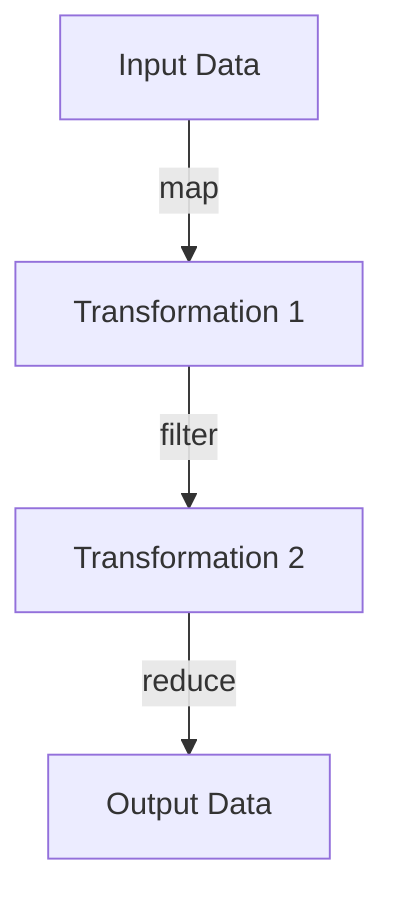

## 5.5 Practical Applications of Higher-Order Functions

Higher-order functions (HOFs) are a cornerstone of functional programming and play a crucial role in Clojure. They allow us to write more abstract, reusable, and modular code. In this section, we will explore several practical applications of higher-order functions, including event handling, functional design patterns, data processing pipelines, and modular code. We will also draw parallels to Java to help experienced Java developers transition smoothly to Clojure.

### Event Handling and Callbacks

Higher-order functions are essential in asynchronous programming for handling events and callbacks. In Java, you might be familiar with using interfaces or anonymous classes to handle events. In Clojure, higher-order functions provide a more concise and expressive way to achieve similar functionality.

#### Java Example: Event Handling with Anonymous Classes

In Java, handling events often involves implementing interfaces or using anonymous classes. Consider a simple button click event:

```java
import javax.swing.JButton;
import java.awt.event.ActionEvent;
import java.awt.event.ActionListener;

public class ButtonExample {
    public static void main(String[] args) {
        JButton button = new JButton("Click Me");
        button.addActionListener(new ActionListener() {
            @Override
            public void actionPerformed(ActionEvent e) {
                System.out.println("Button clicked!");
            }
        });
    }
}
```

#### Clojure Example: Event Handling with Higher-Order Functions

In Clojure, we can achieve the same functionality using higher-order functions, which simplifies the code and enhances readability:

```clojure
(ns button-example
  (:import [javax.swing JButton]))

(defn on-click [event]
  (println "Button clicked!"))

(defn create-button []
  (let [button (JButton. "Click Me")]
    (.addActionListener button (proxy [java.awt.event.ActionListener] []
                                (actionPerformed [e] (on-click e))))
    button))
```

Here, `on-click` is a higher-order function that acts as a callback for the button click event. This approach not only reduces boilerplate code but also makes it easier to change the behavior of the event handler by simply passing a different function.

#### Try It Yourself

Experiment by modifying the `on-click` function to perform different actions, such as updating a label or changing the button's text.

### Functional Design Patterns

Higher-order functions enable the implementation of several functional design patterns, such as decorators and strategies. These patterns promote code reuse and flexibility.

#### The Decorator Pattern

The decorator pattern allows behavior to be added to individual objects, dynamically, without affecting the behavior of other objects from the same class. In Clojure, we can use higher-order functions to achieve this pattern.

##### Clojure Example: Decorator Pattern

```clojure
(defn log-decorator [f]
  (fn [& args]
    (println "Calling function with arguments:" args)
    (let [result (apply f args)]
      (println "Function returned:" result)
      result)))

(defn add [x y]
  (+ x y))

(def decorated-add (log-decorator add))

(decorated-add 2 3)
```

In this example, `log-decorator` is a higher-order function that takes a function `f` and returns a new function that logs the arguments and result of `f`. This pattern allows us to add logging behavior to any function without modifying its original implementation.

#### The Strategy Pattern

The strategy pattern defines a family of algorithms, encapsulates each one, and makes them interchangeable. Higher-order functions in Clojure can be used to implement this pattern effectively.

##### Clojure Example: Strategy Pattern

```clojure
(defn execute-strategy [strategy x y]
  (strategy x y))

(defn add-strategy [x y]
  (+ x y))

(defn multiply-strategy [x y]
  (* x y))

(execute-strategy add-strategy 5 3)       ; => 8
(execute-strategy multiply-strategy 5 3)  ; => 15
```

Here, `execute-strategy` is a higher-order function that takes a strategy function and two arguments, allowing us to switch between different algorithms at runtime.

### Data Processing Pipelines

Higher-order functions are instrumental in building data processing pipelines, where data is transformed step by step. This approach is similar to Java's Stream API but offers more flexibility and composability.

#### Java Example: Data Processing with Streams

In Java, you might use the Stream API to process data:

```java
import java.util.Arrays;
import java.util.List;
import java.util.stream.Collectors;

public class StreamExample {
    public static void main(String[] args) {
        List<Integer> numbers = Arrays.asList(1, 2, 3, 4, 5);
        List<Integer> squaredNumbers = numbers.stream()
                                              .map(n -> n * n)
                                              .collect(Collectors.toList());
        System.out.println(squaredNumbers);
    }
}
```

#### Clojure Example: Data Processing with Higher-Order Functions

In Clojure, we can achieve similar functionality using higher-order functions like `map`, `filter`, and `reduce`:

```clojure
(def numbers [1 2 3 4 5])

(defn square [n]
  (* n n))

(def squared-numbers (map square numbers))

(println (into [] squared-numbers))
```

Here, `map` is a higher-order function that applies the `square` function to each element in the `numbers` collection, producing a new collection of squared numbers.

#### Try It Yourself

Modify the pipeline to include additional transformations, such as filtering out even numbers or reducing the collection to a sum.

### Modular Code

Higher-order functions promote code reusability and modularity by allowing us to abstract common patterns and behaviors into reusable components.

#### Example: Modular Code with Higher-Order Functions

Consider a scenario where we need to apply a discount to a list of prices based on different strategies:

```clojure
(defn apply-discount [discount-fn prices]
  (map discount-fn prices))

(defn ten-percent-discount [price]
  (* price 0.9))

(defn twenty-percent-discount [price]
  (* price 0.8))

(def prices [100 200 300])

(println (apply-discount ten-percent-discount prices))
(println (apply-discount twenty-percent-discount prices))
```

In this example, `apply-discount` is a higher-order function that takes a discount function and a list of prices, applying the discount to each price. This modular approach allows us to easily switch between different discount strategies.

#### Try It Yourself

Create additional discount functions and apply them using `apply-discount` to see how easily you can extend the functionality.

### Visual Aids

To better understand the flow of data through higher-order functions, consider the following diagram illustrating a data processing pipeline:



**Diagram Description:** This diagram represents a data processing pipeline where input data is transformed through a series of higher-order functions: `map`, `filter`, and `reduce`, resulting in the final output data.

### References and Links

- [Official Clojure Documentation](https://clojure.org/reference)
- [ClojureDocs](https://clojuredocs.org/)
- [Java Stream API Documentation](https://docs.oracle.com/javase/8/docs/api/java/util/stream/package-summary.html)

### Knowledge Check

To reinforce your understanding of higher-order functions in Clojure, consider the following questions and exercises:

1. **What is a higher-order function, and how does it differ from a regular function?**
2. **Implement a higher-order function that takes a function and a collection, applying the function to each element and returning a new collection.**
3. **How can higher-order functions be used to implement the decorator pattern in Clojure? Provide an example.**
4. **Create a data processing pipeline using `map`, `filter`, and `reduce` to transform a collection of numbers.**
5. **Discuss the benefits of using higher-order functions for modular code design.**

### Encouraging Tone

Now that we've explored the practical applications of higher-order functions in Clojure, you're well-equipped to leverage these powerful tools in your own projects. By understanding how to use higher-order functions for event handling, design patterns, data processing, and modular code, you can write more efficient and scalable applications. Keep experimenting and applying these concepts to see the full potential of functional programming in Clojure!

## Quiz: Mastering Higher-Order Functions in Clojure



### What is a higher-order function?

- [x] A function that takes other functions as arguments or returns a function as a result.
- [ ] A function that only performs arithmetic operations.
- [ ] A function that cannot be reused.
- [ ] A function that is only used for event handling.

> **Explanation:** A higher-order function is one that takes other functions as arguments or returns a function as a result, allowing for more abstract and reusable code.

### How can higher-order functions be used in event handling?

- [x] By passing functions as callbacks to handle events.
- [ ] By creating new classes for each event.
- [ ] By using only primitive data types.
- [ ] By avoiding the use of functions altogether.

> **Explanation:** Higher-order functions can be used in event handling by passing functions as callbacks, which are executed when the event occurs.

### Which design pattern can be implemented using higher-order functions?

- [x] Decorator Pattern
- [ ] Singleton Pattern
- [ ] Factory Pattern
- [ ] Observer Pattern

> **Explanation:** The Decorator Pattern can be implemented using higher-order functions by wrapping a function with additional behavior.

### What is the benefit of using higher-order functions in data processing pipelines?

- [x] They allow for more flexible and composable data transformations.
- [ ] They make the code longer and more complex.
- [ ] They restrict the use of different data types.
- [ ] They eliminate the need for any functions.

> **Explanation:** Higher-order functions allow for more flexible and composable data transformations, making it easier to build data processing pipelines.

### How do higher-order functions promote modular code?

- [x] By abstracting common patterns into reusable components.
- [ ] By making the code dependent on specific implementations.
- [ ] By increasing the amount of boilerplate code.
- [ ] By reducing the need for any abstraction.

> **Explanation:** Higher-order functions promote modular code by abstracting common patterns into reusable components, enhancing code reusability and flexibility.

### What is the role of the `map` function in a data processing pipeline?

- [x] To apply a function to each element of a collection.
- [ ] To filter elements based on a condition.
- [ ] To reduce a collection to a single value.
- [ ] To sort elements in a collection.

> **Explanation:** The `map` function applies a given function to each element of a collection, transforming it into a new collection.

### What is the purpose of the `filter` function in a data processing pipeline?

- [x] To select elements that satisfy a given condition.
- [ ] To apply a function to each element of a collection.
- [ ] To reduce a collection to a single value.
- [ ] To sort elements in a collection.

> **Explanation:** The `filter` function selects elements from a collection that satisfy a given condition, creating a new collection with only those elements.

### How does the `reduce` function work in a data processing pipeline?

- [x] It reduces a collection to a single value using a binary function.
- [ ] It applies a function to each element of a collection.
- [ ] It filters elements based on a condition.
- [ ] It sorts elements in a collection.

> **Explanation:** The `reduce` function reduces a collection to a single value by applying a binary function to its elements.

### Can higher-order functions be used to implement the Strategy Pattern?

- [x] True
- [ ] False

> **Explanation:** Higher-order functions can be used to implement the Strategy Pattern by allowing different algorithms to be passed as functions and executed dynamically.

### Are higher-order functions unique to Clojure?

- [ ] True
- [x] False

> **Explanation:** Higher-order functions are not unique to Clojure; they are a fundamental concept in functional programming and are available in many programming languages.


