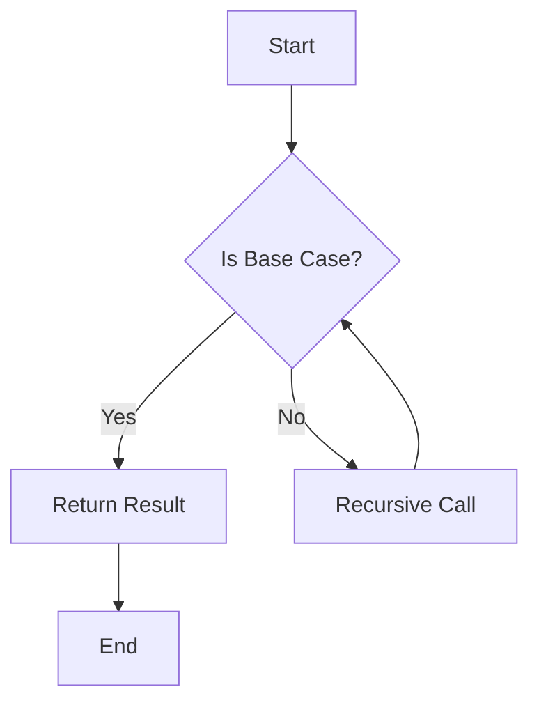

## 5.7 Recursion vs. Iteration

In the realm of programming, recursion and iteration are two fundamental techniques used to perform repetitive tasks. As experienced Java developers transitioning to Clojure, understanding the nuances between these two approaches is crucial for mastering functional programming and building scalable applications. In this section, we will explore the differences between recursion and iteration, discuss the advantages of recursion, provide guidelines on when to use each, and address performance considerations, particularly in the context of Clojure.

### Differences Between Recursion and Iteration

**Recursion** is a technique where a function calls itself to solve a problem. It is often used in functional programming languages like Clojure to process data structures that are inherently recursive, such as trees or graphs. Recursion can lead to more elegant and concise solutions, especially when dealing with hierarchical data.

**Iteration**, on the other hand, involves using loops to repeat a block of code until a certain condition is met. In Java, iteration is commonly implemented using `for`, `while`, or `do-while` loops. Iteration is typically more intuitive for developers with an imperative programming background, as it involves explicit control over the loop's execution.

#### Code Example: Factorial Calculation

Let's compare recursion and iteration by calculating the factorial of a number, a classic example used to illustrate these concepts.

**Java Iteration Example:**

```java
public class Factorial {
    public static int factorialIterative(int n) {
        int result = 1;
        for (int i = 1; i <= n; i++) {
            result *= i;
        }
        return result;
    }

    public static void main(String[] args) {
        System.out.println(factorialIterative(5)); // Output: 120
    }
}
```

**Clojure Recursion Example:**

```clojure
(defn factorial-recursive [n]
  (if (<= n 1)
    1
    (* n (factorial-recursive (dec n)))))

(println (factorial-recursive 5)) ; Output: 120
```

In the Java example, we use a `for` loop to iterate through numbers from 1 to `n`, multiplying each number to calculate the factorial. In the Clojure example, we use a recursive function that calls itself until the base case (`n <= 1`) is reached.

### Advantages of Recursion

Recursion offers several advantages, particularly in functional programming:

1. **Elegance and Simplicity**: Recursive solutions are often more elegant and concise, especially for problems that naturally fit a recursive structure, such as tree traversal or parsing nested data.

2. **Expressiveness**: Recursion allows for more expressive code, as it can directly mirror the problem's structure. This can lead to clearer and more maintainable code.

3. **Functional Paradigm Alignment**: Recursion aligns well with the functional programming paradigm, which emphasizes immutability and pure functions. Recursive solutions often avoid mutable state, reducing the risk of side effects.

4. **Tail Recursion Optimization**: Clojure supports tail recursion optimization through the `recur` special form, allowing recursive functions to execute in constant stack space, similar to iteration.

#### Code Example: Tail Recursion in Clojure

```clojure
(defn factorial-tail-recursive [n]
  (letfn [(helper [acc n]
            (if (<= n 1)
              acc
              (recur (* acc n) (dec n))))]
    (helper 1 n)))

(println (factorial-tail-recursive 5)) ; Output: 120
```

In this example, we use a helper function with an accumulator (`acc`) to perform tail recursion. The `recur` form ensures that the recursive call is the last operation, allowing Clojure to optimize the recursion and prevent stack overflow.

### When to Use Each

Choosing between recursion and iteration depends on the problem context and the language features available. Here are some guidelines:

- **Use Recursion When**:
  - The problem has a natural recursive structure, such as tree traversal or solving puzzles like the Tower of Hanoi.
  - You want to leverage the expressiveness and elegance of functional programming.
  - Tail recursion optimization is available, allowing recursion to be as efficient as iteration.

- **Use Iteration When**:
  - The problem is inherently iterative, such as processing a list of items in sequence.
  - You need explicit control over the loop's execution, such as breaking out of a loop early.
  - You are working in a language or environment where recursion is not optimized or could lead to stack overflow.

### Performance Considerations

Performance is a critical factor when choosing between recursion and iteration. In languages without tail recursion optimization, recursion can lead to stack overflow for deep recursive calls. However, Clojure's support for tail recursion optimization mitigates this issue, making recursion a viable option for many problems.

#### Code Example: Fibonacci Sequence

Let's compare recursion and iteration for calculating the Fibonacci sequence.

**Java Iteration Example:**

```java
public class Fibonacci {
    public static int fibonacciIterative(int n) {
        if (n <= 1) return n;
        int a = 0, b = 1, c;
        for (int i = 2; i <= n; i++) {
            c = a + b;
            a = b;
            b = c;
        }
        return b;
    }

    public static void main(String[] args) {
        System.out.println(fibonacciIterative(10)); // Output: 55
    }
}
```

**Clojure Recursion Example:**

```clojure
(defn fibonacci-recursive [n]
  (if (<= n 1)
    n
    (+ (fibonacci-recursive (- n 1))
       (fibonacci-recursive (- n 2)))))

(println (fibonacci-recursive 10)) ; Output: 55
```

**Clojure Tail Recursion Example:**

```clojure
(defn fibonacci-tail-recursive [n]
  (letfn [(helper [a b n]
            (if (zero? n)
              a
              (recur b (+ a b) (dec n))))]
    (helper 0 1 n)))

(println (fibonacci-tail-recursive 10)) ; Output: 55
```

In the iterative Java example, we use a loop to calculate the Fibonacci sequence. The recursive Clojure example is straightforward but inefficient due to repeated calculations. The tail-recursive Clojure example uses an accumulator to optimize the recursion, making it as efficient as the iterative solution.

### Visual Aids

To better understand the flow of recursion and iteration, let's visualize the process using a flowchart.



**Caption**: This flowchart illustrates the recursive process, where a function calls itself until a base case is reached.

### References and Links

For further reading on recursion and iteration in Clojure, consider the following resources:

- [Official Clojure Documentation](https://clojure.org/reference/recursion)
- [ClojureDocs: Recursion Examples](https://clojuredocs.org/clojure.core/recur)
- [Functional Programming in Clojure](https://www.braveclojure.com/)

### Knowledge Check

To reinforce your understanding of recursion and iteration, consider the following questions:

1. What are the main differences between recursion and iteration?
2. When is recursion more advantageous than iteration?
3. How does Clojure optimize tail recursion?
4. What are some common pitfalls of using recursion without optimization?
5. How can you refactor a recursive function to be tail-recursive in Clojure?

### Try It Yourself

Experiment with the code examples provided by modifying them to solve different problems. For instance, try implementing a recursive solution for calculating the greatest common divisor (GCD) or exploring how recursion can be used to traverse a binary tree.

### Summary

Recursion and iteration are powerful techniques for solving repetitive tasks in programming. While iteration is often more intuitive for developers with an imperative background, recursion offers elegance and expressiveness, particularly in functional programming languages like Clojure. By understanding the differences, advantages, and performance considerations, you can make informed decisions on when to use each approach in your applications.

---

## Recursion vs. Iteration Quiz: Test Your Understanding



### What is a key difference between recursion and iteration?

- [x] Recursion involves a function calling itself, while iteration uses loops.
- [ ] Recursion is always faster than iteration.
- [ ] Iteration cannot be used in functional programming.
- [ ] Recursion requires mutable state.

> **Explanation:** Recursion involves a function calling itself to solve a problem, whereas iteration uses loops to repeat a block of code.

### When is recursion more advantageous than iteration?

- [x] When the problem has a natural recursive structure.
- [ ] When explicit loop control is needed.
- [ ] When working with simple arithmetic operations.
- [ ] When performance is not a concern.

> **Explanation:** Recursion is more advantageous when the problem has a natural recursive structure, such as tree traversal or solving puzzles.

### How does Clojure optimize tail recursion?

- [x] By using the `recur` special form to execute in constant stack space.
- [ ] By converting recursion into iteration automatically.
- [ ] By using mutable state to store intermediate results.
- [ ] By limiting the depth of recursion.

> **Explanation:** Clojure optimizes tail recursion using the `recur` special form, allowing recursive functions to execute in constant stack space.

### What is a common pitfall of using recursion without optimization?

- [x] Stack overflow due to deep recursive calls.
- [ ] Inability to handle large datasets.
- [ ] Increased memory usage from mutable state.
- [ ] Difficulty in debugging.

> **Explanation:** Without optimization, recursion can lead to stack overflow for deep recursive calls, as each call consumes stack space.

### How can you refactor a recursive function to be tail-recursive in Clojure?

- [x] Use an accumulator and the `recur` form.
- [ ] Convert it into a loop.
- [ ] Use global variables to store results.
- [ ] Avoid using base cases.

> **Explanation:** Refactoring a recursive function to be tail-recursive involves using an accumulator and the `recur` form to ensure the recursive call is the last operation.

### What is an advantage of iteration over recursion?

- [x] Explicit control over loop execution.
- [ ] More concise code.
- [ ] Better alignment with functional programming.
- [ ] Avoidance of stack overflow.

> **Explanation:** Iteration provides explicit control over loop execution, allowing for operations like breaking out of a loop early.

### Which of the following is a scenario where recursion is preferred?

- [x] Traversing a binary tree.
- [ ] Calculating simple arithmetic operations.
- [ ] Iterating over a list of numbers.
- [ ] Performing a linear search.

> **Explanation:** Recursion is preferred for traversing a binary tree, as it naturally fits the recursive structure of the problem.

### What is the purpose of the `recur` form in Clojure?

- [x] To optimize tail recursion by executing in constant stack space.
- [ ] To convert recursion into iteration.
- [ ] To handle exceptions in recursive functions.
- [ ] To store intermediate results in mutable state.

> **Explanation:** The `recur` form in Clojure optimizes tail recursion by allowing recursive functions to execute in constant stack space.

### Which of the following is a disadvantage of recursion?

- [x] Potential for stack overflow without optimization.
- [ ] Lack of expressiveness.
- [ ] Difficulty in handling hierarchical data.
- [ ] Inability to use in functional programming.

> **Explanation:** A disadvantage of recursion is the potential for stack overflow without optimization, as each recursive call consumes stack space.

### True or False: Tail recursion in Clojure can be as efficient as iteration.

- [x] True
- [ ] False

> **Explanation:** True. Tail recursion in Clojure can be as efficient as iteration due to the `recur` form, which allows recursive functions to execute in constant stack space.


