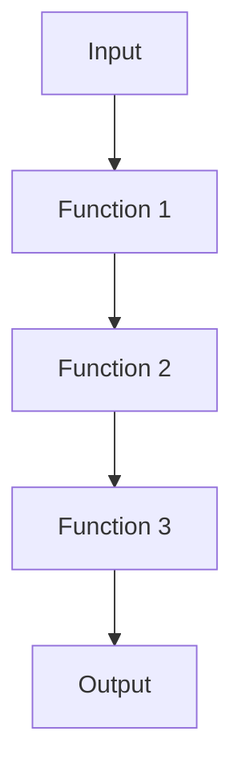

## 6.1 The `comp` Function for Composition

In the realm of functional programming, the ability to compose functions is a powerful tool that allows developers to build complex operations from simple, reusable components. Clojure, a modern Lisp dialect that runs on the Java Virtual Machine (JVM), provides a built-in function called `comp` that facilitates function composition. In this section, we will explore the `comp` function in detail, examining its usage patterns, benefits, and practical applications. We will also compare it with Java's approach to function composition, providing a bridge for experienced Java developers transitioning to Clojure.

### Understanding Function Composition

Function composition is the process of combining two or more functions to produce a new function. This new function, when invoked, applies the original functions in sequence. In mathematical terms, if you have two functions, `f` and `g`, the composition of these functions is denoted as `f(g(x))`. In Clojure, the `comp` function allows us to express this composition succinctly.

#### The Basics of `comp`

The `comp` function in Clojure takes any number of functions as arguments and returns a new function. This new function, when called, applies the original functions from right to left. Here's a simple example to illustrate this concept:

```clojure
(defn square [x]
  (* x x))

(defn increment [x]
  (+ x 1))

(def square-then-increment (comp increment square))

(println (square-then-increment 3)) ; Output: 10
```

In this example, `square-then-increment` is a composed function that first squares the input and then increments the result. The `comp` function applies `square` first, followed by `increment`.

### Usage Patterns and Best Practices

#### Readability and Maintainability

One of the primary benefits of using `comp` is improved code readability and maintainability. By composing functions, you can break down complex operations into smaller, more manageable pieces. This modular approach makes it easier to understand and modify the code.

Consider the following example, which demonstrates a data transformation pipeline:

```clojure
(defn parse-int [s]
  (Integer/parseInt s))

(defn double [x]
  (* 2 x))

(defn stringify [x]
  (str x))

(def transform (comp stringify double parse-int))

(println (transform "5")) ; Output: "10"
```

Here, `transform` is a composed function that parses a string into an integer, doubles the integer, and then converts it back to a string. Each step is encapsulated in a separate function, enhancing clarity.

#### Avoiding Nested Function Calls

Without `comp`, you might end up with deeply nested function calls, which can be difficult to read and maintain. The `comp` function helps flatten these nested calls, making the code more concise and easier to follow.

```clojure
;; Without comp
(println (stringify (double (parse-int "5")))) ; Output: "10"

;; With comp
(println (transform "5")) ; Output: "10"
```

By using `comp`, we eliminate the need for nested parentheses, resulting in cleaner code.

### Practical Examples of `comp` in Action

#### Composing Mathematical Operations

Let's explore a more complex example involving mathematical operations. Suppose we want to create a function that calculates the area of a circle given its radius, then formats the result as a string with two decimal places.

```clojure
(defn square [x]
  (* x x))

(defn multiply-by-pi [x]
  (* Math/PI x))

(defn format-decimal [x]
  (format "%.2f" x))

(def calculate-area (comp format-decimal multiply-by-pi square))

(println (calculate-area 5)) ; Output: "78.54"
```

In this example, `calculate-area` is a composed function that squares the radius, multiplies it by π (pi), and formats the result. Each operation is encapsulated in its own function, making the code modular and easy to understand.

#### Data Transformation Pipelines

The `comp` function is particularly useful in data transformation pipelines, where data flows through a series of transformations. Let's consider a scenario where we have a list of strings representing numbers, and we want to filter out even numbers, double them, and then convert them back to strings.

```clojure
(defn is-even? [x]
  (zero? (mod x 2)))

(defn double [x]
  (* 2 x))

(defn stringify [x]
  (str x))

(def process-numbers
  (comp (partial map stringify)
        (partial map double)
        (partial filter is-even?)
        (partial map parse-int)))

(println (process-numbers ["1" "2" "3" "4"])) ; Output: ("4" "8")
```

In this example, `process-numbers` is a composed function that processes a list of strings. It first parses each string into an integer, filters out even numbers, doubles them, and finally converts them back to strings. The use of `comp` allows us to express this pipeline in a clear and concise manner.

### Comparing `comp` with Java's Approach

Java, being an object-oriented language, does not have a built-in function composition mechanism like Clojure's `comp`. However, with the introduction of lambda expressions and functional interfaces in Java 8, it is possible to achieve similar functionality using method references and the `Function` interface.

Here's how you might compose functions in Java:

```java
import java.util.function.Function;

public class FunctionComposition {
    public static void main(String[] args) {
        Function<String, Integer> parseInt = Integer::parseInt;
        Function<Integer, Integer> doubleValue = x -> x * 2;
        Function<Integer, String> stringify = Object::toString;

        Function<String, String> transform = parseInt.andThen(doubleValue).andThen(stringify);

        System.out.println(transform.apply("5")); // Output: "10"
    }
}
```

In this Java example, we use the `andThen` method to compose functions. While this approach works, it is more verbose compared to Clojure's `comp`. Clojure's concise syntax and first-class support for functions make it a more natural fit for function composition.

### Visualizing Function Composition

To better understand how `comp` works, let's visualize the flow of data through composed functions using a diagram.



In this diagram, data flows from the input through a series of functions, each transforming the data before passing it to the next function. This linear flow is characteristic of function composition and highlights the modular nature of functional programming.

### Key Takeaways

- **Function Composition**: The `comp` function in Clojure allows you to compose multiple functions into a single function, applying them from right to left.
- **Improved Readability**: Using `comp` can enhance code readability by reducing nested function calls and encapsulating complex operations in modular components.
- **Practical Applications**: The `comp` function is particularly useful in data transformation pipelines and mathematical operations.
- **Comparison with Java**: While Java supports function composition through the `Function` interface, Clojure's `comp` offers a more concise and expressive syntax.

### Try It Yourself

Now that we've explored the `comp` function, try modifying the examples provided. For instance, add a new function to the composition or change the order of functions to see how it affects the output. Experimenting with different compositions will deepen your understanding of this powerful concept.

### Knowledge Check

To reinforce your understanding of the `comp` function, let's test your knowledge with a quiz.

## Mastering Clojure's `comp` Function: Quiz



### What does the `comp` function do in Clojure?

- [x] Composes multiple functions into a single function
- [ ] Executes functions in parallel
- [ ] Converts functions into strings
- [ ] Optimizes function performance

> **Explanation:** The `comp` function in Clojure composes multiple functions into a single function, applying them from right to left.

### How does `comp` improve code readability?

- [x] By reducing nested function calls
- [ ] By increasing the number of lines of code
- [ ] By adding more comments
- [ ] By using complex syntax

> **Explanation:** The `comp` function reduces nested function calls, making the code more concise and easier to read.

### In Clojure, which direction does `comp` apply functions?

- [x] Right to left
- [ ] Left to right
- [ ] Top to bottom
- [ ] Bottom to top

> **Explanation:** The `comp` function applies functions from right to left, meaning the last function in the argument list is applied first.

### What is a common use case for `comp`?

- [x] Data transformation pipelines
- [ ] Memory management
- [ ] Network communication
- [ ] File I/O operations

> **Explanation:** The `comp` function is commonly used in data transformation pipelines to process data through a series of transformations.

### How does Java achieve function composition?

- [x] Using the `Function` interface and `andThen` method
- [ ] Using the `Thread` class
- [ ] Using the `String` class
- [ ] Using the `List` interface

> **Explanation:** Java achieves function composition using the `Function` interface and the `andThen` method to chain functions together.

### What is the output of `(comp inc dec)` when applied to `5`?

- [x] 5
- [ ] 6
- [ ] 4
- [ ] 10

> **Explanation:** The `comp` function applies `dec` first, then `inc`, resulting in the original value `5`.

### Which of the following is a benefit of using `comp`?

- [x] Enhanced modularity
- [ ] Increased memory usage
- [ ] Slower execution time
- [ ] More complex syntax

> **Explanation:** Using `comp` enhances modularity by allowing complex operations to be broken down into smaller, reusable functions.

### What does the `comp` function return?

- [x] A new function
- [ ] A list of functions
- [ ] A string representation of functions
- [ ] An integer value

> **Explanation:** The `comp` function returns a new function that is the composition of the input functions.

### True or False: `comp` can only be used with two functions.

- [ ] True
- [x] False

> **Explanation:** The `comp` function can be used with any number of functions, not just two.

### Which of the following is a key takeaway about `comp`?

- [x] It allows for concise expression of complex operations
- [ ] It is only useful for mathematical operations
- [ ] It is a feature unique to Java
- [ ] It requires extensive boilerplate code

> **Explanation:** The `comp` function allows for concise expression of complex operations by composing multiple functions into a single function.



By mastering the `comp` function, you can harness the full power of function composition in Clojure, leading to more readable, maintainable, and efficient code. Keep experimenting and exploring to deepen your understanding and proficiency in functional programming with Clojure.
