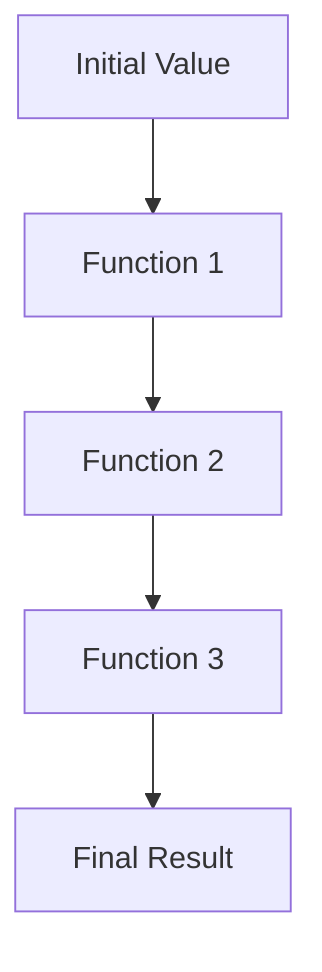

## 6.2 Threading Macros: `->` and `->>`

As experienced Java developers, you're likely familiar with the verbosity that can accompany method chaining and nested function calls. Clojure offers a more elegant solution through threading macros, `->` and `->>`, which enhance code readability and simplify function composition by reordering function calls. In this section, we'll explore how these macros work, their purpose, and practical examples to illustrate their use.

### Purpose of Threading Macros

Threading macros in Clojure are designed to improve code readability and maintainability by allowing you to express a sequence of transformations on data in a linear and intuitive manner. They achieve this by reordering function calls, which can often become cumbersome and difficult to read when nested deeply. By using threading macros, you can transform complex nested expressions into a series of straightforward steps.

#### Benefits of Threading Macros

- **Improved Readability**: By reducing the need for deeply nested expressions, threading macros make your code easier to read and understand.
- **Simplified Function Composition**: They allow you to compose functions in a linear fashion, making it easier to follow the flow of data through your program.
- **Reduced Boilerplate**: Threading macros minimize the need for intermediate variables, reducing boilerplate code and potential errors.

### The `->` Macro (Thread-First)

The `->` macro, also known as the thread-first macro, is used to thread an expression through a series of forms by inserting it as the first argument in each subsequent form. This is particularly useful when dealing with functions that expect their primary data argument to be the first parameter.

#### How `->` Works

Consider the following example, where we have a series of functions that transform a data structure:

```clojure
(defn add-one [x] (+ x 1))
(defn double [x] (* x 2))
(defn square [x] (* x x))

;; Without threading macro
(square (double (add-one 3)))
;; => 64
```

Using the `->` macro, we can rewrite this code to improve readability:

```clojure
(-> 3
    add-one
    double
    square)
;; => 64
```

In this example, the `->` macro takes the initial value `3` and threads it through each function, inserting it as the first argument. This linear flow is much easier to read and understand.

#### Practical Use Cases for `->`

- **Data Transformation Pipelines**: When you have a series of transformations to apply to a data structure, `->` can make the process more intuitive.
- **Chaining Function Calls**: When functions are designed to take their primary data argument first, `->` is ideal for chaining them together.

### The `->>` Macro (Thread-Last)

The `->>` macro, or thread-last macro, is similar to `->`, but it threads the expression by inserting it as the last argument in each subsequent form. This is useful for functions that expect their primary data argument to be the last parameter.

#### How `->>` Works

Let's consider a similar example, but with functions that expect the data as the last argument:

```clojure
(defn append-exclamation [s] (str s "!"))
(defn reverse-string [s] (apply str (reverse s)))
(defn to-upper-case [s] (.toUpperCase s))

;; Without threading macro
(to-upper-case (reverse-string (append-exclamation "hello")))
;; => "OLLEH!"
```

Using the `->>` macro, we can rewrite this code:

```clojure
(->> "hello"
     append-exclamation
     reverse-string
     to-upper-case)
;; => "OLLEH!"
```

Here, the `->>` macro threads the initial string `"hello"` through each function, inserting it as the last argument. This approach is particularly useful when working with collection functions like `map`, `filter`, and `reduce`.

#### Practical Use Cases for `->>`

- **Collection Processing**: When working with functions that operate on collections, such as `map` and `filter`, `->>` is often more appropriate.
- **String Manipulation**: For functions that expect the string or collection to be the last argument, `->>` provides a clean and readable way to chain operations.

### Examples and Comparisons

#### Example 1: Data Processing with `->`

Suppose we have a map representing a user, and we want to transform it by updating the age and adding a new key:

```clojure
(def user {:name "Alice" :age 30})

(defn increment-age [user]
  (update user :age inc))

(defn add-email [user]
  (assoc user :email "alice@example.com"))

;; Without threading macro
(add-email (increment-age user))
;; => {:name "Alice", :age 31, :email "alice@example.com"}

;; Using `->`
(-> user
    increment-age
    add-email)
;; => {:name "Alice", :age 31, :email "alice@example.com"}
```

In this example, `->` makes the transformation pipeline clear and concise.

#### Example 2: Collection Processing with `->>`

Consider a list of numbers that we want to filter, map, and reduce:

```clojure
(def numbers [1 2 3 4 5 6])

;; Without threading macro
(reduce + (map #(* % %) (filter even? numbers)))
;; => 56

;; Using `->>`
(->> numbers
     (filter even?)
     (map #(* % %))
     (reduce +))
;; => 56
```

Here, `->>` is used to process the collection, threading it through each function as the last argument.

### Visualizing Threading Macros

To better understand how threading macros work, let's visualize the flow of data through a series of transformations using a flowchart.



In this diagram, the initial value is passed through a series of functions, each transforming the data until the final result is achieved. This linear flow is what threading macros facilitate, making complex transformations more manageable.

### Try It Yourself

To deepen your understanding of threading macros, try modifying the examples above:

1. **Experiment with Different Functions**: Replace the functions in the examples with your own to see how threading macros handle different argument positions.
2. **Combine `->` and `->>`**: Use both macros in a single expression to handle functions with varying argument positions.
3. **Refactor Nested Code**: Take a piece of nested code you have written in Java and refactor it using Clojure's threading macros.

### Key Takeaways

- **Threading Macros Simplify Code**: They reduce the complexity of nested function calls, making your code more readable and maintainable.
- **Choose the Right Macro**: Use `->` when the primary data argument is first, and `->>` when it's last.
- **Enhance Function Composition**: Threading macros allow you to express data transformations in a linear, intuitive manner.

By incorporating threading macros into your Clojure code, you can achieve cleaner, more readable, and maintainable code, leveraging the power of functional programming to build scalable applications.

### Further Reading

- [Clojure Official Documentation on Threading Macros](https://clojure.org/reference/threading)
- [ClojureDocs: `->` Macro](https://clojuredocs.org/clojure.core/-%3E)
- [ClojureDocs: `->>` Macro](https://clojuredocs.org/clojure.core/-%3E%3E)

## Quiz: Mastering Clojure Threading Macros



### What is the primary purpose of threading macros in Clojure?

- [x] To improve code readability by reordering function calls
- [ ] To increase the execution speed of functions
- [ ] To enable parallel processing of data
- [ ] To simplify error handling

> **Explanation:** Threading macros are designed to improve code readability by allowing you to express a sequence of transformations on data in a linear and intuitive manner.

### How does the `->` macro thread an expression through forms?

- [x] By inserting it as the first argument in each subsequent form
- [ ] By inserting it as the last argument in each subsequent form
- [ ] By reversing the order of function calls
- [ ] By duplicating the expression in each form

> **Explanation:** The `->` macro threads an expression by inserting it as the first argument in each subsequent form, making it ideal for functions that expect their primary data argument first.

### In which scenario is the `->>` macro more appropriate than `->`?

- [x] When working with functions that expect the primary data argument as the last parameter
- [ ] When working with functions that expect the primary data argument as the first parameter
- [ ] When dealing with nested loops
- [ ] When handling exceptions

> **Explanation:** The `->>` macro is more appropriate when working with functions that expect the primary data argument as the last parameter, such as collection processing functions.

### What is a key benefit of using threading macros?

- [x] They reduce the need for deeply nested expressions
- [ ] They automatically parallelize function calls
- [ ] They eliminate the need for error handling
- [ ] They increase the verbosity of code

> **Explanation:** Threading macros reduce the need for deeply nested expressions, making code easier to read and understand.

### Which of the following is a practical use case for the `->` macro?

- [x] Data transformation pipelines
- [ ] Parallel processing
- [ ] Error handling
- [ ] Memory management

> **Explanation:** The `->` macro is particularly useful for data transformation pipelines, where a series of transformations are applied to a data structure.

### How can threading macros enhance function composition?

- [x] By allowing functions to be composed in a linear fashion
- [ ] By enabling functions to run in parallel
- [ ] By automatically handling exceptions
- [ ] By increasing the complexity of function calls

> **Explanation:** Threading macros enhance function composition by allowing functions to be composed in a linear fashion, making it easier to follow the flow of data through a program.

### What is the result of using the `->` macro with the following code?

```clojure
(-> 5
    inc
    (* 2))
```

- [x] 12
- [ ] 10
- [ ] 11
- [ ] 15

> **Explanation:** The `->` macro threads the initial value `5` through the `inc` function, resulting in `6`, and then through the `(* 2)` function, resulting in `12`.

### Which threading macro would you use for the following code snippet?

```clojure
(reduce + (map #(* % %) (filter even? numbers)))
```

- [x] `->>`
- [ ] `->`
- [ ] Neither
- [ ] Both

> **Explanation:** The `->>` macro is appropriate here because it threads the collection through functions that expect the collection as the last argument.

### What is a common pitfall to avoid when using threading macros?

- [x] Using the wrong macro for the argument position
- [ ] Using them for error handling
- [ ] Using them for parallel processing
- [ ] Using them for memory management

> **Explanation:** A common pitfall is using the wrong macro for the argument position, which can lead to incorrect function calls and unexpected results.

### True or False: Threading macros can be used to simplify error handling in Clojure.

- [ ] True
- [x] False

> **Explanation:** Threading macros are not designed for error handling; they are intended to improve code readability and simplify function composition by reordering function calls.


