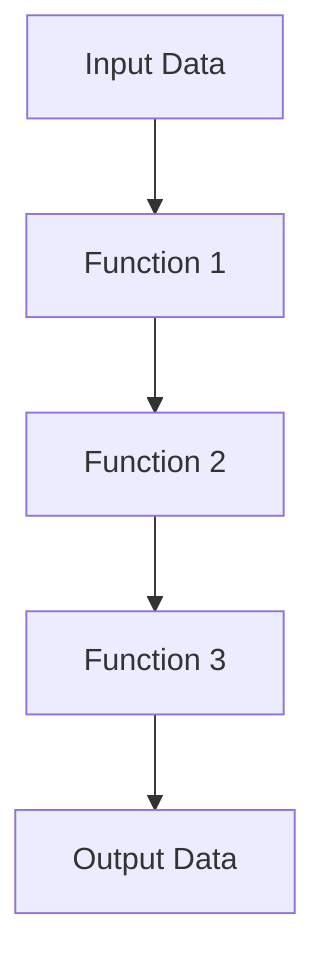

## 6.3 Managing Data Flow with Pipelines

In this section, we will explore how to manage data flow using Clojure's powerful pipelines. We'll introduce the concept of data flowing through a series of transformations, demonstrate how to build these pipelines using threading macros and composed functions, and discuss the advantages of using pipelines to enhance code clarity and modularity. We'll also provide real-world examples, such as processing user input or transforming JSON data.

### Data Flow Concepts

In functional programming, data flow refers to the movement and transformation of data through a series of operations. This concept is akin to an assembly line in a factory, where raw materials are transformed into finished products through a series of steps. In Clojure, we can achieve this through pipelines, which allow us to chain functions together in a clear and concise manner.

#### Understanding Pipelines

A pipeline is a sequence of data transformations, where the output of one function becomes the input of the next. This approach is particularly powerful in functional programming, as it allows us to build complex data processing workflows in a modular and reusable way.

Consider the following analogy: imagine a series of water pipes connected end-to-end. Water flows through the pipes, undergoing various transformations along the way, such as filtration, heating, or cooling. Similarly, in a data pipeline, data flows through a series of functions, each performing a specific transformation.

### Building Pipelines

In Clojure, we can build data transformation pipelines using threading macros and composed functions. Let's explore these techniques in detail.

#### Threading Macros

Threading macros are a powerful feature in Clojure that allow us to express data transformations in a linear, readable manner. The two most common threading macros are `->` (thread-first) and `->>` (thread-last).

- **Thread-First Macro (`->`)**: This macro threads the result of each expression as the first argument to the next expression.

```clojure
(-> x
    (f a)
    (g b)
    (h c))
```

- **Thread-Last Macro (`->>`)**: This macro threads the result of each expression as the last argument to the next expression.

```clojure
(->> x
     (f a)
     (g b)
     (h c))
```

#### Example: Using Threading Macros

Let's consider a simple example where we have a list of numbers, and we want to filter out even numbers, square the remaining numbers, and then sum them up.

```clojure
(def numbers [1 2 3 4 5 6 7 8 9 10])

(def result
  (->> numbers
       (filter odd?)
       (map #(* % %))
       (reduce +)))

(println result) ; Output: 165
```

In this example, we use the `->>` threading macro to pass the list of numbers through a series of transformations: filtering, mapping, and reducing. This approach makes the code more readable and easier to understand.

#### Function Composition

Function composition is another technique for building pipelines in Clojure. It involves combining multiple functions into a single function, where the output of one function becomes the input of the next.

- **The `comp` Function**: Clojure provides the `comp` function for composing functions. It takes multiple functions as arguments and returns a new function that applies the given functions in sequence.

```clojure
(defn square [x]
  (* x x))

(defn increment [x]
  (+ x 1))

(def square-and-increment
  (comp increment square))

(println (square-and-increment 3)) ; Output: 10
```

In this example, we define two functions, `square` and `increment`, and then compose them using `comp` to create a new function, `square-and-increment`. When we apply this function to the number 3, it first squares the number and then increments the result.

### Advantages of Pipelines

Using pipelines in Clojure offers several advantages, including enhanced code clarity, modularity, and reusability.

#### Code Clarity

Pipelines make code more readable by expressing data transformations in a linear, step-by-step manner. This approach reduces the cognitive load on developers, as they can easily follow the flow of data through the pipeline.

#### Modularity

Pipelines promote modularity by encouraging the use of small, focused functions that perform specific tasks. These functions can be easily reused and combined in different pipelines, reducing code duplication and improving maintainability.

#### Reusability

By composing functions into pipelines, we can create reusable data processing workflows that can be applied to different data sets. This approach allows us to build flexible and adaptable applications that can handle a wide range of data processing tasks.

### Case Studies

Let's explore some real-world examples of using pipelines in Clojure to process user input and transform JSON data.

#### Case Study 1: Processing User Input

Suppose we have a web application that receives user input in the form of a JSON object. We want to validate the input, extract relevant fields, and transform the data into a format suitable for storage in a database.

```clojure
(defn validate-input [input]
  (if (and (contains? input :name)
           (contains? input :email))
    input
    (throw (ex-info "Invalid input" {:input input}))))

(defn extract-fields [input]
  {:name  (:name input)
   :email (:email input)})

(defn transform-data [data]
  (assoc data :created-at (java.time.Instant/now)))

(defn process-user-input [input]
  (-> input
      validate-input
      extract-fields
      transform-data))

(def user-input {:name "John Doe" :email "john.doe@example.com"})

(println (process-user-input user-input))
```

In this example, we define a pipeline using the `->` threading macro to process user input. The pipeline consists of three functions: `validate-input`, `extract-fields`, and `transform-data`. Each function performs a specific task, and the pipeline combines them into a cohesive data processing workflow.

#### Case Study 2: Transforming JSON Data

Consider a scenario where we have a JSON file containing a list of products, and we want to filter out products that are out of stock, calculate the total price of the remaining products, and format the result as a JSON string.

```clojure
(require '[clojure.data.json :as json])

(def products-json "[{\"name\": \"Laptop\", \"price\": 1000, \"stock\": 5},
                     {\"name\": \"Phone\", \"price\": 500, \"stock\": 0},
                     {\"name\": \"Tablet\", \"price\": 300, \"stock\": 10}]")

(defn parse-json [json-str]
  (json/read-str json-str :key-fn keyword))

(defn filter-in-stock [products]
  (filter #(> (:stock %) 0) products))

(defn calculate-total-price [products]
  (reduce + (map :price products)))

(defn format-as-json [total-price]
  (json/write-str {:total-price total-price}))

(defn process-products [json-str]
  (-> json-str
      parse-json
      filter-in-stock
      calculate-total-price
      format-as-json))

(println (process-products products-json))
```

In this example, we use a pipeline to transform JSON data. The pipeline consists of four functions: `parse-json`, `filter-in-stock`, `calculate-total-price`, and `format-as-json`. Each function performs a specific transformation, and the pipeline combines them into a complete data processing workflow.

### Visual Aids

To enhance understanding of Clojure pipelines, let's incorporate a diagram that illustrates the flow of data through a pipeline.



**Diagram Description**: This diagram represents a simple data pipeline, where data flows from the input through a series of functions, each performing a specific transformation, and finally producing the output.

### References and Links

For further reading on Clojure pipelines and threading macros, consider the following resources:

- [Official Clojure Documentation](https://clojure.org/reference)
- [ClojureDocs](https://clojuredocs.org/)
- [Clojure Threading Macros](https://clojure.org/guides/threading_macros)

### Knowledge Check

To reinforce your understanding of managing data flow with pipelines in Clojure, try answering the following questions:

1. What is the primary purpose of a data pipeline in functional programming?
2. How do threading macros enhance code readability in Clojure?
3. What are the advantages of using pipelines for data transformation?
4. How can function composition be used to build pipelines in Clojure?
5. Provide an example of a real-world application of Clojure pipelines.

### Exercises

Try modifying the code examples provided in this section to experiment with different data transformations. For instance, you could:

- Add additional validation checks to the user input processing pipeline.
- Extend the JSON data transformation pipeline to include additional product attributes.

### Summary

In this section, we've explored how to manage data flow using Clojure's powerful pipelines. We've introduced the concept of data flowing through a series of transformations, demonstrated how to build these pipelines using threading macros and composed functions, and discussed the advantages of using pipelines to enhance code clarity and modularity. We've also provided real-world examples, such as processing user input or transforming JSON data.

Now that we've mastered data flow with pipelines, let's continue our journey into the world of functional programming with Clojure.

## Quiz: Mastering Data Flow with Clojure Pipelines



### What is the primary purpose of a data pipeline in functional programming?

- [x] To transform data through a series of functions
- [ ] To store data in a database
- [ ] To manage user authentication
- [ ] To handle network requests

> **Explanation:** A data pipeline is used to transform data through a series of functions, allowing for modular and reusable data processing workflows.

### How do threading macros enhance code readability in Clojure?

- [x] By expressing data transformations in a linear, readable manner
- [ ] By reducing the number of lines of code
- [ ] By increasing the performance of the code
- [ ] By simplifying error handling

> **Explanation:** Threading macros enhance code readability by expressing data transformations in a linear, step-by-step manner, making it easier to follow the flow of data.

### What are the advantages of using pipelines for data transformation?

- [x] Enhanced code clarity and modularity
- [x] Reusability of data processing workflows
- [ ] Improved error handling
- [ ] Faster execution times

> **Explanation:** Pipelines enhance code clarity and modularity by promoting the use of small, focused functions. They also allow for the reusability of data processing workflows.

### How can function composition be used to build pipelines in Clojure?

- [x] By combining multiple functions into a single function
- [ ] By using loops to iterate over data
- [ ] By storing data in a global variable
- [ ] By writing complex conditional statements

> **Explanation:** Function composition involves combining multiple functions into a single function, where the output of one function becomes the input of the next, allowing for the creation of pipelines.

### Provide an example of a real-world application of Clojure pipelines.

- [x] Processing user input in a web application
- [x] Transforming JSON data for storage
- [ ] Managing user sessions
- [ ] Handling file uploads

> **Explanation:** Real-world applications of Clojure pipelines include processing user input in web applications and transforming JSON data for storage, among others.

### What is the role of the `->` threading macro in Clojure?

- [x] To thread the result of each expression as the first argument to the next expression
- [ ] To execute functions in parallel
- [ ] To handle exceptions in code
- [ ] To manage state changes

> **Explanation:** The `->` threading macro threads the result of each expression as the first argument to the next expression, allowing for linear data transformations.

### What is the role of the `->>` threading macro in Clojure?

- [x] To thread the result of each expression as the last argument to the next expression
- [ ] To execute functions in parallel
- [ ] To handle exceptions in code
- [ ] To manage state changes

> **Explanation:** The `->>` threading macro threads the result of each expression as the last argument to the next expression, allowing for linear data transformations.

### How does function composition differ from threading macros?

- [x] Function composition combines functions into a single function, while threading macros express data transformations linearly
- [ ] Function composition is faster than threading macros
- [ ] Function composition is used for error handling
- [ ] Function composition is only used in object-oriented programming

> **Explanation:** Function composition combines functions into a single function, where the output of one function becomes the input of the next. Threading macros express data transformations in a linear, readable manner.

### What is the benefit of using small, focused functions in pipelines?

- [x] They promote modularity and reusability
- [ ] They increase the execution speed of the code
- [ ] They simplify error handling
- [ ] They reduce the number of lines of code

> **Explanation:** Small, focused functions promote modularity and reusability, allowing for the creation of flexible and adaptable data processing workflows.

### True or False: Pipelines in Clojure can only be used for data transformation tasks.

- [ ] True
- [x] False

> **Explanation:** While pipelines are commonly used for data transformation tasks, they can also be applied to other areas, such as managing state or handling side effects, depending on the specific requirements of the application.


