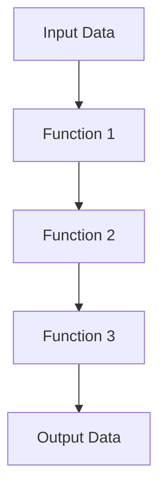

## 6.4 Chaining Functions for Clean Code

In the world of functional programming, the ability to chain functions together is a powerful tool that can lead to cleaner, more maintainable code. In Clojure, function chaining is a common practice that allows developers to express complex operations in a concise and readable manner. This section will explore the techniques and benefits of chaining functions, using anonymous functions, refactoring nested code, and best practices for maintaining readability.

### Function Chaining Techniques

Function chaining involves linking multiple functions together in a sequence, where the output of one function becomes the input of the next. This approach is particularly useful in Clojure, where immutability and pure functions are core principles. By chaining functions, you can create a pipeline of operations that transform data step-by-step.

#### Benefits of Function Chaining

- **Improved Readability**: Chaining functions can make code more readable by reducing the need for nested function calls.
- **Modularity**: Each function in the chain performs a specific task, promoting modularity and reusability.
- **Ease of Maintenance**: Changes to one part of the chain can often be made without affecting the rest of the code.

#### Chaining Functions vs. Nested Function Calls

Consider the following example of nested function calls in Java:

```java
String result = process(trim(toUpperCase(input)));
```

In this Java example, the functions `toUpperCase`, `trim`, and `process` are nested, which can make the code harder to read and understand. In Clojure, we can achieve the same result using function chaining:

```clojure
(defn process-input [input]
  (-> input
      clojure.string/upper-case
      clojure.string/trim
      process))
```

In this Clojure example, the `->` threading macro is used to chain the functions together, making the code more readable and easier to follow.

#### Using Anonymous Functions

Anonymous functions, also known as lambda functions, can be used to dynamically chain functions together. This is particularly useful when you need to apply a series of transformations that are not predefined.

```clojure
(defn transform-data [data]
  (-> data
      (map #(-> % (* 2) inc))
      (filter even?)))
```

In this example, an anonymous function is used within the `map` function to double each element and then increment it. The `filter` function is then used to retain only even numbers.

### Refactoring Nested Code

Nested code can often be refactored into a series of chained function calls, improving readability and maintainability. Let's look at an example of deeply nested code and how it can be refactored.

#### Nested Code Example

```clojure
(defn process-data [data]
  (filter even?
          (map inc
               (map #(* % 2) data))))
```

#### Refactored Code Using Function Chaining

```clojure
(defn process-data [data]
  (->> data
       (map #(* % 2))
       (map inc)
       (filter even?)))
```

In the refactored example, the `->>` threading macro is used to chain the functions together. This approach eliminates the need for nested function calls and makes the code more readable.

### Best Practices for Chaining Functions

When chaining functions, it's important to maintain readability and ensure that the code is easy to understand. Here are some best practices to consider:

- **Use Line Breaks and Indentation**: Break long chains into multiple lines and use consistent indentation to improve readability.
- **Limit the Length of Chains**: Avoid excessively long chains, as they can become difficult to follow. Consider breaking them into smaller, named functions.
- **Use Descriptive Function Names**: Ensure that each function in the chain has a clear and descriptive name that indicates its purpose.
- **Avoid Side Effects**: Ensure that each function in the chain is pure and does not produce side effects, which can lead to unexpected behavior.

### Visualizing Function Chaining

To better understand how function chaining works, let's visualize the flow of data through a series of chained functions using a flowchart.



**Figure 1**: Flow of data through a series of chained functions.

In this diagram, data flows from the input through each function in the chain, resulting in the final output.

### Try It Yourself

Experiment with the following code by modifying the functions in the chain or adding new ones:

```clojure
(defn transform-sequence [seq]
  (->> seq
       (map #(* % 3))
       (filter odd?)
       (reduce +)))

(transform-sequence [1 2 3 4 5 6 7 8 9])
```

Try changing the multiplier in the `map` function or the predicate in the `filter` function to see how the output changes.

### References and Further Reading

- [Official Clojure Documentation](https://clojure.org/reference)
- [ClojureDocs](https://clojuredocs.org/)
- [Functional Programming in Clojure](https://www.braveclojure.com/)

### Knowledge Check

To reinforce your understanding of function chaining in Clojure, try answering the following questions:

## Quiz: Mastering Function Chaining in Clojure



### What is the primary benefit of chaining functions in Clojure?

- [x] Improved readability and maintainability
- [ ] Increased execution speed
- [ ] Reduced memory usage
- [ ] Enhanced security

> **Explanation:** Chaining functions improves readability and maintainability by reducing the need for nested function calls and promoting a clear flow of data.

### Which Clojure macro is commonly used for function chaining?

- [x] `->`
- [ ] `let`
- [ ] `defn`
- [ ] `if`

> **Explanation:** The `->` threading macro is commonly used for chaining functions in Clojure, allowing for a more readable sequence of operations.

### How can anonymous functions be used in function chaining?

- [x] To dynamically apply transformations within a chain
- [ ] To define global variables
- [ ] To create new namespaces
- [ ] To handle exceptions

> **Explanation:** Anonymous functions can be used within a chain to apply dynamic transformations to data, enhancing flexibility.

### What is a best practice for maintaining readability in function chains?

- [x] Use line breaks and consistent indentation
- [ ] Use global variables
- [ ] Avoid using macros
- [ ] Minimize the number of functions

> **Explanation:** Using line breaks and consistent indentation helps maintain readability in function chains, making the code easier to follow.

### What should be avoided in functions within a chain?

- [x] Side effects
- [ ] Pure functions
- [ ] Descriptive names
- [ ] Modularity

> **Explanation:** Side effects should be avoided in functions within a chain to ensure predictable and reliable behavior.

### Which threading macro is used for chaining functions with a collection as the first argument?

- [x] `->>`
- [ ] `->`
- [ ] `let`
- [ ] `defn`

> **Explanation:** The `->>` threading macro is used when chaining functions with a collection as the first argument, allowing for a more natural flow of operations.

### How can nested code be refactored for better readability?

- [x] By using function chaining
- [ ] By increasing indentation
- [ ] By adding more comments
- [ ] By using global variables

> **Explanation:** Nested code can be refactored using function chaining, which improves readability by reducing complexity.

### What is a key advantage of using descriptive function names in a chain?

- [x] They indicate the purpose of each function
- [ ] They reduce execution time
- [ ] They increase memory efficiency
- [ ] They enhance security

> **Explanation:** Descriptive function names indicate the purpose of each function in the chain, making the code easier to understand.

### True or False: Function chaining can lead to cleaner and more maintainable code.

- [x] True
- [ ] False

> **Explanation:** Function chaining can indeed lead to cleaner and more maintainable code by promoting modularity and reducing complexity.

### What is the role of the `reduce` function in a chain?

- [x] To aggregate data into a single value
- [ ] To filter elements
- [ ] To map transformations
- [ ] To create side effects

> **Explanation:** The `reduce` function aggregates data into a single value, often serving as the final step in a chain of transformations.



By mastering function chaining in Clojure, you can write cleaner, more efficient code that is easier to maintain and understand. Keep experimenting with different chaining techniques and explore how they can simplify your codebase.
