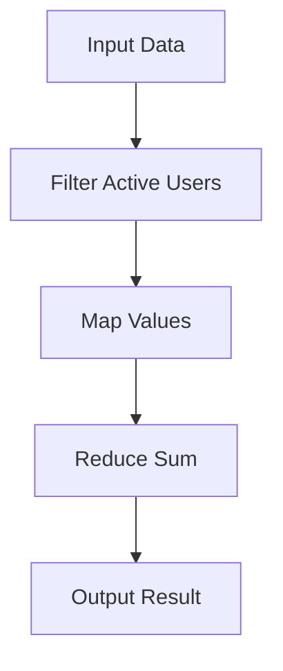

## 6.5 Best Practices for Function Composition

Function composition is a cornerstone of functional programming, enabling developers to build complex operations from simple, reusable components. In Clojure, function composition is not only a powerful tool for creating scalable applications but also a means to write clean, maintainable code. In this section, we will explore best practices for function composition, focusing on writing small, pure functions, using clear naming conventions, avoiding over-composition, and employing effective testing strategies.

### Write Small, Pure Functions

#### The Importance of Small, Single-Purpose Functions

In functional programming, the mantra "small is beautiful" holds significant weight. Small functions are easier to understand, test, and reuse. They encapsulate a single responsibility, making them ideal building blocks for more complex operations.

- **Single Responsibility Principle**: Each function should do one thing and do it well. This principle, borrowed from object-oriented design, applies equally to functional programming. By limiting a function's scope, we reduce the cognitive load required to understand it.

- **Ease of Testing**: Small functions are easier to test because they have fewer dependencies and side effects. This isolation makes it straightforward to verify their correctness.

- **Reusability**: Functions that perform a single task can be reused in different contexts, promoting code reuse and reducing duplication.

#### Pure Functions: The Building Blocks of Composition

Pure functions are deterministic and side-effect-free, meaning they always produce the same output for the same input and do not alter any external state. These characteristics make them ideal for composition.

- **Determinism**: Pure functions' predictability ensures that composed functions behave consistently, simplifying debugging and reasoning about code.

- **Referential Transparency**: This property allows us to replace a function call with its result without changing the program's behavior, facilitating optimization and refactoring.

- **Example of a Pure Function in Clojure**:

```clojure
(defn add [x y]
  (+ x y))
```

This simple function takes two arguments and returns their sum. It is pure because it relies solely on its inputs and produces no side effects.

#### Java Comparison: Methods vs. Functions

In Java, methods often belong to classes and can have side effects, such as modifying object state. In contrast, Clojure functions are standalone and emphasize immutability, aligning with functional programming principles.

- **Java Method Example**:

```java
public class Calculator {
    private int result = 0;

    public int add(int x, int y) {
        result = x + y; // Side effect: modifies object state
        return result;
    }
}
```

- **Clojure Function Equivalent**:

```clojure
(defn add [x y]
  (+ x y)) ; No side effects, pure function
```

### Clear Function Names

#### Descriptive Naming Conventions

Clear and descriptive function names are crucial for understanding composed functions. They serve as documentation, conveying the function's purpose and behavior.

- **Verb-Noun Structure**: Use a verb-noun structure to describe what the function does. For example, `calculate-total` or `filter-active-users`.

- **Avoid Abbreviations**: While brevity is valuable, clarity should not be sacrificed. Avoid cryptic abbreviations that obscure meaning.

- **Consistency**: Maintain consistent naming conventions across your codebase to enhance readability and predictability.

#### Example of Clear Naming in Clojure

```clojure
(defn calculate-total [prices]
  (reduce + prices))

(defn filter-active-users [users]
  (filter :active users))
```

These function names clearly indicate their purpose, making it easier to understand their role in a composition.

### Avoid Over-Composition

#### The Pitfalls of Over-Composition

While function composition is powerful, over-composing can lead to complex, hard-to-read code. Striking a balance between composition and readability is essential.

- **Readability vs. Complexity**: Excessive composition can obscure the logic flow, making it difficult to trace data transformations.

- **Debugging Challenges**: Deeply nested compositions can complicate debugging, as errors may propagate through multiple layers.

- **Performance Considerations**: Over-composition can introduce performance overhead, particularly if intermediate results are not optimized.

#### Strategies to Avoid Over-Composition

- **Break Down Complex Compositions**: If a composition becomes unwieldy, consider breaking it into smaller, named functions. This approach enhances readability and testability.

- **Use Intermediate Variables**: Introduce intermediate variables to capture key transformation steps, clarifying the data flow.

- **Example of Avoiding Over-Composition**:

```clojure
(defn process-data [data]
  (->> data
       (filter :active)
       (map :value)
       (reduce +)))
```

In this example, the use of threading macros (`->>`) helps maintain readability by clearly outlining the data transformation steps.

### Testing Composed Functions

#### Strategies for Testing Compositions

Testing is a critical aspect of ensuring the correctness of composed functions. By verifying individual components and their interactions, we can build reliable applications.

- **Unit Testing Individual Functions**: Test each function in isolation to ensure it behaves as expected. This approach simplifies debugging and provides confidence in the building blocks of your compositions.

- **Integration Testing Compositions**: Test composed functions as a whole to verify their interactions and data flow. Integration tests help catch issues that may arise from combining functions.

- **Property-Based Testing**: Use property-based testing to verify that compositions maintain certain invariants. This technique is particularly useful for functions with complex input spaces.

#### Example of Testing in Clojure

```clojure
(ns myapp.core-test
  (:require [clojure.test :refer :all]
            [myapp.core :refer :all]))

(deftest test-add
  (is (= 5 (add 2 3))))

(deftest test-calculate-total
  (is (= 10 (calculate-total [2 3 5]))))

(deftest test-process-data
  (is (= 10 (process-data [{:active true :value 2}
                           {:active false :value 3}
                           {:active true :value 8}]))))
```

In this example, we test individual functions and their compositions to ensure correctness.

### Visual Aids: Understanding Function Composition

To further illustrate function composition, let's use a diagram to visualize the flow of data through composed functions.



**Diagram Description**: This flowchart represents the composition of functions in the `process-data` example. Data flows from input through filtering, mapping, and reducing steps, resulting in the final output.

### References and Links

- [Official Clojure Documentation](https://clojure.org/reference)
- [ClojureDocs](https://clojuredocs.org/)
- [Functional Programming in Java](https://www.oreilly.com/library/view/functional-programming-in/9781449365516/)

### Knowledge Check

To reinforce your understanding of function composition in Clojure, try answering the following questions and challenges.

## Mastering Function Composition in Clojure: Quiz



### What is a key characteristic of pure functions?

- [x] They are deterministic and side-effect-free.
- [ ] They modify external state.
- [ ] They rely on global variables.
- [ ] They produce different outputs for the same inputs.

> **Explanation:** Pure functions are deterministic and side-effect-free, meaning they always produce the same output for the same input and do not alter any external state.

### Why is it important to write small, single-purpose functions?

- [x] They are easier to understand, test, and reuse.
- [ ] They require more lines of code.
- [ ] They are more difficult to debug.
- [ ] They increase the complexity of the codebase.

> **Explanation:** Small, single-purpose functions are easier to understand, test, and reuse, making them ideal building blocks for more complex operations.

### What is a potential drawback of over-composing functions?

- [x] It can reduce readability and complicate debugging.
- [ ] It simplifies the codebase.
- [ ] It eliminates the need for testing.
- [ ] It improves performance.

> **Explanation:** Over-composing functions can lead to complex, hard-to-read code, making it difficult to trace data transformations and debug issues.

### How can you enhance the readability of composed functions?

- [x] Use intermediate variables to capture key transformation steps.
- [ ] Avoid using descriptive names for functions.
- [ ] Compose as many functions as possible in a single line.
- [ ] Use global variables to store intermediate results.

> **Explanation:** Introducing intermediate variables to capture key transformation steps can enhance the readability of composed functions by clarifying the data flow.

### What is the benefit of using property-based testing for composed functions?

- [x] It verifies that compositions maintain certain invariants.
- [ ] It eliminates the need for unit tests.
- [ ] It simplifies the testing process.
- [ ] It focuses on testing individual functions in isolation.

> **Explanation:** Property-based testing verifies that compositions maintain certain invariants, making it useful for functions with complex input spaces.

### What is a recommended naming convention for functions?

- [x] Use a verb-noun structure to describe what the function does.
- [ ] Use cryptic abbreviations to save space.
- [ ] Avoid using verbs in function names.
- [ ] Use random names for functions.

> **Explanation:** Using a verb-noun structure to describe what the function does helps make function names clear and descriptive, enhancing code readability.

### How can you test composed functions effectively?

- [x] Test individual functions in isolation and their compositions as a whole.
- [ ] Only test the final output of the composition.
- [ ] Avoid testing individual functions.
- [ ] Use global variables to store test results.

> **Explanation:** Testing individual functions in isolation and their compositions as a whole ensures correctness and helps catch issues that may arise from combining functions.

### What is a benefit of using threading macros in Clojure?

- [x] They help maintain readability by clearly outlining data transformation steps.
- [ ] They increase the complexity of the code.
- [ ] They eliminate the need for intermediate variables.
- [ ] They obscure the logic flow.

> **Explanation:** Threading macros help maintain readability by clearly outlining data transformation steps, making it easier to understand the flow of data through composed functions.

### What is the purpose of the `reduce` function in Clojure?

- [x] It aggregates a collection into a single value using a specified function.
- [ ] It filters elements from a collection.
- [ ] It maps a function over a collection.
- [ ] It sorts a collection.

> **Explanation:** The `reduce` function aggregates a collection into a single value using a specified function, making it useful for operations like summing values.

### True or False: Pure functions can modify external state.

- [ ] True
- [x] False

> **Explanation:** Pure functions cannot modify external state; they are deterministic and side-effect-free, relying solely on their inputs to produce outputs.



By following these best practices for function composition, you can harness the full power of Clojure to build efficient, scalable applications. Remember to write small, pure functions, use clear naming conventions, avoid over-composition, and employ effective testing strategies. With these principles in mind, you'll be well-equipped to create clean, maintainable code that stands the test of time.
