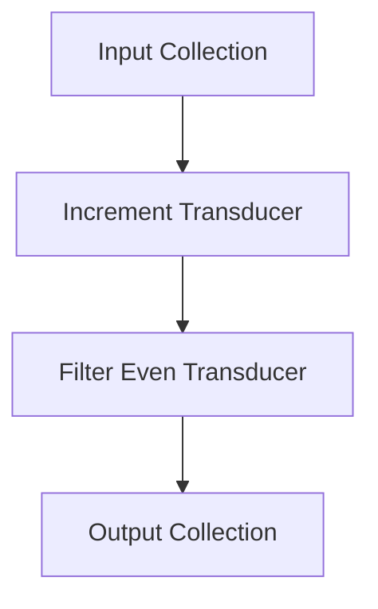

## 6.6 Introduction to Transducers

As experienced Java developers venturing into the world of Clojure, understanding transducers can significantly enhance your ability to build efficient and scalable applications. Transducers are a powerful feature in Clojure that allow for composable algorithmic transformations, independent of the context of their input and output. In this section, we will delve into what transducers are, their benefits over traditional sequence operations, how to create them, and how to effectively use them in your Clojure applications.

### What Are Transducers?

Transducers are a novel concept in Clojure that provide a way to compose transformations without being tied to a specific data structure. Unlike traditional sequence operations that operate on collections and produce intermediate collections, transducers abstract the transformation process, allowing you to apply them to any context that supports reduction.

#### Key Characteristics of Transducers:

- **Composable**: Transducers can be composed together to form complex transformations.
- **Context-Independent**: They are not bound to any specific input or output context, making them versatile.
- **Efficient**: By eliminating intermediate collections, transducers can improve performance, especially in large data processing tasks.

#### Example of Transducer Composition

To illustrate the concept of transducers, consider the following example where we compose a series of transformations:

```clojure
(defn increment [x] (inc x))
(defn even? [x] (zero? (mod x 2)))

(def transducer
  (comp
    (map increment)
    (filter even?)))

;; Applying the transducer to a collection
(transduce transducer conj [] [1 2 3 4 5])
;; => [2 4 6]
```

In this example, we define a transducer that increments each number and filters out the odd numbers. The `transduce` function applies this transducer to a collection, producing the result `[2 4 6]`.

### Benefits Over Sequences

Transducers offer several advantages over traditional sequence operations:

1. **Performance Optimization**: By eliminating intermediate collections, transducers reduce memory overhead and improve performance. This is particularly beneficial when processing large datasets.

2. **Flexibility**: Transducers can be applied to various contexts, such as collections, channels, or streams, without modification.

3. **Composability**: You can easily compose multiple transducers to create complex data processing pipelines.

#### Performance Comparison

Consider a scenario where you need to process a large list of numbers by incrementing each number and then filtering out the odd numbers. Using traditional sequence operations, you might write:

```clojure
(def numbers (range 1 1000000))

(def result
  (->> numbers
       (map inc)
       (filter even?)
       (into [])))
```

With transducers, the same operation can be performed without creating intermediate collections:

```clojure
(def result
  (transduce
    (comp (map inc) (filter even?))
    conj
    []
    numbers))
```

In this case, transducers provide a more efficient solution by directly reducing the input collection without creating intermediate results.

### Creating Transducers

Creating transducers in Clojure is straightforward. You can use existing functions like `map`, `filter`, and `take` to define transducers without involving collections.

#### Using `map` and `filter` as Transducers

The `map` and `filter` functions can be used to create transducers by simply omitting the collection argument:

```clojure
(def increment-transducer (map inc))
(def even-transducer (filter even?))
```

These transducers can be composed using the `comp` function:

```clojure
(def composed-transducer
  (comp increment-transducer even-transducer))
```

#### Creating Custom Transducers

You can also create custom transducers by defining a function that returns a transducer. Here's an example of a custom transducer that doubles each element:

```clojure
(defn double-transducer []
  (map #(* 2 %)))

;; Using the custom transducer
(transduce (double-transducer) conj [] [1 2 3 4])
;; => [2 4 6 8]
```

### Transducer Functions

Clojure provides several functions that work with transducers, including `transduce`, `sequence`, and `into`.

#### The `transduce` Function

The `transduce` function is used to apply a transducer to a collection, reducing it to a single value. It takes a transducer, a reducing function, an initial value, and a collection:

```clojure
(transduce transducer reducing-fn init-val coll)
```

Example:

```clojure
(transduce (comp (map inc) (filter even?)) conj [] [1 2 3 4 5])
;; => [2 4 6]
```

#### The `sequence` Function

The `sequence` function returns a lazy sequence of the results of applying a transducer to a collection. It is useful when you want to maintain laziness:

```clojure
(sequence (comp (map inc) (filter even?)) [1 2 3 4 5])
;; => (2 4 6)
```

#### The `into` Function

The `into` function can be used to apply a transducer and collect the results into a specified collection type:

```clojure
(into [] (comp (map inc) (filter even?)) [1 2 3 4 5])
;; => [2 4 6]
```

### Visualizing Transducers

To better understand how transducers work, let's visualize the flow of data through a transducer pipeline:



In this diagram, data flows from the input collection through the increment transducer, then through the filter even transducer, and finally into the output collection.

### Try It Yourself

Now that we've explored the basics of transducers, try modifying the examples to see how they behave with different transformations. For instance, create a transducer that squares each number and filters out numbers greater than 10.

### Knowledge Check

1. What is a transducer in Clojure?
2. How do transducers improve performance over traditional sequence operations?
3. How can you create a transducer using the `map` function?
4. What is the purpose of the `transduce` function?
5. How does the `sequence` function differ from `transduce`?

### Key Takeaways

- Transducers provide a powerful way to compose transformations without creating intermediate collections.
- They improve performance by reducing memory overhead and can be applied to various contexts.
- Clojure's `transduce`, `sequence`, and `into` functions allow you to work effectively with transducers.

### Further Reading

For more information on transducers, check out the [Official Clojure Documentation](https://clojure.org/reference/transducers) and [ClojureDocs](https://clojuredocs.org/).

---

## Quiz: Mastering Transducers in Clojure



### What is a transducer in Clojure?

- [x] A composable transformation independent of input and output context
- [ ] A function that operates only on lists
- [ ] A type of collection in Clojure
- [ ] A method for handling exceptions

> **Explanation:** Transducers are composable transformations that are independent of the context of their input and output, allowing for efficient data processing.

### How do transducers improve performance?

- [x] By eliminating intermediate collections
- [ ] By using more memory
- [ ] By increasing the number of operations
- [ ] By requiring more complex code

> **Explanation:** Transducers improve performance by eliminating the need for intermediate collections, reducing memory usage and processing time.

### Which function applies a transducer to a collection?

- [x] `transduce`
- [ ] `map`
- [ ] `filter`
- [ ] `reduce`

> **Explanation:** The `transduce` function is used to apply a transducer to a collection, reducing it to a single value.

### What does the `sequence` function return?

- [x] A lazy sequence of results
- [ ] An eager list of results
- [ ] A single reduced value
- [ ] A map of results

> **Explanation:** The `sequence` function returns a lazy sequence of results after applying a transducer to a collection.

### How can you create a transducer using `map`?

- [x] By omitting the collection argument
- [ ] By providing a collection argument
- [ ] By using a different function
- [ ] By defining a new data type

> **Explanation:** You can create a transducer using `map` by omitting the collection argument, which allows it to be composed with other transducers.

### What is the purpose of the `into` function with transducers?

- [x] To collect results into a specified collection type
- [ ] To create a new transducer
- [ ] To apply a transducer lazily
- [ ] To filter out unwanted elements

> **Explanation:** The `into` function is used to apply a transducer and collect the results into a specified collection type.

### Which of the following is a benefit of using transducers?

- [x] Improved performance
- [x] Composability
- [ ] Increased complexity
- [ ] Limited applicability

> **Explanation:** Transducers offer improved performance and composability, making them a powerful tool for data transformation.

### What does the `comp` function do with transducers?

- [x] Composes multiple transducers together
- [ ] Applies a transducer to a collection
- [ ] Filters elements from a collection
- [ ] Maps a function over a collection

> **Explanation:** The `comp` function is used to compose multiple transducers together, allowing for complex transformations.

### How do transducers differ from traditional sequence operations?

- [x] They are context-independent
- [x] They eliminate intermediate collections
- [ ] They require more memory
- [ ] They are slower

> **Explanation:** Transducers are context-independent and eliminate intermediate collections, providing a more efficient way to process data.

### True or False: Transducers can only be used with collections.

- [ ] True
- [x] False

> **Explanation:** False. Transducers can be applied to various contexts, such as collections, channels, or streams, making them versatile.


