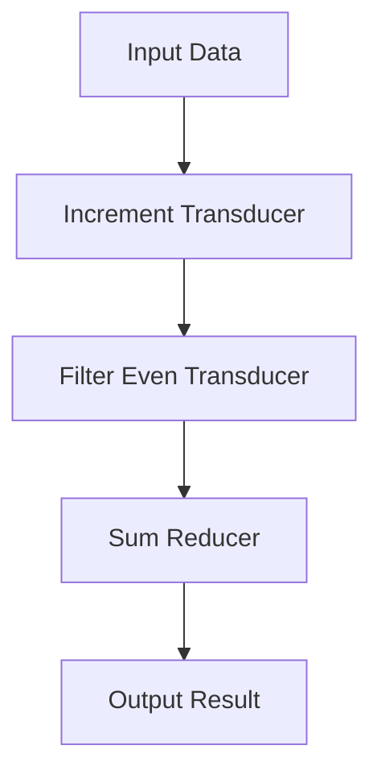

## 6.7 Composing Efficient Pipelines with Transducers

In this section, we delve into the world of transducers in Clojure, a powerful tool for building efficient data processing pipelines. Transducers offer a unique approach to transforming data, providing performance advantages over traditional methods like lazy sequences. As experienced Java developers, you'll appreciate the elegance and efficiency transducers bring to functional programming in Clojure.

### Building Transducer Pipelines

Transducers are composable and reusable transformations that can be applied to various data structures. They allow you to build pipelines that process data in a single pass, minimizing overhead and improving performance.

#### Understanding Transducers

A transducer is a function that takes a reducing function and returns a new reducing function. This new function can be applied to a collection to transform its elements. Transducers are independent of the context in which they are used, making them versatile and efficient.

Let's start with a simple example to illustrate the concept:

```clojure
(defn inc-transducer
  "A transducer that increments each element."
  [rf]
  (fn
    ([] (rf))
    ([result] (rf result))
    ([result input] (rf result (inc input)))))

(defn sum-reducer
  "A reducing function that sums elements."
  ([] 0)
  ([result] result)
  ([result input] (+ result input)))

;; Using the transducer with a collection
(transduce inc-transducer sum-reducer [1 2 3 4 5])
;; => 20
```

In this example, `inc-transducer` is a transducer that increments each element, and `sum-reducer` is a reducing function that sums elements. The `transduce` function applies the transducer to the collection `[1 2 3 4 5]`, resulting in a sum of 20.

#### Composing Transducers

One of the key strengths of transducers is their composability. You can combine multiple transducers to create complex data processing pipelines. Let's see how this works:

```clojure
(defn even-transducer
  "A transducer that filters even numbers."
  [rf]
  (fn
    ([] (rf))
    ([result] (rf result))
    ([result input] (if (even? input) (rf result input) result))))

;; Composing transducers
(def composed-transducer
  (comp inc-transducer even-transducer))

;; Using the composed transducer
(transduce composed-transducer sum-reducer [1 2 3 4 5])
;; => 12
```

Here, we define an `even-transducer` that filters even numbers. By composing `inc-transducer` and `even-transducer`, we create a pipeline that increments and filters even numbers before summing them.

### Performance Advantages

Transducers offer significant performance benefits by processing data in a single pass. This reduces the overhead associated with intermediate collections and lazy evaluation.

#### Single-Pass Processing

Unlike lazy sequences, which may require multiple passes over data, transducers perform transformations in a single pass. This is particularly advantageous when dealing with large datasets or real-time data streams.

Consider the following comparison:

```clojure
;; Using lazy sequences
(->> [1 2 3 4 5]
     (map inc)
     (filter even?)
     (reduce +))
;; => 12

;; Using transducers
(transduce (comp (map inc) (filter even?)) + [1 2 3 4 5])
;; => 12
```

Both approaches yield the same result, but the transducer pipeline processes the data more efficiently by avoiding the creation of intermediate collections.

#### Reduced Memory Footprint

Transducers also reduce memory usage by eliminating the need for intermediate collections. This is crucial when working with large datasets that cannot fit entirely in memory.

### Example Use Cases

Transducers are well-suited for various scenarios, including:

- **Processing Large Datasets**: Transducers can handle large datasets efficiently by minimizing memory usage and processing time.
- **Real-Time Data Streams**: In applications that require real-time data processing, transducers provide a performant solution by processing data in a single pass.
- **Data Transformation Pipelines**: Transducers enable the creation of complex data transformation pipelines that are both efficient and easy to compose.

Let's explore a practical example involving a large dataset:

```clojure
(defn process-large-dataset
  "Processes a large dataset using transducers."
  [dataset]
  (transduce
    (comp
      (map inc)
      (filter even?)
      (map #(* % 2)))
    conj
    []
    dataset))

;; Simulating a large dataset
(def large-dataset (range 1 1000000))

;; Processing the dataset
(process-large-dataset large-dataset)
```

In this example, we simulate a large dataset and process it using a transducer pipeline that increments, filters, and doubles even numbers. The use of transducers ensures efficient processing without excessive memory consumption.

### Comparison with Lazy Sequences

While both transducers and lazy sequences are used for data transformation, they have distinct differences in terms of performance and use cases.

#### Performance

- **Lazy Sequences**: Suitable for scenarios where deferred computation is beneficial. However, they may incur additional overhead due to multiple passes over data.
- **Transducers**: Ideal for scenarios requiring efficient, single-pass processing. They eliminate the need for intermediate collections, reducing memory usage and processing time.

#### Use Cases

- **Lazy Sequences**: Useful for deferred computation and infinite sequences. They allow for on-demand evaluation, which can be advantageous in certain contexts.
- **Transducers**: Best suited for finite data processing tasks where efficiency and performance are critical. They excel in scenarios involving large datasets or real-time data streams.

### Try It Yourself

To deepen your understanding of transducers, try modifying the code examples provided. Experiment with different transducers and reducing functions to see how they affect the output. Consider creating your own transducers to perform custom transformations.

### Visual Aids

To further illustrate the flow of data through transducers, let's use a diagram:



**Diagram Description**: This flowchart represents a transducer pipeline where input data is incremented, filtered for even numbers, and then summed to produce the output result.

### References and Links

For further reading on transducers and their applications, consider exploring the following resources:

- [Official Clojure Documentation on Transducers](https://clojure.org/reference/transducers)
- [ClojureDocs Transducers Examples](https://clojuredocs.org/clojure.core/transduce)
- [GitHub Repository on Transducers](https://github.com/cognitect-labs/transducers)

### Knowledge Check

To reinforce your understanding of transducers, consider the following questions:

- What are the key advantages of using transducers over lazy sequences?
- How do transducers improve performance in data processing pipelines?
- In what scenarios would you choose transducers over other data transformation techniques?

### Summary

In this section, we've explored the power of transducers in Clojure for building efficient data processing pipelines. Transducers offer performance advantages by processing data in a single pass, reducing memory usage and processing time. By understanding how to compose and apply transducers, you can create scalable and performant applications in Clojure.

Now that we've covered transducers, let's continue our journey into the world of Clojure by exploring recursion and recursive data structures in the next section.

## Quiz: Mastering Transducers in Clojure



### What is a transducer in Clojure?

- [x] A function that takes a reducing function and returns a new reducing function.
- [ ] A data structure for storing elements.
- [ ] A method for creating lazy sequences.
- [ ] A type of collection in Clojure.

> **Explanation:** A transducer is a function that takes a reducing function and returns a new reducing function, allowing for efficient data transformation.

### How do transducers improve performance?

- [x] By processing data in a single pass.
- [ ] By creating multiple intermediate collections.
- [ ] By deferring computation until needed.
- [ ] By using more memory.

> **Explanation:** Transducers improve performance by processing data in a single pass, reducing the need for intermediate collections and minimizing memory usage.

### In which scenario are transducers most beneficial?

- [x] Processing large datasets efficiently.
- [ ] Creating infinite sequences.
- [ ] Deferring computation.
- [ ] Storing data in memory.

> **Explanation:** Transducers are most beneficial when processing large datasets efficiently, as they minimize memory usage and processing time.

### What is the main difference between transducers and lazy sequences?

- [x] Transducers process data in a single pass, while lazy sequences may require multiple passes.
- [ ] Transducers create intermediate collections, while lazy sequences do not.
- [ ] Transducers are used for infinite sequences, while lazy sequences are not.
- [ ] Transducers are slower than lazy sequences.

> **Explanation:** The main difference is that transducers process data in a single pass, while lazy sequences may require multiple passes over data.

### Which function is used to apply a transducer to a collection?

- [x] `transduce`
- [ ] `map`
- [ ] `filter`
- [ ] `reduce`

> **Explanation:** The `transduce` function is used to apply a transducer to a collection, transforming its elements.

### What is the purpose of a reducing function in a transducer?

- [x] To accumulate results during data transformation.
- [ ] To create intermediate collections.
- [ ] To defer computation.
- [ ] To store data in memory.

> **Explanation:** A reducing function accumulates results during data transformation, allowing for efficient processing.

### How can transducers be composed?

- [x] Using the `comp` function.
- [ ] Using the `concat` function.
- [ ] Using the `merge` function.
- [ ] Using the `zip` function.

> **Explanation:** Transducers can be composed using the `comp` function, allowing for the creation of complex data processing pipelines.

### What is a key advantage of using transducers for real-time data streams?

- [x] They process data in a single pass, reducing latency.
- [ ] They create multiple intermediate collections.
- [ ] They defer computation until needed.
- [ ] They use more memory.

> **Explanation:** Transducers process data in a single pass, reducing latency and making them ideal for real-time data streams.

### What does the `map` transducer do?

- [x] Transforms each element in a collection.
- [ ] Filters elements from a collection.
- [ ] Reduces a collection to a single value.
- [ ] Creates a lazy sequence.

> **Explanation:** The `map` transducer transforms each element in a collection, applying a specified function.

### True or False: Transducers can be used with any collection type in Clojure.

- [x] True
- [ ] False

> **Explanation:** True. Transducers are independent of the collection type and can be used with any collection in Clojure.


