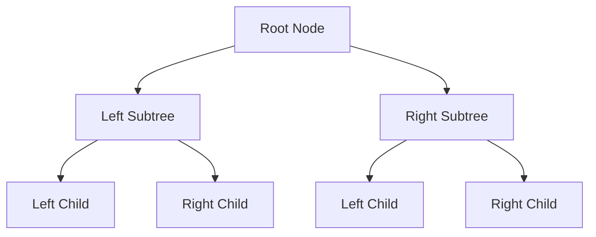

## 7.1 Fundamentals of Recursion

Recursion is a powerful concept in programming that allows us to solve complex problems by breaking them down into simpler, more manageable subproblems. In functional programming, recursion is often preferred over iteration due to its natural fit with immutable data structures and pure functions. In this section, we will explore the fundamentals of recursion, its components, and how it can be visualized and applied in Clojure. We will also compare it with Java's approach to recursion to help experienced Java developers transition smoothly into Clojure.

### Recursion Basics

**Define Recursion**: Recursion occurs when a function calls itself to solve a smaller instance of the same problem. This self-referential approach is particularly useful for problems that exhibit a repetitive structure, such as mathematical sequences, tree traversals, and divide-and-conquer algorithms.

**Role in Problem Solving**: Recursion is ideal for problems that can be decomposed into smaller, similar subproblems. It allows for elegant and concise solutions, especially in functional programming languages like Clojure, where recursion can replace traditional loops.

### Components of Recursive Functions

To effectively use recursion, it is crucial to understand its two main components: the base case and the recursive step.

#### Base Case

The base case is the condition under which the recursion stops. It prevents infinite recursion by providing a simple, non-recursive solution to the smallest instance of the problem. Without a base case, a recursive function would continue to call itself indefinitely, leading to a stack overflow error.

#### Recursive Step

The recursive step is where the function calls itself with a modified argument, moving closer to the base case. This step should ensure that each recursive call progresses towards the base case, eventually terminating the recursion.

### Visualizing Recursion

Understanding recursion can be challenging without a clear visualization of how recursive calls are made and resolved. Let's use a simple example to illustrate this concept.

#### Example: Factorial Function

The factorial of a number \\( n \\) (denoted as \\( n! \\)) is the product of all positive integers less than or equal to \\( n \\). The recursive definition of factorial is:

- Base case: \\( 0! = 1 \\)
- Recursive step: \\( n! = n \times (n-1)! \\)

Here is how you can implement the factorial function in Clojure:

```clojure
(defn factorial [n]
  (if (<= n 1)
    1
    (* n (factorial (dec n)))))
```

**Java Comparison**: In Java, the factorial function can be implemented similarly using recursion:

```java
public class Factorial {
    public static int factorial(int n) {
        if (n <= 1) {
            return 1;
        } else {
            return n * factorial(n - 1);
        }
    }
}
```

#### Call Stack Visualization

To better understand how recursion works, let's visualize the call stack for `factorial(3)`:

```mermaid
graph TD;
    A[factorial(3)] --> B[factorial(2)];
    B --> C[factorial(1)];
    C --> D[return 1];
    B --> E[return 2 * 1];
    A --> F[return 3 * 2];
```

**Explanation**: The call stack grows as each recursive call is made, and it shrinks as each call returns a result. The base case is reached when `factorial(1)` returns 1, and the results are then multiplied as the stack unwinds.

### Common Recursive Algorithms

Recursion is particularly well-suited for certain types of algorithms. Let's explore some common recursive algorithms and their implementations in Clojure.

#### Tree Traversals

Trees are hierarchical data structures that naturally lend themselves to recursive solutions. Common tree traversal algorithms include:

- **Pre-order Traversal**: Visit the root node, traverse the left subtree, then traverse the right subtree.
- **In-order Traversal**: Traverse the left subtree, visit the root node, then traverse the right subtree.
- **Post-order Traversal**: Traverse the left subtree, traverse the right subtree, then visit the root node.

**Clojure Implementation**: Let's implement a simple binary tree and perform an in-order traversal.

```clojure
(defn in-order-traversal [tree]
  (when tree
    (concat
      (in-order-traversal (:left tree))
      [(:value tree)]
      (in-order-traversal (:right tree)))))

(def sample-tree {:value 1
                  :left {:value 2
                         :left nil
                         :right nil}
                  :right {:value 3
                          :left nil
                          :right nil}})

(in-order-traversal sample-tree) ; => (2 1 3)
```

**Java Comparison**: In Java, tree traversal can be implemented using recursion as well:

```java
import java.util.ArrayList;
import java.util.List;

public class BinaryTree {
    static class Node {
        int value;
        Node left, right;

        Node(int value) {
            this.value = value;
            left = right = null;
        }
    }

    public List<Integer> inOrderTraversal(Node node) {
        List<Integer> result = new ArrayList<>();
        if (node != null) {
            result.addAll(inOrderTraversal(node.left));
            result.add(node.value);
            result.addAll(inOrderTraversal(node.right));
        }
        return result;
    }
}
```

### Try It Yourself

Now that we've explored the fundamentals of recursion, try modifying the examples above:

- **Factorial Function**: Implement a tail-recursive version of the factorial function in Clojure.
- **Tree Traversal**: Extend the tree traversal example to include pre-order and post-order traversals.

### Visual Aids

To further enhance your understanding of recursion, let's look at a diagram illustrating the recursive process for a binary tree traversal.



**Diagram Explanation**: This diagram shows the recursive nature of tree traversal, where each node's left and right children are recursively visited.

### References and Links

For further reading and deeper dives into recursion and functional programming in Clojure, consider the following resources:

- [Official Clojure Documentation](https://clojure.org/reference/documentation)
- [ClojureDocs](https://clojuredocs.org/)
- [Functional Programming in Clojure](https://github.com/functional-programming-in-clojure)

### Knowledge Check

To reinforce your understanding of recursion, consider the following questions:

- What is the role of the base case in a recursive function?
- How does the call stack behave during recursive function calls?
- Can you identify a problem that is not suitable for recursion?

### Encouraging Tone

Recursion can initially seem daunting, but with practice, it becomes a powerful tool in your programming arsenal. By understanding the fundamentals and experimenting with different recursive algorithms, you'll be well-equipped to tackle complex problems in Clojure. Let's continue to explore and master the art of recursion together!

### Summary

In this section, we explored the fundamentals of recursion, its components, and how to visualize recursive calls. We also discussed common recursive algorithms and provided examples in both Clojure and Java. By understanding these concepts, you can leverage recursion to solve complex problems efficiently in Clojure.

## Quiz: Mastering Recursion in Clojure



### What is the primary purpose of the base case in a recursive function?

- [x] To terminate the recursion
- [ ] To increase the recursion depth
- [ ] To handle exceptions
- [ ] To optimize performance

> **Explanation:** The base case provides a condition to terminate the recursion, preventing infinite loops.

### How does the call stack behave during recursive function calls?

- [x] It grows with each recursive call and shrinks as calls return
- [ ] It remains constant throughout the recursion
- [ ] It only grows and never shrinks
- [ ] It only shrinks and never grows

> **Explanation:** The call stack grows with each recursive call and shrinks as each call returns a result.

### Which of the following is a common use case for recursion?

- [x] Tree traversals
- [ ] Iterating over arrays
- [ ] Sorting algorithms
- [ ] String concatenation

> **Explanation:** Tree traversals are a common use case for recursion due to their hierarchical structure.

### In Clojure, what is the `recur` special form used for?

- [x] To perform tail recursion
- [ ] To define a new function
- [ ] To create a loop
- [ ] To handle exceptions

> **Explanation:** The `recur` special form is used to perform tail recursion in Clojure.

### What is the result of the following Clojure expression: `(factorial 3)`?

- [x] 6
- [ ] 3
- [ ] 9
- [ ] 1

> **Explanation:** The factorial of 3 is 6, calculated as 3 * 2 * 1.

### Which of the following is NOT a component of a recursive function?

- [x] Loop condition
- [ ] Base case
- [ ] Recursive step
- [ ] Function call

> **Explanation:** A loop condition is not a component of a recursive function; it is used in iterative loops.

### What is the primary advantage of using recursion in functional programming?

- [x] It aligns with immutable data structures and pure functions
- [ ] It simplifies exception handling
- [ ] It improves performance in all cases
- [ ] It reduces memory usage

> **Explanation:** Recursion aligns with immutable data structures and pure functions, making it a natural fit for functional programming.

### How can recursion be visualized effectively?

- [x] Using call stack diagrams
- [ ] Using flowcharts
- [ ] Using UML diagrams
- [ ] Using pie charts

> **Explanation:** Call stack diagrams effectively visualize the recursive process and function calls.

### What is a potential downside of recursion?

- [x] Stack overflow due to deep recursion
- [ ] Increased code readability
- [ ] Simplified logic
- [ ] Enhanced performance

> **Explanation:** Deep recursion can lead to stack overflow errors if not managed properly.

### True or False: Recursion is always more efficient than iteration.

- [ ] True
- [x] False

> **Explanation:** Recursion is not always more efficient than iteration; it depends on the problem and implementation.




