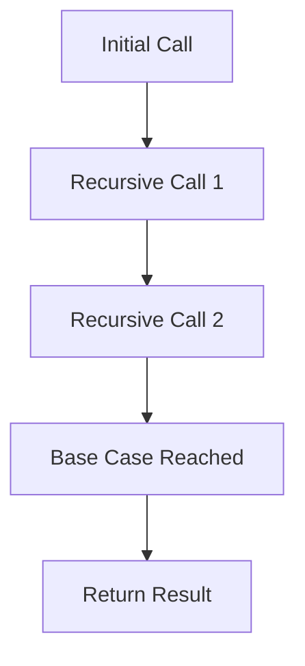

## 7.3 Tail Recursion and the `recur` Special Form

In this section, we delve into the concept of tail recursion and how Clojure's `recur` special form facilitates efficient recursive function calls. Understanding these concepts is crucial for building scalable applications in Clojure, especially for developers transitioning from Java who are accustomed to iterative loops.

### Tail Recursion Explained

Tail recursion is a specific form of recursion where the recursive call is the last operation in the function. This allows the language runtime to optimize the call, reusing the current function's stack frame instead of creating a new one. This optimization is known as tail call optimization (TCO).

#### Why Tail Recursion?

In traditional recursion, each function call adds a new frame to the call stack. This can lead to stack overflow errors for deep recursions. Tail recursion mitigates this by reusing the stack frame, making it possible to handle deep recursive calls without increasing the stack size.

**Java vs. Clojure:**

- **Java**: Java does not natively support tail call optimization, which can lead to stack overflow in deep recursive calls.
- **Clojure**: Clojure provides the `recur` special form to achieve tail recursion, allowing for efficient recursive operations.

### Using `recur`

The `recur` special form in Clojure is used to perform tail recursion. It allows a function to call itself without growing the call stack, as long as the recursive call is in the tail position.

#### How `recur` Works

- **Stack Frame Reuse**: `recur` reuses the current function's stack frame, preventing stack overflow.
- **Tail Position**: The recursive call must be the last operation in the function.

#### Rules for `recur`

1. **Tail Position**: The `recur` call must be in the tail position, meaning it is the last operation before the function returns.
2. **Arity Match**: The number of arguments passed to `recur` must match the function's parameters.
3. **Local or Loop**: `recur` can be used in a local function or within a `loop` construct.

### Examples

Let's explore how to convert a standard recursive function into a tail-recursive version using `recur`.

#### Example 1: Factorial Function

**Standard Recursive Version:**

```clojure
(defn factorial [n]
  (if (<= n 1)
    1
    (* n (factorial (dec n)))))
```

**Tail-Recursive Version Using `recur`:**

```clojure
(defn factorial [n]
  (letfn [(fact-helper [acc n]
            (if (<= n 1)
              acc
              (recur (* acc n) (dec n))))]
    (fact-helper 1 n)))
```

**Explanation:**

- **Standard Version**: Each call to `factorial` creates a new stack frame.
- **Tail-Recursive Version**: Uses an accumulator `acc` to carry the result, with `recur` in the tail position to optimize recursion.

#### Example 2: Fibonacci Sequence

**Standard Recursive Version:**

```clojure
(defn fibonacci [n]
  (if (<= n 1)
    n
    (+ (fibonacci (- n 1)) (fibonacci (- n 2)))))
```

**Tail-Recursive Version Using `recur`:**

```clojure
(defn fibonacci [n]
  (letfn [(fib-helper [a b n]
            (if (zero? n)
              a
              (recur b (+ a b) (dec n))))]
    (fib-helper 0 1 n)))
```

**Explanation:**

- **Standard Version**: Inefficient due to repeated calculations and stack growth.
- **Tail-Recursive Version**: Uses helper function `fib-helper` with `recur` to efficiently compute Fibonacci numbers.

### Visual Aids

To better understand the flow of tail recursion, consider the following diagram illustrating the recursive call stack for a tail-recursive function:



**Diagram Explanation:**

- **Initial Call**: The function is called with initial parameters.
- **Recursive Calls**: Each call reuses the stack frame, preventing stack growth.
- **Base Case**: Once reached, the function returns the result.

### Try It Yourself

Experiment with the provided examples by modifying the base case or the recursive logic. For instance, try changing the base case condition in the factorial function or the initial values in the Fibonacci sequence.

### Knowledge Check

- **Question**: What is the primary advantage of tail recursion?
- **Challenge**: Convert a recursive function that calculates the sum of a list into a tail-recursive version using `recur`.

### Summary

Tail recursion and the `recur` special form are powerful tools in Clojure for optimizing recursive calls. By ensuring the recursive call is in the tail position, we can build efficient and scalable applications without the risk of stack overflow. As you continue to explore Clojure, practice identifying opportunities to leverage tail recursion in your code.

### Further Reading

- [Official Clojure Documentation on recur](https://clojure.org/reference/special_forms#recur)
- [ClojureDocs: recur](https://clojuredocs.org/clojure.core/recur)
- [Functional Programming in Clojure](https://www.braveclojure.com/)

## Quiz: Mastering Tail Recursion and `recur` in Clojure



### What is tail recursion?

- [x] A form of recursion where the recursive call is the last operation in the function.
- [ ] A form of recursion that uses multiple stack frames.
- [ ] A form of recursion that does not require a base case.
- [ ] A form of recursion that is only used in Clojure.

> **Explanation:** Tail recursion is when the recursive call is the last operation, allowing for stack frame reuse.

### What does the `recur` special form do in Clojure?

- [x] It allows for tail recursion by reusing the current stack frame.
- [ ] It creates a new stack frame for each recursive call.
- [ ] It is used to define new functions.
- [ ] It is used to handle exceptions.

> **Explanation:** `recur` enables tail recursion by reusing the current stack frame, preventing stack overflow.

### What is a requirement for using `recur`?

- [x] The recursive call must be in the tail position.
- [ ] The function must have only one parameter.
- [ ] The function must return a list.
- [ ] The function must not have a base case.

> **Explanation:** `recur` requires the recursive call to be in the tail position to optimize recursion.

### How does tail recursion prevent stack overflow?

- [x] By reusing the current stack frame for recursive calls.
- [ ] By creating new stack frames for each call.
- [ ] By eliminating the need for a base case.
- [ ] By using more memory.

> **Explanation:** Tail recursion reuses the stack frame, preventing stack overflow in deep recursions.

### Which of the following is a tail-recursive version of a factorial function?

- [x] Using an accumulator and `recur` in the tail position.
- [ ] Using nested function calls without `recur`.
- [x] Using a helper function with `recur`.
- [ ] Using a loop without recursion.

> **Explanation:** Tail recursion involves using an accumulator and `recur` in the tail position, often with a helper function.

### Can `recur` be used outside of a function or loop?

- [ ] Yes, it can be used anywhere in Clojure code.
- [x] No, it must be used within a function or loop.
- [ ] Yes, but only in specific cases.
- [ ] No, it is only for defining functions.

> **Explanation:** `recur` must be used within a function or loop to enable tail recursion.

### What is the main difference between standard recursion and tail recursion?

- [x] Tail recursion reuses the stack frame, while standard recursion does not.
- [ ] Standard recursion is faster than tail recursion.
- [x] Tail recursion prevents stack overflow, while standard recursion can cause it.
- [ ] Standard recursion does not require a base case.

> **Explanation:** Tail recursion reuses the stack frame, preventing stack overflow, unlike standard recursion.

### What happens if `recur` is not in the tail position?

- [ ] The code will run faster.
- [x] It will result in a compile-time error.
- [ ] It will cause a stack overflow.
- [ ] It will have no effect on the code.

> **Explanation:** `recur` must be in the tail position; otherwise, it results in a compile-time error.

### How can you convert a standard recursive function to a tail-recursive one?

- [x] By using an accumulator and placing `recur` in the tail position.
- [ ] By removing the base case.
- [ ] By adding more parameters.
- [ ] By using nested function calls.

> **Explanation:** Converting to tail recursion involves using an accumulator and placing `recur` in the tail position.

### True or False: Tail recursion is only applicable in functional programming languages.

- [ ] True
- [x] False

> **Explanation:** Tail recursion can be applied in any language that supports it, not just functional languages.


