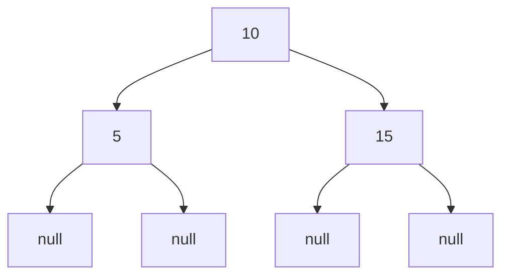

## 7.4 Working with Recursive Data Structures

In this section, we delve into the fascinating world of recursive data structures in Clojure. As experienced Java developers, you are likely familiar with data structures like linked lists and trees. In Clojure, these structures take on a new dimension, thanks to the language's functional nature and emphasis on immutability. Let's explore how recursive data structures are defined, traversed, and manipulated in Clojure, and how they can be applied to real-world problems such as parsing JSON or XML data.

### Understanding Recursive Structures

Recursive data structures are those that reference themselves in their definition. This self-referential nature allows them to represent complex, hierarchical data in a compact and flexible manner. Common examples include linked lists, trees, and graphs.

#### Linked Lists

In Java, a linked list is typically implemented using nodes that contain data and a reference to the next node. In Clojure, lists are inherently recursive and are a fundamental part of the language. Here's a simple example of a linked list in Java:

```java
class Node {
    int data;
    Node next;

    Node(int data) {
        this.data = data;
        this.next = null;
    }
}

class LinkedList {
    Node head;

    void add(int data) {
        if (head == null) {
            head = new Node(data);
        } else {
            Node current = head;
            while (current.next != null) {
                current = current.next;
            }
            current.next = new Node(data);
        }
    }
}
```

In Clojure, lists are built-in and can be created using the `list` function or the literal syntax:

```clojure
(def my-list '(1 2 3 4 5))
```

Clojure lists are immutable and persistent, meaning that operations on them return new lists rather than modifying the original.

#### Trees

Trees are another common recursive data structure. They consist of nodes, each of which may have zero or more child nodes. A binary tree, for example, is a tree where each node has at most two children.

In Java, a binary tree node might look like this:

```java
class TreeNode {
    int value;
    TreeNode left;
    TreeNode right;

    TreeNode(int value) {
        this.value = value;
        this.left = null;
        this.right = null;
    }
}
```

In Clojure, trees can be represented using nested maps or vectors. Here's an example of a simple binary tree:

```clojure
(def binary-tree
  {:value 10
   :left {:value 5
          :left nil
          :right nil}
   :right {:value 15
           :left nil
           :right nil}})
```

### Traversing Trees

Traversing a tree involves visiting each node in a specific order. Common traversal strategies include pre-order, in-order, and post-order traversal.

#### Pre-order Traversal

In pre-order traversal, the nodes are recursively visited in this order: root, left subtree, right subtree.

Here's how you might implement pre-order traversal in Clojure:

```clojure
(defn pre-order-traversal [tree]
  (when tree
    (println (:value tree))
    (pre-order-traversal (:left tree))
    (pre-order-traversal (:right tree))))

(pre-order-traversal binary-tree)
```

#### In-order Traversal

In in-order traversal, the nodes are visited in this order: left subtree, root, right subtree. This is particularly useful for binary search trees, as it visits nodes in ascending order.

```clojure
(defn in-order-traversal [tree]
  (when tree
    (in-order-traversal (:left tree))
    (println (:value tree))
    (in-order-traversal (:right tree))))

(in-order-traversal binary-tree)
```

#### Post-order Traversal

In post-order traversal, the nodes are visited in this order: left subtree, right subtree, root. This is useful for deleting a tree, as it ensures that child nodes are processed before their parent.

```clojure
(defn post-order-traversal [tree]
  (when tree
    (post-order-traversal (:left tree))
    (post-order-traversal (:right tree))
    (println (:value tree))))

(post-order-traversal binary-tree)
```

### Manipulating Nested Data

Clojure's immutable data structures make it particularly well-suited for manipulating deeply nested data. Let's explore how to work with nested maps and vectors.

#### Nested Maps

Nested maps are common in Clojure, especially when dealing with JSON or configuration data. Here's an example of a nested map:

```clojure
(def nested-map
  {:user {:name "Alice"
          :address {:city "Wonderland"
                    :zip 12345}}})
```

To access nested data, you can use the `get-in` function:

```clojure
(get-in nested-map [:user :address :city]) ; => "Wonderland"
```

To update nested data, use the `assoc-in` function:

```clojure
(def updated-map (assoc-in nested-map [:user :address :zip] 54321))
```

#### Nested Vectors

Nested vectors are useful for representing matrices or grids. Here's an example of a 2x2 matrix:

```clojure
(def matrix [[1 2]
             [3 4]])
```

You can access elements using the `get-in` function:

```clojure
(get-in matrix [1 0]) ; => 3
```

To update an element, use the `assoc-in` function:

```clojure
(def updated-matrix (assoc-in matrix [0 1] 5))
```

### Practical Applications

Recursive data structures are not just academic exercises; they have practical applications in many domains.

#### Parsing JSON

JSON data is inherently hierarchical and can be represented as nested maps and vectors in Clojure. Here's an example of parsing JSON data:

```clojure
(require '[cheshire.core :as json])

(def json-data "{\"user\": {\"name\": \"Alice\", \"age\": 30}}")

(def parsed-data (json/parse-string json-data true))

(get-in parsed-data [:user :name]) ; => "Alice"
```

#### Parsing XML

XML data can also be represented as nested structures. Here's an example using the `clojure.data.xml` library:

```clojure
(require '[clojure.data.xml :as xml])

(def xml-data "<user><name>Alice</name><age>30</age></user>")

(def parsed-xml (xml/parse-str xml-data))

(defn extract-xml-value [element]
  (first (:content element)))

(extract-xml-value (first (:content (first (:content parsed-xml))))) ; => "Alice"
```

### Visual Aids

To better understand how recursive data structures work, let's visualize a binary tree and its traversal.



**Caption:** This diagram represents a simple binary tree with root node 10, and child nodes 5 and 15.

### Knowledge Check

- **What is a recursive data structure?**
- **How do you perform pre-order traversal on a binary tree in Clojure?**
- **What functions are used to access and update nested data in Clojure?**

### Exercises

1. **Implement a function to calculate the depth of a binary tree.**
2. **Write a function to convert a nested map into a flat map.**
3. **Parse a complex JSON object and extract specific values using Clojure functions.**

### Summary

Recursive data structures are a powerful tool in Clojure, allowing you to represent and manipulate complex data hierarchies. By understanding how to traverse and modify these structures, you can tackle a wide range of real-world problems, from parsing data formats to building scalable applications. Now that we've explored recursive data structures, let's continue to deepen our understanding of recursion in Clojure.

## Quiz: Mastering Recursive Data Structures in Clojure



### What is a recursive data structure?

- [x] A data structure that references itself in its definition
- [ ] A data structure that is immutable
- [ ] A data structure that is only used in functional programming
- [ ] A data structure that cannot be traversed

> **Explanation:** Recursive data structures are those that reference themselves, allowing for complex, hierarchical representations.

### Which function is used for pre-order traversal in Clojure?

- [x] pre-order-traversal
- [ ] in-order-traversal
- [ ] post-order-traversal
- [ ] level-order-traversal

> **Explanation:** Pre-order traversal visits the root node first, followed by the left and right subtrees.

### How do you access nested data in a Clojure map?

- [x] Using the get-in function
- [ ] Using the assoc function
- [ ] Using the update function
- [ ] Using the map function

> **Explanation:** The `get-in` function is used to access nested data structures by specifying a path.

### What is the purpose of the assoc-in function?

- [x] To update nested data in a map
- [ ] To create a new map
- [ ] To remove data from a map
- [ ] To iterate over a map

> **Explanation:** The `assoc-in` function updates nested data structures by specifying a path and a new value.

### Which library is used for parsing JSON in Clojure?

- [x] cheshire.core
- [ ] clojure.data.json
- [ ] clojure.xml
- [ ] clojure.data.xml

> **Explanation:** The `cheshire.core` library is commonly used for parsing JSON data in Clojure.

### What is the result of in-order traversal on a binary search tree?

- [x] Nodes visited in ascending order
- [ ] Nodes visited in descending order
- [ ] Nodes visited in random order
- [ ] Nodes visited in pre-order

> **Explanation:** In-order traversal of a binary search tree visits nodes in ascending order.

### How can you represent a binary tree in Clojure?

- [x] Using nested maps
- [ ] Using arrays
- [ ] Using linked lists
- [ ] Using sets

> **Explanation:** Binary trees can be represented using nested maps in Clojure, with keys for value, left, and right.

### What is the advantage of using immutable data structures in Clojure?

- [x] They ensure thread safety and consistency
- [ ] They are faster than mutable data structures
- [ ] They use less memory
- [ ] They are easier to write

> **Explanation:** Immutable data structures in Clojure ensure thread safety and consistency, which is crucial for concurrent programming.

### Which function is used to parse XML data in Clojure?

- [x] clojure.data.xml/parse-str
- [ ] clojure.xml/parse
- [ ] clojure.data.json/parse
- [ ] cheshire.core/parse-string

> **Explanation:** The `clojure.data.xml/parse-str` function is used to parse XML data in Clojure.

### True or False: Recursive data structures can only be used in functional programming languages.

- [ ] True
- [x] False

> **Explanation:** Recursive data structures are not limited to functional programming languages; they are used in many programming paradigms.


