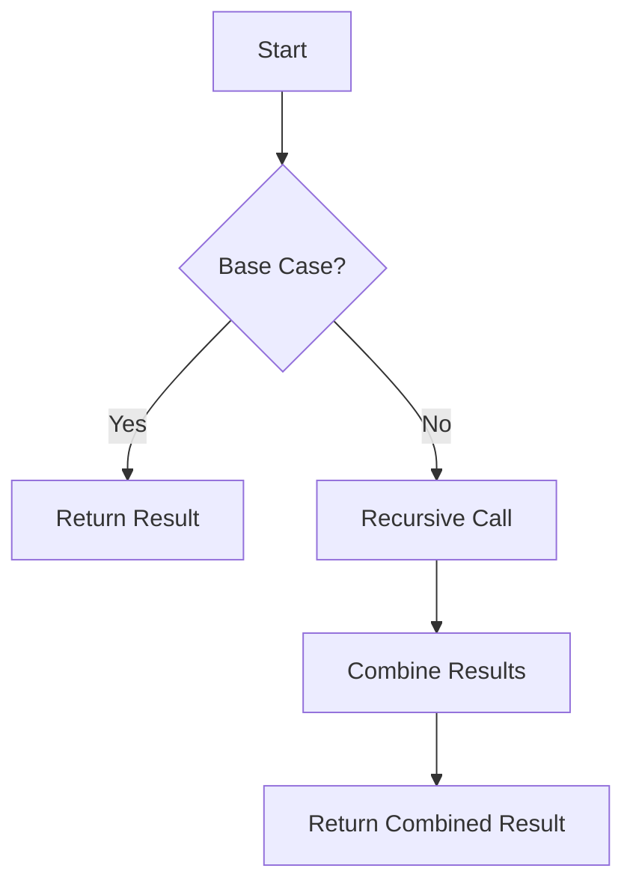

## 7.5 Optimizing Recursive Solutions

In this section, we delve into optimizing recursive solutions in Clojure, a critical aspect of mastering functional programming. Recursion is a powerful tool in functional programming, allowing us to solve problems by breaking them down into simpler sub-problems. However, recursive solutions can sometimes be inefficient, leading to performance bottlenecks. This guide will explore techniques to optimize recursive solutions, including memoization, iterative alternatives, and understanding the limits of tail call optimization in the JVM. We will also discuss performance profiling to identify and address inefficiencies.

### Eliminating Redundant Computations with Memoization

Memoization is a technique used to cache the results of expensive function calls and return the cached result when the same inputs occur again. This can significantly improve the performance of recursive functions, especially those that involve repeated calculations of the same values.

#### Understanding Memoization

Memoization stores the results of expensive function calls and reuses them when the same inputs occur again. This is particularly useful in recursive functions where the same computations are performed multiple times.

#### Implementing Memoization in Clojure

Clojure provides a built-in function `memoize` that can be used to memoize any function. Let's explore how to use `memoize` with a classic example: the Fibonacci sequence.

```clojure
(defn fib [n]
  (if (<= n 1)
    n
    (+ (fib (- n 1)) (fib (- n 2)))))

(def memoized-fib (memoize fib))

;; Usage
(memoized-fib 40) ; This will be much faster than calling fib directly
```

In the above example, `memoized-fib` caches the results of previous computations, reducing redundant calculations and improving performance.

#### Try It Yourself

Experiment with memoizing other recursive functions. Consider how memoization affects performance in functions with different characteristics, such as those with more complex recursive structures.

### Iterative Alternatives: When to Use Iteration

While recursion is elegant and often the preferred approach in functional programming, there are cases where an iterative solution may be more efficient. Iterative solutions can avoid the overhead of recursive calls and are sometimes easier to optimize.

#### Recognizing When to Use Iteration

Consider using iteration when:

- The recursive depth is large, leading to potential stack overflow.
- The problem can be naturally expressed as a loop.
- Performance profiling indicates recursion is a bottleneck.

#### Converting Recursion to Iteration

Let's convert a simple recursive function to an iterative one. Consider the factorial function:

Recursive version:

```clojure
(defn factorial [n]
  (if (<= n 1)
    1
    (* n (factorial (dec n)))))
```

Iterative version:

```clojure
(defn factorial-iter [n]
  (loop [acc 1, i n]
    (if (<= i 1)
      acc
      (recur (* acc i) (dec i)))))
```

In the iterative version, we use a `loop` and `recur` to maintain the state, avoiding the overhead of recursive calls.

#### Try It Yourself

Convert other recursive functions to iterative ones and compare their performance. Consider scenarios where iteration might be more appropriate than recursion.

### Tail Call Optimization Limits in the JVM

Tail call optimization (TCO) is a technique used by some languages to optimize recursive calls that are in the tail position, eliminating the need for additional stack frames. Unfortunately, the JVM does not support TCO natively, which can lead to stack overflow errors in deeply recursive functions.

#### Understanding Tail Call Optimization

In languages that support TCO, a function call in the tail position can be optimized to avoid adding a new stack frame. This allows recursive functions to run in constant stack space.

#### Using `recur` in Clojure

Clojure provides the `recur` special form to achieve a similar effect to TCO. `recur` allows you to perform a recursive call without growing the stack, but it must be used in a tail position.

Example of using `recur`:

```clojure
(defn sum [n acc]
  (if (zero? n)
    acc
    (recur (dec n) (+ acc n))))

(sum 1000000 0) ; This will not cause a stack overflow
```

In this example, `recur` is used to call `sum` without adding a new stack frame, allowing it to handle large inputs without stack overflow.

#### Try It Yourself

Practice using `recur` in your recursive functions. Identify functions where `recur` can prevent stack overflow and improve performance.

### Performance Profiling: Identifying Bottlenecks

Profiling is an essential step in optimizing recursive solutions. By identifying bottlenecks, you can focus your optimization efforts where they will have the most impact.

#### Tools for Profiling Clojure Code

Several tools can help you profile Clojure code:

- **VisualVM**: A visual tool for monitoring and profiling Java applications, including those running Clojure.
- **YourKit**: A commercial profiler with support for Java and Clojure.
- **Criterium**: A Clojure library for benchmarking code.

#### Profiling Recursive Functions

When profiling recursive functions, look for:

- High CPU usage: Indicates that the function is computationally expensive.
- High memory usage: May suggest excessive allocations or lack of tail call optimization.
- Long execution times: Identify functions that take longer than expected to complete.

#### Try It Yourself

Use a profiling tool to analyze a recursive function. Identify any bottlenecks and consider how memoization, iteration, or `recur` might address them.

### Visual Aids

To better understand these concepts, let's visualize the flow of a recursive function using a flowchart.



**Figure 1:** Flowchart of a Recursive Function

This flowchart illustrates the decision-making process in a recursive function, highlighting the base case and recursive call.

### Key Takeaways

- **Memoization** can significantly improve the performance of recursive functions by caching results.
- **Iterative solutions** may be more efficient than recursion in certain scenarios.
- **Tail call optimization** is not natively supported by the JVM, but `recur` can mitigate this limitation in Clojure.
- **Profiling** is crucial for identifying and addressing performance bottlenecks in recursive functions.

### Knowledge Check

Test your understanding of optimizing recursive solutions with the following quiz.

## Quiz: Optimizing Recursive Solutions in Clojure



### What is memoization used for in recursive functions?

- [x] Caching results of expensive function calls
- [ ] Increasing the recursion depth
- [ ] Simplifying the function logic
- [ ] Reducing memory usage

> **Explanation:** Memoization caches results of expensive function calls to avoid redundant computations.

### When should you consider using iteration instead of recursion?

- [x] When the recursive depth is large
- [ ] When the function is simple
- [ ] When the function has no base case
- [ ] When the function is tail-recursive

> **Explanation:** Iteration can be more efficient when the recursive depth is large, avoiding stack overflow.

### What is the purpose of the `recur` special form in Clojure?

- [x] To perform a recursive call without growing the stack
- [ ] To increase the recursion depth
- [ ] To simplify function logic
- [ ] To cache function results

> **Explanation:** `recur` allows recursive calls without adding a new stack frame, preventing stack overflow.

### Which tool can be used to profile Clojure code?

- [x] VisualVM
- [ ] Eclipse
- [ ] IntelliJ IDEA
- [ ] NetBeans

> **Explanation:** VisualVM is a tool for monitoring and profiling Java applications, including Clojure.

### What should you look for when profiling recursive functions?

- [x] High CPU usage
- [x] High memory usage
- [ ] Low recursion depth
- [ ] Simple function logic

> **Explanation:** High CPU and memory usage can indicate performance bottlenecks in recursive functions.

### What is a limitation of the JVM regarding recursion?

- [x] Lack of native tail call optimization
- [ ] Limited recursion depth
- [ ] High memory usage
- [ ] Slow execution speed

> **Explanation:** The JVM does not support tail call optimization natively, which can lead to stack overflow.

### How can `recur` help with recursion in Clojure?

- [x] By preventing stack overflow
- [ ] By caching function results
- [x] By allowing tail-recursive calls
- [ ] By simplifying function logic

> **Explanation:** `recur` allows tail-recursive calls without growing the stack, preventing stack overflow.

### What is the benefit of converting recursion to iteration?

- [x] Avoiding stack overflow
- [ ] Simplifying function logic
- [ ] Increasing recursion depth
- [ ] Reducing memory usage

> **Explanation:** Iteration can avoid stack overflow by not relying on the call stack.

### What does memoization help reduce in recursive functions?

- [x] Redundant computations
- [ ] Memory usage
- [ ] Function complexity
- [ ] Recursion depth

> **Explanation:** Memoization reduces redundant computations by caching results.

### True or False: The JVM supports tail call optimization natively.

- [ ] True
- [x] False

> **Explanation:** The JVM does not support tail call optimization natively, but Clojure's `recur` provides a workaround.



By mastering these optimization techniques, you can enhance the performance of your recursive solutions in Clojure, making your applications more efficient and scalable. Keep experimenting and profiling to discover the best approaches for your specific use cases.
