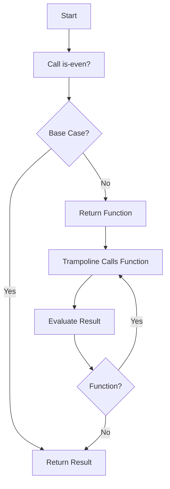

## 7.6 Mutual Recursion and Trampolining

In this section, we delve into the concepts of mutual recursion and trampolining in Clojure. These techniques are essential for managing recursive function calls efficiently, especially when dealing with complex recursive relationships and stack growth issues. As experienced Java developers, you'll appreciate how Clojure's approach to recursion can simplify and optimize your code.

### Understanding Mutual Recursion

**Mutual recursion** occurs when two or more functions call each other in a recursive manner. This is a common pattern in functional programming, where the solution to a problem is divided into smaller, interdependent sub-problems. In mutual recursion, each function relies on the other to complete its task.

#### Example of Mutual Recursion

Let's consider a classic example of mutual recursion: determining whether a number is even or odd. We can define two functions, `is-even?` and `is-odd?`, that call each other recursively:

```clojure
(defn is-even? [n]
  (cond
    (= n 0) true
    (= n 1) false
    :else (is-odd? (dec n))))

(defn is-odd? [n]
  (cond
    (= n 0) false
    (= n 1) true
    :else (is-even? (dec n))))
```

In this example, `is-even?` calls `is-odd?` and vice versa. This mutual recursion continues until the base case is reached.

### Challenges with Mutual Recursion

While mutual recursion is a powerful technique, it poses challenges, particularly in languages running on the Java Virtual Machine (JVM). The primary issue is **stack growth**. Each recursive call consumes stack space, and deep recursion can lead to a `StackOverflowError`.

#### Stack Growth Problem

In Java, recursion is limited by the stack size. Each recursive call adds a new frame to the call stack, and excessive recursion can exhaust the stack space. This is particularly problematic in mutual recursion, where multiple functions are involved in the recursive process.

### Introducing Trampolining

Clojure provides a solution to the stack growth problem through a technique called **trampolining**. Trampolining allows recursive functions to execute without growing the stack, enabling them to handle deep recursion efficiently.

#### How Trampolining Works

The `trampoline` function in Clojure is used to repeatedly call a function until it returns a non-function value. This is achieved by returning a function from each recursive call, which is then invoked by the trampoline.

#### Implementing Trampolining

Let's modify our mutual recursion example to use trampolining:

```clojure
(defn is-even? [n]
  (cond
    (= n 0) true
    (= n 1) false
    :else #(is-odd? (dec n))))

(defn is-odd? [n]
  (cond
    (= n 0) false
    (= n 1) true
    :else #(is-even? (dec n))))

(defn trampoline-even? [n]
  (trampoline is-even? n))

(defn trampoline-odd? [n]
  (trampoline is-odd? n))
```

In this implementation, each recursive call returns a function (using the `#()` shorthand for anonymous functions) instead of directly calling the other function. The `trampoline` function then repeatedly invokes these functions until a non-function value is returned.

### Benefits of Trampolining

Trampolining offers several advantages:

- **Stack Safety**: By avoiding direct recursive calls, trampolining prevents stack overflow, allowing for deep recursion.
- **Efficiency**: Trampolining can improve performance by reducing the overhead associated with stack management.
- **Flexibility**: It enables complex recursive relationships to be expressed cleanly and efficiently.

### Comparing Java and Clojure

In Java, managing recursion often involves iterative solutions or complex stack management techniques. Clojure's trampolining provides a more elegant and functional approach, leveraging the language's strengths in handling recursion.

#### Java Example

Consider a Java implementation of the even/odd check using iteration:

```java
public class EvenOdd {
    public static boolean isEven(int n) {
        while (n > 1) {
            n -= 2;
        }
        return n == 0;
    }

    public static boolean isOdd(int n) {
        return !isEven(n);
    }
}
```

While this iterative solution avoids stack overflow, it lacks the elegance and expressiveness of the functional approach in Clojure.

### Try It Yourself

Experiment with the Clojure code examples by modifying the base cases or adding additional conditions. Observe how trampolining handles deep recursion without stack overflow.

### Visualizing Trampolining

To better understand trampolining, let's visualize the process using a flowchart:



**Figure 1**: Trampolining Process Flowchart

### Knowledge Check

- What is mutual recursion, and how does it differ from regular recursion?
- How does trampolining prevent stack overflow in recursive functions?
- Why is trampolining particularly useful in Clojure compared to Java?

### Exercises

1. Implement a mutual recursion example using trampolining to calculate the Fibonacci sequence.
2. Modify the even/odd example to handle negative numbers.
3. Explore the performance differences between trampolining and direct recursion in Clojure.

### Key Takeaways

- Mutual recursion involves two or more functions calling each other recursively.
- Trampolining in Clojure allows for efficient recursion without stack growth.
- Clojure's functional approach to recursion offers advantages over traditional iterative solutions in Java.

### Further Reading

- [Official Clojure Documentation on Trampolining](https://clojure.org/reference/trampoline)
- [ClojureDocs: Trampoline Function](https://clojuredocs.org/clojure.core/trampoline)
- [Functional Programming in Clojure](https://www.braveclojure.com/)

By mastering mutual recursion and trampolining, you can write more efficient and scalable Clojure applications. Embrace these techniques to enhance your functional programming skills and optimize your code for performance and reliability.

## Quiz: Mastering Mutual Recursion and Trampolining in Clojure



### What is mutual recursion?

- [x] When two or more functions call each other recursively.
- [ ] When a single function calls itself recursively.
- [ ] When functions are called in a loop.
- [ ] When functions are called in parallel.

> **Explanation:** Mutual recursion involves two or more functions calling each other recursively, creating a cycle of function calls.

### What problem does trampolining solve in Clojure?

- [x] Stack overflow due to deep recursion.
- [ ] Memory leaks in recursive functions.
- [ ] Infinite loops in iterative functions.
- [ ] Syntax errors in recursive functions.

> **Explanation:** Trampolining prevents stack overflow by managing recursive calls without growing the stack, allowing for deep recursion.

### How does trampolining work in Clojure?

- [x] By returning functions from recursive calls and using `trampoline` to execute them.
- [ ] By converting recursive calls into iterative loops.
- [ ] By using threads to manage recursive calls.
- [ ] By optimizing the JVM stack size.

> **Explanation:** Trampolining involves returning functions from recursive calls, which are then executed by the `trampoline` function until a non-function value is returned.

### What is a key advantage of trampolining over direct recursion?

- [x] It prevents stack overflow in deep recursion.
- [ ] It simplifies the syntax of recursive functions.
- [ ] It increases the speed of recursive functions.
- [ ] It reduces the memory usage of recursive functions.

> **Explanation:** Trampolining prevents stack overflow by avoiding direct recursive calls, making it suitable for deep recursion.

### Which of the following is a mutual recursion example?

- [x] Two functions calling each other recursively.
- [ ] A single function calling itself recursively.
- [ ] A loop iterating over a list.
- [ ] A function calling another function once.

> **Explanation:** Mutual recursion involves two or more functions calling each other recursively.

### What is the role of the `trampoline` function in Clojure?

- [x] To repeatedly call a function until it returns a non-function value.
- [ ] To convert recursive functions into iterative loops.
- [ ] To manage memory allocation for recursive functions.
- [ ] To optimize the performance of recursive functions.

> **Explanation:** The `trampoline` function repeatedly calls a function until it returns a non-function value, enabling efficient recursion.

### How can trampolining improve performance?

- [x] By reducing the overhead associated with stack management.
- [ ] By increasing the speed of function execution.
- [ ] By optimizing memory usage in recursive functions.
- [ ] By simplifying the syntax of recursive functions.

> **Explanation:** Trampolining reduces the overhead associated with stack management, improving performance in recursive functions.

### What is a common challenge with mutual recursion on the JVM?

- [x] Stack growth leading to `StackOverflowError`.
- [ ] Memory leaks in recursive functions.
- [ ] Infinite loops in iterative functions.
- [ ] Syntax errors in recursive functions.

> **Explanation:** Mutual recursion can lead to stack growth and `StackOverflowError` on the JVM due to the limited stack size.

### How does Clojure's approach to recursion differ from Java's?

- [x] Clojure uses trampolining to manage recursion without stack growth.
- [ ] Clojure uses iterative loops instead of recursion.
- [ ] Clojure relies on threads to manage recursive calls.
- [ ] Clojure optimizes the JVM stack size for recursion.

> **Explanation:** Clojure uses trampolining to manage recursion without stack growth, offering a more efficient approach than traditional iterative solutions in Java.

### True or False: Trampolining is only useful for mutual recursion.

- [ ] True
- [x] False

> **Explanation:** Trampolining is useful for any recursive function that may lead to stack overflow, not just mutual recursion.


