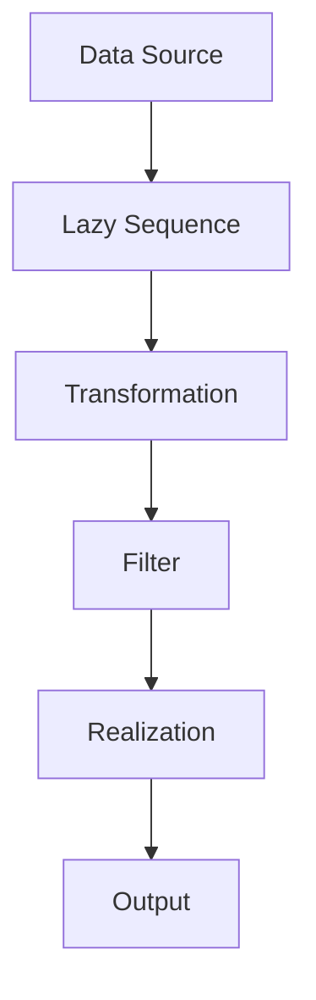

## 8.1 Introduction to Lazy Evaluation

In this section, we delve into the concept of lazy evaluation, a fundamental aspect of Clojure's approach to functional programming. As experienced Java developers, you may be familiar with eager evaluation, where expressions are computed as soon as they are bound to a variable. In contrast, lazy evaluation defers computation until the result is actually needed. This strategy can lead to significant performance improvements, especially when dealing with large or infinite data structures.

### Lazy Evaluation Concept

Lazy evaluation is a strategy that delays the computation of an expression until its value is required. This can be particularly beneficial in scenarios where not all elements of a data structure are needed immediately, or where the computation is expensive and should be avoided unless necessary.

#### Benefits of Laziness

1. **Improved Performance**: By avoiding unnecessary calculations, lazy evaluation can enhance performance, especially in large datasets.
2. **Memory Efficiency**: Laziness allows for the handling of potentially infinite data structures without consuming excessive memory.
3. **Modular Code**: Lazy evaluation enables more modular code, as it allows for the separation of data generation and data processing.
4. **Responsive Programs**: Programs can remain responsive by deferring heavy computations until absolutely necessary.

### Clojure's Approach to Lazy Evaluation

Clojure, as a functional language, embraces lazy evaluation primarily through its sequence abstraction. Sequences in Clojure are lazy by default, meaning that operations on sequences do not compute their results immediately. Instead, they produce a sequence of computations that are executed only when needed.

#### Lazy Sequences in Clojure

Clojure provides a rich set of functions for working with sequences, such as `map`, `filter`, and `reduce`. These functions are designed to work lazily, allowing you to build complex data processing pipelines without incurring the cost of immediate computation.

```clojure
;; Example of a lazy sequence in Clojure
(defn lazy-numbers []
  (println "Generating numbers")
  (range 1 1000000))

(def numbers (lazy-numbers))

;; Only when we actually use the sequence, the numbers are generated
(take 5 numbers)
;; Output: Generating numbers
;; => (1 2 3 4 5)
```

In the example above, the `range` function generates a lazy sequence of numbers. The `println` statement is executed only when the sequence is realized by the `take` function.

#### Comparing with Java

In Java, streams introduced in Java 8 provide a similar concept of laziness. Streams are sequences of elements supporting sequential and parallel aggregate operations. However, unlike Clojure's sequences, Java streams are single-use and must be re-created if you need to traverse them again.

```java
// Java example using streams
import java.util.stream.IntStream;

public class LazyEvaluationExample {
    public static void main(String[] args) {
        IntStream numbers = IntStream.range(1, 1000000)
            .peek(n -> System.out.println("Generating number: " + n))
            .limit(5);

        numbers.forEach(System.out::println);
    }
}
```

In this Java example, the `peek` method is used to demonstrate the lazy nature of streams, similar to Clojure's sequences. The numbers are generated only when the `forEach` terminal operation is called.

### Real-World Implications

Lazy evaluation can lead to more efficient and responsive programs. Consider a scenario where you need to process a large dataset but only require a small subset of the data. With lazy evaluation, you can avoid processing the entire dataset upfront, saving both time and resources.

#### Use Cases for Lazy Evaluation

1. **Data Processing Pipelines**: When processing large logs or datasets, laziness allows you to filter and transform data without loading everything into memory.
2. **Infinite Data Structures**: Lazy evaluation is essential for working with infinite sequences, such as generating Fibonacci numbers or prime numbers.
3. **Conditional Computations**: Laziness can defer expensive computations until a condition is met, optimizing performance.

### Visualizing Lazy Evaluation

To better understand how lazy evaluation works in Clojure, let's visualize the flow of data through a lazy sequence pipeline.



**Diagram Description**: This flowchart illustrates how data flows through a lazy sequence pipeline in Clojure. Data is sourced and passed through a series of transformations and filters, but only realized when needed, leading to the final output.

### Try It Yourself

Experiment with the following Clojure code to see lazy evaluation in action:

```clojure
(defn infinite-sequence []
  (iterate inc 0))

(def infinite-numbers (infinite-sequence))

;; Try taking different numbers of elements from the infinite sequence
(take 10 infinite-numbers)
```

**Challenge**: Modify the code to filter out even numbers from the infinite sequence before taking the first 10 elements.

### Knowledge Check

- What is lazy evaluation, and how does it differ from eager evaluation?
- How does Clojure implement lazy evaluation in its sequence processing?
- What are the benefits of using lazy evaluation in functional programming?
- Can you identify a scenario where lazy evaluation would be particularly beneficial?

### Summary

Lazy evaluation is a powerful concept in Clojure that allows for efficient and scalable data processing. By deferring computation until necessary, Clojure enables developers to work with large or infinite data structures without incurring unnecessary performance costs. As you continue to explore Clojure, consider how lazy evaluation can be leveraged to optimize your applications.

## Quiz: Mastering Lazy Evaluation in Clojure



### What is lazy evaluation?

- [x] A strategy that delays computation until the value is needed
- [ ] A method of eagerly computing all values in advance
- [ ] A technique for parallel processing
- [ ] A way to optimize memory usage by pre-computing results

> **Explanation:** Lazy evaluation defers computation until the result is actually required, which can improve performance and memory efficiency.

### How does Clojure implement lazy evaluation?

- [x] Through lazy sequences
- [ ] By using eager evaluation in all functions
- [ ] By pre-computing all possible values
- [ ] By using Java streams

> **Explanation:** Clojure uses lazy sequences to implement lazy evaluation, allowing computations to be deferred until necessary.

### Which of the following is a benefit of lazy evaluation?

- [x] Improved performance with large datasets
- [ ] Increased memory usage
- [ ] Immediate computation of all values
- [ ] Reduced code readability

> **Explanation:** Lazy evaluation can improve performance by avoiding unnecessary computations, especially with large datasets.

### What happens when a lazy sequence is realized in Clojure?

- [x] The computations are executed
- [ ] The sequence is discarded
- [ ] The sequence is converted to a Java stream
- [ ] The sequence remains unevaluated

> **Explanation:** When a lazy sequence is realized, the deferred computations are executed to produce the needed values.

### How can lazy evaluation be beneficial in real-world applications?

- [x] By deferring expensive computations until necessary
- [ ] By eagerly computing all possible outcomes
- [x] By handling infinite data structures efficiently
- [ ] By reducing the need for data transformation

> **Explanation:** Lazy evaluation defers computations and can handle infinite data structures efficiently, optimizing performance.

### What is a key difference between Java streams and Clojure's lazy sequences?

- [x] Java streams are single-use, while Clojure's lazy sequences can be reused
- [ ] Java streams are always eager
- [ ] Clojure's lazy sequences are always finite
- [ ] Java streams do not support parallel processing

> **Explanation:** Java streams are single-use, meaning they must be recreated for each traversal, unlike Clojure's reusable lazy sequences.

### Which function in Clojure can create an infinite lazy sequence?

- [x] `iterate`
- [ ] `map`
- [ ] `filter`
- [ ] `reduce`

> **Explanation:** The `iterate` function can create an infinite lazy sequence by repeatedly applying a function.

### What is the role of the `take` function in lazy evaluation?

- [x] It realizes a specified number of elements from a lazy sequence
- [ ] It discards elements from a sequence
- [ ] It converts a lazy sequence to a Java stream
- [ ] It eagerly computes all elements in a sequence

> **Explanation:** The `take` function realizes a specified number of elements from a lazy sequence, triggering computation.

### Why is lazy evaluation important in functional programming?

- [x] It allows for efficient data processing
- [ ] It increases the complexity of code
- [ ] It requires more memory usage
- [ ] It eliminates the need for functions

> **Explanation:** Lazy evaluation allows for efficient data processing by deferring computations until necessary.

### True or False: Lazy evaluation can lead to more responsive programs.

- [x] True
- [ ] False

> **Explanation:** Lazy evaluation can lead to more responsive programs by deferring heavy computations until they are needed.


