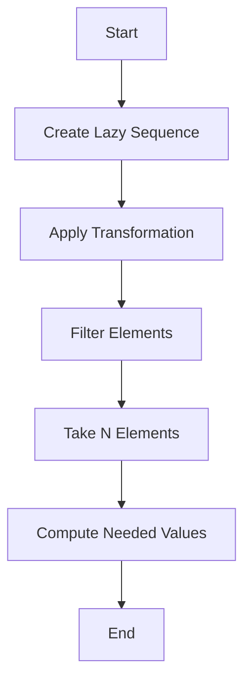

## 8.2 Creating and Using Lazy Sequences

Lazy sequences are a powerful feature in Clojure that allow for efficient data processing by deferring computation until the results are actually needed. This concept is particularly useful in functional programming, where immutability and composability are key. In this section, we will explore how to create and use lazy sequences in Clojure, leveraging your existing Java knowledge to ease the transition.

### Built-In Lazy Sequences

Clojure provides several built-in functions that produce lazy sequences. These functions are designed to handle potentially infinite data structures without consuming excessive memory. Let's explore some of these functions:

#### `range`

The `range` function generates a lazy sequence of numbers. It can be used with or without arguments to specify the start, end, and step values.

```clojure
;; Infinite sequence of numbers starting from 0
(def infinite-numbers (range))

;; Finite sequence from 0 to 9
(def finite-numbers (range 10))

;; Sequence from 5 to 14
(def custom-range (range 5 15))

;; Sequence from 0 to 20 with a step of 5
(def stepped-range (range 0 21 5))

;; Print the first 10 numbers from the infinite sequence
(println (take 10 infinite-numbers))
```

In Java, generating a similar sequence would typically involve loops or streams, which can be less intuitive and more verbose.

#### `iterate`

The `iterate` function creates an infinite lazy sequence by repeatedly applying a function to an initial value.

```clojure
;; Infinite sequence of powers of 2
(def powers-of-2 (iterate #(* 2 %) 1))

;; Print the first 10 powers of 2
(println (take 10 powers-of-2))
```

In Java, you might use a loop or a recursive method to achieve this, but Clojure's `iterate` provides a more concise and expressive way to define such sequences.

#### `repeatedly`

The `repeatedly` function generates a lazy sequence by repeatedly calling a function. This is useful for creating sequences of random numbers or other repeated computations.

```clojure
;; Infinite sequence of random numbers
(def random-numbers (repeatedly #(rand-int 100)))

;; Print the first 10 random numbers
(println (take 10 random-numbers))
```

In Java, generating a sequence of random numbers would typically involve a loop, but `repeatedly` offers a more functional approach.

### Custom Lazy Sequences

While Clojure provides many built-in lazy sequence functions, you can also create custom lazy sequences using the `lazy-seq` macro. This macro allows you to define sequences that compute their elements on demand.

#### Using `lazy-seq`

The `lazy-seq` macro is used to create custom lazy sequences. It defers the computation of the sequence elements until they are needed.

```clojure
;; Custom lazy sequence of Fibonacci numbers
(defn fibonacci
  ([] (fibonacci 0 1))
  ([a b] (lazy-seq (cons a (fibonacci b (+ a b))))))

;; Print the first 10 Fibonacci numbers
(println (take 10 (fibonacci)))
```

In this example, the `fibonacci` function generates an infinite sequence of Fibonacci numbers. The `lazy-seq` macro ensures that each element is computed only when required, making it efficient even for large sequences.

### Working with Lazy Collections

Lazy sequences in Clojure can be manipulated using the same core functions that work with regular collections. This includes functions like `map`, `filter`, and `reduce`.

#### Example: Filtering a Lazy Sequence

```clojure
;; Infinite sequence of natural numbers
(def naturals (range 1 Long/MAX_VALUE))

;; Filter even numbers from the sequence
(def even-naturals (filter even? naturals))

;; Print the first 10 even numbers
(println (take 10 even-naturals))
```

In this example, `filter` is used to create a lazy sequence of even numbers. The computation is deferred until the sequence is consumed, allowing for efficient processing of potentially infinite data.

### Delayed Computation

One of the key benefits of lazy sequences is delayed computation. Operations on lazy sequences are not performed until the values are actually needed. This can lead to significant performance improvements, especially when dealing with large or infinite datasets.

#### Example: Delayed Computation

```clojure
;; Define a function with side effects
(defn side-effect [x]
  (println "Computing:" x)
  x)

;; Create a lazy sequence with side effects
(def lazy-seq-with-side-effects (map side-effect (range 5)))

;; Only the first two elements are computed
(println (take 2 lazy-seq-with-side-effects))
```

In this example, the `side-effect` function prints a message each time it is called. The lazy sequence `lazy-seq-with-side-effects` only computes the elements that are actually needed, demonstrating the power of delayed computation.

### Visualizing Lazy Sequences

To better understand how lazy sequences work, let's visualize the flow of data through a lazy sequence using a diagram.



**Diagram Description:** This flowchart illustrates the process of creating and consuming a lazy sequence in Clojure. The sequence is created, transformations are applied, elements are filtered, and only the needed values are computed when taken.

### Try It Yourself

Experiment with the code examples provided by modifying them to suit your needs. For instance, try creating a lazy sequence of prime numbers or use `lazy-seq` to generate a custom sequence of your choice.

### Knowledge Check

Let's reinforce what we've learned with some questions and exercises.

- What are the benefits of using lazy sequences in Clojure?
- How does `lazy-seq` differ from regular sequence functions?
- Create a lazy sequence that generates the squares of natural numbers.
- Modify the `fibonacci` function to start from different initial values.

### Summary

Lazy sequences in Clojure offer a powerful way to handle large or infinite datasets efficiently. By deferring computation until necessary, they enable the creation of expressive and performant functional programs. As you continue to explore Clojure, consider how lazy sequences can simplify your data processing tasks and improve the scalability of your applications.

## Quiz: Mastering Lazy Sequences in Clojure



### What is a key benefit of using lazy sequences in Clojure?

- [x] Deferred computation
- [ ] Immediate computation
- [ ] Increased memory usage
- [ ] Reduced code readability

> **Explanation:** Lazy sequences defer computation until the values are needed, which can improve performance and reduce memory usage.

### Which Clojure function generates an infinite sequence by repeatedly applying a function?

- [ ] range
- [x] iterate
- [ ] filter
- [ ] map

> **Explanation:** The `iterate` function creates an infinite lazy sequence by repeatedly applying a function to an initial value.

### How can you create a custom lazy sequence in Clojure?

- [ ] Using the `range` function
- [ ] Using the `map` function
- [x] Using the `lazy-seq` macro
- [ ] Using the `filter` function

> **Explanation:** The `lazy-seq` macro is used to create custom lazy sequences in Clojure.

### What does the `repeatedly` function do in Clojure?

- [x] Generates a lazy sequence by repeatedly calling a function
- [ ] Generates a finite sequence of numbers
- [ ] Filters elements from a sequence
- [ ] Reduces a sequence to a single value

> **Explanation:** The `repeatedly` function generates a lazy sequence by repeatedly calling a provided function.

### Which of the following is a built-in lazy sequence function in Clojure?

- [x] range
- [ ] println
- [ ] def
- [ ] let

> **Explanation:** The `range` function is a built-in lazy sequence function in Clojure that generates a sequence of numbers.

### What is the purpose of the `lazy-seq` macro?

- [x] To create custom lazy sequences
- [ ] To immediately evaluate expressions
- [ ] To define functions
- [ ] To filter sequences

> **Explanation:** The `lazy-seq` macro is used to create custom lazy sequences that defer computation until needed.

### How does Clojure handle potentially infinite data structures?

- [x] Using lazy sequences
- [ ] Using loops
- [ ] Using immediate computation
- [ ] Using mutable data structures

> **Explanation:** Clojure uses lazy sequences to handle potentially infinite data structures efficiently.

### Which function would you use to generate a sequence of random numbers in Clojure?

- [ ] range
- [ ] iterate
- [x] repeatedly
- [ ] filter

> **Explanation:** The `repeatedly` function is used to generate a sequence of random numbers by repeatedly calling a function.

### What happens when you apply transformations to a lazy sequence?

- [x] The transformations are deferred until the sequence is consumed
- [ ] The transformations are applied immediately
- [ ] The sequence is converted to a list
- [ ] The sequence is evaluated eagerly

> **Explanation:** Transformations on a lazy sequence are deferred until the sequence is consumed, allowing for efficient processing.

### True or False: Lazy sequences in Clojure are computed immediately.

- [ ] True
- [x] False

> **Explanation:** Lazy sequences in Clojure are not computed immediately; they are computed only when the values are needed.



By understanding and utilizing lazy sequences, you can write more efficient and scalable Clojure applications. Keep experimenting with different lazy sequence functions and explore how they can enhance your functional programming skills.
