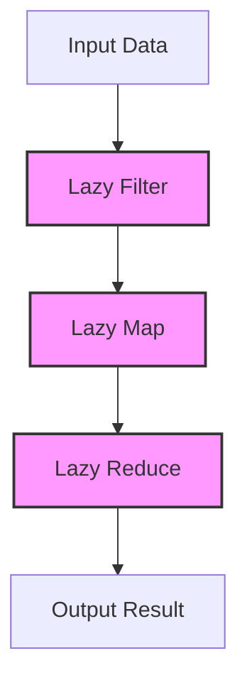

## 8.3 Benefits of Laziness in Processing Data

Lazy evaluation is a powerful concept in functional programming, and Clojure leverages it to provide significant advantages in data processing. As experienced Java developers, you're likely familiar with eager evaluation, where expressions are evaluated as soon as they are bound to a variable. In contrast, lazy evaluation delays computation until the result is actually needed. This approach can lead to more efficient memory usage, improved composability, and the ability to work with infinite data structures. Let's delve into these benefits and see how they can be harnessed in Clojure.

### Memory Efficiency

One of the most compelling benefits of lazy evaluation is its ability to handle large datasets efficiently. In Java, processing large collections often requires loading the entire dataset into memory, which can be resource-intensive and sometimes infeasible. Clojure's lazy sequences, however, allow you to process data incrementally, loading only the necessary elements into memory.

#### Example: Processing a Large File

Consider a scenario where you need to process a large log file. In Java, you might read the entire file into a list, which could consume a significant amount of memory. In Clojure, you can use lazy sequences to read and process the file line by line, minimizing memory usage.

```clojure
;; Clojure code to process a large file lazily
(defn process-log-file [file-path]
  (with-open [reader (clojure.java.io/reader file-path)]
    (doseq [line (line-seq reader)]
      ;; Process each line
      (println line))))
```

In this example, `line-seq` creates a lazy sequence of lines from the file, ensuring that only one line is loaded into memory at a time. This approach is particularly beneficial when working with files that are too large to fit into memory.

#### Java Comparison

In Java, you might use a `BufferedReader` to achieve similar functionality, but the concept of laziness is not as inherent or seamless as in Clojure.

```java
// Java code to process a large file
try (BufferedReader br = new BufferedReader(new FileReader("largefile.txt"))) {
    String line;
    while ((line = br.readLine()) != null) {
        // Process each line
        System.out.println(line);
    }
}
```

While Java's `BufferedReader` provides a way to read files line by line, Clojure's lazy sequences offer a more idiomatic and flexible approach to handling large datasets.

### Composability

Lazy evaluation enhances composability by allowing you to chain multiple transformations without executing them immediately. This means you can build complex data processing pipelines that are evaluated only when the final result is needed.

#### Example: Composing Transformations

Let's say you have a collection of numbers, and you want to filter out even numbers, square the remaining numbers, and then sum them. In Clojure, you can compose these transformations using lazy sequences.

```clojure
;; Clojure code to compose transformations lazily
(def numbers (range 1 1000000))

(defn process-numbers [nums]
  (->> nums
       (filter odd?)
       (map #(* % %))
       (reduce +)))

(println (process-numbers numbers))
```

In this example, `filter`, `map`, and `reduce` are chained together, but the actual computation is deferred until `reduce` is called. This lazy composition allows for efficient data processing, as only the necessary elements are computed.

#### Java Comparison

In Java, you might use streams to achieve similar composability, but the syntax and approach differ.

```java
// Java code to compose transformations using streams
List<Integer> numbers = IntStream.range(1, 1000000).boxed().collect(Collectors.toList());

int result = numbers.stream()
                    .filter(n -> n % 2 != 0)
                    .map(n -> n * n)
                    .reduce(0, Integer::sum);

System.out.println(result);
```

Java streams provide a way to compose transformations, but Clojure's lazy sequences offer a more natural and concise syntax for functional composition.

### Infinite Data Structures

Lazy evaluation in Clojure enables the use of infinite sequences, which can be particularly useful in scenarios where you need to generate or process data without a predefined limit.

#### Example: Generating Fibonacci Numbers

Consider generating an infinite sequence of Fibonacci numbers. In Clojure, you can define this sequence lazily, allowing you to compute as many numbers as needed without predefining the sequence length.

```clojure
;; Clojure code to generate an infinite sequence of Fibonacci numbers
(defn fib-seq
  ([] (fib-seq 0 1))
  ([a b] (lazy-seq (cons a (fib-seq b (+ a b))))))

(take 10 (fib-seq)) ;; Output: (0 1 1 2 3 5 8 13 21 34)
```

In this example, `fib-seq` is a lazy sequence that generates Fibonacci numbers on demand. The `take` function is used to retrieve the first 10 numbers, demonstrating how infinite sequences can be managed efficiently.

#### Java Comparison

In Java, creating an infinite sequence requires more boilerplate code and is less intuitive.

```java
// Java code to generate Fibonacci numbers using an iterator
Iterator<Integer> fibIterator = new Iterator<>() {
    private int a = 0, b = 1;

    @Override
    public boolean hasNext() {
        return true; // Infinite sequence
    }

    @Override
    public Integer next() {
        int result = a;
        int next = a + b;
        a = b;
        b = next;
        return result;
    }
};

List<Integer> fibNumbers = new ArrayList<>();
for (int i = 0; i < 10; i++) {
    fibNumbers.add(fibIterator.next());
}

System.out.println(fibNumbers);
```

While Java can achieve similar functionality with iterators, Clojure's lazy sequences provide a more elegant and concise solution.

### Performance Gains

Lazy evaluation can lead to significant performance improvements by avoiding unnecessary computations. This is particularly beneficial in scenarios where only a subset of data is required, or when computations are expensive.

#### Example: Conditional Processing

Suppose you have a large dataset, and you want to find the first element that satisfies a certain condition. With lazy evaluation, you can stop processing as soon as the condition is met, avoiding unnecessary computations.

```clojure
;; Clojure code to find the first element satisfying a condition
(defn find-first-even [nums]
  (first (filter even? nums)))

(println (find-first-even (range 1 1000000))) ;; Output: 2
```

In this example, `filter` creates a lazy sequence, and `first` retrieves the first even number, stopping further processing once the condition is met.

#### Java Comparison

In Java, achieving similar performance gains requires careful use of streams and short-circuiting operations.

```java
// Java code to find the first even number using streams
Optional<Integer> firstEven = IntStream.range(1, 1000000)
                                       .filter(n -> n % 2 == 0)
                                       .findFirst();

firstEven.ifPresent(System.out::println);
```

While Java streams offer short-circuiting operations, Clojure's lazy sequences provide a more straightforward approach to achieving performance gains through laziness.

### Visualizing Lazy Evaluation

To better understand how lazy evaluation works in Clojure, let's visualize the flow of data through a series of transformations using a diagram.



**Diagram Description:** This flowchart illustrates how data flows through a series of lazy transformations in Clojure. Each transformation (filter, map, reduce) is applied lazily, meaning that data is processed only as needed, resulting in efficient memory and CPU usage.

### Key Takeaways

- **Memory Efficiency:** Lazy sequences allow for processing large datasets without loading all data into memory, reducing resource consumption.
- **Composability:** Laziness enables the composition of data transformations, allowing for flexible and efficient data processing pipelines.
- **Infinite Data Structures:** Lazy evaluation supports the creation and manipulation of infinite sequences, providing powerful tools for data generation and processing.
- **Performance Gains:** By avoiding unnecessary computations, lazy evaluation can lead to significant performance improvements in data processing tasks.

### Knowledge Check

Let's reinforce your understanding of lazy evaluation in Clojure with a few questions and exercises.

1. **What is lazy evaluation, and how does it differ from eager evaluation?**
2. **How can lazy sequences improve memory efficiency when processing large datasets?**
3. **Describe a scenario where lazy evaluation could lead to performance gains.**
4. **Try modifying the Fibonacci sequence example to generate the first 20 numbers.**

### Encouragement and Next Steps

Now that we've explored the benefits of laziness in processing data with Clojure, you're well-equipped to leverage these concepts in your applications. Experiment with lazy sequences in your projects, and see how they can improve performance and efficiency. Remember, the power of laziness lies in its ability to defer computation until it's truly needed, allowing you to build scalable and efficient applications.

For further reading, consider exploring the [Official Clojure Documentation on Lazy Sequences](https://clojure.org/reference/sequences) and [ClojureDocs](https://clojuredocs.org/), where you'll find additional examples and insights into lazy evaluation.

## Quiz: Mastering Lazy Evaluation in Clojure



### What is the primary advantage of lazy evaluation in Clojure?

- [x] It allows for processing large datasets without loading all data into memory.
- [ ] It speeds up the execution of all functions.
- [ ] It simplifies the syntax of Clojure code.
- [ ] It automatically parallelizes computations.

> **Explanation:** Lazy evaluation allows for processing large datasets without loading all data into memory, which is a key advantage in terms of memory efficiency.

### How does lazy evaluation enhance composability in Clojure?

- [x] By allowing transformations to be composed without immediate computation.
- [ ] By automatically optimizing composed functions.
- [ ] By simplifying the syntax of composed functions.
- [ ] By enabling parallel execution of composed functions.

> **Explanation:** Lazy evaluation enhances composability by allowing transformations to be composed without immediate computation, enabling flexible and efficient data processing pipelines.

### What is a benefit of using infinite sequences in Clojure?

- [x] They allow for computations without a predefined limit.
- [ ] They automatically optimize memory usage.
- [ ] They simplify the syntax of sequence operations.
- [ ] They enable parallel execution of sequence operations.

> **Explanation:** Infinite sequences allow for computations without a predefined limit, providing powerful tools for data generation and processing.

### In what scenario can lazy evaluation lead to performance gains?

- [x] When only a subset of data is required, avoiding unnecessary computations.
- [ ] When all data needs to be processed simultaneously.
- [ ] When computations are inexpensive.
- [ ] When data is stored in a database.

> **Explanation:** Lazy evaluation can lead to performance gains when only a subset of data is required, avoiding unnecessary computations.

### How does Clojure's lazy evaluation compare to Java's eager evaluation?

- [x] Clojure defers computation until results are needed, while Java evaluates immediately.
- [ ] Clojure evaluates immediately, while Java defers computation.
- [ ] Both Clojure and Java evaluate immediately.
- [ ] Both Clojure and Java defer computation.

> **Explanation:** Clojure defers computation until results are needed, while Java typically evaluates immediately, highlighting a key difference between lazy and eager evaluation.

### What function is used to create a lazy sequence in Clojure?

- [x] `lazy-seq`
- [ ] `eager-seq`
- [ ] `lazy-list`
- [ ] `deferred-seq`

> **Explanation:** The `lazy-seq` function is used to create a lazy sequence in Clojure, enabling deferred computation.

### Which of the following is a characteristic of lazy sequences?

- [x] They are computed only when needed.
- [ ] They are always computed immediately.
- [ ] They require explicit memory management.
- [ ] They automatically parallelize computations.

> **Explanation:** Lazy sequences are computed only when needed, which is a defining characteristic of lazy evaluation.

### How can lazy sequences improve memory efficiency?

- [x] By loading only necessary elements into memory.
- [ ] By preloading all data into memory.
- [ ] By compressing data in memory.
- [ ] By automatically managing memory allocation.

> **Explanation:** Lazy sequences improve memory efficiency by loading only necessary elements into memory, reducing resource consumption.

### What is a potential drawback of lazy evaluation?

- [x] It can lead to unexpected performance issues if not managed properly.
- [ ] It always results in slower execution.
- [ ] It requires more memory than eager evaluation.
- [ ] It simplifies all computations.

> **Explanation:** Lazy evaluation can lead to unexpected performance issues if not managed properly, as deferred computations may accumulate and execute at inopportune times.

### True or False: Lazy evaluation is always the best choice for all data processing tasks.

- [ ] True
- [x] False

> **Explanation:** False. While lazy evaluation offers many benefits, it is not always the best choice for all data processing tasks. The decision to use lazy evaluation should be based on the specific requirements and constraints of the task at hand.



---
