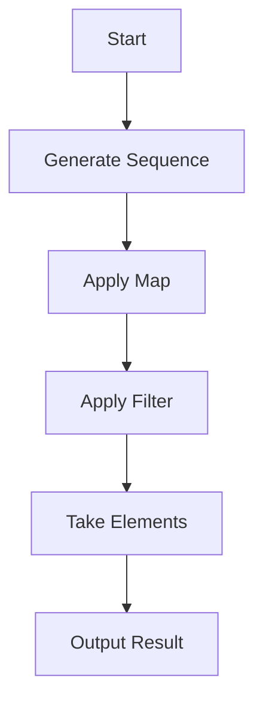

## 8.4 Core Lazy Sequence Functions

Lazy sequences are a cornerstone of functional programming in Clojure, enabling efficient data processing by deferring computation until necessary. This approach is particularly beneficial when dealing with large datasets or potentially infinite sequences. In this section, we will delve into the core lazy sequence functions in Clojure, exploring their usage and benefits.

### Mapping and Filtering

In Clojure, `map` and `filter` are fundamental functions that operate lazily, allowing you to process large or infinite collections without consuming excessive memory.

#### Map

The `map` function applies a given function to each element of a sequence, producing a new lazy sequence of results. This is akin to Java's `Stream.map` method but with the added benefit of laziness.

```clojure
;; Example of using map in Clojure
(def numbers (range 1 10))
(def squares (map #(* % %) numbers))

;; squares is a lazy sequence of squared numbers
(println (take 5 squares)) ;; Output: (1 4 9 16 25)
```

In Java, you might achieve similar functionality using streams:

```java
// Java equivalent using streams
List<Integer> numbers = IntStream.range(1, 10).boxed().collect(Collectors.toList());
List<Integer> squares = numbers.stream().map(n -> n * n).collect(Collectors.toList());

System.out.println(squares.subList(0, 5)); // Output: [1, 4, 9, 16, 25]
```

#### Filter

The `filter` function creates a lazy sequence of elements that satisfy a predicate function. This is similar to Java's `Stream.filter`.

```clojure
;; Example of using filter in Clojure
(def even-numbers (filter even? numbers))

;; even-numbers is a lazy sequence of even numbers
(println (take 5 even-numbers)) ;; Output: (2 4 6 8)
```

In Java, filtering can be done as follows:

```java
// Java equivalent using streams
List<Integer> evenNumbers = numbers.stream().filter(n -> n % 2 == 0).collect(Collectors.toList());

System.out.println(evenNumbers.subList(0, 4)); // Output: [2, 4, 6, 8]
```

### Sequence Generation

Clojure provides several functions to generate sequences lazily, which can be particularly useful for creating infinite sequences or repeating patterns.

#### Iterate

The `iterate` function generates an infinite lazy sequence by repeatedly applying a function to an initial value.

```clojure
;; Example of using iterate in Clojure
(def powers-of-two (iterate #(* 2 %) 1))

;; Take the first 5 powers of two
(println (take 5 powers-of-two)) ;; Output: (1 2 4 8 16)
```

#### Repeat

The `repeat` function creates a lazy sequence of a given value, repeated indefinitely or a specified number of times.

```clojure
;; Example of using repeat in Clojure
(def repeated-hello (repeat 3 "Hello"))

(println repeated-hello) ;; Output: ("Hello" "Hello" "Hello")
```

#### Cycle

The `cycle` function produces an infinite lazy sequence by repeating a given sequence.

```clojure
;; Example of using cycle in Clojure
(def cycling-abc (cycle ["A" "B" "C"]))

;; Take the first 6 elements of the cycle
(println (take 6 cycling-abc)) ;; Output: ("A" "B" "C" "A" "B" "C")
```

### Subsequence Operations

Subsequence operations allow you to lazily take or drop elements from a sequence based on certain conditions.

#### Take and Drop

The `take` function returns a lazy sequence of the first n elements, while `drop` skips the first n elements.

```clojure
;; Example of using take and drop in Clojure
(def numbers (range 1 10))
(def first-three (take 3 numbers))
(def after-three (drop 3 numbers))

(println first-three) ;; Output: (1 2 3)
(println after-three) ;; Output: (4 5 6 7 8 9)
```

#### Take-while and Drop-while

The `take-while` function returns a lazy sequence of elements from the start of the sequence that satisfy a predicate, while `drop-while` skips elements until the predicate fails.

```clojure
;; Example of using take-while and drop-while in Clojure
(def less-than-five (take-while #(< % 5) numbers))
(def from-five (drop-while #(< % 5) numbers))

(println less-than-five) ;; Output: (1 2 3 4)
(println from-five) ;; Output: (5 6 7 8 9)
```

### Combining Sequences

Clojure provides functions to merge or concatenate sequences, allowing for flexible sequence manipulation.

#### Concat

The `concat` function combines multiple sequences into a single lazy sequence.

```clojure
;; Example of using concat in Clojure
(def combined (concat [1 2 3] [4 5 6] [7 8 9]))

(println combined) ;; Output: (1 2 3 4 5 6 7 8 9)
```

#### Interleave

The `interleave` function merges sequences by alternating elements from each sequence.

```clojure
;; Example of using interleave in Clojure
(def interleaved (interleave [1 2 3] ["A" "B" "C"]))

(println interleaved) ;; Output: (1 "A" 2 "B" 3 "C")
```

### Visualizing Lazy Sequences

To better understand how lazy sequences work, let's visualize the flow of data through a series of operations using a flowchart.



**Figure 1:** Flow of data through lazy sequence operations.

### Try It Yourself

Experiment with the following code snippets to deepen your understanding of lazy sequences:

1. Modify the `map` example to cube each number instead of squaring it.
2. Use `filter` to create a sequence of numbers greater than 5.
3. Generate an infinite sequence of Fibonacci numbers using `iterate`.
4. Create a lazy sequence that cycles through the days of the week.

### Knowledge Check

To reinforce your understanding of lazy sequences, consider the following questions:

- How does lazy evaluation benefit memory usage when processing large datasets?
- What is the difference between `take` and `take-while`?
- How can you create an infinite sequence in Clojure?

### Summary

Lazy sequences in Clojure provide a powerful mechanism for handling large or infinite datasets efficiently. By leveraging functions like `map`, `filter`, `iterate`, and `concat`, you can build complex data processing pipelines that are both memory-efficient and expressive.

### Further Reading

For more information on lazy sequences and functional programming in Clojure, consider exploring the following resources:

- [Official Clojure Documentation](https://clojure.org/reference/sequences)
- [ClojureDocs](https://clojuredocs.org/)
- [Functional Programming in Clojure](https://www.braveclojure.com/)

## Quiz: Mastering Lazy Sequences in Clojure



### What is a key benefit of lazy sequences in Clojure?

- [x] Efficient memory usage
- [ ] Faster execution time
- [ ] Easier debugging
- [ ] Improved security

> **Explanation:** Lazy sequences allow for efficient memory usage by deferring computation until necessary, which is particularly useful for large datasets.

### Which function would you use to create an infinite sequence in Clojure?

- [x] `iterate`
- [ ] `map`
- [ ] `filter`
- [ ] `take`

> **Explanation:** The `iterate` function can generate an infinite sequence by repeatedly applying a function to an initial value.

### How does `filter` differ from `map` in Clojure?

- [x] `filter` selects elements based on a predicate, while `map` transforms each element.
- [ ] `filter` transforms each element, while `map` selects elements based on a predicate.
- [ ] Both `filter` and `map` transform elements.
- [ ] Both `filter` and `map` select elements based on a predicate.

> **Explanation:** `filter` creates a sequence of elements that satisfy a predicate, whereas `map` applies a function to each element to transform it.

### What does the `take` function do in Clojure?

- [x] Returns a lazy sequence of the first n elements
- [ ] Skips the first n elements
- [ ] Returns elements that satisfy a predicate
- [ ] Combines multiple sequences

> **Explanation:** The `take` function returns a lazy sequence containing the first n elements of a sequence.

### Which function would you use to combine two sequences in Clojure?

- [x] `concat`
- [ ] `interleave`
- [ ] `map`
- [ ] `filter`

> **Explanation:** The `concat` function combines multiple sequences into a single lazy sequence.

### What is the purpose of the `cycle` function in Clojure?

- [x] To create an infinite lazy sequence by repeating a given sequence
- [ ] To apply a function repeatedly to an initial value
- [ ] To filter elements based on a predicate
- [ ] To transform each element of a sequence

> **Explanation:** The `cycle` function produces an infinite lazy sequence by repeating the elements of a given sequence.

### How does `drop-while` differ from `drop` in Clojure?

- [x] `drop-while` skips elements until a predicate fails, while `drop` skips a fixed number of elements.
- [ ] `drop-while` skips a fixed number of elements, while `drop` skips elements until a predicate fails.
- [ ] Both `drop-while` and `drop` skip elements until a predicate fails.
- [ ] Both `drop-while` and `drop` skip a fixed number of elements.

> **Explanation:** `drop-while` skips elements as long as they satisfy a predicate, while `drop` skips a specified number of elements.

### What does the `interleave` function do in Clojure?

- [x] Merges sequences by alternating elements from each sequence
- [ ] Combines multiple sequences into one
- [ ] Filters elements based on a predicate
- [ ] Transforms each element of a sequence

> **Explanation:** The `interleave` function merges sequences by alternating elements from each sequence, creating a new sequence.

### Which function would you use to generate a sequence of repeated values?

- [x] `repeat`
- [ ] `cycle`
- [ ] `iterate`
- [ ] `map`

> **Explanation:** The `repeat` function creates a lazy sequence of a given value, repeated indefinitely or a specified number of times.

### True or False: Lazy sequences in Clojure are evaluated immediately.

- [ ] True
- [x] False

> **Explanation:** Lazy sequences in Clojure are not evaluated immediately; they are computed on demand, which allows for efficient memory usage.


