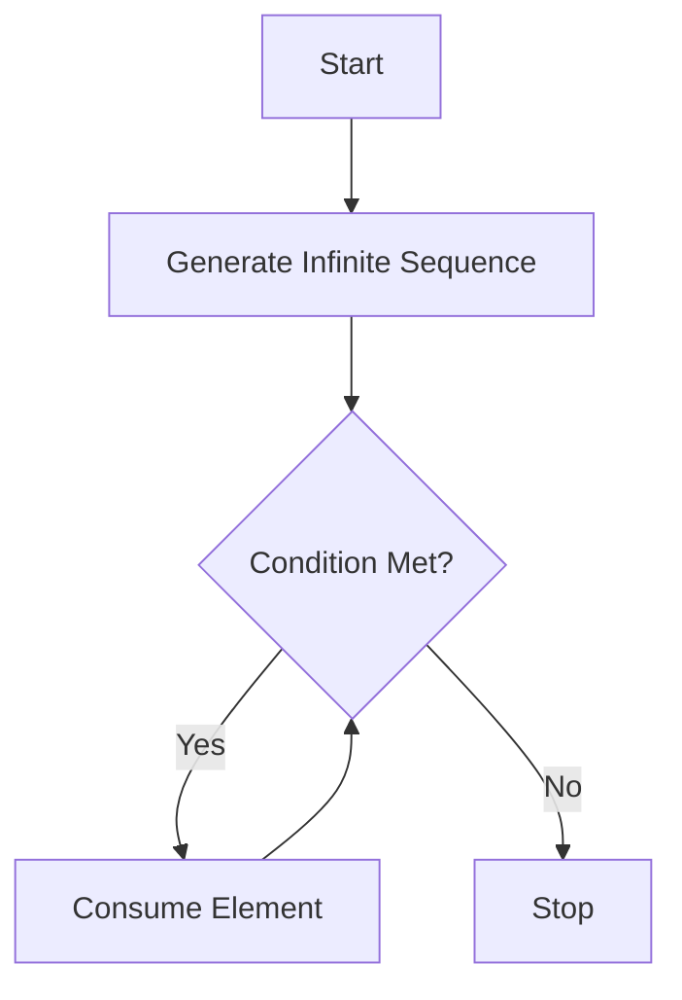

## 8.5 Working with Infinite Sequences

In the realm of functional programming, infinite sequences are a powerful concept that allows developers to handle potentially unbounded data streams efficiently. Clojure, with its emphasis on immutability and laziness, provides robust tools for working with infinite sequences. This section will guide you through generating infinite sequences, safely consuming them, and applying them in practical scenarios. We'll also explore how laziness in Clojure enables complex control flow without explicit loops.

### Generating Infinite Sequences

Infinite sequences in Clojure are made possible through lazy evaluation. This means that elements of the sequence are computed only as needed, allowing you to define sequences that could, in theory, extend indefinitely without consuming infinite memory.

#### Example: Infinite Sequence of Natural Numbers

Let's start with a simple example: generating an infinite sequence of natural numbers.

```clojure
(def naturals (iterate inc 0))

;; Take the first 10 natural numbers
(take 10 naturals)
;; => (0 1 2 3 4 5 6 7 8 9)
```

In this example, `iterate` is used to create an infinite sequence by repeatedly applying the `inc` function starting from 0. The `take` function is then used to safely consume only the first 10 elements.

#### Example: Infinite Sequence of Random Numbers

Generating an infinite sequence of random numbers can be useful in simulations or testing scenarios.

```clojure
(def random-numbers (repeatedly rand))

;; Take the first 5 random numbers
(take 5 random-numbers)
;; => (0.123456 0.789012 0.345678 0.901234 0.567890)
```

Here, `repeatedly` is used to create an infinite sequence by repeatedly calling the `rand` function, which generates a random number between 0 and 1.

#### Example: Infinite Sequence of Timestamps

You can also generate an infinite sequence of timestamps, which can be useful for logging or monitoring applications.

```clojure
(def timestamps (repeatedly #(java.time.Instant/now)))

;; Take the first 3 timestamps
(take 3 timestamps)
;; => (#inst "2024-11-25T12:34:56.789Z" #inst "2024-11-25T12:34:57.890Z" #inst "2024-11-25T12:34:58.901Z")
```

In this example, `repeatedly` is used with a lambda function that calls `java.time.Instant/now`, generating a new timestamp each time it is invoked.

### Safely Consuming Infinite Data

Working with infinite sequences requires careful handling to avoid infinite loops or excessive memory consumption. Clojure provides several functions to manage this effectively.

#### Using `take` to Limit Consumption

The `take` function is essential when working with infinite sequences, as it allows you to specify the number of elements to consume.

```clojure
(take 10 naturals)
;; => (0 1 2 3 4 5 6 7 8 9)
```

By using `take`, you ensure that only a finite portion of the sequence is realized, preventing memory issues.

#### Using `take-while` for Conditional Consumption

The `take-while` function allows you to consume elements of a sequence based on a predicate, stopping when the predicate returns false.

```clojure
(take-while #(< % 10) naturals)
;; => (0 1 2 3 4 5 6 7 8 9)
```

In this example, `take-while` consumes elements from the `naturals` sequence until it encounters a number that is not less than 10.

#### Using `drop` and `drop-while` to Skip Elements

Sometimes, you may want to skip a certain number of elements or skip elements based on a condition.

```clojure
(drop 5 naturals)
;; => (5 6 7 8 9 10 11 12 13 14 ...)

(drop-while #(< % 5) naturals)
;; => (5 6 7 8 9 10 11 12 13 14 ...)
```

The `drop` function skips the first 5 elements, while `drop-while` skips elements until it finds one that is not less than 5.

### Practical Use Cases

Infinite sequences are not just a theoretical construct; they have practical applications in various domains.

#### Simulations

In simulations, infinite sequences can model continuous processes, such as the passage of time or random events.

```clojure
(defn simulate-random-events []
  (take 10 (repeatedly #(rand-int 100))))

(simulate-random-events)
;; => (42 17 89 23 56 78 90 12 34 67)
```

This function simulates 10 random events, each represented by a random integer between 0 and 99.

#### Continuous Data Streams

Infinite sequences are ideal for handling continuous data streams, such as sensor data or user interactions.

```clojure
(defn process-sensor-data [sensor-stream]
  (take 5 (map #(str "Sensor reading: " %) sensor-stream)))

(process-sensor-data (repeatedly #(rand-int 100)))
;; => ("Sensor reading: 42" "Sensor reading: 17" "Sensor reading: 89" "Sensor reading: 23" "Sensor reading: 56")
```

This function processes a stream of sensor data, transforming each reading into a string for logging or display.

### Laziness and Control Flow

Clojure's lazy sequences enable complex control flow structures without explicit loops, providing a more declarative approach to programming.

#### Example: Fibonacci Sequence

The Fibonacci sequence is a classic example of an infinite sequence that can be elegantly expressed using laziness.

```clojure
(defn fib-seq
  ([] (fib-seq 0 1))
  ([a b] (lazy-seq (cons a (fib-seq b (+ a b))))))

(take 10 (fib-seq))
;; => (0 1 1 2 3 5 8 13 21 34)
```

In this example, `fib-seq` generates the Fibonacci sequence using recursion and `lazy-seq`, which ensures that each element is computed only when needed.

#### Example: Prime Numbers

Generating an infinite sequence of prime numbers can be achieved using a sieve algorithm, demonstrating the power of laziness in handling complex logic.

```clojure
(defn sieve [s]
  (lazy-seq
   (cons (first s)
         (sieve (filter #(not= 0 (mod % (first s))) (rest s))))))

(def primes (sieve (iterate inc 2)))

(take 10 primes)
;; => (2 3 5 7 11 13 17 19 23 29)
```

This implementation of the Sieve of Eratosthenes uses `lazy-seq` to generate an infinite sequence of prime numbers.

### Diagrams and Visual Aids

To better understand the flow of data through infinite sequences, let's visualize the process using a flowchart.



**Figure 1:** Flowchart illustrating the process of generating and consuming elements from an infinite sequence.

### References and Links

- [Official Clojure Documentation](https://clojure.org/reference/sequences)
- [ClojureDocs: Lazy Sequences](https://clojuredocs.org/clojure.core/lazy-seq)
- [GitHub: Clojure Examples](https://github.com/clojure/examples)

### Knowledge Check

1. What is the primary advantage of using lazy sequences in Clojure?
2. How can you safely consume elements from an infinite sequence?
3. Provide an example of a practical use case for infinite sequences.
4. Explain how laziness in Clojure enables complex control flow structures.

### Exercises

1. Modify the Fibonacci sequence example to generate the sequence starting from a different pair of initial values.
2. Create an infinite sequence of even numbers and consume the first 20 elements.
3. Implement a function that generates an infinite sequence of squares of natural numbers and consumes the first 15 elements.

### Summary

In this section, we've explored the concept of infinite sequences in Clojure, learning how to generate and safely consume them. We've seen practical applications in simulations and data streams and discovered how laziness allows for complex control flow without explicit loops. By leveraging these concepts, you can build efficient, scalable applications that handle potentially unbounded data with ease.

Now that we've mastered working with infinite sequences, let's continue our journey into the world of functional programming by exploring functional data structures in the next section.

## Quiz: Mastering Infinite Sequences in Clojure



### What is the primary advantage of using lazy sequences in Clojure?

- [x] They allow for efficient memory usage by computing elements only as needed.
- [ ] They automatically parallelize computations.
- [ ] They eliminate the need for recursion.
- [ ] They provide built-in error handling.

> **Explanation:** Lazy sequences compute elements only when needed, which allows for efficient memory usage and handling of potentially infinite data streams.

### How can you safely consume elements from an infinite sequence?

- [x] Use the `take` function to limit the number of elements.
- [ ] Use the `map` function to transform elements.
- [ ] Use the `filter` function to select elements.
- [ ] Use the `reduce` function to aggregate elements.

> **Explanation:** The `take` function allows you to specify the number of elements to consume from an infinite sequence, preventing infinite loops.

### Which function is used to generate an infinite sequence by repeatedly applying a function?

- [x] `iterate`
- [ ] `map`
- [ ] `filter`
- [ ] `reduce`

> **Explanation:** The `iterate` function generates an infinite sequence by repeatedly applying a function to an initial value.

### What is a practical use case for infinite sequences?

- [x] Simulating continuous processes or data streams.
- [ ] Sorting large datasets.
- [ ] Compiling source code.
- [ ] Managing database transactions.

> **Explanation:** Infinite sequences are ideal for modeling continuous processes or handling data streams that may not have a defined end.

### How does laziness in Clojure enable complex control flow?

- [x] By allowing sequences to be defined declaratively without explicit loops.
- [ ] By automatically optimizing recursive functions.
- [ ] By providing built-in concurrency support.
- [ ] By simplifying error handling.

> **Explanation:** Laziness allows sequences to be defined in a declarative manner, enabling complex control flow without the need for explicit loops.

### What function can be used to skip elements in a sequence based on a condition?

- [x] `drop-while`
- [ ] `take`
- [ ] `map`
- [ ] `filter`

> **Explanation:** The `drop-while` function skips elements in a sequence until a condition is no longer met.

### Which of the following is an example of an infinite sequence?

- [x] An endless sequence of random numbers.
- [ ] A finite list of prime numbers.
- [ ] A sorted array of integers.
- [ ] A fixed-size buffer.

> **Explanation:** An endless sequence of random numbers is an example of an infinite sequence, as it can continue indefinitely.

### What is the purpose of the `lazy-seq` function in Clojure?

- [x] To define a sequence that computes elements lazily.
- [ ] To sort elements in a sequence.
- [ ] To filter elements in a sequence.
- [ ] To aggregate elements in a sequence.

> **Explanation:** The `lazy-seq` function is used to define a sequence that computes its elements lazily, ensuring they are only realized when needed.

### How can you generate an infinite sequence of timestamps in Clojure?

- [x] Use `repeatedly` with a function that returns the current timestamp.
- [ ] Use `map` with a function that returns the current timestamp.
- [ ] Use `filter` with a function that returns the current timestamp.
- [ ] Use `reduce` with a function that returns the current timestamp.

> **Explanation:** The `repeatedly` function can be used with a function that returns the current timestamp to generate an infinite sequence of timestamps.

### True or False: Infinite sequences in Clojure can be safely consumed without causing memory issues.

- [x] True
- [ ] False

> **Explanation:** True, as long as functions like `take` or `take-while` are used to limit the number of elements consumed, infinite sequences can be safely handled without memory issues.




