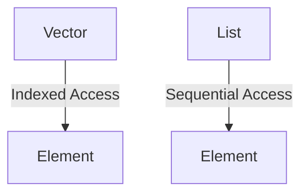
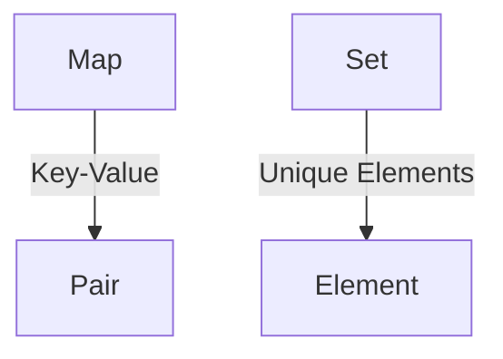

## 9.2 Vectors, Lists, Maps, and Sets in Depth

In this section, we delve into the core data structures of Clojure: vectors, lists, maps, and sets. These structures are foundational to functional programming in Clojure and offer unique advantages over their Java counterparts. By understanding these data structures, you can leverage Clojure's strengths to build scalable and efficient applications.

### Vectors

**Vectors** in Clojure are akin to Java's `ArrayList`, providing efficient indexed access and updates. They are immutable, meaning any modification results in a new vector, preserving the original.

#### Characteristics and Usage

- **Indexed Access**: Vectors allow O(1) time complexity for accessing elements by index, making them suitable for scenarios where random access is frequent.
- **Immutability**: Modifications create new vectors, enabling safe concurrent operations without locks.
- **Persistent Data Structure**: Utilizes structural sharing to minimize memory usage during updates.

#### Code Example

```clojure
;; Creating a vector
(def my-vector [1 2 3 4 5])

;; Accessing elements
(println (my-vector 2)) ; Output: 3

;; Adding an element
(def new-vector (conj my-vector 6))
(println new-vector) ; Output: [1 2 3 4 5 6]

;; Updating an element
(def updated-vector (assoc my-vector 1 10))
(println updated-vector) ; Output: [1 10 3 4 5]
```

#### Comparison with Java

In Java, an `ArrayList` provides similar indexed access, but it is mutable. Clojure's vectors offer immutability, which is crucial for functional programming paradigms.

```java
// Java ArrayList example
List<Integer> arrayList = new ArrayList<>(Arrays.asList(1, 2, 3, 4, 5));
arrayList.set(1, 10); // Mutates the list
System.out.println(arrayList); // Output: [1, 10, 3, 4, 5]
```

### Lists

**Lists** in Clojure are linked lists, optimized for sequential access and operations at the head. They are ideal for scenarios where you frequently add or remove elements from the front.

#### Characteristics and Usage

- **Sequential Access**: Lists are efficient for operations at the head, with O(1) complexity for adding or removing elements.
- **Immutability**: Like vectors, lists are immutable, supporting safe concurrent operations.
- **Persistent Data Structure**: Uses structural sharing to efficiently manage memory.

#### Code Example

```clojure
;; Creating a list
(def my-list '(1 2 3 4 5))

;; Accessing the first element
(println (first my-list)) ; Output: 1

;; Adding an element to the front
(def new-list (cons 0 my-list))
(println new-list) ; Output: (0 1 2 3 4 5)

;; Removing the first element
(def rest-list (rest my-list))
(println rest-list) ; Output: (2 3 4 5)
```

#### Comparison with Java

Java's `LinkedList` provides similar functionality but is mutable. Clojure's lists maintain immutability, which is beneficial for functional programming.

```java
// Java LinkedList example
LinkedList<Integer> linkedList = new LinkedList<>(Arrays.asList(1, 2, 3, 4, 5));
linkedList.addFirst(0); // Mutates the list
System.out.println(linkedList); // Output: [0, 1, 2, 3, 4, 5]
```

### Maps

**Maps** in Clojure are key-value pairs, similar to Java's `HashMap`. They provide efficient lookups and updates, with immutability ensuring thread safety.

#### Characteristics and Usage

- **Key-Value Association**: Maps store data as key-value pairs, allowing efficient retrieval by key.
- **Immutability**: Updates result in new maps, preserving the original.
- **Persistent Data Structure**: Uses structural sharing for memory efficiency.

#### Code Example

```clojure
;; Creating a map
(def my-map {:a 1 :b 2 :c 3})

;; Accessing a value
(println (:b my-map)) ; Output: 2

;; Adding a key-value pair
(def new-map (assoc my-map :d 4))
(println new-map) ; Output: {:a 1, :b 2, :c 3, :d 4}

;; Removing a key-value pair
(def updated-map (dissoc my-map :a))
(println updated-map) ; Output: {:b 2, :c 3}
```

#### Comparison with Java

Java's `HashMap` allows similar operations but is mutable. Clojure's maps provide immutability, enhancing safety in concurrent environments.

```java
// Java HashMap example
Map<String, Integer> hashMap = new HashMap<>();
hashMap.put("a", 1);
hashMap.put("b", 2);
System.out.println(hashMap.get("b")); // Output: 2
```

### Sets

**Sets** in Clojure are collections of unique elements, akin to Java's `HashSet`. They are useful for ensuring uniqueness and performing set operations.

#### Characteristics and Usage

- **Uniqueness**: Sets automatically enforce unique elements.
- **Immutability**: Like other Clojure data structures, sets are immutable.
- **Persistent Data Structure**: Efficiently manages memory through structural sharing.

#### Code Example

```clojure
;; Creating a set
(def my-set #{1 2 3 4 5})

;; Checking membership
(println (contains? my-set 3)) ; Output: true

;; Adding an element
(def new-set (conj my-set 6))
(println new-set) ; Output: #{1 2 3 4 5 6}

;; Removing an element
(def updated-set (disj my-set 1))
(println updated-set) ; Output: #{2 3 4 5}
```

#### Comparison with Java

Java's `HashSet` provides similar functionality but is mutable. Clojure's sets maintain immutability, which is advantageous for functional programming.

```java
// Java HashSet example
Set<Integer> hashSet = new HashSet<>(Arrays.asList(1, 2, 3, 4, 5));
hashSet.add(6); // Mutates the set
System.out.println(hashSet); // Output: [1, 2, 3, 4, 5, 6]
```

### Operations

Clojure provides a rich set of operations for manipulating these data structures. Let's explore some common functions:

#### Vectors

- **`conj`**: Adds an element to the end.
- **`assoc`**: Updates an element at a specific index.
- **`subvec`**: Creates a subvector from a range.

#### Lists

- **`cons`**: Adds an element to the front.
- **`first`**: Retrieves the first element.
- **`rest`**: Returns the list without the first element.

#### Maps

- **`assoc`**: Adds or updates a key-value pair.
- **`dissoc`**: Removes a key-value pair.
- **`get`**: Retrieves a value by key.

#### Sets

- **`conj`**: Adds an element.
- **`disj`**: Removes an element.
- **`union`**: Combines two sets.

### Visual Aids

To better understand these data structures, let's visualize them using diagrams.

#### Vectors and Lists



*Diagram 1: Vectors provide indexed access, while lists offer sequential access.*

#### Maps and Sets



*Diagram 2: Maps store key-value pairs, while sets ensure unique elements.*

### Knowledge Check

- **What are the advantages of using vectors over lists in Clojure?**
- **How does immutability benefit concurrent programming in Clojure?**
- **Compare and contrast Clojure's maps with Java's HashMap.**

### Try It Yourself

Experiment with the provided code examples by modifying them. For instance, try adding elements to a list and observe the changes. Explore how immutability affects the behavior of these data structures.

### Summary

In this section, we've explored Clojure's core data structures: vectors, lists, maps, and sets. These structures offer immutability, efficiency, and safety in concurrent environments, making them ideal for functional programming. By understanding their characteristics and operations, you can leverage Clojure's strengths to build scalable applications.

### Further Reading

- [Official Clojure Documentation](https://clojure.org/reference/data_structures)
- [ClojureDocs](https://clojuredocs.org/)
- [GitHub - Clojure](https://github.com/clojure/clojure)

## Quiz: Mastering Clojure Data Structures



### What is the primary advantage of Clojure's vectors over Java's ArrayList?

- [x] Immutability
- [ ] Faster access time
- [ ] More memory usage
- [ ] Built-in sorting

> **Explanation:** Clojure's vectors are immutable, which is a key advantage over Java's mutable ArrayList, especially in concurrent programming.

### How does Clojure ensure memory efficiency with its data structures?

- [x] Structural sharing
- [ ] Garbage collection
- [ ] Manual memory management
- [ ] Data compression

> **Explanation:** Clojure uses structural sharing to efficiently manage memory when creating new versions of data structures.

### Which operation is efficient for Clojure lists?

- [x] Adding elements to the front
- [ ] Random access
- [ ] Removing elements from the end
- [ ] Sorting elements

> **Explanation:** Clojure lists are optimized for adding elements to the front, making this operation efficient.

### What is a key characteristic of Clojure's maps?

- [x] Key-value association
- [ ] Sequential access
- [ ] Automatic sorting
- [ ] Mutable state

> **Explanation:** Clojure's maps store data as key-value pairs, allowing efficient retrieval by key.

### Which Clojure function adds an element to a set?

- [x] `conj`
- [ ] `assoc`
- [ ] `cons`
- [ ] `dissoc`

> **Explanation:** The `conj` function is used to add elements to a set in Clojure.

### What is the time complexity of accessing an element in a Clojure vector?

- [x] O(1)
- [ ] O(n)
- [ ] O(log n)
- [ ] O(n^2)

> **Explanation:** Clojure vectors provide O(1) time complexity for accessing elements by index.

### How does immutability benefit concurrent programming?

- [x] Eliminates the need for locks
- [ ] Increases memory usage
- [ ] Slows down execution
- [ ] Requires manual synchronization

> **Explanation:** Immutability eliminates the need for locks, making concurrent programming safer and more efficient.

### Which Clojure data structure ensures uniqueness of elements?

- [x] Set
- [ ] List
- [ ] Vector
- [ ] Map

> **Explanation:** Sets in Clojure ensure that all elements are unique.

### What is the result of `(assoc {:a 1 :b 2} :c 3)` in Clojure?

- [x] `{:a 1, :b 2, :c 3}`
- [ ] `{:a 1, :b 2}`
- [ ] `{:c 3}`
- [ ] `{:a 1, :b 2, :c 2}`

> **Explanation:** The `assoc` function adds or updates a key-value pair in a map, resulting in `{:a 1, :b 2, :c 3}`.

### Clojure's data structures are immutable.

- [x] True
- [ ] False

> **Explanation:** Clojure's data structures are immutable, which is a fundamental aspect of its functional programming paradigm.


