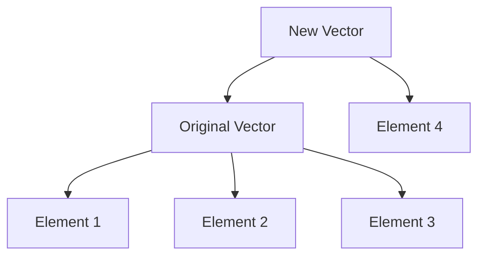

## 9.3 Understanding Structural Sharing

As we delve deeper into the world of functional programming with Clojure, one of the most fascinating and powerful concepts we encounter is **structural sharing**. This concept is pivotal in enabling Clojure's immutable data structures to be both memory-efficient and performant. In this section, we will explore the mechanism of structural sharing, how immutable updates work, and the efficiency considerations that come into play.

### Mechanism of Structural Sharing

Structural sharing is a technique used in functional programming languages like Clojure to manage memory efficiently when dealing with immutable data structures. When a data structure is immutable, any modification results in a new data structure. However, creating a completely new copy of the data structure for every change would be inefficient in terms of both time and space. This is where structural sharing comes in.

#### How Structural Sharing Works

In structural sharing, new data structures are created by reusing parts of existing structures. Instead of copying the entire structure, only the parts that are changed are new, while the unchanged parts are shared between the old and new structures. This approach significantly reduces the memory overhead and improves performance.

Let's illustrate this with a simple example using a list:

```clojure
(def original-list [1 2 3 4 5])

;; Create a new list by adding an element
(def new-list (conj original-list 6))

;; original-list remains unchanged
;; new-list shares the structure of original-list
```

In the example above, `new-list` is created by adding an element to `original-list`. Instead of copying the entire list, `new-list` shares the structure of `original-list` and only the new element is added.

#### Visualizing Structural Sharing

To better understand structural sharing, let's visualize it using a diagram. Consider the following scenario where we have a vector and we add a new element to it:



In this diagram, the `Original Vector` consists of three elements. When we create the `New Vector` by adding an element, it shares the existing elements with the `Original Vector` and only the new element is added separately.

### Immutable Updates

Immutable updates are a core concept in functional programming. In Clojure, when you update a data structure, you create a new version of it without altering the original. This is achieved through structural sharing, which allows for efficient updates.

#### Creating New Versions

When you perform an update on an immutable data structure, Clojure creates a new version of the structure. This new version shares as much of the old structure as possible. Let's see this in action with a map:

```clojure
(def original-map {:a 1 :b 2 :c 3})

;; Update the map with a new key-value pair
(def updated-map (assoc original-map :d 4))

;; original-map remains unchanged
;; updated-map shares the structure of original-map
```

In this example, `updated-map` is created by adding a new key-value pair to `original-map`. The new map shares the existing key-value pairs with the original map, and only the new pair is added.

#### Efficiency of Immutable Updates

The efficiency of immutable updates is one of the reasons why structural sharing is so powerful. By reusing existing structures, Clojure minimizes the amount of memory required for updates and reduces the time complexity of operations.

### Efficiency Considerations

When discussing structural sharing, it's important to consider the efficiency in terms of both time and space complexities. Structural sharing allows Clojure to achieve efficient memory usage and fast operations on immutable data structures.

#### Time Complexity

The time complexity of operations on immutable data structures in Clojure is often logarithmic, thanks to structural sharing. For example, adding an element to a vector or updating a map typically involves a logarithmic number of steps relative to the size of the structure.

#### Space Complexity

The space complexity is also improved through structural sharing. Since only the changed parts of a structure are new, the memory overhead is significantly reduced. This makes Clojure's immutable data structures suitable for large-scale applications where memory efficiency is crucial.

### Comparing with Java

For Java developers transitioning to Clojure, understanding structural sharing can be a paradigm shift. In Java, data structures are often mutable, and updates involve modifying the original structure. This can lead to issues with concurrency and state management.

In contrast, Clojure's approach to immutability and structural sharing provides a more robust solution for concurrent programming. By eliminating mutable state, Clojure simplifies the management of shared data and reduces the risk of race conditions.

#### Java Example

Consider a simple Java example where we update a list:

```java
import java.util.ArrayList;
import java.util.List;

public class JavaExample {
    public static void main(String[] args) {
        List<Integer> originalList = new ArrayList<>();
        originalList.add(1);
        originalList.add(2);
        originalList.add(3);

        // Create a new list by copying the original and adding an element
        List<Integer> newList = new ArrayList<>(originalList);
        newList.add(4);

        // originalList is unchanged, but newList is a full copy
    }
}
```

In this Java example, `newList` is created by copying `originalList` and adding a new element. This approach involves copying the entire list, which can be inefficient for large data structures.

### Try It Yourself

Now that we've explored how structural sharing works in Clojure, let's try modifying the code examples to deepen your understanding:

1. **Modify the List Example**: Try adding multiple elements to the `original-list` and observe how `new-list` changes.
2. **Experiment with Maps**: Create a map with several key-value pairs and update it with new pairs. Check how the original map remains unchanged.
3. **Visualize Structural Sharing**: Use the Mermaid.js diagram to visualize different scenarios of structural sharing with vectors and maps.

### Knowledge Check

Before we conclude, let's reinforce what we've learned:

- **What is structural sharing and why is it important in Clojure?**
- **How do immutable updates work in Clojure?**
- **What are the efficiency considerations of structural sharing in terms of time and space complexities?**

### Summary

In this section, we've explored the concept of structural sharing in Clojure, a key feature that enables efficient memory management and performance optimization. By understanding how structural sharing works, you can leverage Clojure's immutable data structures to build scalable and robust applications.

### Further Reading

For more information on structural sharing and immutable data structures in Clojure, consider exploring the following resources:

- [Official Clojure Documentation](https://clojure.org/reference/data_structures)
- [ClojureDocs](https://clojuredocs.org/)
- [GitHub Repositories on Clojure Data Structures](https://github.com/clojure)

By mastering structural sharing, you can unlock the full potential of functional programming in Clojure and build applications that are both efficient and scalable.

## Quiz: Test Your Understanding of Structural Sharing in Clojure



### What is structural sharing in Clojure?

- [x] A technique to share parts of data structures to conserve memory
- [ ] A method to copy entire data structures for immutability
- [ ] A way to make data structures mutable
- [ ] A process to convert data structures to Java objects

> **Explanation:** Structural sharing is a technique used in Clojure to share parts of data structures, allowing for efficient memory usage and immutability.

### How does Clojure handle updates to immutable data structures?

- [x] By creating new versions that share unchanged parts with the original
- [ ] By modifying the original data structure directly
- [ ] By copying the entire data structure
- [ ] By converting the data structure to a mutable form

> **Explanation:** Clojure creates new versions of data structures that share unchanged parts with the original, ensuring immutability.

### What is the time complexity of operations on Clojure's immutable data structures?

- [x] Often logarithmic due to structural sharing
- [ ] Linear because of copying
- [ ] Constant for all operations
- [ ] Quadratic due to immutability

> **Explanation:** The time complexity is often logarithmic because structural sharing allows for efficient updates without copying entire structures.

### Why is structural sharing beneficial for memory efficiency?

- [x] It reduces memory overhead by reusing unchanged parts of data structures
- [ ] It increases memory usage by duplicating data structures
- [ ] It makes data structures mutable
- [ ] It converts data structures to primitive types

> **Explanation:** Structural sharing reduces memory overhead by reusing unchanged parts of data structures, making it memory efficient.

### How does structural sharing improve performance in Clojure?

- [x] By minimizing the amount of new memory allocation needed for updates
- [ ] By increasing the time complexity of operations
- [ ] By converting data structures to Java objects
- [ ] By making data structures mutable

> **Explanation:** Structural sharing improves performance by minimizing the amount of new memory allocation needed for updates, allowing for faster operations.

### What is a key difference between Clojure and Java regarding data structure updates?

- [x] Clojure uses structural sharing, while Java often involves copying
- [ ] Java uses structural sharing, while Clojure involves copying
- [ ] Both use structural sharing
- [ ] Both involve copying entire data structures

> **Explanation:** Clojure uses structural sharing to efficiently update data structures, while Java often involves copying entire structures.

### What happens to the original data structure when an update is made in Clojure?

- [x] It remains unchanged
- [ ] It is modified directly
- [ ] It is deleted
- [ ] It is converted to a mutable form

> **Explanation:** The original data structure remains unchanged when an update is made in Clojure, ensuring immutability.

### How can structural sharing be visualized?

- [x] By showing shared parts of data structures in diagrams
- [ ] By listing all elements in a data structure
- [ ] By converting data structures to strings
- [ ] By using Java code examples

> **Explanation:** Structural sharing can be visualized by showing shared parts of data structures in diagrams, illustrating how new structures reuse existing parts.

### What is the space complexity benefit of structural sharing?

- [x] Reduced memory usage by sharing unchanged parts
- [ ] Increased memory usage due to duplication
- [ ] Constant memory usage for all operations
- [ ] Memory usage is irrelevant in functional programming

> **Explanation:** The space complexity benefit of structural sharing is reduced memory usage by sharing unchanged parts of data structures.

### True or False: Structural sharing allows for mutable data structures in Clojure.

- [ ] True
- [x] False

> **Explanation:** False. Structural sharing is used to maintain immutability while allowing efficient updates to data structures.


