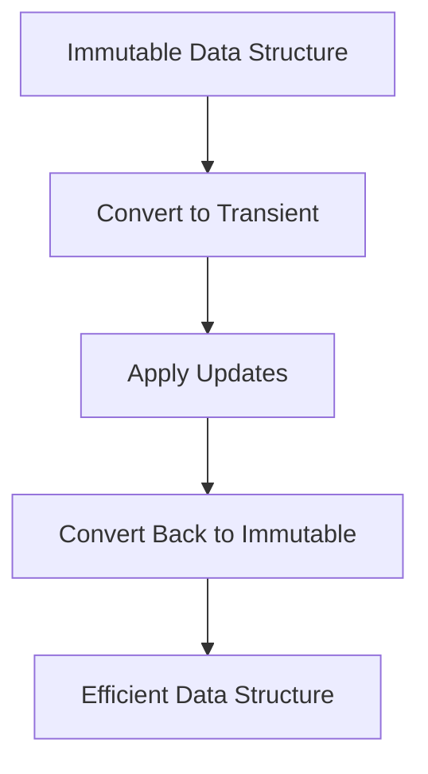

## 9.4 Efficient Data Manipulation Techniques

In this section, we will delve into efficient data manipulation techniques in Clojure, focusing on using transients for performance-critical sections, strategies for batch updates, and optimizing data access by choosing the right data structures. As experienced Java developers, you may be familiar with mutable data structures and their performance benefits. However, in Clojure, we aim to maintain immutability while still achieving efficient data manipulation.

### Using Transients

Transients in Clojure provide a way to perform efficient, temporary mutations on immutable data structures. They are particularly useful in performance-critical sections where you need to make multiple updates to a data structure before returning it to an immutable state.

#### Understanding Transients

Transients are a special type of data structure in Clojure that allow for temporary mutability. They are designed to be used in a controlled manner, where you create a transient version of a data structure, perform a series of updates, and then convert it back to an immutable structure.

```clojure
;; Example of using transients in Clojure
(defn build-large-vector []
  (persistent!
    (reduce conj! (transient []) (range 1000000))))
```

In this example, we use `transient` to create a mutable version of an empty vector. We then use `conj!` to add elements to this vector in a loop, and finally, we convert it back to an immutable vector using `persistent!`.

#### Benefits of Transients

- **Performance**: Transients can significantly improve performance when making multiple updates to a data structure. They reduce the overhead associated with creating new immutable structures for each update.
- **Controlled Mutability**: Transients provide a controlled way to introduce mutability, ensuring that the rest of your code remains functional and immutable.

#### When to Use Transients

Transients are best used in scenarios where you need to perform a large number of updates to a data structure in a performance-critical section of your code. They are not intended for general-purpose use and should be used judiciously to maintain the benefits of immutability in your application.

### Batch Updates

Batch updates refer to the process of applying multiple changes to a data structure in a single operation. This approach can be more efficient than applying each change individually, especially when dealing with large data sets.

#### Strategies for Batch Updates

1. **Use Transients**: As discussed earlier, transients are ideal for batch updates. By converting a data structure to a transient, you can apply multiple updates efficiently before converting it back to an immutable structure.

2. **Leverage Higher-Order Functions**: Functions like `reduce` and `map` can be used to apply a series of transformations to a data structure in a single pass.

```clojure
;; Example of batch updates using reduce
(defn update-map [m updates]
  (reduce (fn [acc [k v]] (assoc acc k v)) m updates))

(update-map {:a 1 :b 2} [[:a 10] [:c 3]])
```

In this example, we use `reduce` to apply a series of updates to a map. The `update-map` function takes a map and a sequence of updates, and applies each update in turn.

3. **Use Built-in Functions**: Clojure provides a rich set of functions for manipulating data structures. Functions like `merge`, `assoc`, and `update` can be used to apply batch updates efficiently.

```clojure
;; Using merge for batch updates
(defn merge-maps [m1 m2]
  (merge m1 m2))

(merge-maps {:a 1 :b 2} {:b 3 :c 4})
```

#### Benefits of Batch Updates

- **Efficiency**: Batch updates can be more efficient than applying each update individually, especially when dealing with large data sets.
- **Simplicity**: By applying updates in a single operation, you can simplify your code and reduce the risk of errors.

### Optimizing Data Access

Choosing the right data structure based on access patterns is crucial for optimizing data access in Clojure. Different data structures have different performance characteristics, and selecting the right one can have a significant impact on the efficiency of your code.

#### Choosing the Right Data Structure

1. **Vectors vs. Lists**: Vectors provide efficient random access and are ideal for scenarios where you need to access elements by index. Lists, on the other hand, are better suited for scenarios where you need to process elements sequentially.

```clojure
;; Example of using vectors for random access
(def my-vector [1 2 3 4 5])
(nth my-vector 2) ;; => 3

;; Example of using lists for sequential processing
(def my-list '(1 2 3 4 5))
(first my-list) ;; => 1
```

2. **Maps**: Maps are ideal for scenarios where you need to associate keys with values. They provide efficient lookup, insertion, and deletion operations.

```clojure
;; Example of using maps for key-value associations
(def my-map {:a 1 :b 2 :c 3})
(get my-map :b) ;; => 2
```

3. **Sets**: Sets are useful for scenarios where you need to maintain a collection of unique elements. They provide efficient membership testing and set operations.

```clojure
;; Example of using sets for unique elements
(def my-set #{1 2 3 4 5})
(contains? my-set 3) ;; => true
```

#### Tips for Optimizing Data Access

- **Use the Right Data Structure**: Choose the data structure that best matches your access patterns. For example, use vectors for random access and lists for sequential processing.
- **Minimize Data Copies**: Avoid unnecessary copying of data structures by using functions like `assoc` and `update` that return modified versions of the original structure.
- **Leverage Clojure's Persistent Data Structures**: Clojure's persistent data structures are designed to be efficient and can often be used without the need for additional optimization.

### Visual Aids

To better understand the flow of data through these techniques, let's visualize the process of using transients and batch updates.



**Diagram Description**: This flowchart illustrates the process of converting an immutable data structure to a transient, applying updates, and converting it back to an immutable structure.

### References and Links

- [Official Clojure Documentation](https://clojure.org/reference)
- [ClojureDocs](https://clojuredocs.org/)
- [GitHub - Clojure Transients](https://github.com/clojure/clojure/wiki/Transients)

### Knowledge Check

Let's reinforce what we've learned with a few questions and exercises.

1. **What are transients in Clojure, and when should you use them?**

2. **How can batch updates improve the efficiency of your code?**

3. **What are some strategies for optimizing data access in Clojure?**

4. **Try It Yourself**: Modify the `build-large-vector` function to use a map instead of a vector. How does this change affect performance?

### Summary

In this section, we've explored efficient data manipulation techniques in Clojure, focusing on using transients for performance-critical sections, strategies for batch updates, and optimizing data access by choosing the right data structures. By leveraging these techniques, you can write efficient, scalable applications in Clojure while maintaining the benefits of immutability.

Now that we've covered efficient data manipulation techniques, let's move on to the next section, where we'll explore functional data structures in more depth.

## Quiz: Mastering Efficient Data Manipulation Techniques in Clojure



### What is the primary benefit of using transients in Clojure?

- [x] Improved performance for batch updates
- [ ] Simplified syntax for data manipulation
- [ ] Enhanced readability of code
- [ ] Increased memory usage

> **Explanation:** Transients provide improved performance for batch updates by allowing temporary mutability.

### Which function is used to convert a transient back to an immutable data structure?

- [x] `persistent!`
- [ ] `immutable!`
- [ ] `finalize!`
- [ ] `commit!`

> **Explanation:** The `persistent!` function is used to convert a transient back to an immutable data structure.

### What is a key advantage of batch updates in Clojure?

- [x] Efficiency in applying multiple changes
- [ ] Simplified error handling
- [ ] Improved syntax highlighting
- [ ] Enhanced debugging capabilities

> **Explanation:** Batch updates are efficient because they allow multiple changes to be applied in a single operation.

### Which data structure is best for random access in Clojure?

- [x] Vector
- [ ] List
- [ ] Map
- [ ] Set

> **Explanation:** Vectors provide efficient random access, making them ideal for scenarios where elements are accessed by index.

### How can you optimize data access in Clojure?

- [x] Choose the right data structure
- [x] Minimize data copies
- [ ] Use global variables
- [ ] Avoid using functions

> **Explanation:** Optimizing data access involves choosing the right data structure and minimizing data copies.

### What is the purpose of the `assoc` function in Clojure?

- [x] To associate a key with a value in a map
- [ ] To remove a key from a map
- [ ] To check if a key exists in a map
- [ ] To merge two maps

> **Explanation:** The `assoc` function is used to associate a key with a value in a map, returning a new map with the association.

### Which data structure is ideal for maintaining a collection of unique elements?

- [x] Set
- [ ] List
- [ ] Vector
- [ ] Map

> **Explanation:** Sets are designed to maintain a collection of unique elements, providing efficient membership testing.

### What is the role of the `reduce` function in batch updates?

- [x] To apply a series of transformations to a data structure
- [ ] To filter elements from a collection
- [ ] To sort a collection
- [ ] To find the maximum value in a collection

> **Explanation:** The `reduce` function is used to apply a series of transformations to a data structure, making it useful for batch updates.

### Which of the following is a benefit of using Clojure's persistent data structures?

- [x] Efficiency without additional optimization
- [ ] Increased complexity
- [ ] Reduced readability
- [ ] Higher memory usage

> **Explanation:** Clojure's persistent data structures are designed to be efficient, often eliminating the need for additional optimization.

### True or False: Transients should be used for general-purpose data manipulation in Clojure.

- [ ] True
- [x] False

> **Explanation:** Transients should be used judiciously in performance-critical sections, not for general-purpose data manipulation.


