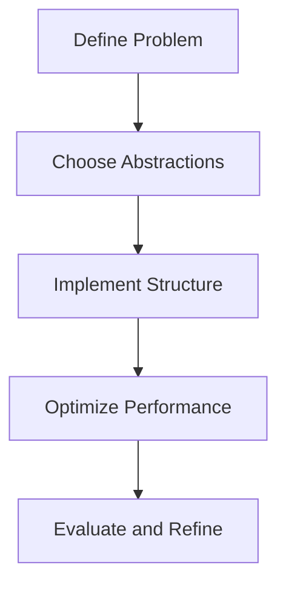

## 9.5 Designing Custom Functional Data Structures

Designing custom functional data structures in Clojure involves understanding the principles of immutability, leveraging protocols for polymorphism, and making informed decisions about performance trade-offs. As experienced Java developers, you are likely familiar with designing data structures using classes and interfaces. In Clojure, we approach this task with a functional mindset, focusing on immutability and leveraging the language's unique features.

### Creating New Data Structures

#### Understanding Functional Paradigms

In functional programming, data structures are immutable, meaning they cannot be changed after they are created. This immutability provides several benefits, such as thread safety and easier reasoning about code. When designing custom data structures in Clojure, we aim to maintain these properties while ensuring efficiency and usability.

#### Leveraging Clojure's Built-in Structures

Before diving into custom structures, it's essential to understand Clojure's built-in persistent data structures, such as lists, vectors, maps, and sets. These structures are designed to be efficient and are based on the concept of structural sharing, which allows for efficient updates without copying the entire structure.

```clojure
;; Example of using a persistent vector
(def my-vector [1 2 3 4 5])

;; Adding an element to the vector
(def new-vector (conj my-vector 6))

;; my-vector remains unchanged
(println my-vector)  ; Output: [1 2 3 4 5]
(println new-vector) ; Output: [1 2 3 4 5 6]
```

### Designing Custom Data Structures

#### Step-by-Step Approach

1. **Define the Problem**: Clearly understand the problem you are trying to solve with your custom data structure. Consider the operations you need to support and the performance characteristics required.

2. **Choose the Right Abstractions**: Identify the core abstractions that will form the basis of your data structure. In Clojure, this often involves leveraging protocols to define a set of operations that your structure will support.

3. **Implement the Structure**: Use Clojure's existing data structures as building blocks to implement your custom structure. Focus on maintaining immutability and leveraging structural sharing where possible.

4. **Optimize for Performance**: Consider the performance trade-offs of your design. Use profiling tools to identify bottlenecks and optimize critical paths.

#### Example: Designing a Custom Queue

Let's design a simple queue data structure in Clojure. A queue supports operations such as enqueue (adding an element) and dequeue (removing an element). We'll use a vector to store the elements and implement the queue operations.

```clojure
(defprotocol Queue
  (enqueue [q element])
  (dequeue [q])
  (peek [q]))

(defrecord SimpleQueue [elements]
  Queue
  (enqueue [q element]
    (SimpleQueue. (conj elements element)))
  (dequeue [q]
    (if (empty? elements)
      q
      (SimpleQueue. (subvec elements 1))))
  (peek [q]
    (first elements)))

;; Usage
(def my-queue (->SimpleQueue []))
(def updated-queue (enqueue my-queue 10))
(println (peek updated-queue)) ; Output: 10
```

### Protocols and Polymorphism

#### Introducing Protocols

Protocols in Clojure are similar to interfaces in Java. They define a set of methods that can be implemented by different types. Protocols provide a way to achieve polymorphism, allowing you to define generic operations that can work with various data structures.

```clojure
(defprotocol Shape
  (area [s])
  (perimeter [s]))

(defrecord Circle [radius]
  Shape
  (area [c] (* Math/PI (* radius radius)))
  (perimeter [c] (* 2 Math/PI radius)))

(defrecord Rectangle [width height]
  Shape
  (area [r] (* width height))
  (perimeter [r] (* 2 (+ width height))))

;; Usage
(def my-circle (->Circle 5))
(def my-rectangle (->Rectangle 4 6))

(println (area my-circle))      ; Output: 78.53981633974483
(println (perimeter my-circle)) ; Output: 31.41592653589793
(println (area my-rectangle))   ; Output: 24
```

#### Implementing Interfaces for Custom Structures

When designing custom data structures, you can define protocols to specify the operations your structure supports. This approach allows you to create flexible and reusable components that can be easily extended or modified.

### Performance Trade-offs

#### Considerations for Performance and Memory

When designing new data structures, it's crucial to consider the performance implications of your design choices. Immutability and structural sharing can introduce overhead, so it's essential to balance these factors with the need for efficiency.

- **Time Complexity**: Analyze the time complexity of your operations. Aim for logarithmic or constant time complexity for common operations like insertion and lookup.

- **Space Complexity**: Consider the memory usage of your data structure. Structural sharing can help reduce memory usage, but it's important to profile and optimize your implementation.

- **Concurrency**: Immutability provides inherent thread safety, but consider the impact of concurrent access on performance. Use Clojure's concurrency primitives, such as atoms and refs, to manage state changes safely.

### Try It Yourself

Experiment with designing your custom data structure. Consider creating a stack or a priority queue. Use protocols to define the operations and implement the structure using Clojure's persistent data structures.

### Visual Aids



*Figure 1: Steps in Designing Custom Functional Data Structures*

### References and Links

- [Clojure Official Documentation](https://clojure.org/reference)
- [ClojureDocs](https://clojuredocs.org/)
- [GitHub - Clojure Examples](https://github.com/clojure)

### Knowledge Check

- What are the benefits of using protocols in Clojure?
- How does immutability affect the design of data structures?
- What are the trade-offs between time complexity and space complexity?

### Summary

Designing custom functional data structures in Clojure involves understanding the principles of immutability, leveraging protocols for polymorphism, and making informed decisions about performance trade-offs. By following a structured approach and considering the unique features of Clojure, you can create efficient and reusable data structures that enhance your applications.

## Quiz: Mastering Custom Functional Data Structures in Clojure



### What is a key benefit of using protocols in Clojure?

- [x] They provide a way to achieve polymorphism.
- [ ] They allow for mutable state.
- [ ] They are faster than Java interfaces.
- [ ] They automatically optimize code.

> **Explanation:** Protocols in Clojure define a set of methods that can be implemented by different types, providing a way to achieve polymorphism.

### How does immutability affect the design of data structures?

- [x] It ensures thread safety.
- [ ] It increases memory usage.
- [ ] It allows for mutable state.
- [ ] It simplifies concurrent programming.

> **Explanation:** Immutability ensures that data structures cannot be changed after creation, providing thread safety and simplifying concurrent programming.

### What is structural sharing in Clojure?

- [x] A technique to efficiently update data structures without copying the entire structure.
- [ ] A method to share data between threads.
- [ ] A way to create mutable data structures.
- [ ] A pattern for designing classes.

> **Explanation:** Structural sharing allows for efficient updates by sharing parts of the data structure that remain unchanged.

### Which of the following is a performance consideration when designing data structures?

- [x] Time complexity
- [ ] Color of the code
- [ ] Number of comments
- [ ] Length of variable names

> **Explanation:** Time complexity is a critical factor in determining the efficiency of data structure operations.

### What is the purpose of the `defprotocol` keyword in Clojure?

- [x] To define a set of methods that can be implemented by different types.
- [ ] To create a new data type.
- [ ] To declare a variable.
- [ ] To import a library.

> **Explanation:** `defprotocol` is used to define a set of methods that can be implemented by different types, similar to interfaces in Java.

### What is a trade-off of using immutable data structures?

- [x] Potential overhead in performance due to immutability.
- [ ] Increased risk of data corruption.
- [ ] Difficulty in concurrent programming.
- [ ] Lack of thread safety.

> **Explanation:** While immutability provides benefits like thread safety, it can introduce performance overhead due to the need for structural sharing.

### How can you optimize a custom data structure in Clojure?

- [x] By analyzing and improving time and space complexity.
- [ ] By adding more comments.
- [ ] By using mutable state.
- [ ] By reducing the number of functions.

> **Explanation:** Optimizing involves analyzing time and space complexity to improve the efficiency of operations.

### What is a common use case for protocols in Clojure?

- [x] Defining operations for custom data structures.
- [ ] Creating mutable variables.
- [ ] Writing Java code.
- [ ] Managing memory manually.

> **Explanation:** Protocols are commonly used to define operations for custom data structures, allowing for polymorphism.

### Which of the following is NOT a benefit of immutability?

- [ ] Thread safety
- [ ] Easier reasoning about code
- [x] Mutable state
- [ ] Simplified concurrency

> **Explanation:** Immutability ensures that data cannot be changed after creation, which inherently provides thread safety and simplifies reasoning about code.

### True or False: Clojure's persistent data structures are based on structural sharing.

- [x] True
- [ ] False

> **Explanation:** Clojure's persistent data structures use structural sharing to efficiently manage updates without copying the entire structure.


