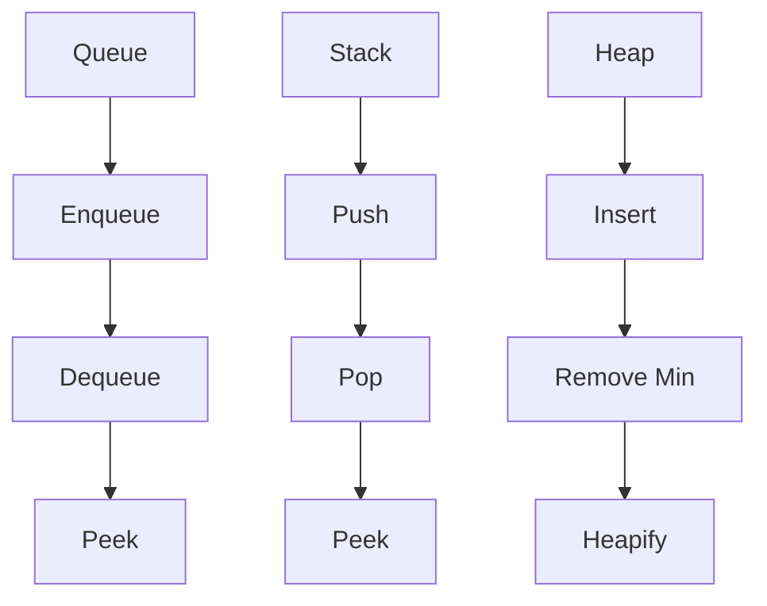

## 9.6 Advanced Collections: Queues, Stacks, and Heaps

In this section, we delve into advanced collections such as queues, stacks, and heaps, exploring their implementation and usage in Clojure. These data structures are essential for various applications, from task scheduling to algorithm optimization. By leveraging Clojure's functional programming paradigm, we can create efficient, immutable versions of these structures that are both performant and easy to reason about.

### Functional Queues

Queues are fundamental data structures that follow the First-In-First-Out (FIFO) principle. In a functional context, implementing queues involves ensuring immutability and leveraging persistent data structures.

#### Implementing Queues in Clojure

In Clojure, a queue can be implemented using a list for the front and a vector for the back. This approach allows for efficient enqueue and dequeue operations.

```clojure
(defn create-queue []
  {:front '()
   :back []})

(defn enqueue [queue element]
  (update queue :back conj element))

(defn dequeue [queue]
  (let [{:keys [front back]} queue]
    (if (empty? front)
      (let [new-front (reverse back)]
        {:front (rest new-front)
         :back []})
      {:front (rest front)
       :back back})))

(defn peek-queue [queue]
  (let [{:keys [front back]} queue]
    (if (empty? front)
      (first (reverse back))
      (first front))))
```

**Explanation:**

- **`create-queue`**: Initializes an empty queue.
- **`enqueue`**: Adds an element to the back of the queue.
- **`dequeue`**: Removes an element from the front. If the front is empty, it reverses the back to maintain FIFO order.
- **`peek-queue`**: Returns the front element without removing it.

#### Java Comparison

In Java, queues are often implemented using linked lists or arrays. The Clojure implementation above mirrors the linked list approach but ensures immutability by using persistent data structures.

```java
Queue<Integer> queue = new LinkedList<>();
queue.add(1); // Enqueue
queue.poll(); // Dequeue
queue.peek(); // Peek
```

### Stacks

Stacks operate on a Last-In-First-Out (LIFO) principle. In Clojure, stacks can be efficiently implemented using lists, which naturally support LIFO operations.

#### Implementing Stacks in Clojure

```clojure
(defn create-stack []
  '())

(defn push [stack element]
  (cons element stack))

(defn pop [stack]
  (rest stack))

(defn peek-stack [stack]
  (first stack))
```

**Explanation:**

- **`create-stack`**: Initializes an empty stack.
- **`push`**: Adds an element to the top of the stack.
- **`pop`**: Removes the top element.
- **`peek-stack`**: Returns the top element without removing it.

#### Java Comparison

Java stacks are typically implemented using the `Stack` class or `ArrayDeque`. The Clojure version is more concise and leverages immutability.

```java
Stack<Integer> stack = new Stack<>();
stack.push(1); // Push
stack.pop();   // Pop
stack.peek();  // Peek
```

### Heaps and Priority Queues

Heaps are specialized tree-based data structures that satisfy the heap property, making them ideal for implementing priority queues. In Clojure, heaps can be implemented using sorted maps or custom data structures.

#### Implementing Heaps in Clojure

A simple binary heap can be implemented using a vector to maintain the heap property.

```clojure
(defn create-heap []
  [])

(defn heapify-up [heap index]
  (let [parent-index (quot (dec index) 2)]
    (if (and (>= index 1) (< (heap index) (heap parent-index)))
      (recur (assoc heap index (heap parent-index)
                         parent-index (heap index))
             parent-index)
      heap)))

(defn insert-heap [heap element]
  (heapify-up (conj heap element) (dec (count heap))))

(defn heapify-down [heap index]
  (let [left-child (inc (* 2 index))
        right-child (+ 2 (* 2 index))
        smallest (reduce (fn [smallest child]
                           (if (and (< child (count heap))
                                    (< (heap child) (heap smallest)))
                             child
                             smallest))
                         index
                         [left-child right-child])]
    (if (not= smallest index)
      (recur (assoc heap index (heap smallest)
                         smallest (heap index))
             smallest)
      heap)))

(defn remove-min [heap]
  (let [last-index (dec (count heap))]
    (heapify-down (assoc heap 0 (heap last-index)) 0)))
```

**Explanation:**

- **`create-heap`**: Initializes an empty heap.
- **`heapify-up`**: Ensures the heap property is maintained when adding an element.
- **`insert-heap`**: Adds an element to the heap.
- **`heapify-down`**: Maintains the heap property when removing the root.
- **`remove-min`**: Removes the minimum element (root) from the heap.

#### Java Comparison

Java's `PriorityQueue` class provides a built-in implementation of a heap. The Clojure version offers more control and customization.

```java
PriorityQueue<Integer> heap = new PriorityQueue<>();
heap.add(1); // Insert
heap.poll(); // Remove Min
```

### Use Cases

- **Queues**: Useful in task scheduling, breadth-first search algorithms, and buffering data streams.
- **Stacks**: Ideal for depth-first search, expression evaluation, and backtracking algorithms.
- **Heaps**: Essential for implementing priority queues, Dijkstra's algorithm, and event simulation.

### Visual Aids

To better understand these data structures, let's visualize the flow of data through these collections.



**Diagram Explanation:**

- **Queue**: Shows the operations of enqueue, dequeue, and peek.
- **Stack**: Illustrates push, pop, and peek operations.
- **Heap**: Demonstrates insert, remove min, and heapify operations.

### Knowledge Check

Before we conclude, let's test your understanding of advanced collections in Clojure.

- **What is the primary difference between a queue and a stack?**
- **How does immutability affect the implementation of these data structures?**
- **Can you modify the heap implementation to support max-heaps instead of min-heaps?**

### Summary

In this section, we've explored the implementation and use of advanced collections like queues, stacks, and heaps in Clojure. By leveraging functional programming principles, we can create efficient, immutable versions of these structures that are both performant and easy to reason about. These collections are essential tools in a developer's toolkit, enabling the creation of scalable and robust applications.

### Try It Yourself

Experiment with the code examples provided. Try modifying the queue to support priority elements or implement a stack with additional operations. By engaging with these exercises, you'll deepen your understanding of functional data structures in Clojure.

### Further Reading

For more information on Clojure's data structures, consider exploring the following resources:

- [Official Clojure Documentation](https://clojure.org/reference/data_structures)
- [ClojureDocs](https://clojuredocs.org/)
- [Functional Programming in Clojure](https://www.braveclojure.com/)

---

## Quiz: Mastering Advanced Collections in Clojure



### What is the primary characteristic of a queue?

- [x] First-In-First-Out (FIFO)
- [ ] Last-In-First-Out (LIFO)
- [ ] Random Access
- [ ] Hierarchical Order

> **Explanation:** A queue operates on a First-In-First-Out (FIFO) principle, meaning the first element added is the first one to be removed.

### Which data structure is best suited for depth-first search algorithms?

- [ ] Queue
- [x] Stack
- [ ] Heap
- [ ] Array

> **Explanation:** A stack is ideal for depth-first search algorithms due to its Last-In-First-Out (LIFO) nature, which allows for backtracking.

### How does Clojure ensure immutability in data structures?

- [x] By using persistent data structures
- [ ] By copying data on every operation
- [ ] By locking data structures
- [ ] By using mutable variables

> **Explanation:** Clojure uses persistent data structures to ensure immutability, allowing for efficient updates without copying the entire structure.

### What operation does a heap primarily support?

- [ ] Random Access
- [ ] Sequential Access
- [x] Priority Queue Operations
- [ ] Stack Operations

> **Explanation:** A heap is primarily used for priority queue operations, allowing for efficient retrieval of the minimum or maximum element.

### In a functional context, how is a queue typically implemented?

- [x] Using a list for the front and a vector for the back
- [ ] Using a single array
- [ ] Using a linked list
- [ ] Using a hash map

> **Explanation:** In a functional context, a queue is often implemented using a list for the front and a vector for the back to maintain immutability and efficiency.

### What is the main advantage of using a heap for priority queues?

- [x] Efficient retrieval of the minimum or maximum element
- [ ] Fast random access
- [ ] Simple implementation
- [ ] Low memory usage

> **Explanation:** The main advantage of using a heap for priority queues is the efficient retrieval of the minimum or maximum element, which is crucial for many algorithms.

### Which operation is not typically associated with a stack?

- [ ] Push
- [ ] Pop
- [x] Enqueue
- [ ] Peek

> **Explanation:** Enqueue is not typically associated with a stack; it is an operation related to queues.

### What is the benefit of using persistent data structures in Clojure?

- [x] They allow for efficient updates without copying the entire structure
- [ ] They are easier to implement
- [ ] They use less memory
- [ ] They are faster than mutable structures

> **Explanation:** Persistent data structures allow for efficient updates by sharing structure between versions, avoiding the need to copy the entire structure.

### How can you modify a min-heap to function as a max-heap?

- [x] By reversing the comparison logic in heap operations
- [ ] By using a different data structure
- [ ] By adding more elements
- [ ] By using a linked list

> **Explanation:** To modify a min-heap to function as a max-heap, you can reverse the comparison logic in heap operations to prioritize larger elements.

### True or False: In Clojure, stacks are typically implemented using arrays.

- [ ] True
- [x] False

> **Explanation:** False. In Clojure, stacks are typically implemented using lists, which naturally support LIFO operations.


