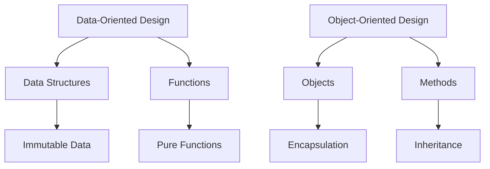

## 9.7 Data-Oriented Design Principles

In the realm of software development, the paradigm you choose can significantly impact the scalability, maintainability, and performance of your applications. Data-oriented design (DOD) is a paradigm that emphasizes the separation of data and behavior, focusing on data and its transformations rather than objects and methods. This approach is particularly powerful in functional programming languages like Clojure, where immutability and first-class functions are core features. In this section, we will delve into the principles of data-oriented design, explore its advantages, and compare it with traditional object-oriented design (OOD).

### Principles of Data-Oriented Design

Data-oriented design is centered around the idea that data should be the primary focus of your application. Instead of encapsulating data and behavior within objects, as in OOD, DOD advocates for keeping data structures separate from the functions that operate on them. This separation allows for more flexible and efficient data manipulation, which is crucial for building scalable applications.

#### Focus on Data and Transformations

In data-oriented design, the primary goal is to optimize the way data is accessed and transformed. This involves:

- **Identifying Core Data Structures**: Determine the fundamental data structures that represent the state of your application.
- **Optimizing Data Access Patterns**: Design your data structures to facilitate efficient access and transformation.
- **Leveraging Immutable Data**: Use immutable data structures to ensure that data transformations do not introduce side effects, making your application more predictable and easier to debug.

In Clojure, data is often represented using simple, immutable data structures such as maps, vectors, and sets. These structures are designed to be efficient and easy to work with, enabling developers to focus on the logic of their applications rather than the intricacies of data management.

#### Separation of Data and Behavior

One of the key principles of data-oriented design is the separation of data and behavior. This separation offers several advantages:

- **Improved Modularity**: By keeping data and behavior separate, you can modify one without affecting the other. This modularity makes your codebase easier to maintain and extend.
- **Enhanced Reusability**: Functions that operate on data can be reused across different parts of your application, reducing code duplication and improving consistency.
- **Simplified Testing**: With data and behavior decoupled, you can test each independently, leading to more robust and reliable applications.

In Clojure, this separation is achieved by defining data structures using simple literals and manipulating them with pure functions. This approach contrasts with OOD, where data and behavior are often tightly coupled within classes and objects.

### Example Applications

Data-oriented design can simplify complex systems by focusing on data transformations rather than object interactions. Let's explore a few examples where DOD shines:

#### Example 1: Data Processing Pipeline

Consider a data processing pipeline that ingests raw data, transforms it, and outputs the results. In a data-oriented design, you would:

1. **Define Data Structures**: Use maps and vectors to represent the raw data and intermediate results.
2. **Implement Transformation Functions**: Write pure functions that take data as input and return transformed data as output.
3. **Compose Functions**: Use function composition to create a pipeline that processes the data in stages.

Here's a simple Clojure example illustrating this approach:

```clojure
(defn parse-data [raw-data]
  ;; Parse raw data into a structured format
  (map #(clojure.string/split % #",") raw-data))

(defn filter-data [parsed-data]
  ;; Filter out unwanted entries
  (filter #(> (count %) 2) parsed-data))

(defn transform-data [filtered-data]
  ;; Transform data into the desired format
  (map #(assoc {} :name (first %) :value (second %)) filtered-data))

(defn process-data [raw-data]
  ;; Compose functions to create a data processing pipeline
  (-> raw-data
      parse-data
      filter-data
      transform-data))

;; Example usage
(def raw-data ["Alice,100", "Bob,200", "Charlie,"])
(process-data raw-data)
```

In this example, each function operates on data independently, allowing for easy modification and testing of individual components.

#### Example 2: Game State Management

In a game application, managing the state of the game world can be complex. Data-oriented design simplifies this by:

1. **Representing Game State as Data**: Use maps to represent the state of game entities (e.g., players, enemies, items).
2. **Defining State Transition Functions**: Write functions that describe how the game state changes in response to events.
3. **Decoupling Logic from State**: Keep game logic separate from the data structures, allowing for flexible and dynamic gameplay.

Here's a Clojure example demonstrating this approach:

```clojure
(defn move-player [game-state player-id direction]
  ;; Update the player's position based on the direction
  (update-in game-state [:players player-id :position]
             (fn [pos]
               (case direction
                 :up    [(first pos) (dec (second pos))]
                 :down  [(first pos) (inc (second pos))]
                 :left  [(dec (first pos)) (second pos)]
                 :right [(inc (first pos)) (second pos)]
                 pos))))

(defn apply-damage [game-state player-id damage]
  ;; Reduce the player's health by the damage amount
  (update-in game-state [:players player-id :health] - damage))

(defn game-loop [game-state events]
  ;; Process a sequence of events to update the game state
  (reduce (fn [state event]
            (case (:type event)
              :move (move-player state (:player-id event) (:direction event))
              :damage (apply-damage state (:player-id event) (:amount event))
              state))
          game-state
          events))

;; Example usage
(def initial-state {:players {1 {:position [0 0] :health 100}
                              2 {:position [5 5] :health 100}}})

(def events [{:type :move :player-id 1 :direction :up}
             {:type :damage :player-id 2 :amount 10}])

(game-loop initial-state events)
```

In this example, the game state is represented as a map, and functions are used to describe state transitions. This separation allows for easy modification of game logic without affecting the underlying data structures.

### Comparison with Object-Oriented Design

Data-oriented design offers several advantages over traditional object-oriented design, particularly in the context of functional programming languages like Clojure.

#### Differences and Benefits

- **Data vs. Objects**: In OOD, data and behavior are encapsulated within objects, leading to tight coupling. In DOD, data is represented using simple structures, and behavior is defined by functions, resulting in loose coupling.
- **Immutability**: DOD emphasizes the use of immutable data structures, which simplifies reasoning about state changes and reduces the risk of bugs. In contrast, OOD often relies on mutable objects, which can lead to complex and error-prone code.
- **Function Composition**: DOD leverages function composition to build complex behavior from simple functions, promoting code reuse and modularity. OOD typically relies on inheritance and polymorphism, which can introduce complexity and reduce flexibility.
- **Performance**: By focusing on data access patterns, DOD can lead to more efficient applications, particularly in scenarios involving large data sets or high concurrency. OOD may suffer from performance bottlenecks due to the overhead of object creation and method dispatch.

#### Visual Comparison

To illustrate the differences between data-oriented and object-oriented design, consider the following diagram:



**Diagram Description**: This diagram contrasts data-oriented design, which separates data structures and functions, with object-oriented design, which encapsulates data and behavior within objects.

### Conclusion

Data-oriented design is a powerful paradigm that aligns well with the principles of functional programming. By focusing on data and transformations, separating data from behavior, and leveraging immutable data structures, you can build scalable, maintainable, and efficient applications. As you continue your journey with Clojure, consider adopting data-oriented design principles to unlock the full potential of functional programming.

### Knowledge Check

To reinforce your understanding of data-oriented design principles, consider the following questions and exercises:

1. **Question**: What are the main advantages of separating data and behavior in a software application?
2. **Exercise**: Refactor an object-oriented Java application to use data-oriented design principles in Clojure. Focus on separating data structures from functions and using immutable data.
3. **Question**: How does data-oriented design improve the performance of applications dealing with large data sets?
4. **Exercise**: Implement a simple data processing pipeline in Clojure using data-oriented design principles. Compare its performance and maintainability with an equivalent object-oriented implementation.

### Encouragement

Now that we've explored the principles of data-oriented design, let's apply these concepts to your next Clojure project. By focusing on data and transformations, you'll be well-equipped to build scalable and efficient applications. Remember, the key to mastering data-oriented design is practice and experimentation. Keep exploring, and don't hesitate to reach out to the Clojure community for support and inspiration.

## Quiz: Mastering Data-Oriented Design Principles in Clojure



### What is a key advantage of separating data and behavior in data-oriented design?

- [x] Improved modularity and reusability
- [ ] Increased complexity
- [ ] Tighter coupling of components
- [ ] Reduced performance

> **Explanation:** Separating data and behavior improves modularity and reusability, making it easier to maintain and extend applications.

### How does data-oriented design differ from object-oriented design?

- [x] Data and behavior are separated in DOD
- [ ] Data and behavior are encapsulated in DOD
- [ ] DOD relies on inheritance and polymorphism
- [ ] DOD uses mutable objects

> **Explanation:** In data-oriented design, data and behavior are separated, unlike object-oriented design where they are encapsulated within objects.

### Which of the following is a benefit of using immutable data structures in data-oriented design?

- [x] Simplifies reasoning about state changes
- [ ] Increases the risk of bugs
- [ ] Requires more memory
- [ ] Complicates data transformations

> **Explanation:** Immutable data structures simplify reasoning about state changes and reduce the risk of bugs.

### What is the primary focus of data-oriented design?

- [x] Optimizing data access and transformations
- [ ] Encapsulating data and behavior
- [ ] Designing complex class hierarchies
- [ ] Using mutable state

> **Explanation:** Data-oriented design focuses on optimizing data access and transformations, rather than encapsulating data and behavior.

### In a data processing pipeline, what is the role of function composition?

- [x] To build complex behavior from simple functions
- [ ] To encapsulate data within objects
- [ ] To increase code duplication
- [ ] To introduce side effects

> **Explanation:** Function composition allows you to build complex behavior from simple functions, promoting code reuse and modularity.

### How does data-oriented design improve performance in high-concurrency scenarios?

- [x] By optimizing data access patterns
- [ ] By using mutable objects
- [ ] By relying on inheritance
- [ ] By increasing method dispatch overhead

> **Explanation:** Data-oriented design improves performance by optimizing data access patterns, which is beneficial in high-concurrency scenarios.

### What is a common pitfall of object-oriented design that data-oriented design avoids?

- [x] Tight coupling of data and behavior
- [ ] Loose coupling of components
- [ ] Efficient data access
- [ ] Use of immutable data

> **Explanation:** Object-oriented design often leads to tight coupling of data and behavior, which data-oriented design avoids.

### Which Clojure feature aligns well with data-oriented design principles?

- [x] Immutable data structures
- [ ] Mutable state
- [ ] Class inheritance
- [ ] Method overloading

> **Explanation:** Immutable data structures in Clojure align well with data-oriented design principles, promoting separation of data and behavior.

### What is the benefit of using pure functions in data-oriented design?

- [x] They have no side effects
- [ ] They increase complexity
- [ ] They require more memory
- [ ] They encapsulate data

> **Explanation:** Pure functions have no side effects, making them ideal for data-oriented design where data transformations are key.

### True or False: Data-oriented design is primarily concerned with encapsulating data and behavior within objects.

- [ ] True
- [x] False

> **Explanation:** False. Data-oriented design focuses on separating data and behavior, unlike object-oriented design which encapsulates them within objects.


