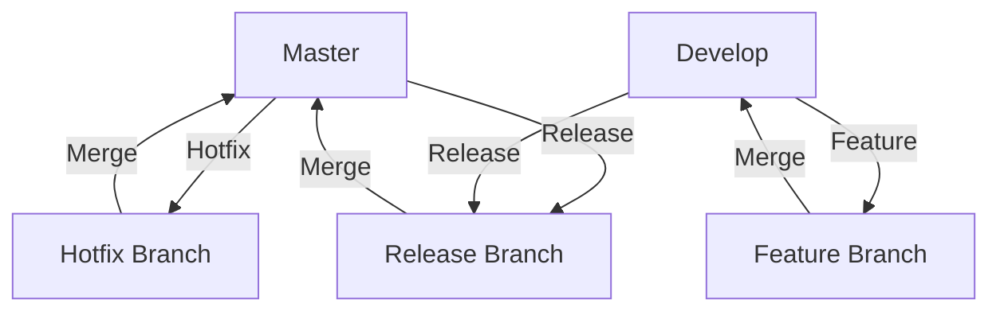

## 11.2.1 Mastering Git Workflow for Clojure Development

In the realm of software development, effective version control is crucial for managing changes, collaborating with team members, and maintaining code quality. Git, a distributed version control system, has become the de facto standard for developers worldwide. This section delves into advanced Git workflows tailored for Clojure development, providing insights into branching strategies, commit management, and collaboration techniques that enhance productivity and code quality.

### Understanding Git Basics

Before diving into advanced workflows, let's revisit the foundational concepts of Git. Git is a distributed version control system that allows multiple developers to work on a project simultaneously. It tracks changes to files and enables developers to revert to previous versions if needed.

#### Key Concepts

- **Repository**: A Git repository is a directory that contains your project's files and the entire history of changes made to those files.
- **Commit**: A commit is a snapshot of your project's files at a specific point in time. It includes a message describing the changes.
- **Branch**: A branch is a parallel version of your project. It allows you to work on different features or fixes independently.
- **Merge**: Merging is the process of integrating changes from one branch into another.
- **Clone**: Cloning is creating a local copy of a remote repository.
- **Pull**: Pulling is fetching changes from a remote repository and merging them into your local branch.
- **Push**: Pushing is sending your local commits to a remote repository.

### Advanced Branching Strategies

Branching is a powerful feature in Git that allows developers to work on multiple features or fixes simultaneously without interfering with the main codebase. Here are some advanced branching strategies that can be particularly useful in Clojure development:

#### Git Flow

Git Flow is a popular branching model that defines a strict branching structure to manage releases, hotfixes, and feature development. It consists of the following branches:

- **Master**: The main branch that always reflects a production-ready state.
- **Develop**: The integration branch for features. It contains the latest delivered development changes for the next release.
- **Feature**: Branches created from `develop` to work on new features. Once a feature is complete, it is merged back into `develop`.
- **Release**: Branches created from `develop` when preparing a new production release. It allows for last-minute fixes and preparing release notes.
- **Hotfix**: Branches created from `master` to fix critical issues in production. Once fixed, changes are merged back into both `master` and `develop`.

#### GitHub Flow

GitHub Flow is a simpler branching strategy suitable for smaller teams or projects with continuous deployment. It involves:

- **Main**: The default branch that reflects the production-ready code.
- **Feature Branches**: Created from `main` for new features or bug fixes. Once complete, they are merged back into `main` via a pull request.

#### Trunk-Based Development

Trunk-Based Development is a branching model where developers work on short-lived branches and merge changes into the `main` branch frequently. This approach minimizes merge conflicts and encourages continuous integration.

### Managing Code History

Effective management of code history is essential for maintaining a clean and understandable project history. Here are some techniques to manage your Git history:

#### Rebasing

Rebasing is the process of moving or combining a sequence of commits to a new base commit. It is useful for:

- **Keeping a Linear History**: Rebasing can create a linear project history by moving feature branch commits onto the tip of the `main` branch.
- **Updating Feature Branches**: By rebasing a feature branch onto the latest `develop` branch, you can incorporate the latest changes without creating a merge commit.

```bash
git checkout feature-branch
git rebase develop
```

#### Squashing Commits

Squashing combines multiple commits into a single commit. This is useful for:

- **Cleaning Up History**: Squashing can tidy up a branch's history by combining related commits into a single, cohesive commit.
- **Simplifying Pull Requests**: By squashing commits before merging a feature branch, you can simplify the review process.

```bash
git rebase -i HEAD~n
```

### Writing Informative Commit Messages

Commit messages are crucial for understanding the history of a project. Here are some best practices for writing informative commit messages:

- **Use the Imperative Mood**: Start commit messages with a verb, such as "Add," "Fix," or "Update."
- **Be Concise**: Keep the subject line under 50 characters and provide additional details in the body if necessary.
- **Explain Why, Not Just What**: Describe the reasoning behind the changes, not just what was changed.

Example of a well-structured commit message:

```
Add user authentication

- Implement login and registration forms
- Integrate with OAuth for third-party authentication
- Add unit tests for authentication logic

This change improves security by requiring users to authenticate before accessing restricted areas.
```

### Resolving Merge Conflicts

Merge conflicts occur when changes in different branches conflict with each other. Here are steps to resolve merge conflicts:

1. **Identify Conflicts**: Git will mark conflicting areas in the files with conflict markers.
2. **Resolve Conflicts**: Edit the files to resolve conflicts by choosing which changes to keep.
3. **Mark as Resolved**: Once conflicts are resolved, mark the files as resolved.

```bash
git add <file>
git commit
```

### Collaborating on Shared Branches

Collaboration is a key aspect of software development. Here are some tips for effective collaboration using Git:

- **Use Pull Requests**: Pull requests facilitate code review and discussion before merging changes into the main branch.
- **Communicate Changes**: Use commit messages and pull request descriptions to communicate the purpose and impact of changes.
- **Synchronize Regularly**: Regularly pull changes from the remote repository to stay up-to-date with the latest changes.

### Practical Code Examples

Let's explore some practical examples to illustrate these concepts:

#### Example 1: Creating a Feature Branch

```bash
git checkout develop
git pull origin develop
git checkout -b feature/new-feature
```

#### Example 2: Rebasing a Feature Branch

```bash
git checkout feature/new-feature
git fetch origin
git rebase origin/develop
```

#### Example 3: Resolving a Merge Conflict

```bash
git checkout feature/new-feature
git merge develop

git add <resolved-file>
git commit
```

### Diagrams and Visual Aids

To better understand the branching strategies, let's visualize the Git Flow model using a Mermaid diagram:



### Best Practices and Common Pitfalls

#### Best Practices

- **Keep Branches Short-Lived**: Regularly merge changes to avoid long-lived branches that are prone to conflicts.
- **Automate Testing**: Use continuous integration to automatically test changes before merging.
- **Document Processes**: Clearly document your team's Git workflow to ensure consistency.

#### Common Pitfalls

- **Ignoring Merge Conflicts**: Failing to resolve conflicts properly can lead to broken code.
- **Poor Commit Messages**: Vague commit messages make it difficult to understand the history of changes.
- **Not Synchronizing**: Failing to regularly pull changes can lead to large, complex merges.

### Conclusion

Mastering Git workflows is essential for effective Clojure development. By understanding advanced branching strategies, managing code history, and collaborating effectively, you can enhance your productivity and maintain a clean, organized codebase. Remember to follow best practices and avoid common pitfalls to ensure a smooth development process.

## Quiz Time!



### What is the purpose of a Git branch?

- [x] To work on different features or fixes independently
- [ ] To delete unwanted files from the repository
- [ ] To create a backup of the repository
- [ ] To merge changes from one branch into another

> **Explanation:** A Git branch allows developers to work on different features or fixes independently without affecting the main codebase.

### What is the main advantage of using Git Flow?

- [x] It provides a structured branching model for managing releases, hotfixes, and feature development.
- [ ] It allows for continuous deployment with minimal branches.
- [ ] It eliminates the need for code reviews.
- [ ] It simplifies the process of cloning repositories.

> **Explanation:** Git Flow provides a structured branching model that helps manage releases, hotfixes, and feature development effectively.

### What is the purpose of rebasing in Git?

- [x] To move or combine a sequence of commits to a new base commit
- [ ] To delete a branch from the repository
- [ ] To create a new branch from an existing one
- [ ] To merge changes from one branch into another

> **Explanation:** Rebasing is used to move or combine a sequence of commits to a new base commit, often to keep a linear project history.

### What is a common use case for squashing commits?

- [x] To combine multiple commits into a single, cohesive commit
- [ ] To delete unwanted files from the repository
- [ ] To create a backup of the repository
- [ ] To merge changes from one branch into another

> **Explanation:** Squashing commits is used to combine multiple commits into a single, cohesive commit, which can tidy up a branch's history.

### Which of the following is a best practice for writing commit messages?

- [x] Use the imperative mood and be concise
- [ ] Include as much detail as possible in the subject line
- [x] Explain why the changes were made, not just what was changed
- [ ] Use only one-word messages for simplicity

> **Explanation:** Best practices for writing commit messages include using the imperative mood, being concise, and explaining why the changes were made.

### What is the first step in resolving a merge conflict?

- [x] Identify conflicts marked by Git
- [ ] Delete the conflicting files
- [ ] Create a new branch
- [ ] Push changes to the remote repository

> **Explanation:** The first step in resolving a merge conflict is to identify the conflicts marked by Git in the files.

### What is the benefit of using pull requests?

- [x] They facilitate code review and discussion before merging changes.
- [ ] They automatically resolve merge conflicts.
- [x] They provide a platform for team collaboration and feedback.
- [ ] They eliminate the need for branches.

> **Explanation:** Pull requests facilitate code review and discussion before merging changes, providing a platform for team collaboration and feedback.

### What is a common pitfall when using Git?

- [x] Ignoring merge conflicts
- [ ] Writing informative commit messages
- [ ] Regularly synchronizing with the remote repository
- [ ] Automating testing

> **Explanation:** Ignoring merge conflicts is a common pitfall that can lead to broken code and integration issues.

### What is the main goal of trunk-based development?

- [x] To merge changes into the main branch frequently
- [ ] To create long-lived feature branches
- [ ] To eliminate the need for continuous integration
- [ ] To simplify the process of cloning repositories

> **Explanation:** The main goal of trunk-based development is to merge changes into the main branch frequently, minimizing merge conflicts and encouraging continuous integration.

### True or False: Squashing commits can simplify the review process by reducing the number of commits to review.

- [x] True
- [ ] False

> **Explanation:** True. Squashing commits can simplify the review process by reducing the number of commits to review, making it easier to understand the changes.


