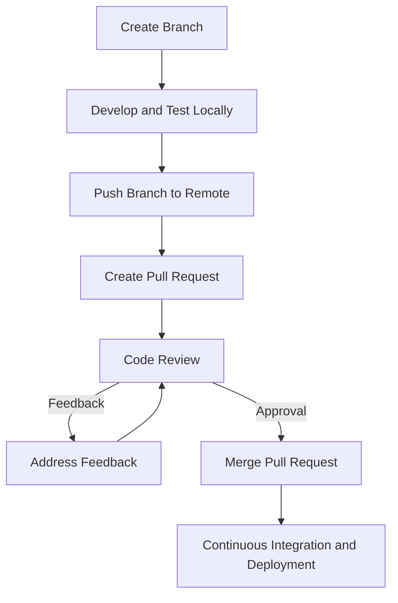

## 11.2.2 Managing Pull Requests and Code Reviews

In the realm of software development, especially within team environments, managing pull requests and conducting thorough code reviews are pivotal processes that ensure code quality and foster collaborative growth. This section delves into the pull request workflow, the significance of code reviews, and provides guidelines for conducting effective reviews. Additionally, we explore tools like GitHub, GitLab, and Bitbucket that facilitate these processes, enhancing team collaboration and continuous integration.

### Understanding the Pull Request Workflow

A pull request (PR) is a method of submitting contributions to a project. It is a request to merge code changes from one branch to another, typically from a feature branch into the main branch. The pull request workflow is a cornerstone of collaborative development, allowing teams to review, discuss, and refine code before it becomes part of the main codebase.

#### Key Steps in the Pull Request Workflow

1. **Branching Strategy**: Before making changes, developers create a new branch from the main branch. This branch is often named after the feature or bug fix it addresses, following a consistent naming convention.

2. **Development and Testing**: Developers implement their changes on the new branch, ensuring that the code is well-tested locally. This step often involves writing unit tests and running them to verify the changes.

3. **Creating a Pull Request**: Once the changes are ready, a pull request is created. This involves pushing the branch to the remote repository and using the platform's interface (e.g., GitHub, GitLab) to open a PR. The PR should include a clear description of the changes, the problem they solve, and any relevant context.

4. **Code Review Process**: Team members review the pull request, providing feedback and suggestions. This is a collaborative process where reviewers can ask questions, request changes, or approve the PR.

5. **Addressing Feedback**: The original developer addresses the feedback by making additional commits to the branch. This iterative process continues until the reviewers are satisfied with the changes.

6. **Merging the Pull Request**: Once approved, the pull request is merged into the main branch. This step often involves resolving any merge conflicts and ensuring that the code integrates smoothly with the existing codebase.

7. **Continuous Integration and Deployment**: After merging, automated processes such as continuous integration (CI) pipelines run tests and deploy the changes to staging or production environments.

#### Diagram: Pull Request Workflow

### The Importance of Code Reviews

Code reviews are a critical component of the software development lifecycle. They serve multiple purposes beyond simply catching bugs:

- **Ensuring Code Quality**: Code reviews help maintain high standards by ensuring that code adheres to the project's style guidelines and best practices.

- **Knowledge Sharing**: Reviews are an excellent opportunity for team members to learn from each other, spreading knowledge about the codebase and fostering a collaborative culture.

- **Identifying Bugs Early**: By having multiple eyes on the code, potential issues can be identified and addressed before they reach production.

- **Improving Code Readability**: Reviewers can provide feedback on code clarity, suggesting improvements that make the code easier to understand and maintain.

- **Encouraging Best Practices**: Code reviews reinforce the use of best practices, such as writing clean, efficient, and well-documented code.

### Guidelines for Effective Code Reviews

Conducting effective code reviews requires a balance of technical scrutiny and constructive feedback. Here are some guidelines to ensure reviews are productive and positive:

#### Be Respectful and Constructive

- **Focus on the Code, Not the Author**: Critique the code, not the person who wrote it. Use language that is respectful and constructive.

- **Provide Specific Feedback**: Instead of vague comments, provide specific suggestions for improvement. For example, instead of saying "This code is confusing," suggest "Consider renaming this variable for clarity."

#### Ensure Consistency and Style

- **Adhere to Style Guides**: Ensure that the code follows the project's style guide. Consistent style makes the codebase easier to read and maintain.

- **Check for Consistent Naming Conventions**: Variable and function names should be descriptive and consistent with the project's naming conventions.

#### Focus on the Big Picture

- **Understand the Context**: Before diving into the details, understand the overall purpose of the changes. This helps in providing relevant feedback.

- **Consider the Impact on the Codebase**: Evaluate how the changes affect the codebase as a whole, including performance, security, and maintainability.

#### Encourage Learning and Growth

- **Ask Questions**: Use questions to encourage discussion and learning. For example, "Can you explain why this approach was chosen?"

- **Share Knowledge**: If you have expertise in a particular area, share insights that can help the author and other reviewers learn.

#### Use Tools to Facilitate Reviews

- **Leverage Code Review Tools**: Use the features of your code review platform to leave comments, suggest changes, and track discussions.

- **Automate Where Possible**: Use automated tools to catch common issues, such as linting errors or failing tests, before the review process begins.

### Tools for Managing Pull Requests and Code Reviews

Several platforms facilitate the pull request and code review process, each offering unique features to enhance collaboration and integration.

#### GitHub

GitHub is one of the most popular platforms for hosting code repositories and managing pull requests. It offers features such as:

- **Pull Request Templates**: Standardize the information required for each PR by using templates.

- **Review Tools**: Comment on specific lines of code, request changes, and approve PRs.

- **Integration with CI/CD**: Automatically run tests and deploy code using GitHub Actions.

- **Branch Protection Rules**: Enforce rules such as requiring reviews or passing tests before merging.

#### GitLab

GitLab provides a comprehensive suite of tools for managing the entire DevOps lifecycle, including:

- **Merge Requests**: Similar to pull requests, merge requests facilitate code reviews and discussions.

- **CI/CD Integration**: GitLab CI/CD allows for seamless integration of testing and deployment pipelines.

- **Code Quality Reports**: Automatically generate reports on code quality metrics.

- **Review Apps**: Deploy temporary environments for testing changes in real-time.

#### Bitbucket

Bitbucket, part of the Atlassian suite, offers robust features for managing code reviews:

- **Pull Requests**: Facilitate code reviews with inline comments and discussions.

- **Pipelines**: Integrate CI/CD pipelines to automate testing and deployment.

- **Code Insights**: Integrate third-party tools to provide insights into code quality and security.

- **Jira Integration**: Seamlessly link pull requests to Jira issues for better project management.

### Best Practices for Pull Requests and Code Reviews

To maximize the effectiveness of pull requests and code reviews, consider the following best practices:

- **Keep Pull Requests Small**: Smaller pull requests are easier to review and less likely to introduce bugs. Aim to make changes that are focused and incremental.

- **Review Regularly**: Conduct reviews regularly to prevent bottlenecks and ensure timely feedback.

- **Use Checklists**: Create checklists for reviewers to ensure that all aspects of the code are considered, from functionality to style.

- **Encourage Open Communication**: Foster an environment where team members feel comfortable discussing code and providing feedback.

- **Document Decisions**: Record important decisions made during the review process for future reference.

### Common Pitfalls and How to Avoid Them

While pull requests and code reviews are invaluable, they can also present challenges. Here are some common pitfalls and strategies to avoid them:

- **Overly Large Pull Requests**: Large PRs can be overwhelming and difficult to review. Break down changes into smaller, logical units.

- **Lack of Context**: Without proper context, reviewers may struggle to understand the changes. Provide detailed descriptions and link to relevant issues or documentation.

- **Ignoring Feedback**: Failing to address feedback can lead to frustration and reduced code quality. Engage with reviewers and iterate on the code as needed.

- **Inconsistent Review Standards**: Without clear guidelines, reviews can become inconsistent. Establish and communicate review standards across the team.

- **Rushed Reviews**: Hasty reviews can miss critical issues. Allocate sufficient time for thorough reviews and prioritize quality over speed.

### Conclusion

Managing pull requests and conducting effective code reviews are essential practices for maintaining code quality and fostering collaboration in Clojure projects. By understanding the pull request workflow, appreciating the importance of code reviews, and following best practices, teams can enhance their development processes and deliver high-quality software. Leveraging tools like GitHub, GitLab, and Bitbucket further streamlines these processes, integrating seamlessly with CI/CD pipelines and facilitating continuous improvement.

## Quiz Time!



### What is the primary purpose of a pull request in a collaborative development environment?

- [x] To propose and discuss code changes before merging them into the main branch
- [ ] To automatically merge code changes into the main branch
- [ ] To delete a branch after code changes are completed
- [ ] To create a new branch for development

> **Explanation:** A pull request is used to propose and discuss code changes before they are merged into the main branch, allowing for review and feedback.

### Which of the following is NOT a benefit of code reviews?

- [ ] Ensuring code quality
- [ ] Knowledge sharing
- [x] Automatically fixing bugs
- [ ] Improving code readability

> **Explanation:** Code reviews help ensure code quality, share knowledge, and improve readability, but they do not automatically fix bugs.

### What is a common guideline for providing feedback during code reviews?

- [x] Focus on the code, not the author
- [ ] Criticize the author for mistakes
- [ ] Provide vague feedback
- [ ] Ignore style inconsistencies

> **Explanation:** Feedback should focus on the code, not the author, and should be constructive and specific.

### Which tool is known for its integration with Jira for managing pull requests?

- [ ] GitHub
- [ ] GitLab
- [x] Bitbucket
- [ ] SourceForge

> **Explanation:** Bitbucket is known for its integration with Jira, facilitating project management and linking pull requests to issues.

### What is a common pitfall of pull requests that can make them difficult to review?

- [x] Being overly large
- [ ] Being too small
- [ ] Having too many reviewers
- [ ] Being submitted too frequently

> **Explanation:** Overly large pull requests can be overwhelming and difficult to review, making it harder to provide thorough feedback.

### What feature of GitHub helps enforce rules such as requiring reviews before merging?

- [x] Branch protection rules
- [ ] Pull request templates
- [ ] Code insights
- [ ] Review apps

> **Explanation:** Branch protection rules in GitHub help enforce rules such as requiring reviews or passing tests before merging.

### Which of the following is a benefit of using automated tools in code reviews?

- [x] Catching common issues before the review process
- [ ] Replacing the need for human reviews
- [ ] Automatically merging pull requests
- [ ] Eliminating the need for style guides

> **Explanation:** Automated tools can catch common issues, such as linting errors, before the review process, complementing human reviews.

### What is a key aspect of the pull request description?

- [x] Providing a clear explanation of the changes and their purpose
- [ ] Listing all files changed
- [ ] Including personal opinions about the code
- [ ] Detailing the entire development process

> **Explanation:** The pull request description should provide a clear explanation of the changes and their purpose, offering context for reviewers.

### How can teams ensure consistent review standards?

- [x] Establish and communicate review guidelines
- [ ] Allow each reviewer to set their own standards
- [ ] Ignore style guides
- [ ] Conduct reviews only when necessary

> **Explanation:** Establishing and communicating review guidelines helps ensure consistent standards across the team.

### True or False: Code reviews should prioritize speed over quality.

- [ ] True
- [x] False

> **Explanation:** Code reviews should prioritize quality over speed to ensure thorough evaluation and maintain high standards.


