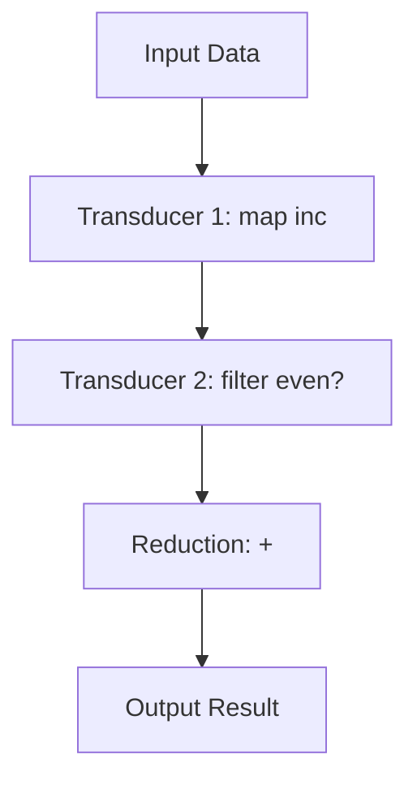

## 2.2.1 Understanding Transducers

In the realm of functional programming, Clojure's transducers stand out as a powerful abstraction for data transformation. They offer a composable and efficient way to process data, decoupling the transformation logic from the data source and destination. This section delves into the intricacies of transducers, comparing them with traditional sequence operations and highlighting their performance benefits.

### Introduction to Transducers

Transducers are a novel approach to data transformation in Clojure, introduced to address the inefficiencies of traditional sequence operations. At their core, transducers are composable functions that transform data independently of the context in which they are used. This means that the same transducer can be applied to a variety of data sources, such as collections, streams, or channels, without modification.

The key advantage of transducers is their ability to separate the transformation process from the data source and destination. This decoupling allows for greater flexibility and reusability, as transducers can be composed and reused across different contexts.

### Decoupling Transformation from Input and Output

Traditional sequence operations in Clojure, such as `map`, `filter`, and `reduce`, are tightly coupled with the data structures they operate on. For example, when using `map` on a collection, the operation is inherently tied to the collection's implementation. This coupling can lead to inefficiencies, particularly when chaining multiple operations together.

Transducers, on the other hand, abstract away the details of the data source and destination. They focus solely on the transformation logic, allowing for a more modular and reusable approach. This decoupling is achieved through the use of higher-order functions that compose the transformation steps, which can then be applied to any compatible data source.

#### Example: Traditional Sequence Operations vs. Transducers

Consider the following example, which demonstrates the difference between traditional sequence operations and transducers:

```clojure
;; Traditional sequence operations
(defn process-data [data]
  (->> data
       (map inc)
       (filter even?)
       (reduce +)))

;; Using transducers
(defn process-data-transducer [data]
  (transduce (comp (map inc) (filter even?)) + data))
```

In the traditional approach, each operation (`map`, `filter`, `reduce`) is applied sequentially, creating intermediate collections at each step. This can lead to unnecessary memory consumption and processing overhead.

With transducers, the transformation logic is composed into a single transducer using `comp`. This transducer is then applied to the data using `transduce`, eliminating the need for intermediate collections and improving performance.

### Performance Improvements with Transducers

One of the primary motivations for using transducers is their potential for performance optimization. By eliminating intermediate collections and reducing the overhead of multiple sequence operations, transducers can significantly improve the efficiency of data processing tasks.

#### Lazy vs. Eager Evaluation

Traditional sequence operations in Clojure are often lazy, meaning that they defer computation until the results are needed. While this can be beneficial in certain scenarios, it can also introduce inefficiencies when chaining multiple operations together.

Transducers, on the other hand, are inherently eager. They process data in a single pass, applying the composed transformation logic directly to the input data. This eager evaluation can lead to substantial performance gains, particularly when dealing with large datasets.

#### Benchmarking Transducers

To illustrate the performance benefits of transducers, consider the following benchmark comparing traditional sequence operations with transducers:

```clojure
(require '[criterium.core :refer [bench]])

(def data (range 1000000))

;; Benchmarking traditional sequence operations
(bench (process-data data))

;; Benchmarking transducers
(bench (process-data-transducer data))
```

In this benchmark, the transducer-based approach consistently outperforms the traditional sequence operations, demonstrating the efficiency gains achieved by eliminating intermediate collections and reducing computational overhead.

### Visualizing Data Flow with Transducers

To better understand how transducers work, it's helpful to visualize the flow of data through a transducer pipeline. The following diagram illustrates the process:



In this diagram, the input data flows through a series of transducers, each applying a specific transformation. The final reduction step aggregates the transformed data into the desired output result. This visualization highlights the composability and modularity of transducers, as each transformation step is independent and can be reused in different contexts.

### Best Practices for Using Transducers

When working with transducers, there are several best practices to keep in mind to maximize their benefits:

1. **Compose Transducers Thoughtfully**: Use `comp` to combine transducers in a logical order, ensuring that each transformation step is necessary and contributes to the desired outcome.

2. **Avoid Over-Optimization**: While transducers offer performance improvements, it's important to balance optimization with code readability and maintainability. Avoid premature optimization and focus on clear, concise transformation logic.

3. **Leverage Existing Transducers**: Clojure's standard library provides a variety of built-in transducers, such as `map`, `filter`, and `take`. Leverage these existing transducers whenever possible to simplify your code and reduce the need for custom implementations.

4. **Profile and Benchmark**: Use tools like Criterium to profile and benchmark your transducer-based code, ensuring that it meets performance expectations and identifying any potential bottlenecks.

### Common Pitfalls and Optimization Tips

Despite their advantages, transducers can introduce certain pitfalls if not used carefully. Here are some common issues to watch out for, along with tips for optimizing transducer-based code:

- **Stateful Transducers**: Avoid using stateful transducers, as they can lead to unexpected behavior and complicate the transformation logic. Instead, focus on pure, stateless transformations that are easier to reason about and test.

- **Complex Compositions**: While transducers are composable, overly complex compositions can become difficult to understand and maintain. Strive for simplicity and clarity in your transducer pipelines, breaking them down into smaller, more manageable components if necessary.

- **Memory Usage**: Although transducers eliminate intermediate collections, they can still consume significant memory if not used carefully. Be mindful of the size of your input data and the complexity of your transformation logic, and consider using techniques like chunking or batching to manage memory usage.

### Conclusion

Transducers represent a powerful and efficient approach to data transformation in Clojure, offering significant performance improvements over traditional sequence operations. By decoupling transformation logic from data sources and destinations, transducers enable greater flexibility, composability, and reusability.

As you continue to explore the world of Clojure, consider incorporating transducers into your data processing workflows to take advantage of their benefits. With careful composition and thoughtful optimization, transducers can help you achieve efficient, scalable data transformations in your applications.

## Quiz Time!



### What is a key advantage of using transducers in Clojure?

- [x] They decouple transformation logic from data sources and destinations.
- [ ] They always use lazy evaluation.
- [ ] They automatically parallelize operations.
- [ ] They are only applicable to collections.

> **Explanation:** Transducers decouple transformation logic from data sources and destinations, allowing for greater flexibility and reusability.

### How do transducers improve performance compared to traditional sequence operations?

- [x] By eliminating intermediate collections.
- [ ] By using lazy evaluation.
- [ ] By automatically parallelizing operations.
- [ ] By reducing the number of function calls.

> **Explanation:** Transducers improve performance by eliminating intermediate collections, reducing memory usage and computational overhead.

### What is the primary function used to compose transducers in Clojure?

- [x] `comp`
- [ ] `map`
- [ ] `filter`
- [ ] `reduce`

> **Explanation:** The `comp` function is used to compose transducers, combining multiple transformation steps into a single transducer.

### Which of the following is a common pitfall when using transducers?

- [x] Using stateful transducers.
- [ ] Using lazy evaluation.
- [ ] Composing too few transducers.
- [ ] Avoiding built-in transducers.

> **Explanation:** Stateful transducers can lead to unexpected behavior and complicate the transformation logic, making them a common pitfall.

### What is the role of the `transduce` function in Clojure?

- [x] It applies a composed transducer to a data source.
- [ ] It composes multiple transducers.
- [ ] It creates a new transducer.
- [ ] It converts a lazy sequence to an eager sequence.

> **Explanation:** The `transduce` function applies a composed transducer to a data source, processing the data in a single pass.

### True or False: Transducers are inherently lazy.

- [ ] True
- [x] False

> **Explanation:** Transducers are inherently eager, processing data in a single pass without deferring computation.

### Which diagram best illustrates the flow of data through transducers?

- [x] Input Data -> Transducer 1 -> Transducer 2 -> Reduction -> Output Result
- [ ] Input Data -> Lazy Sequence -> Transducer -> Output Result
- [ ] Input Data -> Transducer -> Intermediate Collection -> Output Result
- [ ] Input Data -> Transducer -> Parallel Processing -> Output Result

> **Explanation:** The correct diagram illustrates the flow of data through a series of transducers, followed by a reduction step.

### What is a best practice when composing transducers?

- [x] Use `comp` to combine transducers in a logical order.
- [ ] Always use custom transducers instead of built-in ones.
- [ ] Optimize for performance at the expense of readability.
- [ ] Avoid using `transduce` for applying transducers.

> **Explanation:** Using `comp` to combine transducers in a logical order is a best practice, ensuring clear and concise transformation logic.

### Which tool can be used to benchmark transducer-based code in Clojure?

- [x] Criterium
- [ ] Spec
- [ ] Leiningen
- [ ] Boot

> **Explanation:** Criterium is a tool used to benchmark Clojure code, including transducer-based transformations.

### True or False: Transducers can only be used with collections in Clojure.

- [ ] True
- [x] False

> **Explanation:** Transducers can be applied to a variety of data sources, including collections, streams, and channels, making them versatile and reusable.


