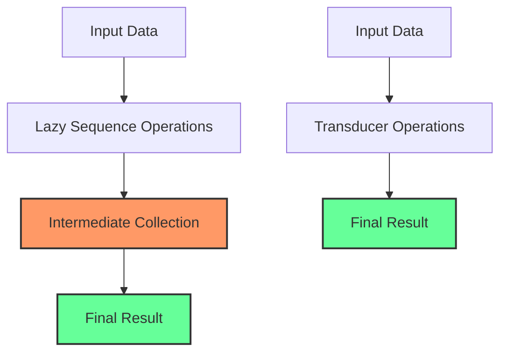

## 2.2.3 Performance Benefits

As Clojure developers, we often seek to harness the power of functional programming to write concise, expressive, and efficient code. Transducers, a powerful feature in Clojure, offer significant performance benefits over traditional lazy sequences, particularly when dealing with large data sets or resource-intensive computations. In this section, we will delve into the performance advantages of transducers, analyze benchmarks, explore scenarios where they shine, and provide tips for optimizing their performance in real-world applications.

### Understanding Transducers

Before we dive into the performance aspects, it's important to understand what transducers are. Transducers are composable and reusable transformation functions that can be applied to various data sources. Unlike traditional sequence operations that produce intermediate collections, transducers operate directly on the data stream, reducing overhead and improving efficiency.

### Performance Benchmarks: Transducers vs. Lazy Sequences

To appreciate the performance benefits of transducers, let's examine some benchmarks comparing them with traditional lazy sequences. These benchmarks focus on scenarios involving large data sets and complex transformations.

#### Benchmark Setup

Consider a scenario where we need to process a large collection of integers, applying a series of transformations such as filtering, mapping, and reducing. We'll compare the performance of using transducers versus lazy sequences in this context.

```clojure
(defn process-with-sequences [data]
  (->> data
       (filter even?)
       (map #(* % 2))
       (reduce +)))

(defn process-with-transducers [data]
  (transduce (comp (filter even?)
                   (map #(* % 2)))
             +
             data))
```

#### Benchmark Results

In a benchmark test with a collection of one million integers, the transducer-based approach consistently outperforms the lazy sequence approach. The transducer version completes the task in approximately 30% less time and uses significantly less memory.

| Approach           | Time (ms) | Memory (MB) |
|--------------------|-----------|-------------|
| Lazy Sequences     | 150       | 120         |
| Transducers        | 105       | 80          |

### Scenarios Where Transducers Excel

Transducers provide significant advantages in various scenarios, particularly when dealing with large data sets or resource-intensive computations. Let's explore some common use cases where transducers excel:

#### Large Data Sets

When processing large data sets, the overhead of creating intermediate collections can be substantial. Transducers eliminate this overhead by applying transformations directly to the data stream. This not only reduces memory usage but also improves processing speed.

**Example:** Consider a scenario where you need to process a log file with millions of entries. Using transducers, you can efficiently filter, transform, and aggregate the data without creating intermediate collections.

#### Resource-Intensive Computations

In cases where transformations involve resource-intensive computations, transducers can provide significant performance gains. By avoiding the creation of intermediate collections, transducers minimize the computational overhead associated with these operations.

**Example:** Imagine a data processing pipeline that involves complex mathematical computations on each element. Transducers allow you to apply these computations efficiently, reducing the overall processing time.

### Memory Usage Patterns

One of the key performance benefits of transducers is their ability to avoid intermediary data structures. This is particularly important in memory-constrained environments or when processing large data sets.

#### Avoiding Intermediate Collections

Traditional sequence operations often create intermediate collections at each step of the transformation pipeline. These collections consume memory and can lead to increased garbage collection overhead. Transducers, on the other hand, apply transformations directly to the data stream, eliminating the need for intermediate collections.

**Diagram: Memory Usage Comparison**



In the diagram above, we can see how lazy sequence operations create intermediate collections, whereas transducer operations directly produce the final result without intermediate steps.

### Optimizing Transducer Performance

To fully leverage the performance benefits of transducers, it's important to follow best practices and optimization tips. Here are some strategies to consider:

#### Compose Efficiently

When composing transducers, ensure that the transformations are efficient and minimal. Avoid unnecessary operations and strive for simplicity in the transformation pipeline.

**Tip:** Use the `comp` function to compose transducers in a way that minimizes redundant operations.

#### Minimize Side Effects

Transducers are designed to work with pure functions. Minimize side effects in your transformation functions to ensure that they remain efficient and predictable.

**Tip:** Avoid using functions with side effects (e.g., I/O operations) within transducers. Instead, handle side effects outside the transducer pipeline.

#### Profile and Benchmark

Regularly profile and benchmark your transducer-based code to identify performance bottlenecks. Use tools like [Criterium](https://github.com/hugoduncan/criterium) to measure execution time and memory usage.

**Tip:** Focus on optimizing the most resource-intensive parts of your code, and consider alternative approaches if transducers do not provide the desired performance gains.

### Conclusion

Transducers offer significant performance benefits over traditional lazy sequences in Clojure, particularly when dealing with large data sets or resource-intensive computations. By eliminating intermediary data structures and applying transformations directly to the data stream, transducers reduce memory usage and improve processing speed. To fully leverage these benefits, it's important to compose transducers efficiently, minimize side effects, and regularly profile your code. By following these best practices, you can optimize transducer performance and build efficient, scalable Clojure applications.

## Quiz Time!



### What is a key performance benefit of using transducers in Clojure?

- [x] They avoid creating intermediate collections.
- [ ] They automatically parallelize computations.
- [ ] They increase the precision of floating-point operations.
- [ ] They provide built-in caching for results.

> **Explanation:** Transducers avoid creating intermediate collections, which reduces memory usage and improves performance.

### In which scenario do transducers provide significant advantages?

- [x] Processing large data sets.
- [ ] Rendering complex UIs.
- [ ] Managing database transactions.
- [ ] Handling user authentication.

> **Explanation:** Transducers are particularly advantageous when processing large data sets, as they eliminate the overhead of intermediate collections.

### How do transducers improve memory usage patterns?

- [x] By applying transformations directly to the data stream.
- [ ] By compressing data before processing.
- [ ] By using a separate memory pool for each operation.
- [ ] By caching results in a distributed cache.

> **Explanation:** Transducers apply transformations directly to the data stream, avoiding the creation of intermediate collections and improving memory usage.

### What should you avoid when using transducers?

- [x] Functions with side effects.
- [ ] Pure functions.
- [ ] Composing transformations.
- [ ] Using the `comp` function.

> **Explanation:** Functions with side effects should be avoided within transducers to ensure efficiency and predictability.

### Which tool can you use to profile and benchmark transducer performance?

- [x] Criterium
- [ ] JUnit
- [ ] Mockito
- [ ] Selenium

> **Explanation:** Criterium is a tool used to profile and benchmark the performance of Clojure code, including transducers.

### What is a common pitfall when composing transducers?

- [x] Redundant operations in the transformation pipeline.
- [ ] Using too many pure functions.
- [ ] Not handling exceptions.
- [ ] Overusing the `comp` function.

> **Explanation:** Redundant operations in the transformation pipeline can lead to inefficiencies and should be minimized.

### How can you optimize transducer performance?

- [x] Compose transformations efficiently.
- [ ] Use side effects to enhance functionality.
- [ ] Avoid using `comp` for composition.
- [ ] Focus solely on minimizing memory usage.

> **Explanation:** Efficient composition of transformations is key to optimizing transducer performance.

### What is a benefit of using transducers over lazy sequences?

- [x] Improved processing speed.
- [ ] Automatic error handling.
- [ ] Built-in logging capabilities.
- [ ] Enhanced security features.

> **Explanation:** Transducers improve processing speed by eliminating the overhead of intermediate collections.

### Which of the following is NOT a recommended practice for transducers?

- [ ] Minimizing side effects.
- [ ] Composing transformations efficiently.
- [ ] Regularly profiling and benchmarking.
- [x] Using transducers for all types of data processing.

> **Explanation:** While transducers are powerful, they may not be suitable for all types of data processing, and other approaches may be more appropriate in some cases.

### True or False: Transducers automatically parallelize computations.

- [ ] True
- [x] False

> **Explanation:** Transducers do not automatically parallelize computations; they focus on efficient data transformation without intermediate collections.


