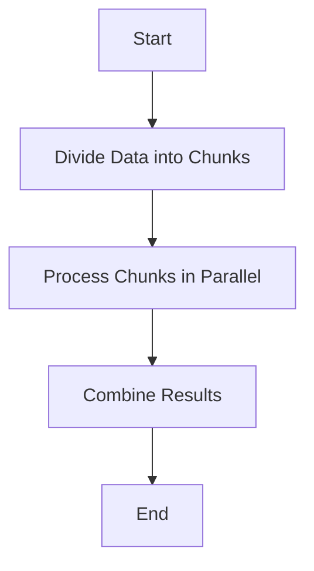

## 2.3.2 Parallel Processing Strategies

In the realm of modern software development, the ability to efficiently process large datasets is crucial. With the advent of multi-core processors, parallel processing has become a vital tool for achieving this efficiency. Clojure, with its functional programming paradigm, offers powerful abstractions for parallel processing, particularly through the use of reducers. In this section, we will delve into various strategies for parallelizing data transformations using reducers, identify workloads that benefit from parallel processing, and explore the trade-offs and tuning guidelines for optimizing parallel operations.

### Understanding Parallel Processing with Reducers

Reducers in Clojure provide a mechanism to perform parallel processing on collections. They are designed to work seamlessly with Clojure's immutable data structures, offering a way to harness the power of multi-core processors without the complexity of managing threads manually.

#### What are Reducers?

Reducers are a library in Clojure that provides a set of functions for transforming collections in parallel. They are an alternative to the traditional sequence operations (`map`, `filter`, `reduce`) and are particularly useful when dealing with large datasets.

The core idea behind reducers is to decouple the description of a transformation from its execution. This allows the transformation to be executed in parallel, taking advantage of multiple cores.

#### How Reducers Work

Reducers work by breaking down a collection into smaller chunks, processing each chunk in parallel, and then combining the results. This is achieved through a combination of the `fold` function and a set of transformation functions (`map`, `filter`, etc.) that are designed to work with reducers.

Here's a basic example of using reducers to perform a parallel map operation:

```clojure
(require '[clojure.core.reducers :as r])

(def data (range 1 1000000))

(defn square [x]
  (* x x))

(def result (r/fold + (r/map square data)))
```

In this example, the `r/map` function is used to apply the `square` function to each element of the `data` collection. The `r/fold` function then combines the results in parallel.

### Identifying Suitable Workloads for Parallel Processing

Not all workloads are suitable for parallel processing. Identifying the right workloads is crucial for achieving performance gains without incurring unnecessary overhead.

#### Characteristics of Suitable Workloads

1. **Large Data Sets**: Parallel processing is most beneficial when dealing with large datasets. The overhead of parallelization can outweigh the benefits for small datasets.

2. **Independent Operations**: The operations performed on each element of the dataset should be independent. This ensures that they can be executed in parallel without dependencies.

3. **CPU-Bound Tasks**: Tasks that are CPU-bound, such as mathematical computations, are ideal candidates for parallel processing. I/O-bound tasks may not see significant performance improvements.

4. **Uniform Workloads**: Workloads where each task takes approximately the same amount of time to complete are more efficient to parallelize.

#### Examples of Suitable Workloads

- Image processing tasks, where each pixel or block of pixels can be processed independently.
- Financial calculations on large datasets, such as risk assessments or portfolio evaluations.
- Data analysis tasks, such as aggregating statistics from large datasets.

### Trade-offs Between Parallelism Overhead and Performance Gains

While parallel processing can provide significant performance improvements, it also introduces overhead. Understanding these trade-offs is essential for making informed decisions about when and how to parallelize workloads.

#### Overhead Considerations

1. **Thread Management**: Creating and managing threads incurs overhead. This includes the cost of context switching and synchronization.

2. **Memory Usage**: Parallel processing can increase memory usage, as each thread may require its own stack and working memory.

3. **Task Granularity**: The granularity of tasks affects the overhead. Too fine-grained tasks can lead to excessive overhead, while too coarse-grained tasks may not fully utilize available cores.

#### Balancing Overhead and Performance

To balance overhead and performance, consider the following strategies:

- **Chunking**: Divide the dataset into chunks that are large enough to minimize overhead but small enough to allow for efficient parallel processing.

- **Adaptive Parallelism**: Use adaptive algorithms that adjust the level of parallelism based on the workload and system resources.

- **Profiling and Benchmarking**: Profile and benchmark your application to identify bottlenecks and optimize parallel processing strategies.

### Guidelines for Tuning Parallel Operations

Tuning parallel operations involves adjusting various parameters to achieve optimal performance based on hardware and application requirements.

#### Hardware Considerations

1. **Number of Cores**: The number of available cores determines the potential for parallelism. Ensure that your application is designed to scale with the number of cores.

2. **Memory Bandwidth**: High memory bandwidth is essential for efficient parallel processing, especially for data-intensive tasks.

3. **Cache Utilization**: Optimize data access patterns to take advantage of CPU caches, reducing memory access latency.

#### Application-Specific Tuning

1. **Task Decomposition**: Decompose tasks into smaller units that can be processed in parallel. Ensure that the decomposition is balanced to avoid load imbalances.

2. **Load Balancing**: Implement load balancing strategies to distribute work evenly across available cores.

3. **Concurrency Control**: Use concurrency control mechanisms, such as locks or atomic operations, to ensure data consistency without introducing excessive overhead.

4. **Testing and Validation**: Thoroughly test and validate your parallel processing strategies to ensure correctness and performance.

### Practical Code Examples

Let's explore some practical examples of parallel processing strategies using reducers in Clojure.

#### Example 1: Parallel Filtering and Mapping

Suppose we have a large dataset of numbers, and we want to filter out even numbers and then square the remaining numbers in parallel.

```clojure
(require '[clojure.core.reducers :as r])

(def data (range 1 1000000))

(defn is-odd? [x]
  (odd? x))

(defn square [x]
  (* x x))

(def result (r/fold + (r/map square (r/filter is-odd? data))))
```

In this example, `r/filter` is used to filter out even numbers, and `r/map` is used to square the remaining numbers. The `r/fold` function combines the results in parallel.

#### Example 2: Parallel Aggregation

Consider a scenario where we need to calculate the sum of squares of a large dataset in parallel.

```clojure
(require '[clojure.core.reducers :as r])

(def data (range 1 1000000))

(defn square [x]
  (* x x))

(def result (r/fold + (r/map square data)))
```

Here, `r/map` applies the `square` function to each element, and `r/fold` aggregates the results in parallel.

### Diagrams and Visualizations

To better understand the flow of parallel processing with reducers, consider the following flowchart illustrating the process:



This flowchart represents the basic steps involved in parallel processing using reducers: dividing the data into chunks, processing each chunk in parallel, and combining the results.

### Best Practices and Common Pitfalls

#### Best Practices

- **Use Immutable Data Structures**: Leverage Clojure's immutable data structures to avoid concurrency issues and simplify parallel processing.

- **Profile and Optimize**: Continuously profile and optimize your application to ensure that parallel processing is providing the desired performance improvements.

- **Monitor Resource Usage**: Monitor CPU and memory usage to ensure that your application is efficiently utilizing available resources.

#### Common Pitfalls

- **Over-Parallelization**: Avoid over-parallelizing tasks, as this can lead to excessive overhead and diminished returns.

- **Ignoring Load Imbalance**: Failing to address load imbalances can result in some cores being underutilized while others are overloaded.

- **Neglecting Error Handling**: Ensure that your parallel processing strategies include robust error handling to manage failures gracefully.

### Conclusion

Parallel processing with reducers in Clojure offers a powerful toolset for efficiently transforming large datasets. By understanding the characteristics of suitable workloads, balancing overhead and performance, and tuning operations based on hardware and application requirements, you can harness the full potential of parallel processing. With careful consideration of best practices and common pitfalls, you can optimize your Clojure applications for maximum performance and scalability.

## Quiz Time!



### What is the primary advantage of using reducers for parallel processing in Clojure?

- [x] They allow for parallel execution without manual thread management.
- [ ] They automatically optimize memory usage.
- [ ] They are faster than all other Clojure sequence operations.
- [ ] They require less code than traditional loops.

> **Explanation:** Reducers allow for parallel execution by decoupling transformation descriptions from execution, eliminating the need for manual thread management.

### Which characteristic makes a workload suitable for parallel processing?

- [x] Independent operations
- [ ] High I/O requirements
- [ ] Small dataset size
- [ ] Complex interdependencies

> **Explanation:** Independent operations ensure that tasks can be executed in parallel without dependencies, making them suitable for parallel processing.

### What is a common trade-off when using parallel processing?

- [x] Increased overhead
- [ ] Reduced memory usage
- [ ] Simplified code
- [ ] Decreased CPU usage

> **Explanation:** Parallel processing introduces overhead, such as thread management and synchronization, which must be balanced against performance gains.

### What is the role of the `fold` function in reducers?

- [x] It combines results in parallel.
- [ ] It filters data in parallel.
- [ ] It maps functions in parallel.
- [ ] It sorts data in parallel.

> **Explanation:** The `fold` function is used to combine results in parallel, aggregating the output of parallelized operations.

### Which strategy helps balance overhead and performance in parallel processing?

- [x] Chunking
- [ ] Increasing task granularity
- [ ] Reducing memory usage
- [ ] Simplifying algorithms

> **Explanation:** Chunking involves dividing data into appropriately sized chunks to minimize overhead while maximizing parallel processing efficiency.

### What should be considered when tuning parallel operations?

- [x] Number of cores
- [ ] Network latency
- [ ] Disk space
- [ ] User interface design

> **Explanation:** The number of available cores is crucial for determining the potential for parallelism and tuning operations accordingly.

### Why is load balancing important in parallel processing?

- [x] To distribute work evenly across cores
- [ ] To minimize memory usage
- [ ] To simplify code
- [ ] To reduce network traffic

> **Explanation:** Load balancing ensures that work is distributed evenly across available cores, preventing some cores from being overloaded while others are underutilized.

### What is a common pitfall in parallel processing?

- [x] Over-parallelization
- [ ] Under-utilizing memory
- [ ] Simplifying algorithms
- [ ] Reducing task complexity

> **Explanation:** Over-parallelization can lead to excessive overhead, diminishing the performance benefits of parallel processing.

### Which of the following is a best practice for parallel processing in Clojure?

- [x] Use immutable data structures
- [ ] Avoid profiling
- [ ] Ignore resource usage
- [ ] Minimize error handling

> **Explanation:** Using immutable data structures helps avoid concurrency issues and simplifies parallel processing.

### True or False: Parallel processing is always beneficial for all types of workloads.

- [ ] True
- [x] False

> **Explanation:** Not all workloads benefit from parallel processing. It is most effective for large, independent, CPU-bound tasks.


