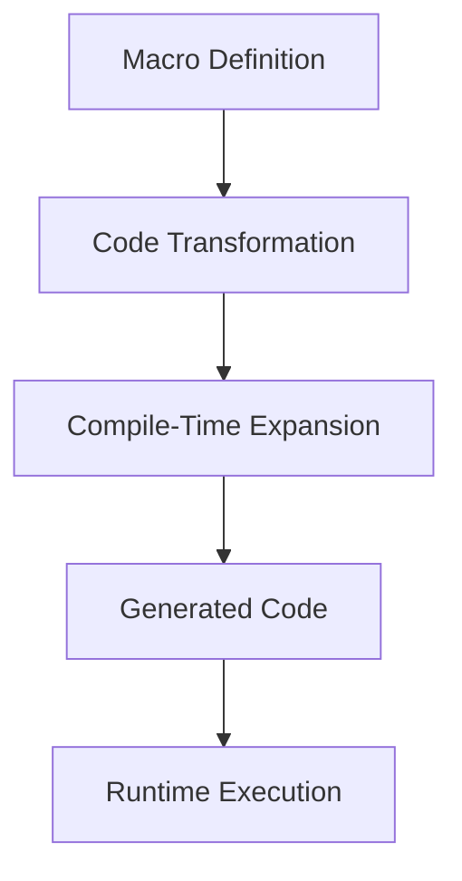

---

linkTitle: "5.6.1 Simplifying Repetitive Code"
title: "Simplifying Repetitive Code with Clojure Macros"
description: "Explore how Clojure macros can eliminate repetitive code patterns, streamline resource management, and encapsulate cross-cutting concerns for Java engineers transitioning to Clojure."
categories:
- Functional Programming
- Clojure
- Software Development
tags:
- Clojure Macros
- Code Simplification
- Functional Programming
- Java to Clojure Transition
- Cross-Cutting Concerns
date: 2024-10-25
type: docs
nav_weight: 561000
canonical: "https://clojureforjava.com/2/5/6/1"
license: "© 2024 Tokenizer Inc. CC BY-NC-SA 4.0"
---

## 5.6.1 Simplifying Repetitive Code with Clojure Macros

In the realm of software development, repetitive code is often a source of inefficiency and potential errors. For Java engineers transitioning to Clojure, the concept of macros offers a powerful tool to eliminate redundancy and enhance code maintainability. This section delves into the practical application of Clojure macros to simplify repetitive code patterns, focusing on scenarios such as logging, resource management, and encapsulating cross-cutting concerns.

### Understanding the Power of Macros

Macros in Clojure are a form of metaprogramming that allow you to write code that generates other code. Unlike functions, which operate on values, macros operate on the code itself, transforming it before it is evaluated. This capability makes macros particularly useful for abstracting repetitive patterns and implementing domain-specific languages (DSLs).

#### Key Characteristics of Macros

- **Code Transformation**: Macros manipulate code as data structures, allowing for complex transformations that can simplify repetitive tasks.
- **Compile-Time Execution**: Macros are expanded at compile time, meaning they can introduce new syntax or control structures that are not possible with functions alone.
- **Avoiding Boilerplate**: By capturing common patterns, macros reduce boilerplate code, making your codebase cleaner and more maintainable.

### Scenarios Where Macros Shine

Let's explore some common scenarios where macros can significantly simplify code.

#### 1. Logging Patterns

Logging is a ubiquitous requirement in software development. In Java, logging often involves repetitive boilerplate code to handle log levels, format messages, and manage exceptions. Clojure macros can encapsulate these patterns, providing a concise and flexible logging mechanism.

**Example: A Simple Logging Macro**

```clojure
(defmacro log [level & body]
  `(println (str "[" ~level "] " ~@body)))

;; Usage
(log "INFO" "Starting the application")
(log "ERROR" "An unexpected error occurred")
```

In this example, the `log` macro abstracts the repetitive pattern of printing log messages with a specific format. By using macros, you can easily extend this to include more sophisticated logging features, such as timestamping or dynamic log level control.

#### 2. Resource Management

Managing resources, such as file handles or database connections, often involves repetitive setup and teardown code. In Java, this is typically handled with try-catch-finally blocks. Clojure macros can encapsulate these patterns, ensuring resources are correctly managed with minimal boilerplate.

**Example: A Resource Management Macro**

```clojure
(defmacro with-resource [resource-binding & body]
  `(let [resource# ~resource-binding]
     (try
       ~@body
       (finally
         (close resource#)))))

;; Usage
(with-resource (open-file "data.txt")
  (println "Processing file"))
```

The `with-resource` macro abstracts the pattern of opening a resource, executing some code, and ensuring the resource is closed, reducing the risk of resource leaks.

#### 3. Encapsulating Cross-Cutting Concerns

Cross-cutting concerns, such as security, transaction management, or caching, often require code to be scattered across multiple modules. Macros can encapsulate these concerns, providing a centralized and reusable solution.

**Example: A Transaction Management Macro**

```clojure
(defmacro with-transaction [db & body]
  `(do
     (start-transaction ~db)
     (try
       ~@body
       (commit-transaction ~db)
       (catch Exception e#
         (rollback-transaction ~db)
         (throw e#)))))

;; Usage
(with-transaction my-database
  (update-record db "users" {:id 1 :name "Alice"}))
```

The `with-transaction` macro encapsulates the pattern of starting, committing, and rolling back a transaction, ensuring consistency and reducing the potential for errors.

### Best Practices for Using Macros

While macros are powerful, they should be used judiciously. Here are some best practices to consider:

- **Identify Repetitive Patterns**: Look for code patterns that are repeated across your codebase. These are prime candidates for macro abstraction.
- **Maintain Readability**: Ensure that macros do not obscure the logic of your code. Aim for clarity and simplicity in macro design.
- **Test Extensively**: Since macros operate at the code level, they can introduce subtle bugs. Thorough testing is essential to ensure correctness.
- **Document Macros**: Provide clear documentation for your macros, including usage examples and limitations, to aid other developers in understanding their purpose and functionality.

### Common Pitfalls and Optimization Tips

- **Avoid Overuse**: Overusing macros can lead to complex and hard-to-debug code. Use them sparingly and only when they provide a clear benefit.
- **Consider Alternatives**: Before reaching for macros, consider whether a function or higher-order function might suffice. Sometimes, simpler solutions are more effective.
- **Optimize for Performance**: Macros can introduce performance overhead if not carefully designed. Profile your code to ensure that macro expansion does not negatively impact performance.

### Practical Code Examples and Snippets

Let's explore some practical examples of how macros can be used to simplify code in real-world scenarios.

#### Example 1: Simplifying API Request Handling

In web applications, handling API requests often involves repetitive code for validation, authentication, and response formatting. A macro can encapsulate these concerns, streamlining the request handling process.

```clojure
(defmacro with-api [request & body]
  `(let [validated-request# (validate-request ~request)]
     (if (authenticated? validated-request#)
       (let [response# (do ~@body)]
         (format-response response#))
       (unauthorized-response))))

;; Usage
(with-api request
  (fetch-user-data request))
```

#### Example 2: Streamlining Configuration Management

Configuration management often involves repetitive code to load, parse, and apply configurations. A macro can encapsulate these steps, providing a clean and consistent approach.

```clojure
(defmacro with-config [config-file & body]
  `(let [config# (load-config ~config-file)]
     (apply-config config#)
     ~@body))

;; Usage
(with-config "app-config.edn"
  (start-application))
```

### Diagrams and Visual Aids

To further illustrate the power of macros, let's use a flowchart to depict the process of macro expansion and execution.



This flowchart highlights the key stages of macro processing, from definition to runtime execution, emphasizing the compile-time transformation that sets macros apart from functions.

### Encouraging Macro Usage in Your Codebase

As you become more familiar with Clojure macros, look for opportunities in your codebase where they can improve efficiency and maintainability. Consider the following steps:

1. **Review Existing Code**: Identify repetitive patterns or cross-cutting concerns that could benefit from macro abstraction.
2. **Prototype Macros**: Start with simple macros to encapsulate these patterns, gradually increasing complexity as needed.
3. **Iterate and Refine**: Continuously refine your macros based on feedback and evolving requirements, ensuring they remain effective and easy to use.

### Conclusion

Clojure macros offer a powerful mechanism for simplifying repetitive code, encapsulating cross-cutting concerns, and enhancing code maintainability. By understanding and leveraging macros effectively, Java engineers transitioning to Clojure can unlock new levels of productivity and code quality. As you explore the possibilities of macros, remember to balance their power with the need for clarity and simplicity, ensuring your code remains accessible and robust.

## Quiz Time!



### What is a primary benefit of using macros in Clojure?

- [x] They allow code transformation at compile-time.
- [ ] They execute faster than functions.
- [ ] They are easier to write than functions.
- [ ] They replace the need for functions.

> **Explanation:** Macros allow code transformation at compile-time, enabling complex code generation and abstraction that functions cannot achieve.

### How do macros differ from functions in Clojure?

- [x] Macros operate on code, while functions operate on values.
- [ ] Macros are evaluated at runtime, while functions are evaluated at compile-time.
- [ ] Macros are always faster than functions.
- [ ] Functions can transform code, while macros cannot.

> **Explanation:** Macros operate on code itself, transforming it before evaluation, whereas functions operate on values at runtime.

### Which scenario is NOT ideal for using macros?

- [ ] Encapsulating logging patterns
- [ ] Managing resources
- [x] Simple arithmetic operations
- [ ] Handling cross-cutting concerns

> **Explanation:** Macros are best suited for complex patterns and cross-cutting concerns, not simple operations like arithmetic.

### What is a common pitfall when using macros?

- [x] Overusing them can lead to complex and hard-to-debug code.
- [ ] They are too simple to implement.
- [ ] They cannot be tested.
- [ ] They do not support code transformation.

> **Explanation:** Overusing macros can make code complex and difficult to debug, so they should be used judiciously.

### Which of the following is a best practice when using macros?

- [x] Identify repetitive patterns before creating a macro.
- [ ] Use macros for all code abstractions.
- [ ] Avoid documenting macros.
- [ ] Never test macros.

> **Explanation:** Identifying repetitive patterns helps ensure that macros are used effectively and appropriately.

### What is the purpose of the `with-resource` macro example?

- [x] To manage resource setup and teardown with minimal boilerplate.
- [ ] To perform arithmetic operations.
- [ ] To handle user authentication.
- [ ] To transform data structures.

> **Explanation:** The `with-resource` macro abstracts the pattern of managing resources, ensuring they are properly closed.

### How can macros improve logging in Clojure applications?

- [x] By encapsulating repetitive logging patterns and formats.
- [ ] By replacing the need for log files.
- [ ] By executing logs faster than functions.
- [ ] By eliminating the need for log levels.

> **Explanation:** Macros can encapsulate logging patterns, reducing boilerplate and ensuring consistent log formats.

### What is a key characteristic of macros?

- [x] They are expanded at compile-time.
- [ ] They are only available in Clojure.
- [ ] They cannot be used with functions.
- [ ] They are always slower than functions.

> **Explanation:** Macros are expanded at compile-time, allowing for code transformation before execution.

### Which of the following is an example of a cross-cutting concern?

- [x] Transaction management
- [ ] Simple arithmetic
- [ ] String concatenation
- [ ] Variable declaration

> **Explanation:** Cross-cutting concerns like transaction management often require code to be scattered across modules, which macros can encapsulate.

### True or False: Macros should be used for all code abstractions in Clojure.

- [ ] True
- [x] False

> **Explanation:** Macros should be used judiciously, only when they provide a clear benefit, as overuse can lead to complex code.


