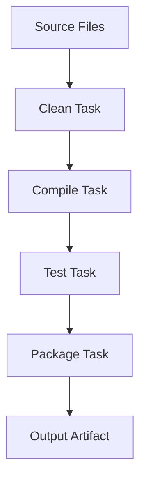

## 6.5.1 Boot's Pipeline Architecture

In the realm of Clojure development, Boot stands out as a powerful build automation tool that offers a unique approach to managing tasks and dependencies. At the heart of Boot's architecture are two core concepts: the build pipeline and immutable filesets. These concepts not only streamline the build process but also provide unparalleled flexibility and composability, making Boot an attractive choice for Clojure developers seeking a robust and efficient build system.

### Understanding Boot's Core Concepts

#### The Build Pipeline

Boot's build pipeline is a sequence of tasks that are executed in a specific order to transform input data into a desired output. Each task in the pipeline performs a specific operation, such as compiling code, running tests, or packaging artifacts. The tasks are composed together to form a cohesive build process, allowing developers to define complex workflows with ease.

The pipeline architecture in Boot is akin to a functional programming paradigm, where each task is a pure function that takes an input and produces an output. This approach ensures that tasks are modular and reusable, enabling developers to easily customize and extend the build process to suit their specific needs.

#### Immutable Filesets

One of the defining features of Boot is its use of immutable filesets. A fileset in Boot is an immutable data structure that represents the state of the file system at a given point in the build process. Each task in the pipeline receives a fileset as input, performs its operations, and produces a new fileset as output. This immutability ensures that tasks do not have side effects, leading to more predictable and reliable builds.

The use of immutable filesets also facilitates parallelism and concurrency, as tasks can be executed independently without the risk of interfering with each other's state. This is particularly beneficial in large projects where build times can be significantly reduced by leveraging parallel execution.

### Composing Boot Tasks

Boot tasks are the building blocks of the build pipeline. They are defined as Clojure functions that take a fileset as input and return a new fileset as output. Tasks can be composed together using Boot's `comp` function, which allows developers to create complex build processes by chaining tasks in a specific order.

Here's a simple example of composing Boot tasks:

```clojure
(deftask compile-clj
  "Compile Clojure source files."
  []
  (comp
    (sift :include #{#"src/**/*.clj"})
    (cljs :optimizations :advanced)))

(deftask build
  "Build the project."
  []
  (comp
    (clean)
    (compile-clj)
    (uber))
```

In this example, the `build` task is composed of three tasks: `clean`, `compile-clj`, and `uber`. Each task performs a specific operation, and the tasks are executed in the order they are composed. This composability allows developers to easily modify and extend the build process by adding or removing tasks as needed.

### Visualizing Boot's Pipeline

To better understand Boot's pipeline architecture, let's visualize the flow of data through a simple build process. The following diagram illustrates a typical Boot pipeline:



In this diagram, each node represents a task in the pipeline, and the arrows indicate the flow of data from one task to the next. The pipeline begins with the source files, which are passed through a series of tasks to produce the final output artifact. This visual representation highlights the linear nature of Boot's pipeline, where each task builds upon the output of the previous task.

### Benefits of Boot's Pipeline Architecture

Boot's pipeline architecture offers several key benefits that make it an attractive choice for Clojure developers:

#### Flexibility

The modular nature of Boot tasks allows developers to easily customize and extend the build process. Tasks can be added, removed, or reordered to accommodate different project requirements, providing a high degree of flexibility in defining build workflows.

#### Composability

Boot's use of immutable filesets and pure functions ensures that tasks are composable and reusable. Developers can create complex build processes by chaining tasks together, and tasks can be reused across different projects without modification.

#### Predictability

The immutability of filesets ensures that tasks do not have side effects, leading to more predictable and reliable builds. This predictability is crucial in large projects where build failures can have significant consequences.

#### Parallelism

The independence of tasks in Boot's pipeline allows for parallel execution, reducing build times and improving efficiency. This is particularly beneficial in large projects where build times can be a bottleneck.

### Practical Code Examples

To illustrate the power of Boot's pipeline architecture, let's explore a practical example of building a Clojure project with Boot.

#### Setting Up a Boot Project

First, we'll create a new Boot project with the following directory structure:

```
my-project/
  ├── build.boot
  ├── src/
  │   └── my_project/
  │       └── core.clj
  └── test/
      └── my_project/
          └── core_test.clj
```

The `build.boot` file is the entry point for defining the build process. Here's a simple `build.boot` file for our project:

```clojure
(set-env!
  :source-paths #{"src"}
  :resource-paths #{"resources"}
  :dependencies '[[org.clojure/clojure "1.10.3"]
                  [boot/core "2.8.3"]])

(deftask build
  "Build the project."
  []
  (comp
    (clean)
    (sift :include #{#"src/**/*.clj"})
    (cljs :optimizations :advanced)
    (uber)
    (jar :main 'my-project.core)))
```

In this example, the `build` task is composed of several tasks: `clean`, `sift`, `cljs`, `uber`, and `jar`. Each task performs a specific operation, such as cleaning the build directory, compiling ClojureScript files, and packaging the project into a JAR file.

#### Running the Build Process

To run the build process, simply execute the following command in the terminal:

```bash
boot build
```

Boot will execute the tasks in the order they are composed, transforming the source files into a final output artifact. The use of immutable filesets ensures that each task operates on a consistent and predictable state, leading to reliable builds.

### Best Practices and Common Pitfalls

When working with Boot's pipeline architecture, there are several best practices and common pitfalls to keep in mind:

#### Best Practices

- **Modularize Tasks:** Break down complex build processes into smaller, modular tasks. This makes the build process easier to understand and maintain.
- **Leverage Immutability:** Take advantage of Boot's immutable filesets to ensure that tasks do not have side effects. This leads to more predictable and reliable builds.
- **Use Parallelism:** Where possible, leverage Boot's ability to execute tasks in parallel to reduce build times and improve efficiency.

#### Common Pitfalls

- **Task Order:** Ensure that tasks are composed in the correct order. The output of one task serves as the input for the next, so the order of tasks is crucial.
- **State Management:** Be mindful of state management in tasks. While filesets are immutable, tasks may still need to manage state internally. Use Clojure's state management primitives, such as atoms and refs, to handle state safely.

### Conclusion

Boot's pipeline architecture offers a powerful and flexible approach to managing build processes in Clojure projects. By leveraging immutable filesets and modular tasks, Boot provides a robust and efficient build system that is well-suited to the needs of modern software development. Whether you're building a simple library or a complex application, Boot's pipeline architecture can help you streamline your build process and achieve reliable, predictable results.

## Quiz Time!



### What is a core concept of Boot's architecture?

- [x] Build pipeline
- [ ] Mutable filesets
- [ ] Monolithic tasks
- [ ] Imperative programming

> **Explanation:** Boot's architecture is centered around the build pipeline, which is a sequence of tasks executed in a specific order.

### What is an immutable fileset in Boot?

- [x] A data structure representing the file system state
- [ ] A mutable collection of files
- [ ] A temporary cache of build artifacts
- [ ] A configuration file for build settings

> **Explanation:** An immutable fileset in Boot is a data structure that represents the state of the file system at a given point in the build process.

### How do Boot tasks compose together?

- [x] Using the `comp` function
- [ ] By modifying global state
- [ ] Through shared mutable variables
- [ ] By altering the order of execution dynamically

> **Explanation:** Boot tasks are composed together using the `comp` function, which allows developers to chain tasks in a specific order.

### What is a benefit of Boot's pipeline architecture?

- [x] Flexibility and composability
- [ ] Increased complexity
- [ ] Dependency on external tools
- [ ] Limited task customization

> **Explanation:** Boot's pipeline architecture offers flexibility and composability, allowing developers to easily customize and extend the build process.

### What ensures that Boot tasks do not have side effects?

- [x] Immutable filesets
- [ ] Mutable global variables
- [ ] Dynamic task ordering
- [ ] External configuration files

> **Explanation:** The immutability of filesets ensures that Boot tasks do not have side effects, leading to more predictable and reliable builds.

### What is a common pitfall when working with Boot?

- [x] Incorrect task order
- [ ] Overuse of parallelism
- [ ] Excessive modularization
- [ ] Lack of task composition

> **Explanation:** A common pitfall when working with Boot is composing tasks in the incorrect order, as the output of one task serves as the input for the next.

### How can Boot's pipeline architecture improve build times?

- [x] By enabling parallel execution of tasks
- [ ] By increasing the complexity of tasks
- [ ] By using mutable filesets
- [ ] By relying on external build tools

> **Explanation:** Boot's pipeline architecture can improve build times by enabling parallel execution of tasks, reducing the overall time required to complete the build process.

### What is a best practice when using Boot?

- [x] Modularize tasks for easier maintenance
- [ ] Use mutable filesets for flexibility
- [ ] Avoid parallel execution of tasks
- [ ] Rely on external configuration files

> **Explanation:** A best practice when using Boot is to modularize tasks, making the build process easier to understand and maintain.

### What is the role of the `sift` task in Boot?

- [x] To include or exclude files based on patterns
- [ ] To compile Clojure source files
- [ ] To run tests
- [ ] To package the project into a JAR file

> **Explanation:** The `sift` task in Boot is used to include or exclude files based on patterns, allowing developers to control which files are processed in the build.

### True or False: Boot tasks can be reused across different projects without modification.

- [x] True
- [ ] False

> **Explanation:** Boot tasks are modular and reusable, allowing them to be used across different projects without modification.


