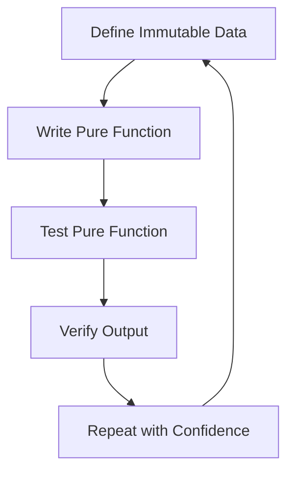

## 8.1.2 Benefits of Immutable Data Structures in Testing

In the realm of software development, testing is a cornerstone of ensuring code quality and reliability. As Java engineers transition into the functional programming paradigm with Clojure, one of the most significant shifts they encounter is the pervasive use of immutable data structures. This shift not only changes how programs are written but also profoundly impacts how they are tested. In this section, we will explore the myriad benefits that immutable data structures bring to testing, particularly in the context of Clojure, and how they contribute to more robust, reliable, and maintainable codebases.

### The Power of Immutability in Testing

Immutability, a core tenet of functional programming, refers to the inability to change data once it has been created. In Clojure, data structures such as lists, vectors, maps, and sets are immutable by default. This immutability offers several advantages when it comes to testing:

#### Consistent State Across Tests

One of the primary challenges in testing mutable code is ensuring that the state is consistent across different test runs. Mutable state can lead to tests that pass or fail unpredictably based on the order of execution or previous test outcomes. Immutable data structures eliminate this issue by ensuring that data remains unchanged throughout the test lifecycle. This consistency allows developers to write tests with the confidence that the state will not be inadvertently altered, leading to more reliable and repeatable test results.

Consider the following example of a pure function in Clojure:

```clojure
(defn add-numbers [a b]
  (+ a b))
```

Testing this function is straightforward because it relies solely on its input parameters and produces a predictable output:

```clojure
(deftest test-add-numbers
  (is (= 5 (add-numbers 2 3)))
  (is (= 0 (add-numbers -1 1))))
```

Since `add-numbers` does not modify any external state, the tests are simple and reliable.

#### Elimination of Side Effects

Side effects occur when a function modifies some state outside its local environment, such as updating a global variable or writing to a file. In a testing context, side effects can complicate test setup and teardown processes, as each test must ensure that the environment is reset to a known state before execution.

Immutable data structures naturally eliminate side effects because they cannot be altered. This characteristic simplifies testing by reducing the need for complex setup and teardown procedures. Tests can focus on verifying the behavior of functions without worrying about unintended interactions with shared state.

For example, consider a function that processes a list of orders:

```clojure
(defn process-orders [orders]
  (map #(assoc % :status "processed") orders))
```

Testing this function involves creating an input list and verifying the output:

```clojure
(deftest test-process-orders
  (let [orders [{:id 1 :status "pending"}
                {:id 2 :status "pending"}]
        expected [{:id 1 :status "processed"}
                  {:id 2 :status "processed"}]]
    (is (= expected (process-orders orders)))))
```

Since `process-orders` does not modify the input list, the test can be run repeatedly without any side effects.

#### Simplified Test Data Creation

Immutability facilitates the creation of test data by allowing developers to define data structures once and reuse them across multiple tests. This approach reduces redundancy and enhances test maintainability. In Clojure, data literals such as maps and vectors can be used directly in tests, making it easy to define complex test scenarios.

```clojure
(def test-orders
  [{:id 1 :status "pending"}
   {:id 2 :status "pending"}
   {:id 3 :status "shipped"}])

(deftest test-order-status
  (is (= "pending" (:status (first test-orders))))
  (is (= "shipped" (:status (last test-orders)))))
```

The ability to define and reuse immutable test data structures streamlines the testing process and reduces the likelihood of errors.

#### Reproducibility and Reliability

Tests that rely on immutable data structures are inherently more reproducible. Since the data does not change between test runs, developers can be confident that the same inputs will yield the same outputs every time. This reliability is crucial for debugging and continuous integration, where tests must consistently pass to ensure code quality.

In contrast, tests involving mutable state may pass under certain conditions but fail when executed in a different order or environment. By leveraging immutability, Clojure developers can avoid these pitfalls and build a more stable testing framework.

#### Testing Pure Functions

Pure functions, which are a hallmark of functional programming, are functions that always produce the same output given the same input and do not cause any observable side effects. Testing pure functions is straightforward because they are deterministic and isolated from external influences.

Consider a function that calculates the factorial of a number:

```clojure
(defn factorial [n]
  (reduce * (range 1 (inc n))))
```

Testing this function involves verifying its output for various inputs:

```clojure
(deftest test-factorial
  (is (= 1 (factorial 0)))
  (is (= 1 (factorial 1)))
  (is (= 2 (factorial 2)))
  (is (= 6 (factorial 3)))
  (is (= 24 (factorial 4))))
```

Since `factorial` is a pure function, the tests are simple and require no additional setup or teardown.

### Practical Code Examples and Snippets

To further illustrate the benefits of immutable data structures in testing, let's explore some practical code examples and snippets.

#### Example 1: Testing a Function with Immutable Inputs

Suppose we have a function that calculates the total price of items in a shopping cart:

```clojure
(defn total-price [cart]
  (reduce + (map :price cart)))
```

We can test this function using immutable data structures:

```clojure
(deftest test-total-price
  (let [cart [{:item "apple" :price 1.0}
              {:item "banana" :price 0.5}
              {:item "orange" :price 0.75}]]
    (is (= 2.25 (total-price cart)))))
```

The test data is defined once and can be reused across multiple tests, ensuring consistency and reliability.

#### Example 2: Testing a Function with Nested Immutable Structures

Consider a function that updates the status of orders in a nested data structure:

```clojure
(defn update-order-status [orders status]
  (map #(assoc % :status status) orders))
```

Testing this function involves creating nested immutable structures:

```clojure
(deftest test-update-order-status
  (let [orders [{:id 1 :status "pending"}
                {:id 2 :status "pending"}]
        expected [{:id 1 :status "shipped"}
                  {:id 2 :status "shipped"}]]
    (is (= expected (update-order-status orders "shipped")))))
```

The use of immutable data structures simplifies the creation and verification of expected outputs.

### Diagrams and Visualizations

To better understand the flow and benefits of using immutable data structures in testing, let's visualize the process using a flowchart:



This flowchart illustrates the cyclical nature of testing with immutable data: define data, write a pure function, test it, verify the output, and repeat with confidence due to the immutability of the data.

### Best Practices and Common Pitfalls

While immutable data structures offer numerous benefits, it's essential to follow best practices to maximize their advantages:

- **Leverage Data Literals:** Use Clojure's data literals to define test data concisely and clearly.
- **Avoid Global State:** Minimize reliance on global state to ensure tests remain isolated and independent.
- **Focus on Pure Functions:** Prioritize testing pure functions, as they are easier to test and reason about.
- **Use Mocking Sparingly:** While mocking can be useful, rely on it minimally to maintain test simplicity and reliability.

Common pitfalls to avoid include:

- **Overcomplicating Test Data:** Keep test data simple and focused on the specific behavior being tested.
- **Neglecting Edge Cases:** Ensure that tests cover a wide range of inputs, including edge cases, to verify function robustness.
- **Ignoring Test Maintenance:** Regularly review and update tests to reflect changes in the codebase and ensure continued reliability.

### Conclusion

Immutable data structures are a powerful tool in the functional programming paradigm, offering significant benefits for testing. By ensuring consistent state, eliminating side effects, and simplifying test data creation, immutability enhances the reliability and maintainability of tests. As Java engineers embrace Clojure, understanding and leveraging these benefits will lead to more robust and trustworthy software.

---

## Quiz Time!



### What is a primary benefit of using immutable data structures in testing?

- [x] Consistent state across tests
- [ ] Increased complexity in test setup
- [ ] More side effects in tests
- [ ] Greater reliance on global state

> **Explanation:** Immutable data structures ensure consistent state across tests, eliminating variability due to state changes.


### How do immutable data structures affect side effects in testing?

- [x] They eliminate side effects
- [ ] They increase side effects
- [ ] They have no impact on side effects
- [ ] They make side effects more complex

> **Explanation:** Immutable data structures eliminate side effects by ensuring data cannot be altered, simplifying the testing process.


### Why are pure functions easier to test?

- [x] They are deterministic and isolated
- [ ] They rely on global state
- [ ] They require complex setup
- [ ] They produce unpredictable outputs

> **Explanation:** Pure functions are deterministic and isolated from external influences, making them easier to test.


### What is a common pitfall to avoid when using immutable data structures in testing?

- [x] Overcomplicating test data
- [ ] Using data literals
- [ ] Focusing on pure functions
- [ ] Minimizing global state reliance

> **Explanation:** Overcomplicating test data can make tests harder to maintain and understand.


### How do immutable data structures facilitate test data creation?

- [x] They allow for easy definition and reuse
- [ ] They require complex data generation
- [ ] They increase redundancy in test data
- [ ] They make data creation more difficult

> **Explanation:** Immutable data structures allow for easy definition and reuse of test data, reducing redundancy.


### What is a key characteristic of immutable data structures?

- [x] They cannot be changed once created
- [ ] They can be modified at any time
- [ ] They rely on mutable state
- [ ] They are inherently complex

> **Explanation:** Immutable data structures cannot be changed once created, ensuring consistent state.


### How do immutable data structures impact test reliability?

- [x] They enhance reliability by ensuring consistent state
- [ ] They decrease reliability due to state changes
- [ ] They have no impact on reliability
- [ ] They make tests less predictable

> **Explanation:** Immutable data structures enhance test reliability by ensuring consistent state across test runs.


### What is a benefit of testing pure functions?

- [x] They produce the same output for the same input
- [ ] They rely on external state
- [ ] They require complex setup
- [ ] They are unpredictable

> **Explanation:** Pure functions produce the same output for the same input, making them predictable and easy to test.


### How does immutability affect test reproducibility?

- [x] It enhances reproducibility by ensuring consistent inputs and outputs
- [ ] It decreases reproducibility due to state changes
- [ ] It has no impact on reproducibility
- [ ] It makes tests less reliable

> **Explanation:** Immutability enhances test reproducibility by ensuring consistent inputs and outputs across test runs.


### True or False: Immutable data structures increase the complexity of test setup.

- [ ] True
- [x] False

> **Explanation:** Immutable data structures simplify test setup by eliminating the need to manage mutable state.


