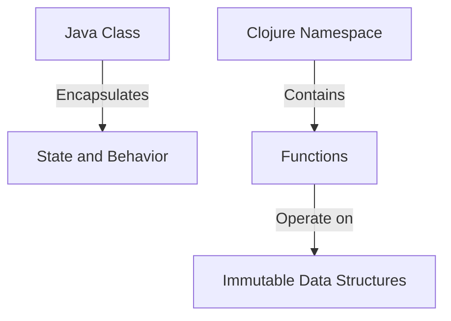

## 1.1 The Shift from OOP to Functional Programming

As we embark on the journey of migrating from Java's Object-Oriented Programming (OOP) to Clojure's functional programming paradigm, it's essential to understand the driving forces behind this transition. This section explores the limitations of traditional OOP in modern software development and the trends that are propelling the adoption of functional programming.

### Exploring the Limitations of Traditional OOP

Object-Oriented Programming has been the cornerstone of software development for decades. Its principles of encapsulation, inheritance, and polymorphism have provided a robust framework for building complex systems. However, as the demands on software systems have evolved, several limitations of OOP have become apparent:

1. **Complexity in State Management**: OOP often involves managing mutable state across objects, which can lead to unpredictable behavior and bugs. As systems grow, tracking and maintaining state becomes increasingly challenging.

2. **Tight Coupling and Rigidity**: Inheritance, a core concept of OOP, can lead to tightly coupled systems. Changes in one part of the system may necessitate changes in others, making the codebase rigid and difficult to modify.

3. **Concurrency Challenges**: With the rise of multi-core processors, concurrent programming has become crucial. OOP's mutable state and shared memory model can complicate concurrency, leading to issues like race conditions and deadlocks.

4. **Scalability Concerns**: As applications scale, the object-oriented approach can struggle to handle the increased load efficiently. The need for more scalable solutions has driven the exploration of alternative paradigms.

### Understanding the Trends Driving the Adoption of Functional Programming

Functional programming (FP) offers solutions to many of the challenges faced by OOP. Let's delve into the trends that are encouraging enterprises to adopt FP, particularly Clojure:

1. **Immutability and Pure Functions**: FP emphasizes immutability and pure functions, which eliminate side effects and make reasoning about code easier. This leads to more predictable and maintainable systems.

2. **Concurrency and Parallelism**: FP's stateless nature and emphasis on immutability simplify concurrent programming. Clojure, for instance, provides powerful concurrency primitives like atoms, refs, and agents, which facilitate safe and efficient parallel processing.

3. **Modularity and Reusability**: FP encourages the composition of small, reusable functions, promoting modularity. This contrasts with OOP's tendency towards monolithic class hierarchies.

4. **Expressiveness and Conciseness**: FP languages often allow developers to express complex logic more succinctly. Clojure's rich set of abstractions and concise syntax enable developers to write less code while achieving more.

5. **Growing Ecosystem and Community**: The FP ecosystem is expanding, with a growing number of libraries, tools, and frameworks. The Clojure community, in particular, is vibrant and supportive, offering a wealth of resources for developers.

### Java OOP Concepts vs. Clojure Functional Paradigm

To facilitate the transition from Java OOP to Clojure, let's draw parallels between the two paradigms:

- **Classes and Objects vs. Functions and Data Structures**: In Java, we encapsulate behavior and state within classes and objects. In Clojure, we focus on functions that operate on immutable data structures.

- **Inheritance vs. Composition**: Java relies heavily on inheritance for code reuse, while Clojure favors composition, allowing for more flexible and adaptable code.

- **State Management**: Java uses mutable state, often leading to complex state management. Clojure's immutable data structures simplify state management and enhance reliability.

- **Concurrency**: Java's concurrency model involves threads and locks, which can be error-prone. Clojure offers a more straightforward approach with its concurrency primitives, reducing the risk of concurrency-related bugs.

### Code Examples: Java vs. Clojure

Let's illustrate these concepts with code examples:

#### Java OOP Example

```java
// Java class representing a bank account
public class BankAccount {
    private double balance;

    public BankAccount(double initialBalance) {
        this.balance = initialBalance;
    }

    public void deposit(double amount) {
        if (amount > 0) {
            balance += amount;
        }
    }

    public void withdraw(double amount) {
        if (amount > 0 && balance >= amount) {
            balance -= amount;
        }
    }

    public double getBalance() {
        return balance;
    }
}
```

#### Clojure Functional Example

```clojure
;; Clojure function representing a bank account
(defn create-account [initial-balance]
  {:balance initial-balance})

(defn deposit [account amount]
  (if (pos? amount)
    (update account :balance + amount)
    account))

(defn withdraw [account amount]
  (if (and (pos? amount) (>= (:balance account) amount))
    (update account :balance - amount)
    account))

(defn get-balance [account]
  (:balance account))
```

### Diagram: Java Classes vs. Clojure Namespaces



*Caption: This diagram illustrates how Java classes encapsulate state and behavior, while Clojure namespaces contain functions that operate on immutable data structures.*

### Try It Yourself

Experiment with the Clojure code example by modifying the `deposit` and `withdraw` functions to add logging or additional validation. Observe how the immutability of data structures affects the behavior of your code.

### References and Further Reading

- [Clojure Official Documentation](https://clojure.org/reference)
- [Clojure Community Resources](https://clojure.org/community/resources)
- [Transitioning from OOP to Functional Programming](https://www.lispcast.com/oo-to-fp/)

### Knowledge Check

- What are the key limitations of OOP that functional programming addresses?
- How does immutability in FP simplify state management?
- Compare Java's concurrency model with Clojure's concurrency primitives.

### Exercises

1. **Refactor a Java OOP Class to Clojure**: Choose a simple Java class and refactor it into a Clojure namespace with functions. Focus on maintaining functionality while embracing immutability.

2. **Concurrency Challenge**: Implement a concurrent task in both Java and Clojure. Compare the complexity and readability of the two implementations.

### Summary

In this section, we've explored the shift from OOP to functional programming, highlighting the limitations of traditional OOP and the benefits of adopting FP. By understanding these concepts and experimenting with code examples, you're well on your way to embracing Clojure's functional paradigm.

## **Quiz: Are You Ready to Migrate from Java to Clojure?**



### What is a key limitation of OOP that functional programming addresses?

- [x] Complexity in state management
- [ ] Lack of encapsulation
- [ ] Inability to handle inheritance
- [ ] Poor support for object creation

> **Explanation:** Functional programming addresses the complexity in state management by emphasizing immutability and pure functions, which simplify reasoning about code.

### How does immutability in functional programming simplify state management?

- [x] By eliminating side effects
- [ ] By increasing the number of classes
- [ ] By using more inheritance
- [ ] By allowing mutable state

> **Explanation:** Immutability eliminates side effects, making it easier to reason about code and manage state predictably.

### What is a benefit of using Clojure's concurrency primitives?

- [x] Simplified concurrent programming
- [ ] Increased use of locks
- [ ] More complex thread management
- [ ] Greater reliance on mutable state

> **Explanation:** Clojure's concurrency primitives simplify concurrent programming by reducing the need for locks and mutable state.

### In Clojure, what is favored over inheritance for code reuse?

- [x] Composition
- [ ] Encapsulation
- [ ] Polymorphism
- [ ] Inheritance

> **Explanation:** Clojure favors composition over inheritance, allowing for more flexible and adaptable code.

### What is a trend driving the adoption of functional programming?

- [x] Growing ecosystem and community
- [ ] Decreasing need for concurrency
- [ ] Increasing reliance on mutable state
- [ ] Declining interest in modularity

> **Explanation:** The growing ecosystem and community support are trends driving the adoption of functional programming.

### How does Clojure handle state management differently from Java?

- [x] By using immutable data structures
- [ ] By increasing the use of classes
- [ ] By relying on mutable state
- [ ] By using more inheritance

> **Explanation:** Clojure uses immutable data structures, simplifying state management and enhancing reliability.

### What is a characteristic of functional programming languages?

- [x] Emphasis on pure functions
- [ ] Heavy use of inheritance
- [ ] Focus on mutable state
- [ ] Reliance on class hierarchies

> **Explanation:** Functional programming languages emphasize pure functions, which eliminate side effects and enhance code predictability.

### What is a challenge of Java's concurrency model?

- [x] Complexity with threads and locks
- [ ] Lack of support for parallelism
- [ ] Inability to handle multiple cores
- [ ] Poor integration with OOP

> **Explanation:** Java's concurrency model can be complex due to the use of threads and locks, leading to issues like race conditions.

### What is a benefit of Clojure's expressiveness?

- [x] Writing less code while achieving more
- [ ] Increasing the number of classes
- [ ] Relying on mutable state
- [ ] Using more inheritance

> **Explanation:** Clojure's expressiveness allows developers to write less code while achieving more, thanks to its rich set of abstractions.

### True or False: Functional programming languages often allow developers to express complex logic more succinctly.

- [x] True
- [ ] False

> **Explanation:** Functional programming languages often allow developers to express complex logic more succinctly, enhancing code readability and maintainability.




