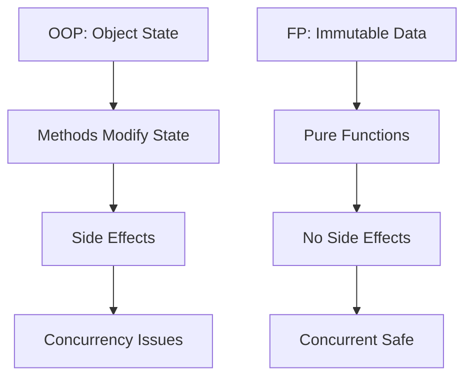

## 1.1 The Shift from OOP to Functional Programming

As we embark on the journey of migrating from Java's Object-Oriented Programming (OOP) paradigm to Clojure's Functional Programming (FP) approach, it's essential to understand the underlying motivations and benefits of this shift. This section will explore the limitations of traditional OOP in modern software development and the trends driving the adoption of functional programming.

### Exploring the Limitations of Traditional OOP

Object-Oriented Programming has been the cornerstone of software development for decades. Its principles of encapsulation, inheritance, and polymorphism have provided a robust framework for building complex systems. However, as software systems have grown in complexity and scale, several limitations of OOP have become apparent:

1. **Mutable State and Side Effects**: OOP often relies on mutable state, which can lead to unpredictable behavior and bugs that are difficult to trace. This is particularly problematic in concurrent and distributed systems where shared state can become a bottleneck.

2. **Tight Coupling and Inflexibility**: Inheritance, a core concept of OOP, can lead to tightly coupled code that is difficult to modify or extend. This rigidity can hinder the adaptability of software systems to changing requirements.

3. **Complexity in Concurrency**: Managing concurrency in OOP requires intricate locking mechanisms and synchronization, which can introduce complexity and performance bottlenecks.

4. **Verbose Code**: OOP languages like Java often require boilerplate code, which can lead to verbose and less readable codebases.

#### Code Example: Java OOP

Let's consider a simple example of a Java class representing a bank account:

```java
public class BankAccount {
    private double balance;

    public BankAccount(double initialBalance) {
        this.balance = initialBalance;
    }

    public void deposit(double amount) {
        if (amount > 0) {
            balance += amount;
        }
    }

    public void withdraw(double amount) {
        if (amount > 0 && amount <= balance) {
            balance -= amount;
        }
    }

    public double getBalance() {
        return balance;
    }
}
```

In this example, the `BankAccount` class encapsulates the state of a bank account with methods to deposit and withdraw funds. However, the mutable `balance` field can lead to issues in concurrent environments.

### Understanding the Trends Driving the Adoption of Functional Programming

Functional Programming offers a paradigm shift that addresses many of the limitations of OOP. Here are some key trends driving the adoption of FP:

1. **Immutability and Pure Functions**: FP emphasizes immutability and pure functions, which eliminate side effects and make code more predictable and easier to reason about.

2. **Higher-Order Functions and Function Composition**: FP languages like Clojure support higher-order functions and function composition, enabling more expressive and concise code.

3. **Concurrency and Parallelism**: FP provides powerful abstractions for managing concurrency and parallelism, such as Software Transactional Memory (STM) and immutable data structures.

4. **Modularity and Reusability**: FP promotes modularity and reusability through first-class functions and composable abstractions.

5. **Declarative Style**: FP encourages a declarative programming style, focusing on what to do rather than how to do it, leading to more concise and readable code.

#### Code Example: Clojure FP

Let's rewrite the bank account example in Clojure using functional programming principles:

```clojure
(defn create-account [initial-balance]
  {:balance initial-balance})

(defn deposit [account amount]
  (if (> amount 0)
    (update account :balance + amount)
    account))

(defn withdraw [account amount]
  (if (and (> amount 0) (<= amount (:balance account)))
    (update account :balance - amount)
    account))

(defn get-balance [account]
  (:balance account))
```

In this Clojure example, the `create-account` function returns an immutable map representing the account. The `deposit` and `withdraw` functions return new account states without modifying the original state, adhering to the principle of immutability.

### Visualizing the Shift

To better understand the shift from OOP to FP, let's visualize the flow of data and control in both paradigms:



**Diagram Description**: This diagram illustrates how OOP relies on object state and methods that modify state, leading to side effects and concurrency issues. In contrast, FP uses immutable data and pure functions, resulting in no side effects and safer concurrency.

### Key Takeaways

- **Immutability**: Embrace immutability to eliminate side effects and improve code predictability.
- **Pure Functions**: Use pure functions to create modular and reusable code.
- **Concurrency**: Leverage FP's concurrency models for efficient and safe parallelism.
- **Expressiveness**: Utilize higher-order functions and function composition for concise and expressive code.

### Try It Yourself

Experiment with the Clojure code example by modifying the `deposit` and `withdraw` functions to include logging or validation. Observe how the immutability of the account state simplifies these tasks.

### References and Links

- [Official Clojure Documentation](https://clojure.org/)
- [ClojureDocs](https://clojuredocs.org/)
- [Functional Programming in Clojure](https://github.com/functional-programming)

### Knowledge Check

- What are the main limitations of OOP in modern software development?
- How does FP address the challenges of concurrency and parallelism?
- Why is immutability a core principle in FP?

## **Quiz: Are You Ready to Migrate from Java to Clojure?**



### What is a key limitation of OOP in modern software development?

- [x] Mutable state leading to unpredictable behavior
- [ ] Lack of encapsulation
- [ ] Inability to model real-world entities
- [ ] Lack of support for inheritance

> **Explanation:** Mutable state in OOP can lead to unpredictable behavior, especially in concurrent environments.

### How does FP address concurrency challenges?

- [x] By using immutable data structures
- [ ] By relying on inheritance
- [ ] By using mutable state
- [ ] By avoiding parallelism

> **Explanation:** FP uses immutable data structures, which are inherently thread-safe, to address concurrency challenges.

### What is a pure function?

- [x] A function that does not cause side effects
- [ ] A function that modifies global state
- [ ] A function that relies on mutable data
- [ ] A function that uses inheritance

> **Explanation:** A pure function does not cause side effects and always produces the same output for the same input.

### What is a benefit of higher-order functions in FP?

- [x] They enable function composition
- [ ] They increase code verbosity
- [ ] They rely on mutable state
- [ ] They require inheritance

> **Explanation:** Higher-order functions enable function composition, allowing for more expressive and concise code.

### Why is immutability important in FP?

- [x] It eliminates side effects
- [ ] It increases code verbosity
- [x] It improves code predictability
- [ ] It relies on inheritance

> **Explanation:** Immutability eliminates side effects and improves code predictability, making it a core principle in FP.

### What is a declarative programming style?

- [x] Focusing on what to do rather than how to do it
- [ ] Focusing on how to do it rather than what to do
- [ ] Relying on mutable state
- [ ] Using inheritance

> **Explanation:** A declarative programming style focuses on what to do rather than how to do it, leading to more concise and readable code.

### How does FP promote modularity?

- [x] Through first-class functions
- [ ] Through mutable state
- [x] Through composable abstractions
- [ ] Through inheritance

> **Explanation:** FP promotes modularity through first-class functions and composable abstractions, enabling more reusable code.

### What is a benefit of using pure functions?

- [x] They make code more predictable
- [ ] They rely on mutable state
- [ ] They require inheritance
- [ ] They increase code verbosity

> **Explanation:** Pure functions make code more predictable by eliminating side effects.

### How does FP improve code expressiveness?

- [x] By using higher-order functions
- [ ] By relying on mutable state
- [ ] By using inheritance
- [ ] By increasing code verbosity

> **Explanation:** FP improves code expressiveness by using higher-order functions and function composition.

### True or False: FP relies on mutable state for concurrency.

- [ ] True
- [x] False

> **Explanation:** False. FP relies on immutable data structures, which are inherently thread-safe, for concurrency.



By understanding the shift from OOP to FP, we can leverage Clojure's powerful features to build scalable, maintainable, and efficient enterprise applications. Let's continue exploring how these concepts can transform your development practices.
