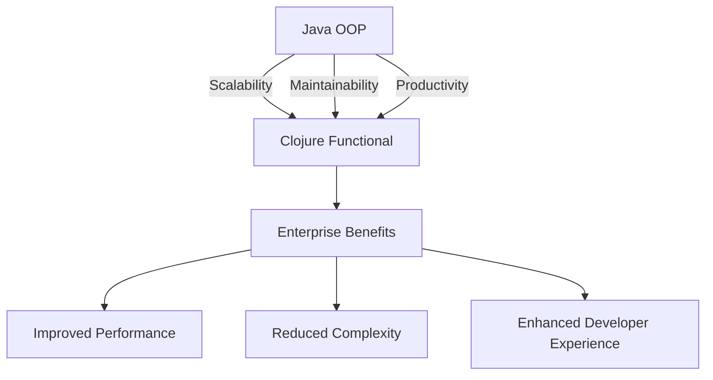

## 1.2 The Advantages of Clojure for Enterprises

In the rapidly evolving landscape of enterprise software development, choosing the right programming language and paradigm is crucial for building scalable, maintainable, and productive systems. Clojure, a modern, functional programming language that runs on the Java Virtual Machine (JVM), offers a compelling alternative to traditional Java Object-Oriented Programming (OOP). In this section, we will explore the advantages of Clojure for enterprise applications, focusing on its impact on scalability, maintainability, and productivity. We will also draw parallels between Java and Clojure to facilitate understanding for developers transitioning from Java OOP to Clojure's functional paradigm.

### Scalability: Leveraging Clojure's Functional Paradigm

Scalability is a critical concern for enterprise applications, which must handle increasing loads and user demands without compromising performance. Clojure's functional programming paradigm offers several features that enhance scalability:

#### Immutability and Concurrency

One of the core tenets of functional programming is immutability, which means that data structures cannot be modified after they are created. This immutability simplifies reasoning about code and eliminates many concurrency issues that arise in mutable state systems. In Java, managing concurrency often involves complex synchronization mechanisms, such as locks and semaphores, which can lead to deadlocks and race conditions.

Clojure, on the other hand, provides built-in concurrency primitives like Atoms, Refs, and Agents, which allow developers to manage state changes in a controlled and predictable manner. These primitives leverage Software Transactional Memory (STM) to ensure safe and efficient concurrent updates.

```clojure
;; Example of using an Atom for concurrent state management
(def counter (atom 0))

;; Increment the counter atomically
(defn increment-counter []
  (swap! counter inc))

;; Demonstrate concurrent updates
(doseq [_ (range 1000)]
  (future (increment-counter)))

;; Print the final value of the counter
(println @counter)
```

In this example, the `atom` provides a thread-safe way to manage state changes, allowing multiple threads to increment the counter concurrently without conflicts.

#### Statelessness and Horizontal Scaling

Clojure's emphasis on stateless functions aligns well with modern cloud-native architectures, which often rely on horizontal scaling to distribute load across multiple instances. Stateless functions can be easily replicated and distributed across servers, enabling applications to scale out efficiently.

In contrast, Java applications often rely on stateful objects and session management, which can complicate scaling efforts. By adopting Clojure's functional paradigm, enterprises can build systems that are inherently more scalable and resilient.

### Maintainability: Simplifying Codebases with Clojure

Maintainability is another key advantage of Clojure, as it encourages writing concise, expressive, and modular code. This leads to codebases that are easier to understand, modify, and extend over time.

#### Conciseness and Expressiveness

Clojure's syntax is designed to be concise and expressive, allowing developers to accomplish more with less code. This reduces the cognitive load on developers and makes it easier to reason about the codebase. In Java, boilerplate code and verbose syntax can obscure the underlying logic, making maintenance more challenging.

Consider the following comparison between Java and Clojure for filtering a list of numbers:

```java
// Java example: Filtering even numbers from a list
List<Integer> numbers = Arrays.asList(1, 2, 3, 4, 5, 6);
List<Integer> evens = numbers.stream()
                             .filter(n -> n % 2 == 0)
                             .collect(Collectors.toList());
```

```clojure
;; Clojure example: Filtering even numbers from a list
(def numbers [1 2 3 4 5 6])
(def evens (filter even? numbers))
```

The Clojure example is more concise and directly expresses the intent of filtering even numbers, making it easier to understand and maintain.

#### Modularity and Reusability

Clojure encourages modularity through the use of pure functions and namespaces. Pure functions, which have no side effects, can be easily composed and reused across different parts of an application. Namespaces provide a way to organize code logically, similar to Java packages, but with greater flexibility.

```clojure
;; Define a namespace for utility functions
(ns myapp.utils)

;; A pure function for calculating the square of a number
(defn square [n]
  (* n n))

;; Use the function in another namespace
(ns myapp.core
  (:require [myapp.utils :as utils]))

(defn calculate-squares [numbers]
  (map utils/square numbers))
```

This modular approach promotes code reuse and simplifies maintenance by isolating functionality into well-defined units.

### Productivity: Accelerating Development with Clojure

Clojure's features also enhance developer productivity, enabling teams to deliver high-quality software faster.

#### Interactive Development and REPL

Clojure's Read-Eval-Print Loop (REPL) provides an interactive development environment that allows developers to experiment with code, test functions, and debug issues in real-time. This rapid feedback loop accelerates the development process and encourages exploration and innovation.

In contrast, Java development often involves longer edit-compile-debug cycles, which can slow down the development process. By leveraging Clojure's REPL, developers can iterate quickly and efficiently.

#### Rich Ecosystem and Interoperability

Clojure benefits from a rich ecosystem of libraries and tools, many of which are designed to integrate seamlessly with existing Java libraries. This interoperability allows enterprises to leverage their existing Java investments while gradually adopting Clojure.

For example, Clojure can call Java methods directly, enabling developers to use Java libraries and frameworks within Clojure applications:

```clojure
;; Calling a Java method from Clojure
(import 'java.util.Date)

(defn current-time []
  (.toString (Date.)))
```

This interoperability facilitates a smooth transition from Java to Clojure, allowing teams to adopt Clojure incrementally without disrupting existing systems.

### Visualizing the Transition: Java OOP vs. Clojure

To further illustrate the advantages of Clojure, let's visualize the transition from Java OOP to Clojure's functional paradigm using a diagram:



**Diagram Description:** This diagram illustrates the transition from Java OOP to Clojure's functional paradigm, highlighting the benefits of improved scalability, maintainability, and productivity, which lead to enhanced enterprise performance and reduced complexity.

### Conclusion: Embracing Clojure for Enterprise Success

In conclusion, Clojure offers significant advantages for enterprise applications by enhancing scalability, maintainability, and productivity. Its functional programming paradigm, built-in concurrency support, and rich ecosystem make it a powerful choice for modern software development. By transitioning from Java OOP to Clojure, enterprises can build systems that are more resilient, efficient, and adaptable to changing business needs.

As we continue our journey through this guide, we will explore practical strategies for migrating from Java to Clojure, including assessing enterprise readiness, setting up the Clojure development environment, and planning the migration process. By embracing Clojure, your organization can stay ahead in today's competitive technology landscape and unlock new opportunities for innovation and growth.

For more information on Clojure's features and benefits, visit the [Clojure Official Documentation](https://clojure.org/reference) and explore [Clojure Community Resources](https://clojure.org/community/resources).

## **Quiz: Are You Ready to Migrate from Java to Clojure?**



### What is one of the core tenets of functional programming that Clojure emphasizes?

- [x] Immutability
- [ ] Inheritance
- [ ] Polymorphism
- [ ] Encapsulation

> **Explanation:** Immutability is a core tenet of functional programming, which Clojure emphasizes to simplify reasoning about code and eliminate concurrency issues.

### How does Clojure handle concurrency differently from Java?

- [x] By using built-in concurrency primitives like Atoms, Refs, and Agents
- [ ] By relying on synchronized blocks and locks
- [ ] By using semaphores and monitors
- [ ] By avoiding concurrency altogether

> **Explanation:** Clojure uses built-in concurrency primitives like Atoms, Refs, and Agents, which leverage Software Transactional Memory (STM) for safe and efficient concurrent updates.

### What advantage does Clojure's REPL provide over Java's development process?

- [x] Interactive development and rapid feedback
- [ ] Longer edit-compile-debug cycles
- [ ] More complex build processes
- [ ] Slower iteration speed

> **Explanation:** Clojure's REPL provides an interactive development environment that allows for rapid feedback and experimentation, accelerating the development process.

### How does Clojure's syntax compare to Java's in terms of expressiveness?

- [x] Clojure's syntax is more concise and expressive
- [ ] Java's syntax is more concise and expressive
- [ ] Both languages have equally verbose syntax
- [ ] Clojure's syntax is more verbose

> **Explanation:** Clojure's syntax is designed to be concise and expressive, allowing developers to accomplish more with less code compared to Java.

### What is a key benefit of Clojure's immutability for enterprise applications?

- [x] Simplifies reasoning about code and eliminates concurrency issues
- [ ] Increases the complexity of state management
- [ ] Requires more memory for data structures
- [ ] Limits the ability to modify data

> **Explanation:** Immutability simplifies reasoning about code and eliminates many concurrency issues, making it beneficial for enterprise applications.

### How does Clojure's emphasis on stateless functions benefit cloud-native architectures?

- [x] Enables easy replication and distribution across servers
- [ ] Complicates scaling efforts
- [ ] Requires stateful session management
- [ ] Limits horizontal scaling

> **Explanation:** Stateless functions can be easily replicated and distributed across servers, aligning well with cloud-native architectures that rely on horizontal scaling.

### What is a key advantage of Clojure's modularity through pure functions and namespaces?

- [x] Promotes code reuse and simplifies maintenance
- [ ] Increases code duplication
- [ ] Complicates code organization
- [ ] Limits the ability to extend functionality

> **Explanation:** Clojure's modularity through pure functions and namespaces promotes code reuse and simplifies maintenance by isolating functionality into well-defined units.

### How does Clojure's interoperability with Java benefit enterprises?

- [x] Allows leveraging existing Java investments while adopting Clojure
- [ ] Requires rewriting all Java code in Clojure
- [ ] Limits the use of Java libraries
- [ ] Complicates integration with Java systems

> **Explanation:** Clojure's interoperability with Java allows enterprises to leverage existing Java investments while gradually adopting Clojure, facilitating a smooth transition.

### What is a key advantage of Clojure's functional paradigm for enterprise applications?

- [x] Enhances scalability, maintainability, and productivity
- [ ] Increases the complexity of codebases
- [ ] Limits the ability to handle concurrency
- [ ] Requires more boilerplate code

> **Explanation:** Clojure's functional paradigm enhances scalability, maintainability, and productivity, making it advantageous for enterprise applications.

### True or False: Clojure's functional programming paradigm is inherently more scalable and resilient than Java OOP.

- [x] True
- [ ] False

> **Explanation:** Clojure's functional programming paradigm, with its emphasis on immutability and statelessness, is inherently more scalable and resilient than Java OOP.


